# Sprawozdanie
### Maciej Cholewa

1. Wybranym programem, do wykonania labolatorium jest Hello World (napisany w **ruscie**) w wydaniu blockachain (Solana). Program posiada:
    - **testy**
    - **build system (Cargo)** 
    - **otwartą licencję**

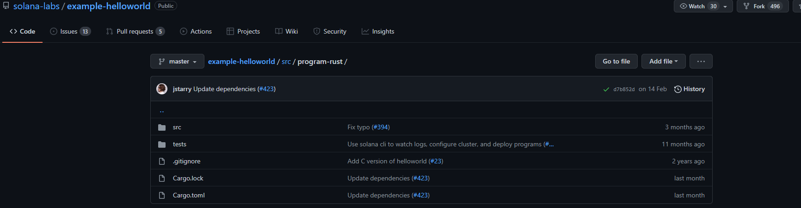

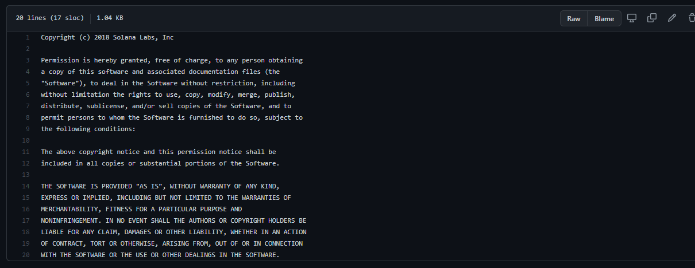

2. Dodatkowo zawiera dokumentację

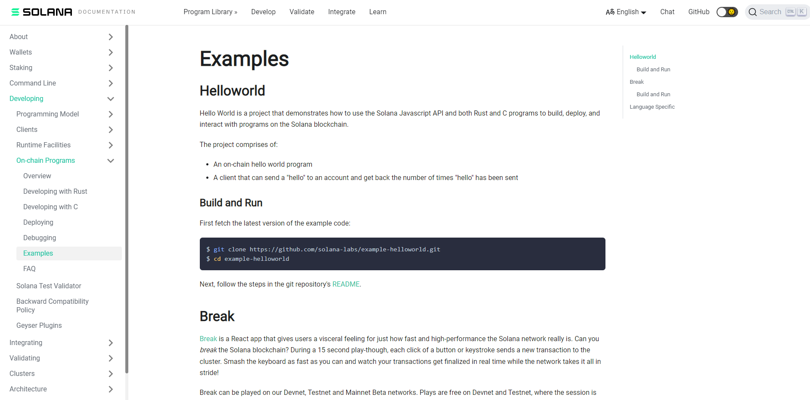

3. Sklonowałem repozytorium, zrbiłem build oraz uruchomiłem testy

         git clone https://github.com/solana-labs/example-helloworld.git
         cd example-helloworld/src/program-rust/
         cargo build
         cargo test

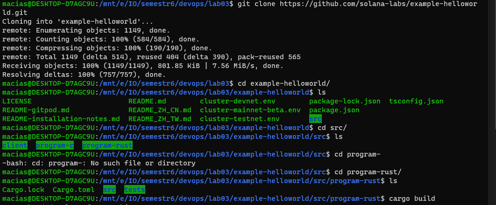

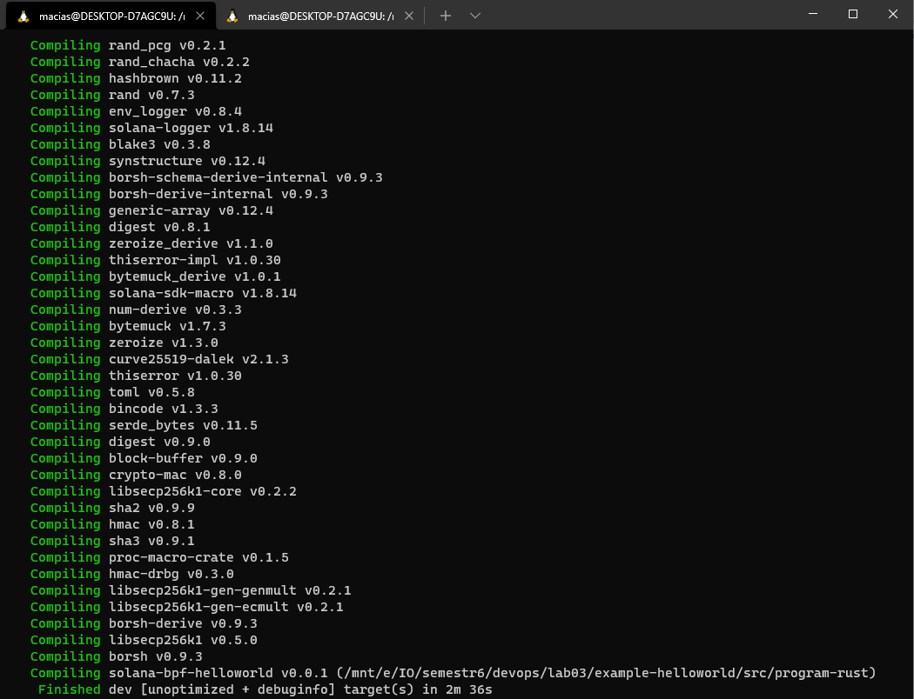

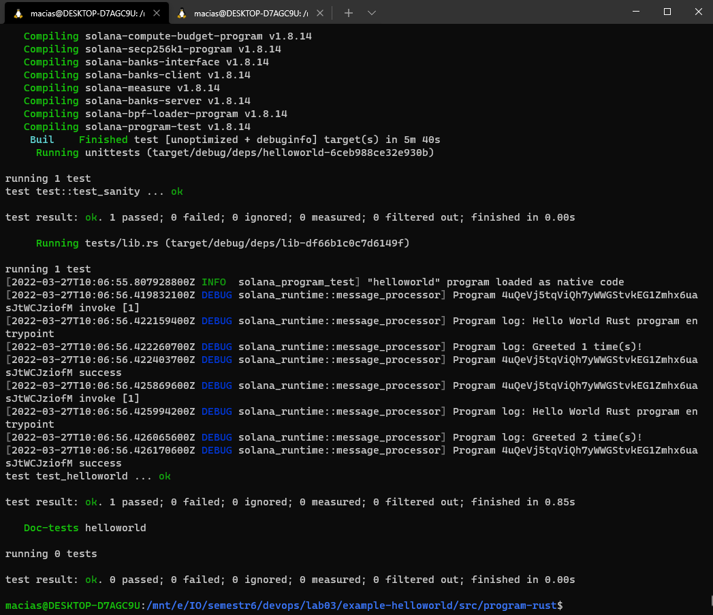

4. Uruchomiłem **deamona dokera**, aby umożliwić pracę interaktywną

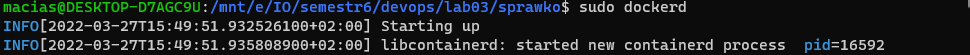

5. Znalazłem wystarczający kontener bazowy z **docker huba**, pobrałem oraz uruchomiłem go

        sudo docker pull rust
        docker run -it rust

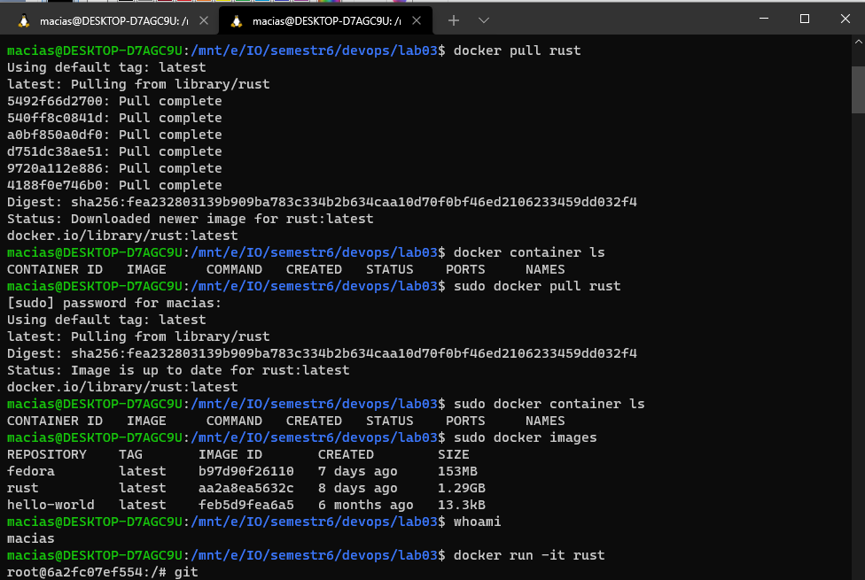

6. W kontenerze były wszystkie konieczne zależności takie jak **git, cargo, rust**, więc nie było potrzeby na doinstalowywanie. Sklonowałem repozytorium oraz uruchomiłem builda.

         git clone https://github.com/solana-labs/example-helloworld.git
         cd example-helloworld/src/program-rust/
         cargo build

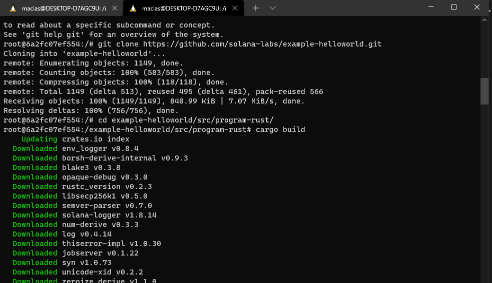

7. Następnie uruchomiłem testy

        cargo test
    
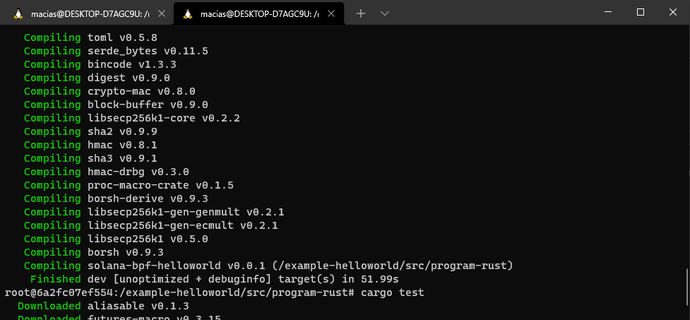
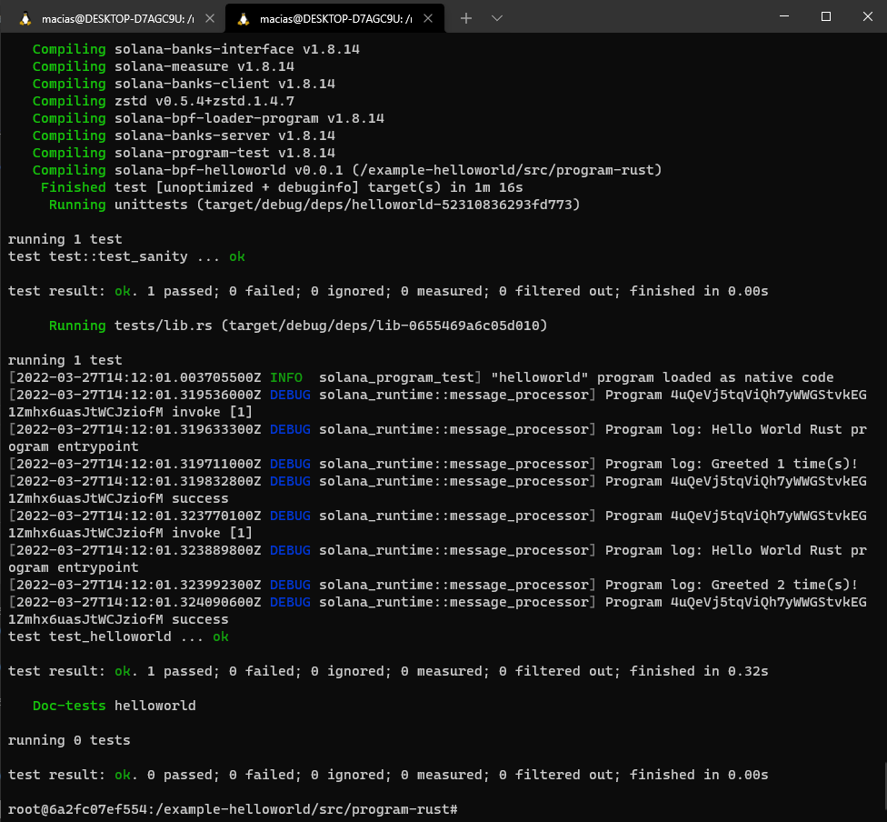

8. Sprawdziłem jakie komendy zostały wykonane w kontenerze

        history | tail -10
        1   git clone https://github.com/solana-labs/example-helloworld.git
        2  cd example-helloworld/src/program-rust/
        3  cargo build
        4  cargo test
        5  history | tail -10

9. Napisałem dockerfila, który na podstawie obrazu **rust** buduje obraz, w którym klonuje repozytorium oraz buduje program

                FROM rust:latest
                RUN git clone https://github.com/solana-labs/example-helloworld.git
                WORKDIR example-helloworld/src/program-rust/
                RUN cargo build

10. Następnie zbudowałem obraz z użyciem wyżej napisanego dockerfila, nazwałem go blder

                docker build -t blder:latest  . -f ./Docker-BLDR

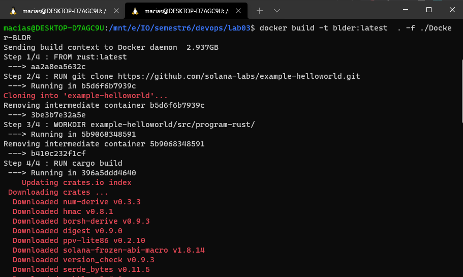

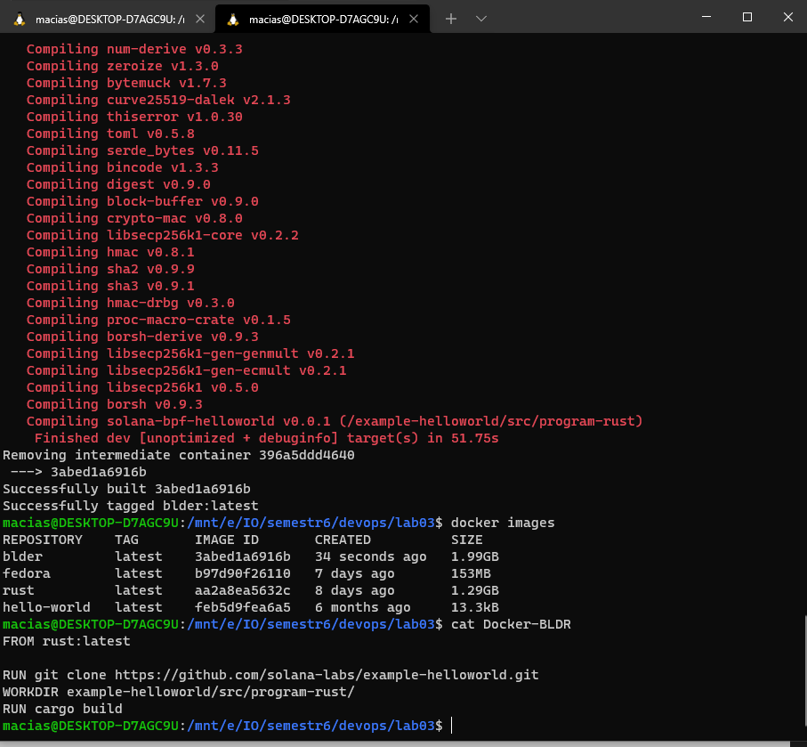

11.  Napisałem dockerfila, który na podstawie obrazu **blder** buduje obraz, w którym wykonuje testy

12.  Następnie zbudowałem obraz z użyciem wyżej napisanego dockerfila, nazwałem go **test**

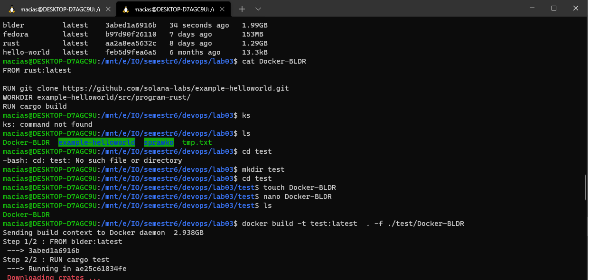
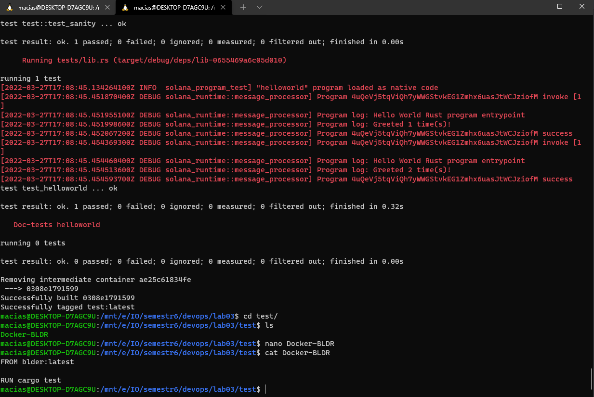

13.  Świadectwem tego, że napisane docker file działają poprawnie oraz tego, że kontener działa i wdraża się poprawnie jest to, że powstał obraz 

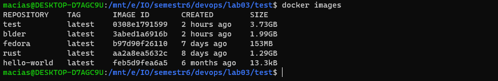

Na sam koniec uruchomiłem oba kontenery

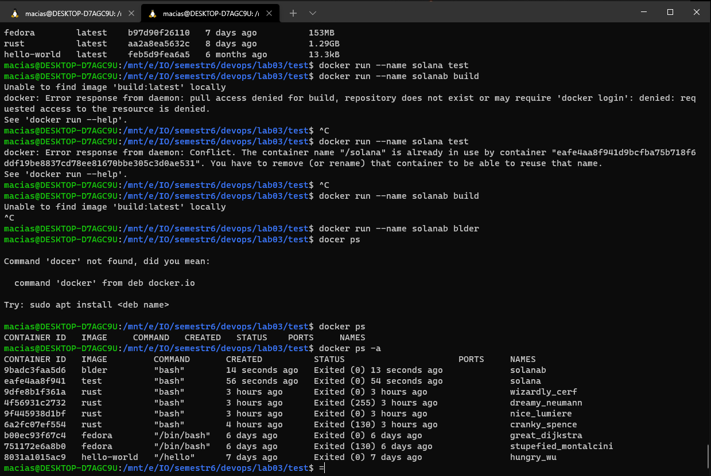