# Sprawozdanie

##   **Maciej Cholewa**

## **Wstęp**

Celem sprawozdania jest pokazanie budowania pipelinu krok po kroku (wraz z napotkanymi problemami).
Spodziewany efekt końcowy działania pipelinu:

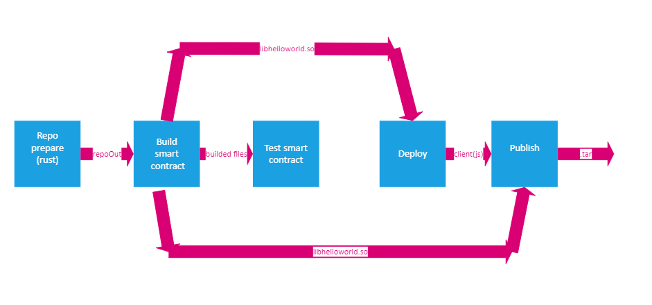

1. Pierwszym etapem pipelinu jest sklonowanie repozytorium na volumen wyjściowy, który bedzie wejściem do kolejnego kontenera. Obrazem bazowym jest **rust:latest**, gdyż będzie on używany w kolejnych etapach i ma on zainstalowanego gita.

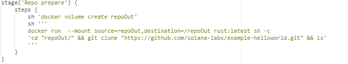   

    stage('Repo prepare') {
        steps {
            sh 'docker volume create repoOut'
            sh '''
            docker run  --mount source=repoOut,destination=/repoOut rust:latest sh -c 
            'cd "repoOut/" && git clone "https://github.com/solana-labs/example-helloworld.git" && ls'
            '''
            }
        }

Problem napotkany przy tym kroku to: 

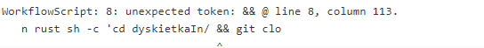

Udało się go rozwiązać przez użycie  ''' ''' do przekazywania poleceń i " " do przkazywania argumentów w pipelinie 

2. Kolejnym napotkanym problemem, było zostawanie utworzonych volumenów, po uruchomieniu pipelinum kolejny raz.

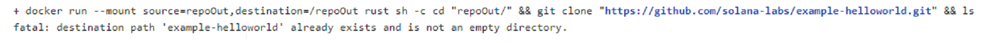

Rozwiązałem ten problem poprzez dodanie sekcji **post**, w której usuwam wszystkie kontenery oraz volumeny, utworzone podczas trwania pipelinu.

    post{
        always{
              sh '''docker rm -f $(docker ps -a -q)'''
              sh '''docker volume rm $(docker volume ls -q)'''
        }
    }

3. Kolejnym krokiem było dodanie kroku **Build smart contract**, w którym obrazem bazowym jest wyżej wspomniany rust:latest - posiada on wszystkie dependencje potrzebne do zbudowania i testowania programu. W tym etapie kopiuje z volumenu wejściowego **program-rust** do volumenu wyjściowego, w którym buduje program.

        stage('Build smart contract') {
            steps {
                sh 'docker volume create buildedSmartContract'
                sh 'docker volume create smartContract'
                sh '''
                docker run  --mount source=smartContract,destination=/smartContract --mount source=repoOut,destination=/repoIn 
                --mount source=buildedSmartContract,destination=/buildedSmartContract rust:latest  sh -c 
                'cp -r "repoIn/example-helloworld/src/program-rust"  "/buildedSmartContract"  && cd "/buildedSmartContract/program-rust" &&
                cargo build  && ls && cp -r "/buildedSmartContract/program-rust/target/debug/libhelloworld.so" "/smartContract"'
                '''
            }
        }

4. Kolejnym krokiem pipelinu jest **Test smart contract**, w którym wykonujemy testy na zbudowanym wczesniej programie

        stage('Test smart contract') {
            steps {
                sh '''
                docker run --mount source=buildedSmartContract,destination=/buildedSmartContract rust:latest 
                sh -c ' cd "/buildedSmartContract/program-rust" && cargo test'
                '''
            }
        }

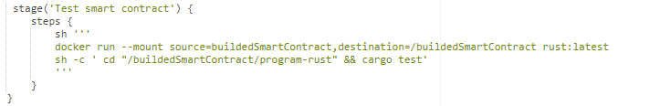

5. Kolejnym krokiem pipelinu jest **Deploy**, w którym obrazem bazowym jest node, gdyż muszę zbudować klienta przed uruchomieniem go, który jest napisany w js. Jednak najpierw zainstalowałem oraz uruchomiłem klaster solany, aby móc tam zamieścić program. 

Pierwszym napotkanym problemem był błąd podczas generowania kluczy przez solanę, podczas instalacji i przygotowania solany do działania.

 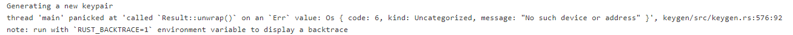

 Udało mi się naprawić problem poprzez zainstalowanie wersji **stable**, a nie **v1.10.8**, która była podana w dokumentacji.

Następnym problemem, na tym etapie był problem z wrzuceniem programu na solanę. Aby to zrobić należy uruchomić klaster:

    solana-test-validator

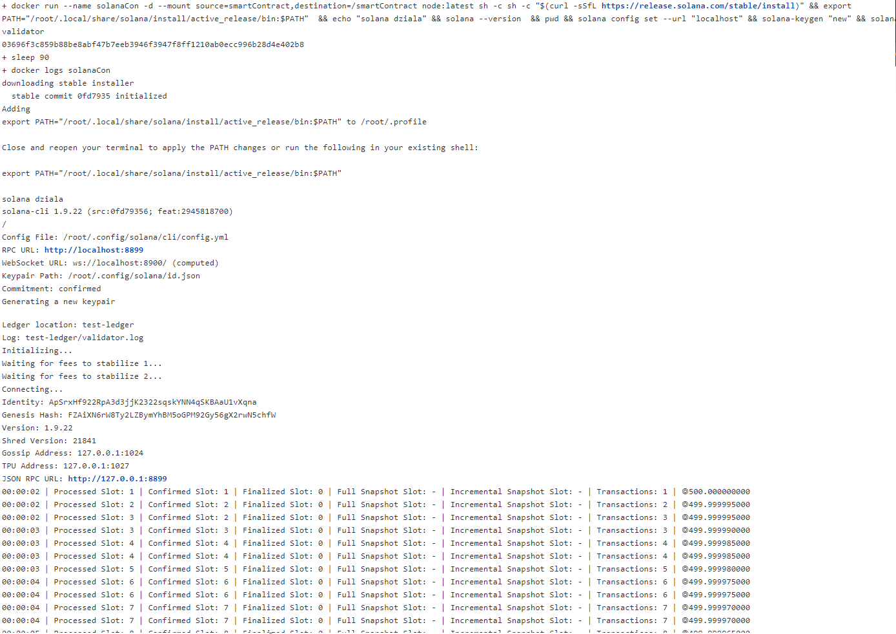

Udało mi się urchomić klaster w kontenerze z flagą -d, co pozwala na dostpę do kontenera za pomocą **docker exec**. Logi ze zdjęcia są zebrane za pomocą **docker logs solanaCon**. Niestety na kolejnym etapie nie udało się zamieścić programu.

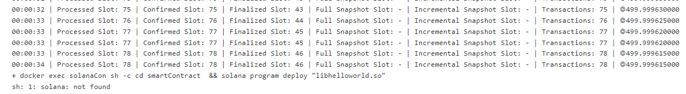

Przy próbie wrzucenia programu, **sh**  nie widzi zainstalowanej solany, co uniemożliwia zamieszczenie porgramu na sieć solany.

        stage('Deploy') {
            steps {
                sh '''
                docker run --name solanaCon -d --mount source=smartContract,destination=/smartContract  node:latest  
                sh -c 'sh -c "$(curl -sSfL https://release.solana.com/stable/install)" && 
                export PATH="/root/.local/share/solana/install/active_release/bin:$PATH"  && 
                echo "solana dziala" && solana --version  && pwd && solana config set --url "localhost" && solana-keygen "new" && solana-test-validator'
                sleep 90
                docker logs solanaCon
                docker exec solanaCon sh -c 'solana program deploy "smartContract /libhelloworld.so"'
                '''                                  
            }
        }

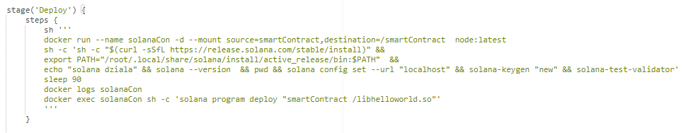

6. Ostatnim etapem jest **Publish**, w tym etapie **smart contract** (plik z rozszerzeniem .so), client napisany w js wraz z instrukcją jest pakowany do paczki.tar.gz. Program nie zawiera instalatora, ponieważ potrzebuje być wgrany na klaster solany, gdzie zostajnie uruchomiony (nie potrzeba instalatora), a gdy uruchomimy klienta to zostanie nam pokazany efekt działania programu.

Etap ten bazuje na parametrze **PROMOTE**, jeżeli jego wartość jest true to nowa wersja zostanie opublikowana.

    parameters {
        booleanParam(name: 'PROMOTE', defaultValue: true, description: '')
    }
    

    stage('Publish'){
        when{
            expression { params.PROMOTE ==~ /(?i)(Y|YES|T|TRUE|ON|RUN)/ }
        }
        steps{
            sh'''
            docker volume create  finalVersion
            docker run --mount source=smartContract,destination=/smartContract --mount source=finalVersion,destination=/finalVersion --mount source=repoOut,destination=/repoOut rust:latest sh -c 'cp -r "/smartContract/libhelloworld.so" "/finalVersion" cp -r "repoOut/example-helloworld/src/client/" "/finalVersion" && cd "finalVersion" && touch "instructions.txt" && echo "For deploying program to Solana network follow the instuctions https://github.com/solana-labs/example-helloworld/blob/master/README.md" >> "instructions.txt" && tar -zcvf sol.tar.gz "/finalVersion"'
            '''
            }
        }

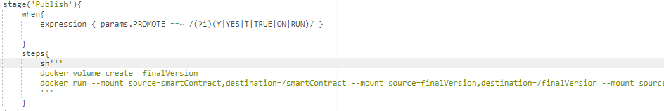

7. Efekt końcowy działania pipelinu, z wykliczeniem etapu **deploy**:

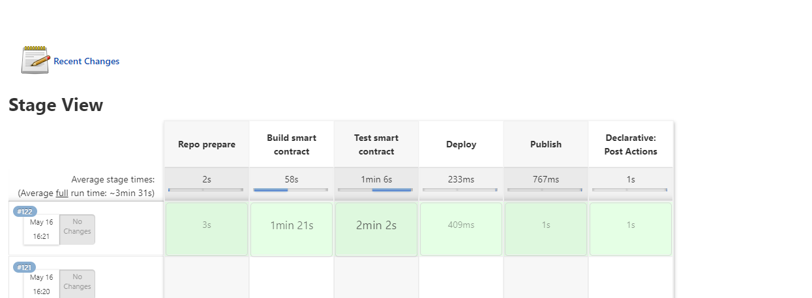