# Sprawozdanie

### Maciej Cholewa

1. Przygotowałem maszynę wirtualną wraz wybraniem pliku startowego (.iso), który pobrałem

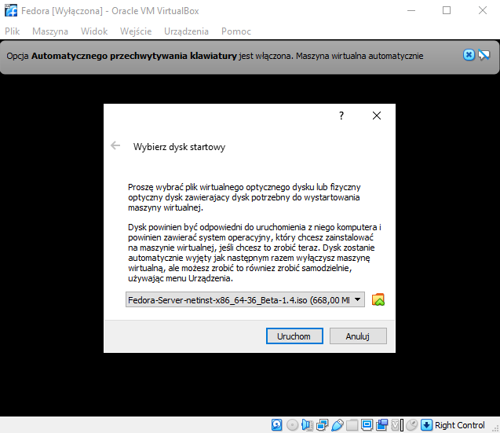

2. Uruchomiłem instalcję systemu Fedora

3. Ustawiłem język angielski oraz polską klawiaturę, zmieniłem ustawienia partycji oraz utworzyłem konto dla **roota**

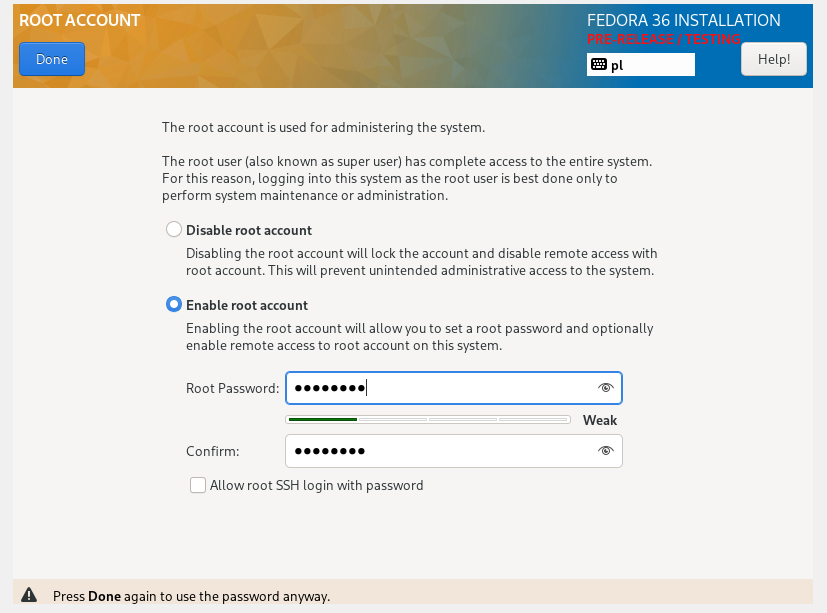

4. Utworzyłem konto dla użytkownika 

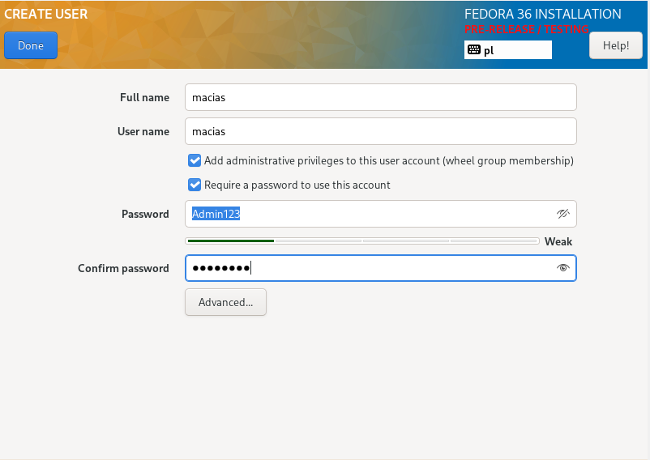

5. Wybrałem minimalną instalcję 

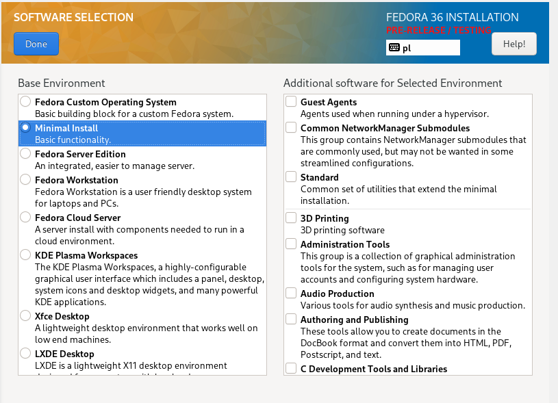

6. Po zainstalowaniu zresetowałem maszynę, zalogowałem się jako **root**, aby mieć dostęp do pliku odpowiedzi potrzebnego do instalacji. Niestety Virtual Box nie chciał współpracować przy udostępnianiu plików miedzy hostem, a Fedorą, więc byłem zmuszony na ręczne "skopiowanie" pliku

        ls
        cat annaconda-ks.cfg | less

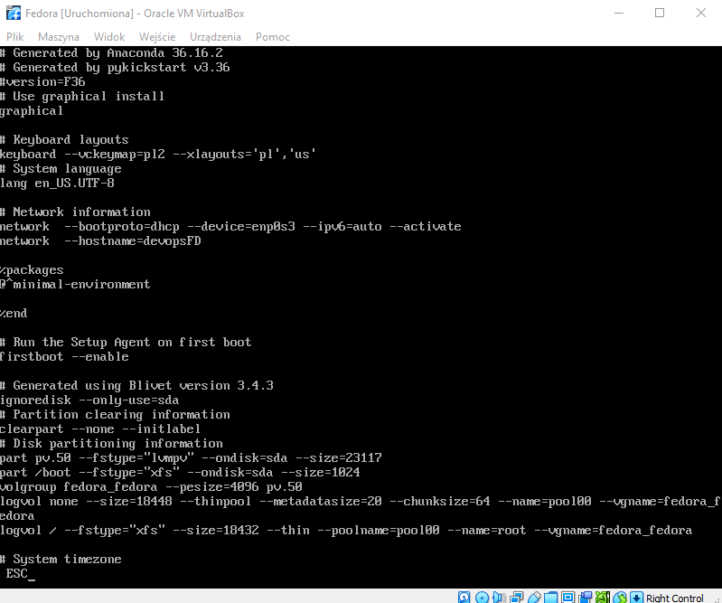

7. Uzupełniłem plik o potrzebne dependencje w sekcji post

sudo apt-get install git #git
sh -c "$(curl -sSfL https://release.solana.com/v1.10.8/install)" # solana

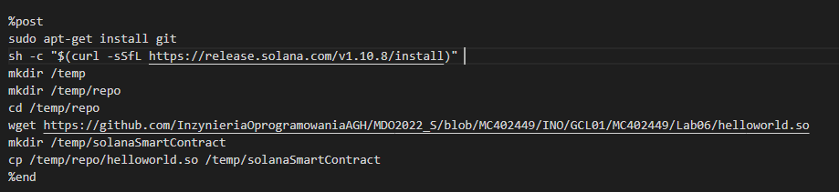

8. "Skopiowany" plik wrzuciłem na gituba 

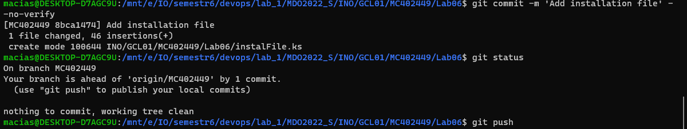

9. Stworzyłem kolejną maszynę z niezainstalowanym systemem, podczas urchamiania podałem plik startowy zawierający odpowiedzi do instalatora.

        inst.ks=https://raw.githubusercontent.com/InzynieriaOprogramowaniaAGH/MDO2022_S/MC402449/INO/GCL01/MC402449/Lab06/instalFile.ks

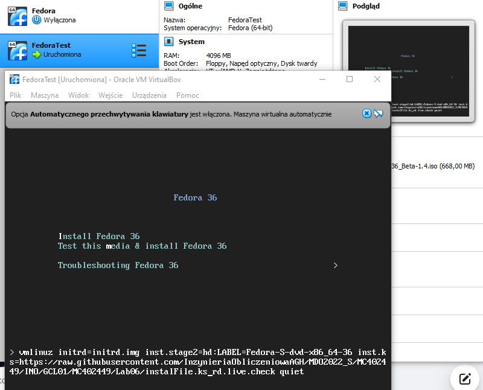

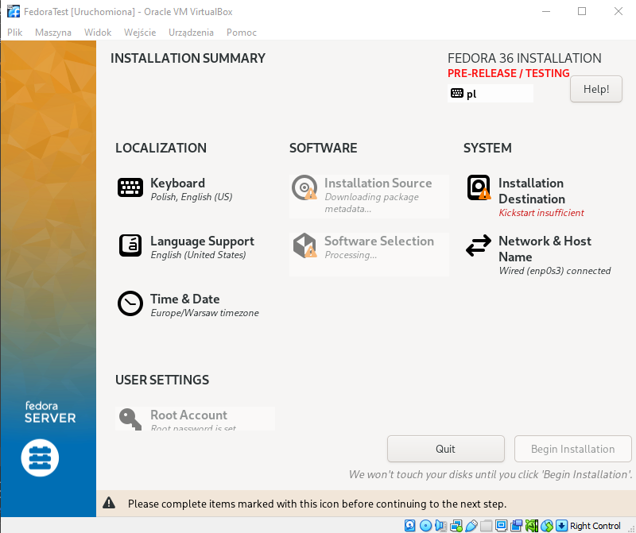

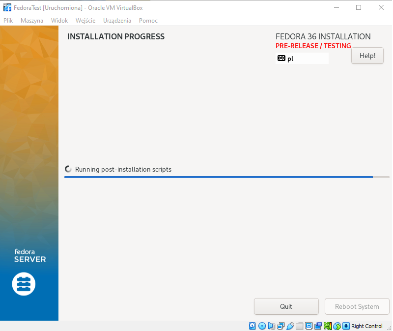

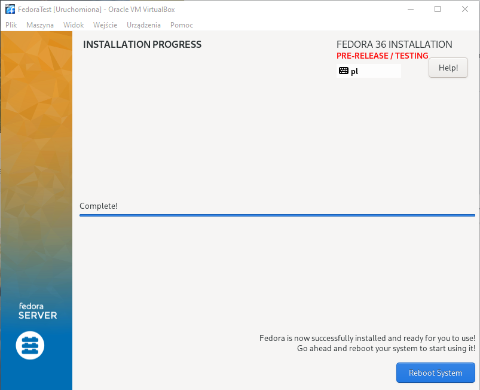

10. Z pliku **.iso** oraz pliku odpowiedzi **.ks** zrobiłem nowe ISO, zgodnie z poradnikiem https://access.redhat.com/documentation/en-us/red_hat_enterprise_linux/6/html/installation_guide/s1-kickstart2-putkickstarthere

        sudo mount Fedora-Server-netinst-x86_64-36_Beta-1.4.iso /mnt/e/IO/semestr6/devops/lab06/isooo/mountFile/
        sudo cp -pRf /mnt/e/IO/semestr6/devops/lab06/isooo/mountFile/  /mnt/e/IO/semestr6/devops/lab06/isooo/tmp/
        sudo umount /mnt/e/IO/semestr6/devops/lab06/isooo/mountFile
        cp instalFile.ks  ./tmp/mountFile/  

Dopisałem do pliku **isolinux.cfg** 

        append ks=instalFile.ks

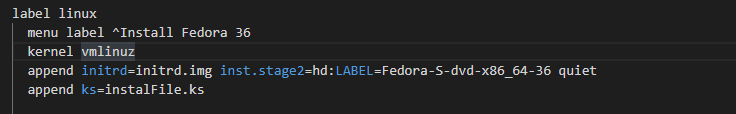        

        genisoimage -U -r -v -T -J -joliet-long -V "RHEL-6.9" -volset "RHEL-6.9" -A "RHEL-6.9" -b isolinux/isolinux.bin -c isolinux/boot.cat -no-emul-boot -boot-load-size 4 -boot-info-table -eltorito-alt-boot -e images/efiboot.img -no-emul-boot -o ../NEWISO.iso .

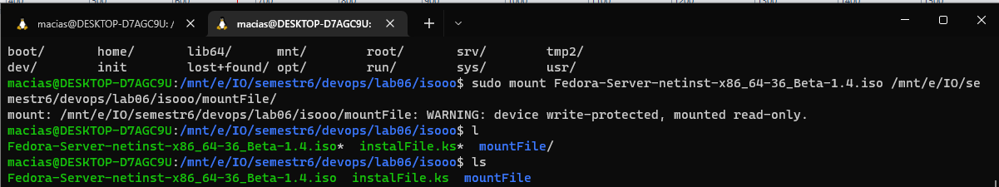
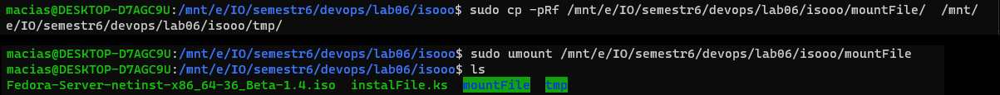
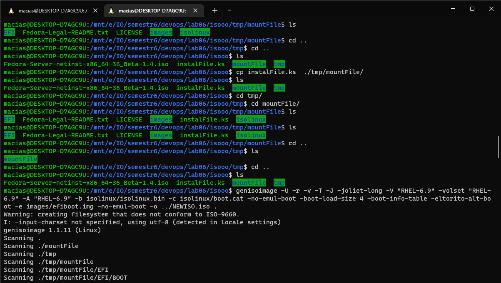
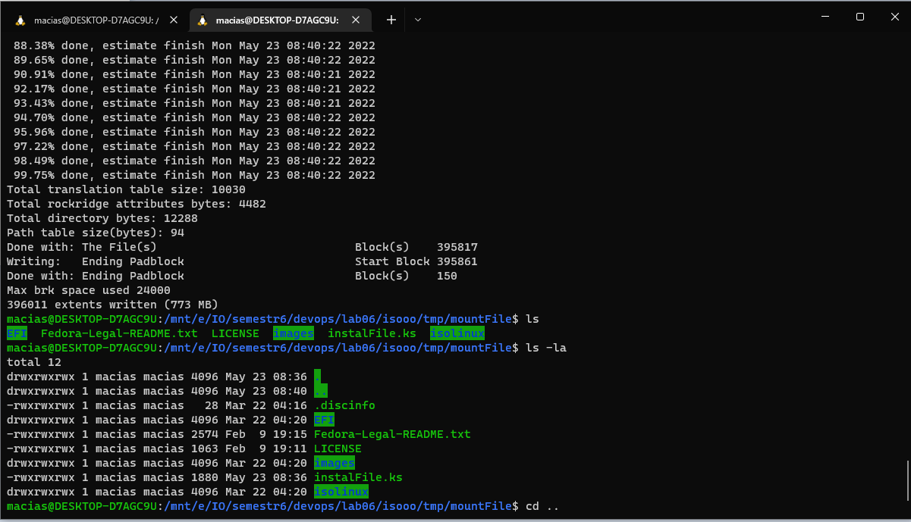
