# Sprawozdanie

### **Maciej Cholewa**

### **Zachowywanie stanu**

1. Przygotowałem 2 voluminy wejściowe oraz wejściowy

        docker volume create dyskietkaIn
        docker volume create dyskietkaOut

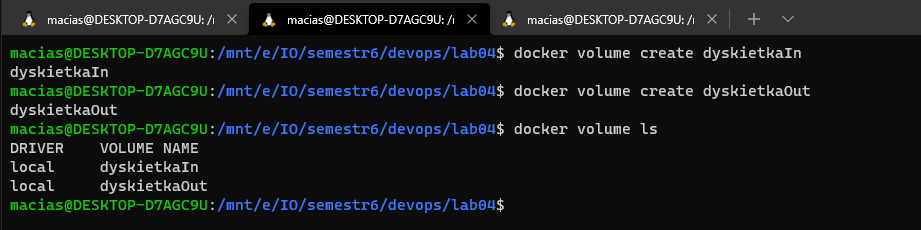

2. Uruchomiłem kontener bazowy, z podłączoną dyskietką na którą sklonowałem repozytorim

        docker run -it --name first --mount source=dyskietkaIn,destination=/dyskietkaIn rust

    Następnie uruchomiłem ponownie kontener, w celu sprawdzenia czy na dyskietce znajduje się sklonowane repozytorium

        docker run -it --mount source=dyskietkaIn,destination=/dyskietkaIn rust

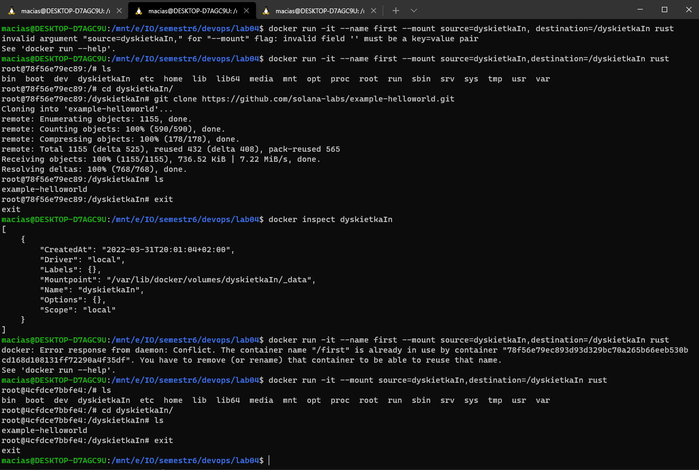

3. Uruchomiłem kontener z voluminem wejściowym oraz wyjściowym, oraz uruchomiłem builda w kontenerze 

        docker run -it --mount source=dyskietkaIn,destination=/dyskietkaIn  --mount source=dyskietkaOut,destination=/dyskietkaOut rust

        cargo build

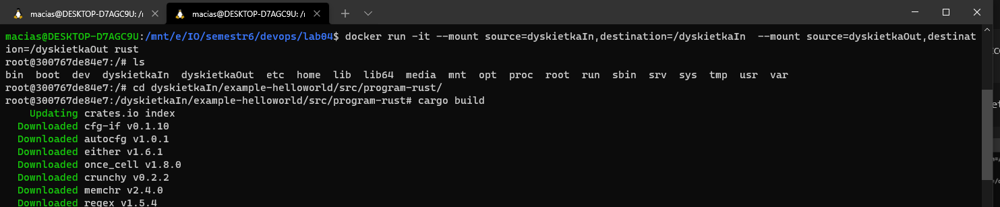

4. Zapisałem pliki w voluminie wyjściowmy

        cp -r /dyskietkaIn/example-helloworld/src/program-rust/target /dyskietkaOut

### **Eksponowanie portu**

5. Uruchomiłem kontener tak, aby jego port 22 był mapowany na port 2222 hosta. Zainstalowałem serwer iperf3 w tym kontenerze.

        docker run -it -p 2222:22 --name con1 fedora
        
        sudo dnf makecache --refresh
        sudo dnf -y install iperf3

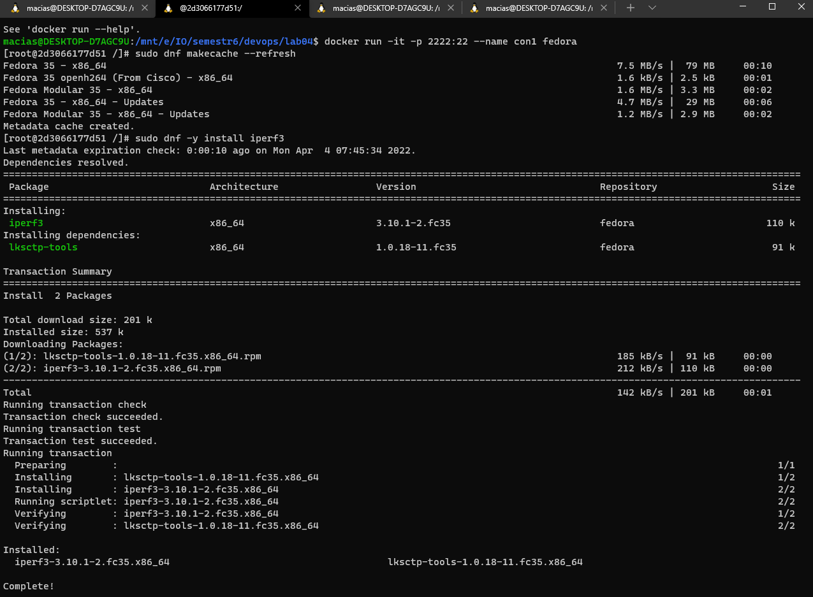

  Oraz uruchomiłem nasłuchiwanie przez serwer iperf3 (nasłuchuje na porcie 5201)

        iperf3 -s

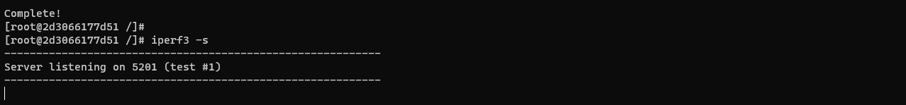

6. Za pomocą docker inspect sprawdziłem ip kontenra, na którym jest uruchomiony serwer iperf3 i używając portu na którym nasłuchuje połączyłem się na czas 60 sekund w celu mierzenia szybkości tranferu miedzy hostem, a kontenerem

        docker inspect con1 
        iperf3 -c 172.17.0.2 -t 60 -p 5201

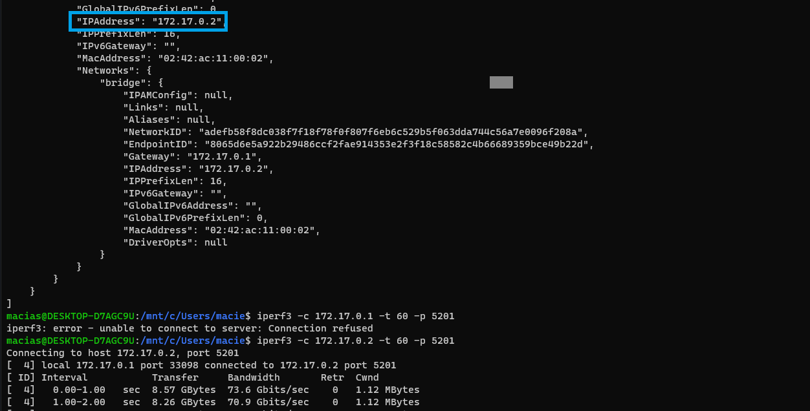
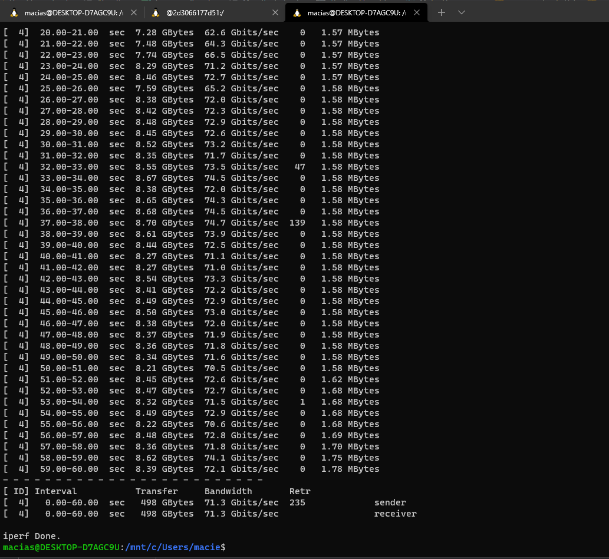

7. Następnie uruchomiłem kolejny kontener, zainstalowałem iperf3 i połączyłem się z **con1** w celu zmierzenia przepustowości między kontenrem, a kontenerem 

        docker run -it --name con2 fedora
        sudo dnf makecache --refresh
        sudo dnf -y install iperf3
        iperf3 -c 172.17.0.2 -t 60 -p 5201

8. Niestetyn ie udało mi się połączyć spoza hosta :( 

Średni tranfer miedzy hoste, a kontenre mwynióśł 71.3 GB/sec
Średni tranfer miedzy kontenerem, a kontenremwynióśł 60.9 GB/sec

### **Instancja Jenkins**

9. Przeprowadziłem zainstalowanie skonteneryzowanej instancji Jenkinsa z pomocnikiem DIND zgodnie z instrukcją dla LINUXa ze strony https://www.jenkins.io/doc/book/installing/docker/

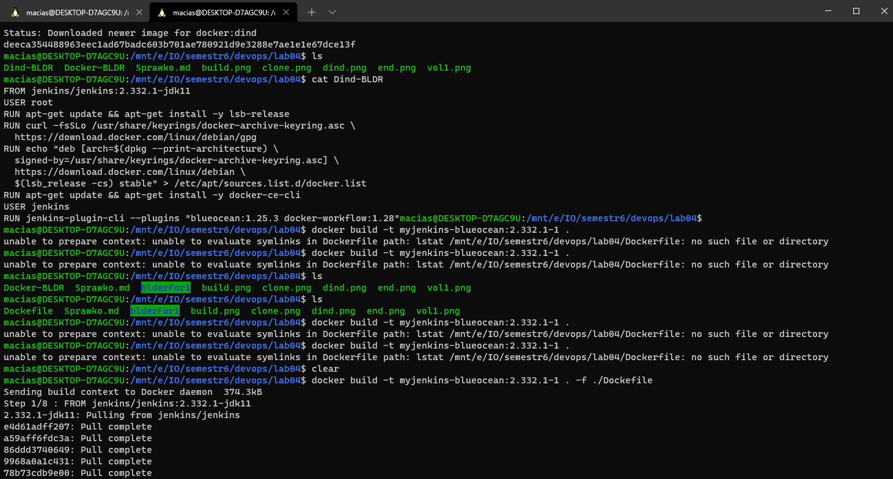
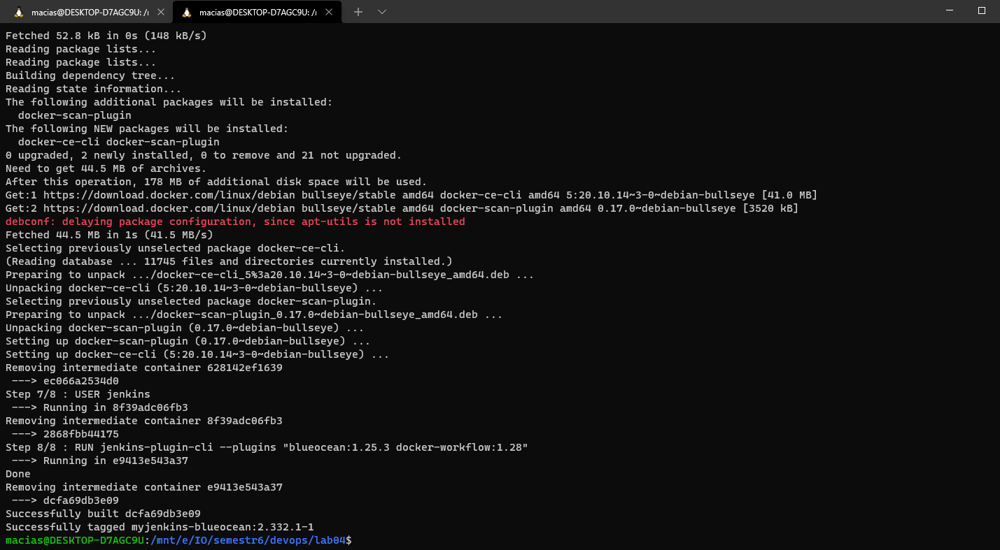

10. Uruchomiłem kontener 

        docker run --name jenkins-blueocean --rm --detach ^
         --network jenkins --env DOCKER_HOST=tcp://docker:2376 ^
        --env DOCKER_CERT_PATH=/certs/client --env  DOCKER_TLS_VERIFY=1 ^
        --volume jenkins-data:/var/jenkins_home ^
        --volume jenkins-docker-certs:/certs/client:ro ^
         --publish 8080:8080 --publish 50000:50000 myjenkins-blueocean:2.332.1-1

11. Sprawdziłem hasło(automatycznie wygenerowane) potrzebne do korzystania z instancji Jenkinsa

        docker logs babd149bf44b (id mojego  kontenera)

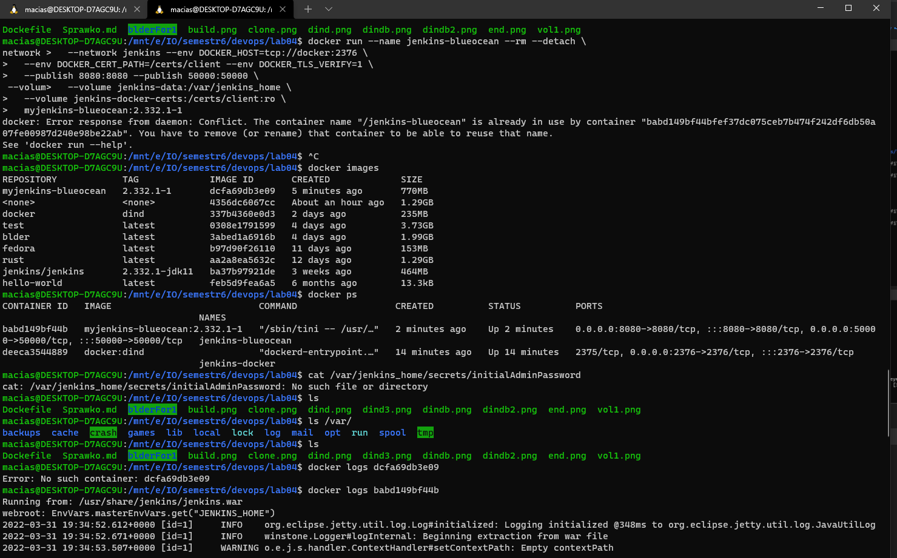
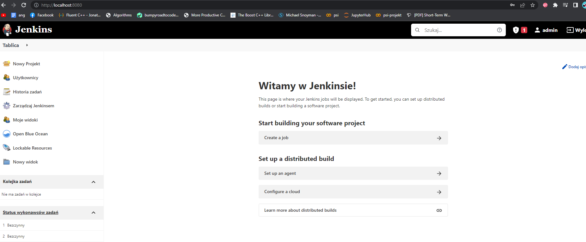