# Sprawozdanie 1 
# Michał Korzym Inżynieria Obliczeniowa gr.LAB01

## Zainstaluj klienta Git i obsługę kluczy SSH.
1. Prace rozpocząłem od zainstalowania oprogramowania Git, środowiskiem programowania z jakiego korzystam jest maszyna wirtualna z systemem linuxowym Ubuntu. Instalacji dokonałem za pomocą polecenia konsolowego *sudo apt-get install git*. 
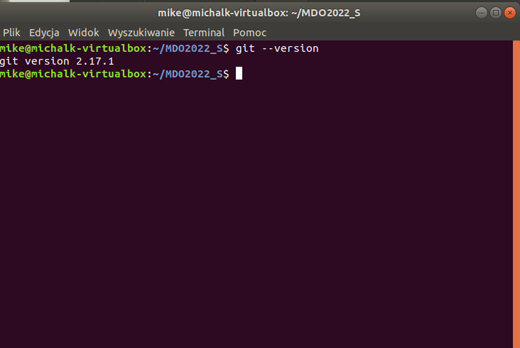
## Sklonuj repozytorium https://github.com/InzynieriaOprogramowaniaAGH/MDO2022_S za pomocą HTTPS.
2. Po przygotowaniu środowiska w pierwszej kolejności sklonowałem repozytorium przy pomocy protokołu HTTPS za pomocą polecenia *git clone  https://github.com/InzynieriaOprogramowaniaAGH/MDO2022_S*.
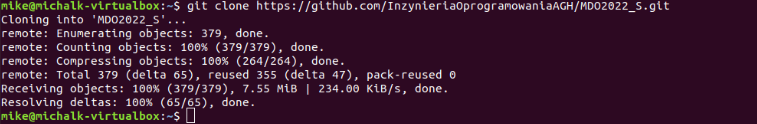
## Upewnij się w kwestii dostępu do repozytorium jako uczestnik i sklonuj je za pomocą utworzonego klucza SSH.
3. W następnym kroku przeszedłem do tworzenia, konfiguracji i obsługi kluczy SSH.
- Utworzyłem dwa klucze o różnych rodzajach klucza *ecdsa* oraz *ed25519*, ponadto jeden z nich został zabezpieczony hasłem.
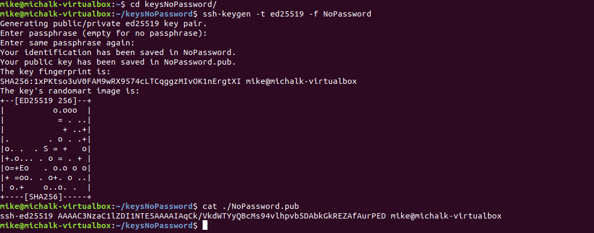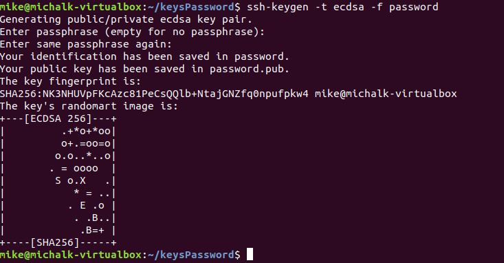
- Drugim krokiem było skonfigurowanie, a konkretnie dodanie kluczy SSH do konta GitHub (Settings -> SSH and GPS keys). Należy skopiować klucz publiczny. 
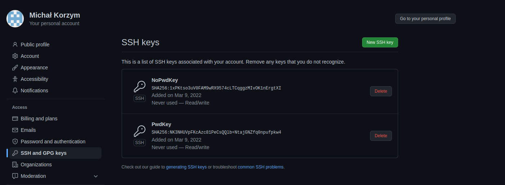
- Ostatnim etapem było finalne sklonowanie repozytorium tym razem korzystając ze wspomnianego powyżej SSH, jest to internetowy protokół komunikacyjny, który to pozwala nam na szyfrowanie danych za pomocą dwóch kluczy: publicznego oraz prywatnego. Tak więc udostępniając nasz klucz publiczny przy dostępie zdalnym do pewnych danych możemy uzyskać do nich dostęp podając nasz prywatny znany wyłącznie nam klucz.
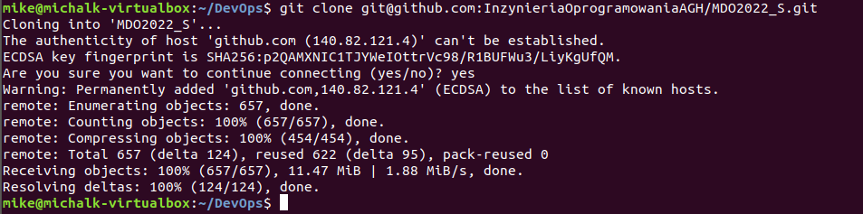
## Przełącz się na gałąź main, a potem na gałąź swojej grupy (pilnuj gałęzi i katalogu!).
4. Po wykonaniu poprzednich kroków można przejść do pracy na repozytorium, korzystając z polecenia *git checkout* przełączyłem się na odpowiedniego brancha.
## Utwórz gałąź o nazwie "inicjały & nr indeksu" np. KD232144.
5. Gdy byłem już na odpowiednim  branchu utowrzyłem nową gałąź o nazwie MK402568, skorzystałem z polecenia *git checkout -b MK402568*. 
## Rozpocznij pracę na nowej gałęzi.

6. Pracując już na nowej gałęzi, zacząłem tworzyć odpowiednie pliki oraz nimi "zarządzać".
- Utworzyłem folder "MK402568" a w nim folder w którym umieszczone zostały materiały "Lab01", korzystałem z polecenia *mkdir*.
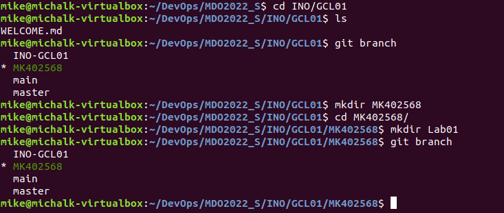
- Do folderu skopiowałem screenshoty oraz sprawozdanie w formacie *markdown*.
- Aby wysłać dodane pliki do zdalnego źródła, początkowo rozpocząłem ich śledznie korzystając z komendy *git add .*, kropka powoduje wykonanie czynności na wszystkich plikach, następnie aby zatwierdzić zmiany które są w "poczekalni" utworzyłem commita, użyłem komendy  *git commit -m* -m umożliwia nam dodanie wiadomości. Ostatecznie korzystając z polecenia *git push* umieszczam zmiany na zdalnym repozytorium.
 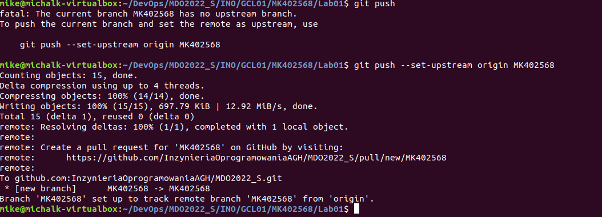
- Przełączając sie w pierwszej kolejności na gałąź grupową, następnie wykonałem instrukcje *git merge MK402568* w celu próby wciągnięcia utworzonej przeze mnie gałęzi do gałęzi grupowej. 
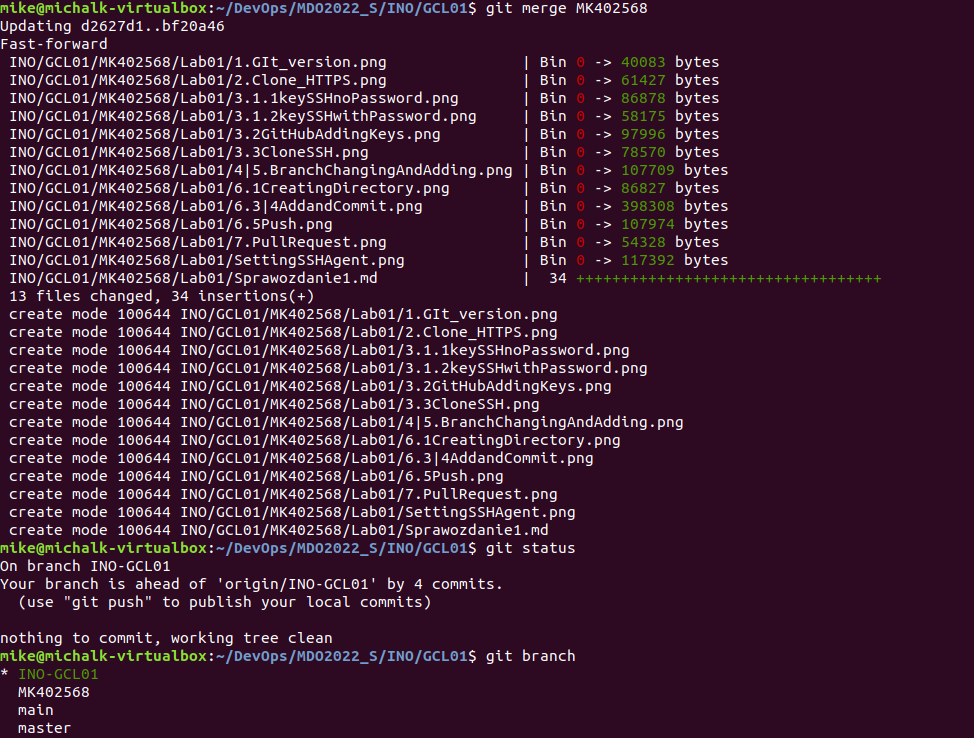 
## Wystaw Pull Request do gałęzi grupowej
7. Po wykonaniu zadań wystawiłem pull requesta do grupowego brancha.
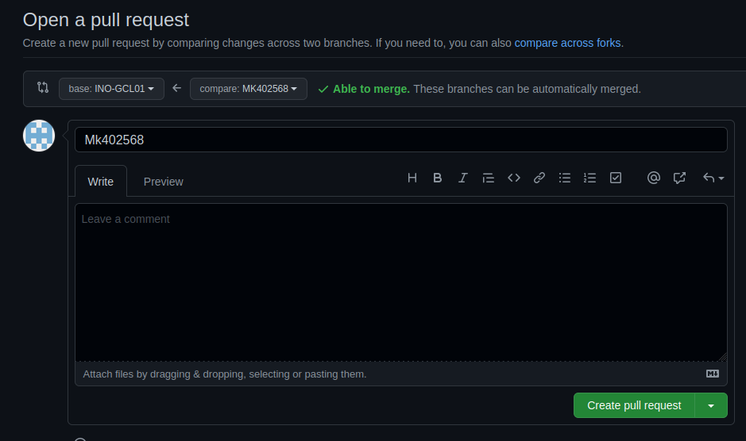
Ponadto aby umożliwić prace z kluczami ssh dodałem je do agenta kluczów. Tak aby uwierzytelnianie było stałe w trakcie danej sesji.
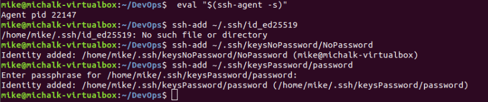