# Michał Korzym Inżynieria Obliczeniowa indeks:402568
## Sprawozdanie - Laboratorium 2

### 1. Przygotowanie git hooków rozwiązujących najczestsze problemy z commitami.
Git hook jest skryptem, który jest intergralny z Gitem , jego dzialanie odbywa się w określonym momencie a zadanie jakie ma wykonać określane jest przez użytkownika.

Prace z git hook'ami rozpocząłem od przejścia do katalogu *.git*, był to ukryty katalog, aby go zobaczyć należy użyć komendy ```ls -la```.

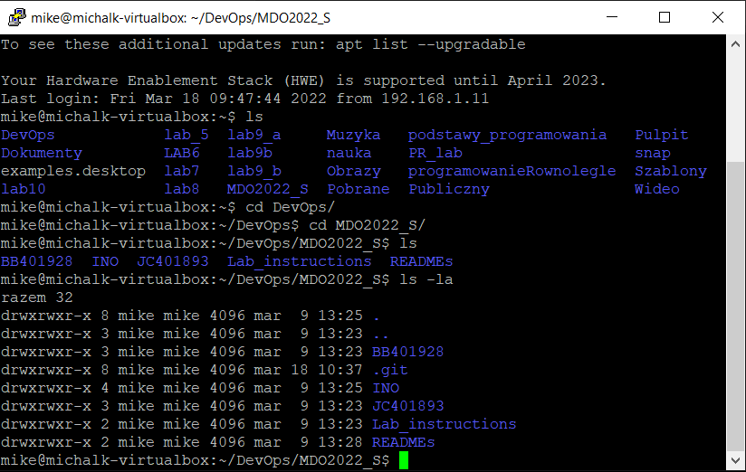

 Po przejściu do katalogu ```.git/hooks/``` dokonałem modyfikacji "domyślnych" plików *commit-msg.samgle* oraz *pre-commit.sample*, kopiując je oraz usuwając ich rozszerzenie sample, tak aby umożliwić ich poprawne działanie.

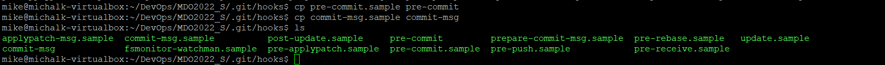

Następnie przeszedłem do modyfikacji plików korzystając z edytora tekstu ```nano```, składnia kodu to powłoka systemów unixowych *Bash*.
- hook sprawdzający, czy tytuł commita nazywa się ```<inicjały><numer indeksu>```.

W pierwszej kolejności zadaniem jest zmodyfikowanie hook'a *commit-msg*, tak aby dokonał testu poprawności tytułu commita, który to ma zawierać inicjały oraz numer indeksu. Poprzez sprawdzenie argumentu przechowywanego w ```$1``` dokonujemy porównania z docelową wartością a następnie za pomocą instrukcji warunkowej na wyjście wypisany jest komunikat rezultatu testu. Tak więc, gdy tworzony jest commit wykonywany jest skrypt sprawdzający jego poprawność.

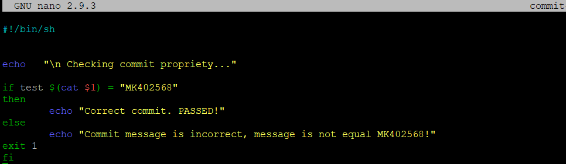 

Kolejno przeprowadziłem testy:
+ test pozytywny

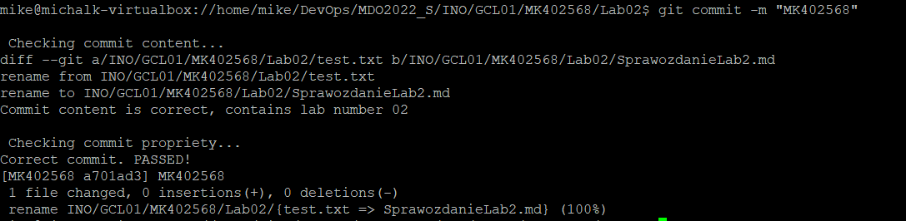

+ test negatywny

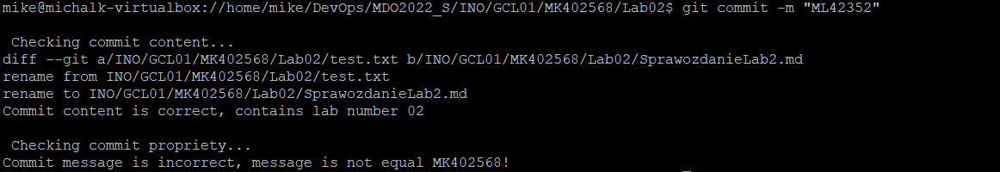

- hook sprawdzający, czy w treści commita pada numer labu, właściwy dla zadania.

Drugim etapem pracy z git hook'ami było zmodyfikowanie hook'a *pre-commit*, tym razem korzystając z funkcji ```git diff``` oraz przełącznika ```cached``` sprawdzane jest czy zmiany zatwierdzone do zacommitowania posiadają w swojej ścieżce \Lab02\ (numer obecnego laboratorium). Następnie za pomocą instrukcji warunkowych na wyjście wypisywana jest wiadomość zwrotna. 


Kolejno przeprowadziłem testy, w celu sprawdzenia poprawności utworzyłem w katalogu poprzedniego laboratorium plik tekstowy:
+ test pozytywny 
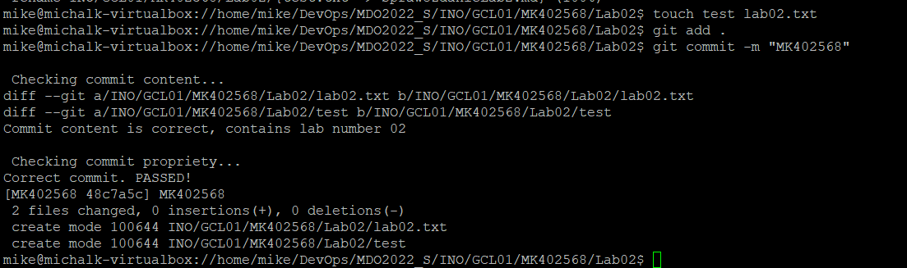
+ test negatywny
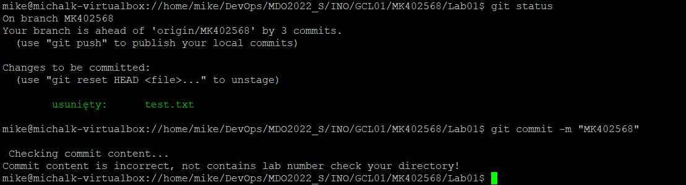

Podsumowując git hook's umożliwiają automatyzacje i usprawnienie pracy z repozytorium. Ponadto zabezpieczają nas przed popełnianiem podstawowych błędów.

### 2. Umieść hook w sprawozdaniu w taki sposób, aby dało się go przejrzeć
Oba zmodyfikowane hooki zostały umieszczone inline powyżej.
### 3. Rozpocznij przygotowanie środowiska Dockerowego
- zapewnij dostęp do maszyny wirtualnej przez zdalny terminal (nie "przez okienko").

Podczas laboratoriów korzystam z Wirtual Box'a z zamontowanym obrazem systemu Ubuntu, dostęp za pomocą terminala poprzez ssh umożliwia mi *PuTTY*, ponadto posiadam klienta FTP *FileZilla* aby usprawnić przesyłanie plików pomiędzy systemem a maszyną wirtualną. Poniżej screenshoty potwierdzające to o czym wspomniałem.
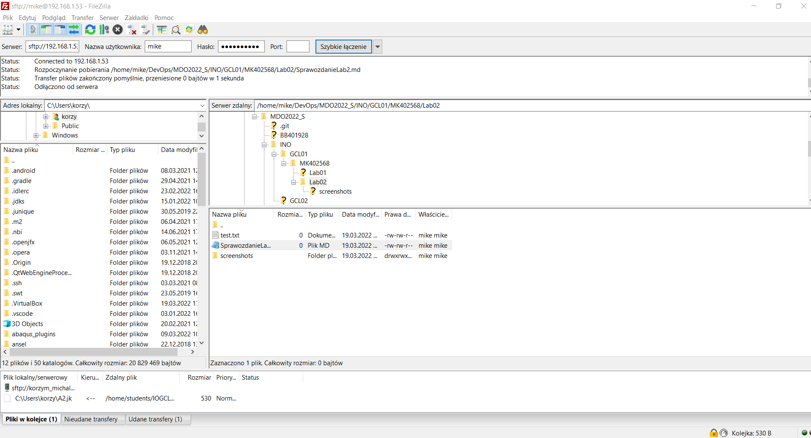 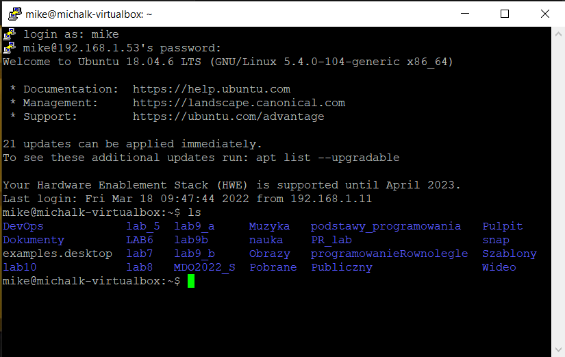
- jeżeli nie jest stosowane VM (np. WSL, Mac, natywny linux), wykaż ten fakt dokładnie.

Nie dotyczy.
- zainstaluj środowisko dockerowe w stosowanym systemie operacyjnym.
Instalacja dockera, krok po kroku: 
+ Usunięcie jakichkolwiek działających plików dockera w systemie korzystając z komendy ```sudo apt-get docker docker-engine docker.io```.

+ Zainstalowanie dockera, korzystając z komendy ```sudo apt install docker.io```.

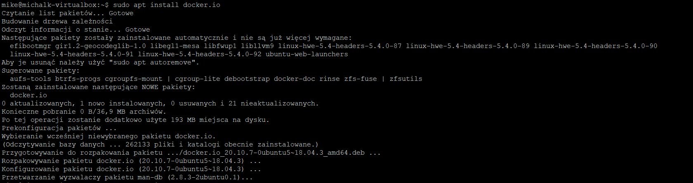
+ Instalacja wszystkich pakietów zależności ```sudo snap install docker```.

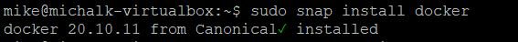
+ Sprawdzenie wersji dockera ```docker --version```.

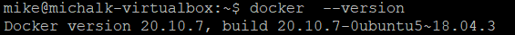
+ Przetestowanie działania poprzez pull obrazu z Docker huba korzystając z komendy ```sudo docker run hello-world```.

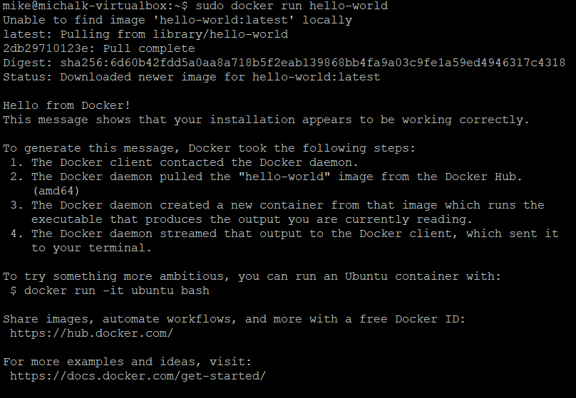
### 4.Działanie środowiska.
- wykaż, że środowisko dockerowe jest uruchomione i działa (z definicji).
Aby wykazać działanie środowiska dockerowego z definicji, wywołuje komende ```ps -aux | grep 'docker' ```, która to powoduje "przefiltrowany" wydruk statusów procesów. Otrzymany wynik potwierdza istnienie procesów *dockerd* oraz *containerd*.

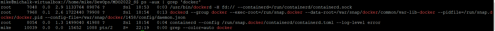
- wykaż działanie z sposób praktyczny (z własności).

W celu wykazania działania dockera w sposób praktyczny, pobrałem obraz linuksowej dystrybucji *Fedora*, ponieważ sam korzystam z Ubuntu. Korzystam ponownie z polecenia tworzącego kontener na określonym obrazie ```sudo docker run fedora```. Ponadto potwierdzam poprawność wykonania polecenia za pomocą komendy ```sudo docker images ```.

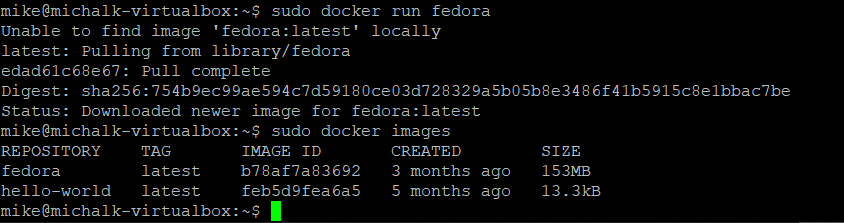

Następnie wykazuje aktualną wersje Fedor'y za pomocą polecenia ```sudo docker run -it fedora```.

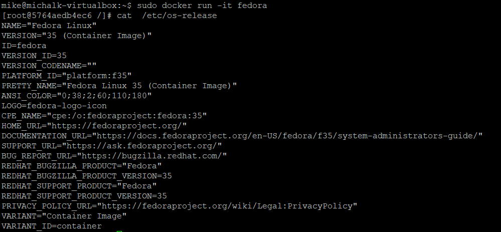
### 5.Załóż konto na Docker Hub
Zgodnie z poleceniem założyłem konto na Docker Hub'ie co potwierdza poniższy screen.

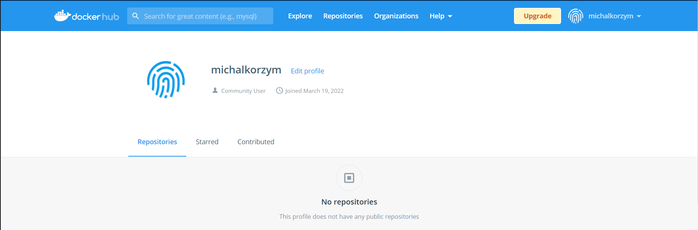


