# Sprawozdanie Lab03 - Docker files, kontener jako definicja etapu
## Michał Korzym Inżynieria Obliczeniowa nr.indeksu 402568

### Wybór oprogramowania na zajęcia
1. Znajdź repozytorium z kodem dowolnego oprogramowania, które:
- dysponuje otwartą licencją.
- jest umieszczone wraz ze swoimi narzędziami Makefile tak, aby możliwe był uruchomienie w repozytorium czegoś na kształt make build oraz make test. Środowisko Makefile jest dowolne. Może to być automake, meson, npm, maven, nuget, dotnet, msbuild...
- zawiera zdefiniowane i obecne w repozytorium testy, które można uruchomić np. jako jeden z "targetów" Makefile'a. Testy muszą jednoznacznie formułować swój raport końcowy (gdy są obecne, zazwyczaj taka jest praktyka).

W pierwszej kolejności wybrałem repozytorium joomla-cms, jednak po komplikacjach zdecydowałem się na repozytorium node-red. Link do repozytorium: https://github.com/node-red/node-red.


Repozytorium opiera się na licencji *Apache License 2.0*, jest to licencja wolnego oprogramowania, dopuscza użycie kodu źródłowego na potrzeby wolnego oprogramowania jaki własnościowego. Tak więc repozytorium spełnia wymaganie otwartej licencji.
 

Jeśli chodzi o środowisko Makefile to będzie to npm, tak więc w przypadku budowania wykorzystywał będe ```npm run build```, natomiast testy można uruchomić za pomocą komendy ```npm test```.

- Sklonuj niniejsze repozytorium, przeprowadź build programu (doinstaluj wymagane zależności).

W pierwszej kolejności sklonowałem repozytorium korzystając z komendy ```git clone https://github.com/node-red/node-red.git```.


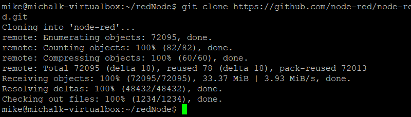

Następnie aby umożliwić zbudowanie repozytorium przeszedłem do instalacji wymaganych zależności. Jako iż Ubuntu nie radziło sobie z instalacją najnowszych wersji *node* oraz *npm*, musiałem "wymusić" instalacje najnowszej wersji node'a aby następnie zainstalować najnowszą wersje npm. Skorzystałem z narzędzia ```curl``` aby za pomocą https pobrać wersje x.14 Node.

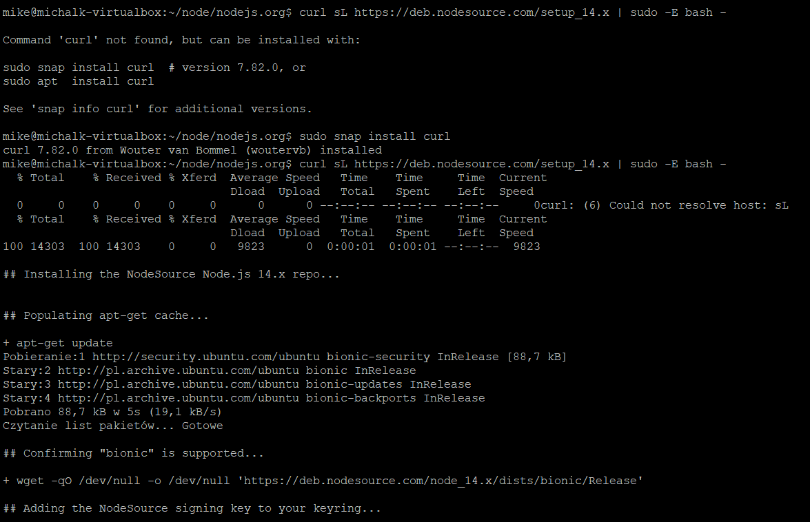

W kolejnym etapie zainstalowałem node za pomocą komendy ```sudo apt-get install -y nodejs```. 

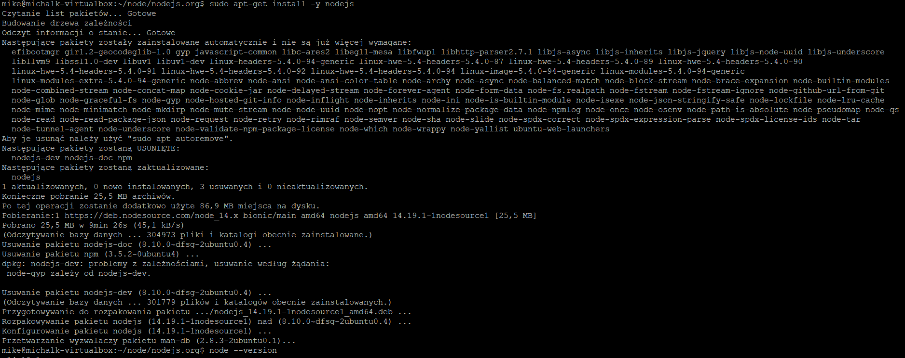

A na końcu zupdateowałem npm za pomocą komendy ```sudo npm install npm@latest -g```.

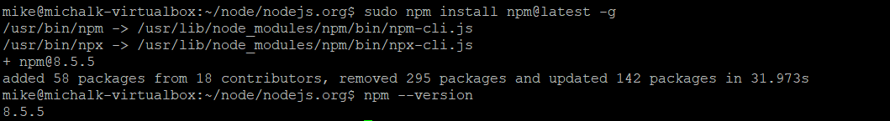

Gdy wymagane zależności zostały doinstalowane a repozytorium sklonowane wykonałem polecenie ```sudo  npm build```.

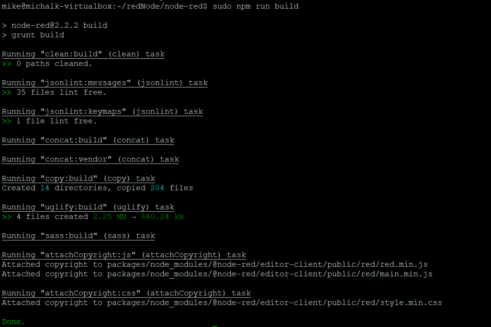

- Uruchom testy jednostkowe dołączone do repozytorium.

W kolejnym kroku wykonałem testy za pomocą polecenia ```sudo npm test```. Wyniki przedstawione w screenshotach są jedynie częścią całości, testów jest ponad 2000, tak więc umieściłem początek i koniec oraz wybrany fragment ze środka.

*start*

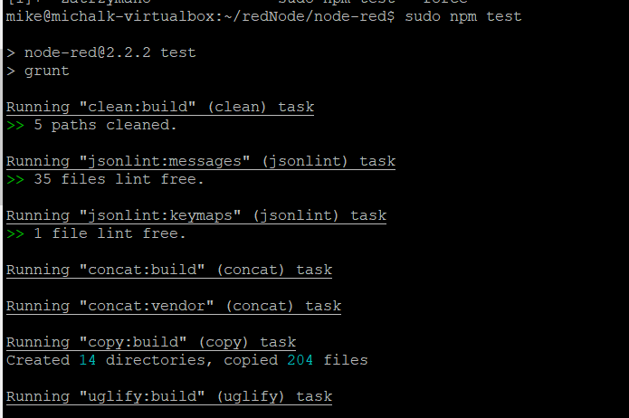

*środek*

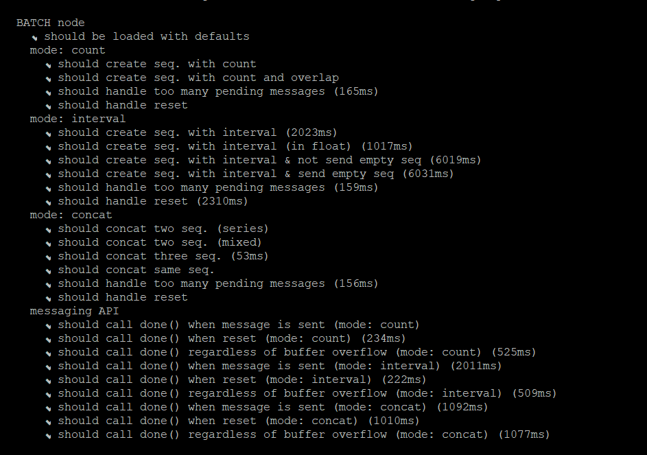

*koniec*

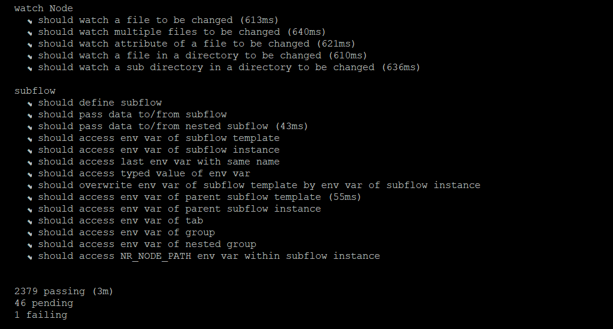

Jak widać na ostatnim z powyższych screenów jeden z testów się nie powiódł, stwierdziłem jednak, że pozytywny rezultat około 2400 testów jak i cel laboratorium nie wymagają aby "usunąć" ten błąd. Jest on spowodowany delayem. Tak więc całość tej części laboratorium powiodła się pomyślnie. 

### Przeprowadzenie buildu w kontenerze

W drugim etapie laboratorium należało powyższe kroki wykonać wewnątrz kontenera.

2. Wykonaj kroki build i test wewnątrz wybranego kontenera bazowego. Tj. wybierz "wystarczający" kontener, np ubuntu dla aplikacji C lub node dla Node.js.

- uruchom kontener oraz podłącz do niego TTY celem rozpoczęcia interaktywnej pracy.

W celu uruchomienia kontenera używam komendy ```sudo docker run``` w moim przypadku kontenerem jest *node*. Ponadto dodaje przełącznik ```-it``` wraz z właściwością ```bash``` tak aby uruchomiony został interaktywny terminal kompatybilny z bashem.

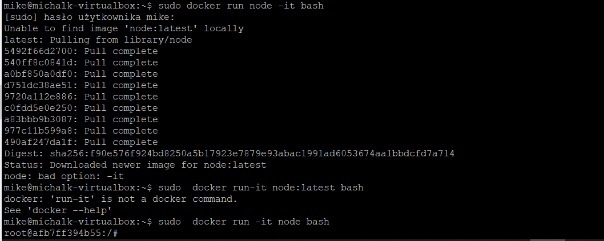

- sklonowanie repozytorium wewn. kontenera

Klonowanie przebiega analogicznie jak poza kontenerem tj. korzystam z komendy ```git clone```.

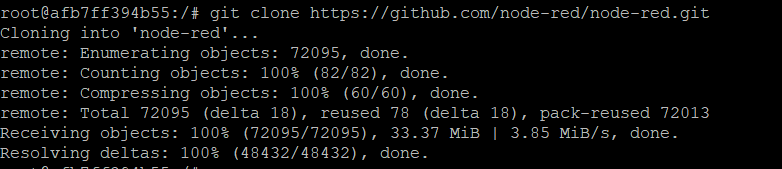

- Zaopatrz kontener w wymagania wstępne (jeżeli proces budowania nie robi tego sam).

Analogicznie po raz kolejny wykonuje polecenie ```npm install``` aby kontener miał doinstalowane zależności.

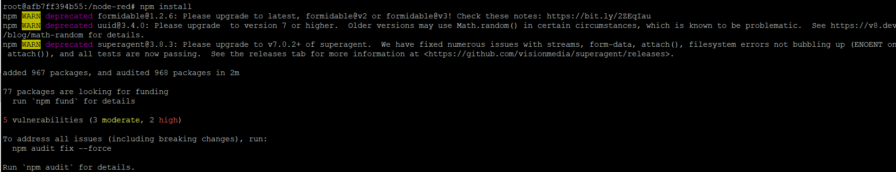

- Uruchom build

Również analogicznie korzystam z polecenia ```npm run build```.

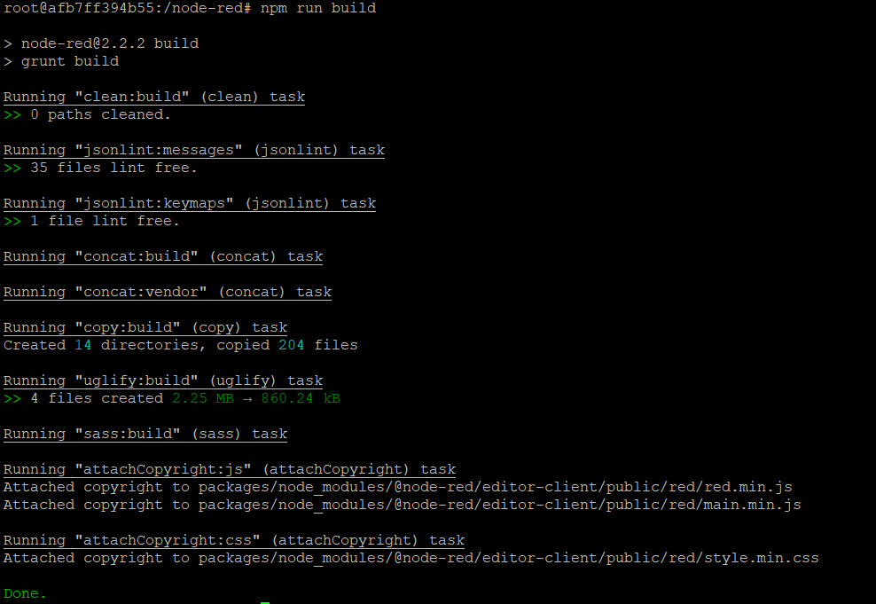

- Uruchom testy.

Ponownie analogicznie korzystam z polecenia ```npm test```.

Ponownie większość testów zakończyła się powodzeniem, problem pojawił się znów w zbyt dużym delay'u jednak, całościowo zostały one przeprowadzone poprawnie. Kolejny raz poniżej screeny początkowego etapu, środkowego i końcowego:

*start*
 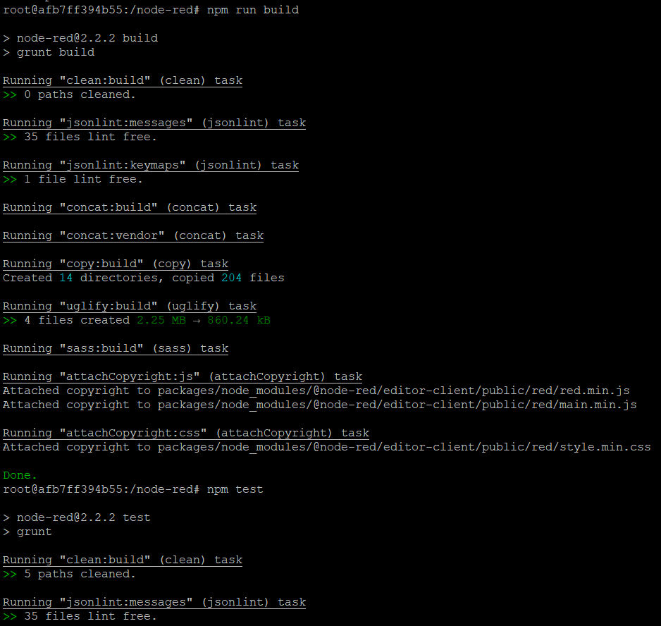

 *środek*

 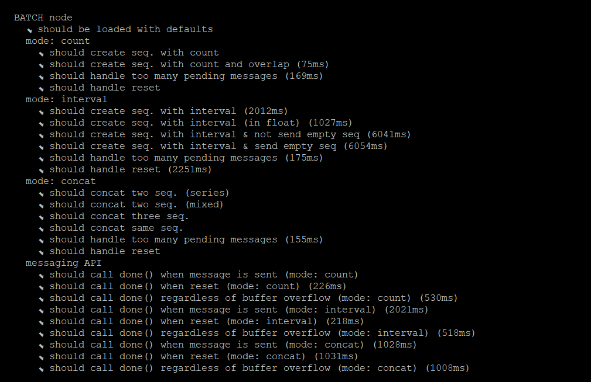

 *koniec*

 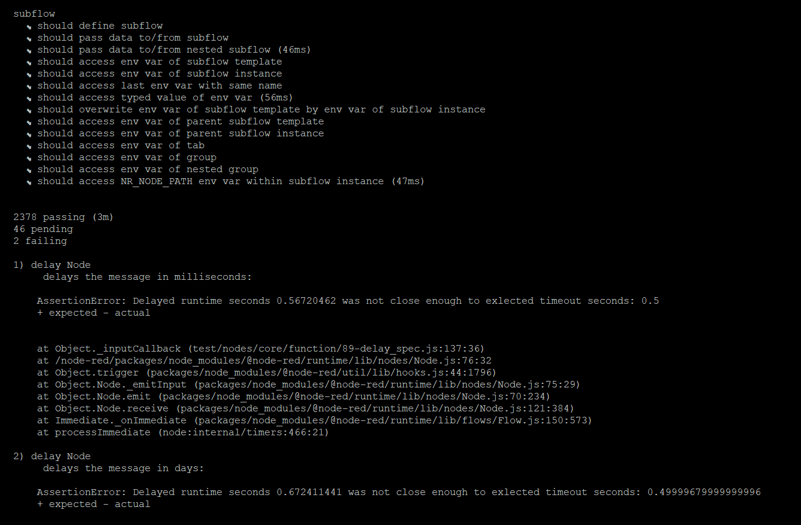 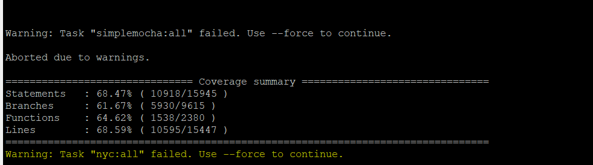


 3. Stwórz dwa pliki Dockerfile automatyzujące kroki powyżej, z uwzględnieniem następujących kwestii.

 - Kontener pierwszy ma przeprowadzać wszystkie kroki aż do builda.

Tworze plik z rozszerzeniem dockerfile, jego modyfikacje przeprowadzam w Visual Studio Code, początkowo korzystając z *FROM* wybieram najnowszy obraz kontenera node ```node:latest```. W następnym kroku korzystam z polecenia ```git clone``` dzięki czemu klonuje repozytorium, poprzez *WORKDIR* ustawiam ścieżke roboczą a na końcu instaluje zależności ```npm install``` i wykonuje builda ```npm run build```.


- Kontener drugi ma bazować na pierwszym i wykonywać testy.

Drugi z plików automatyzujących dockerfile, bazuje na pierwszym oraz wykonuje testy. Wybieramy więc stworzony obraz, ścieżke roboczą oraz dodatkowo uruchamiamy testy dzięki ```RUN npm test```.

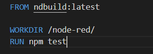

Utworzone pliki dockerfile kopiuje na maszyne wirtualną za pomocą serwera FTP Filezilla.

4. Wykaż, że kontener wdraża się i pracuje poprawnie. Pamiętaj o różnicy między obrazem a kontenerem. Co pracuje w takim kontenerze?

Początkowo wykonywany jest dockerfile który wykonuje build, tak więc zadanie to wykonywane jest poprzez polecenie ```sudo docker build . -f firstDockerFile.dockerfile -t ndbuild```.Poprzez przełącznik ```-f``` odwołuje się do konkretnego pliku dockerfile, natomiast ```-t``` pozwala na ustalenie nazwy obrazu. Poniżej screenshoty potwierdzające powodzenie operacji.

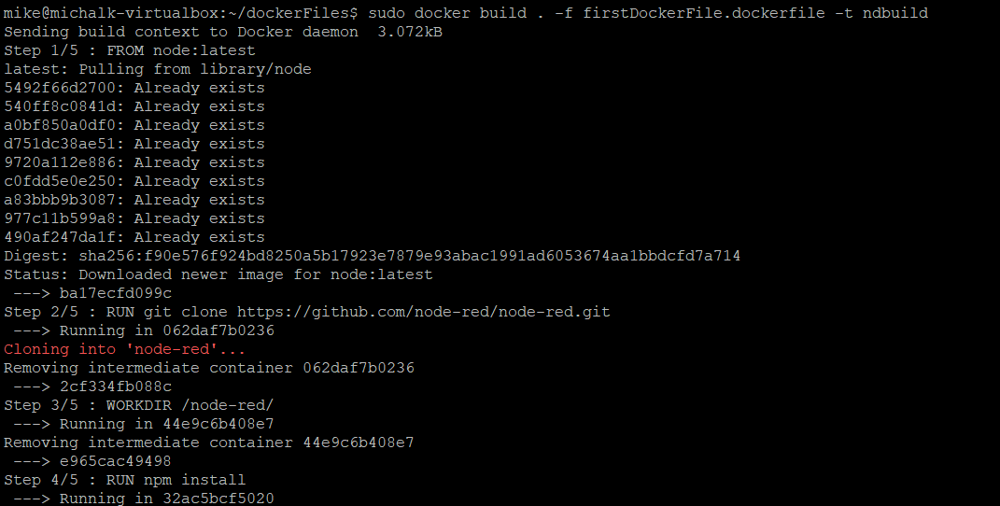

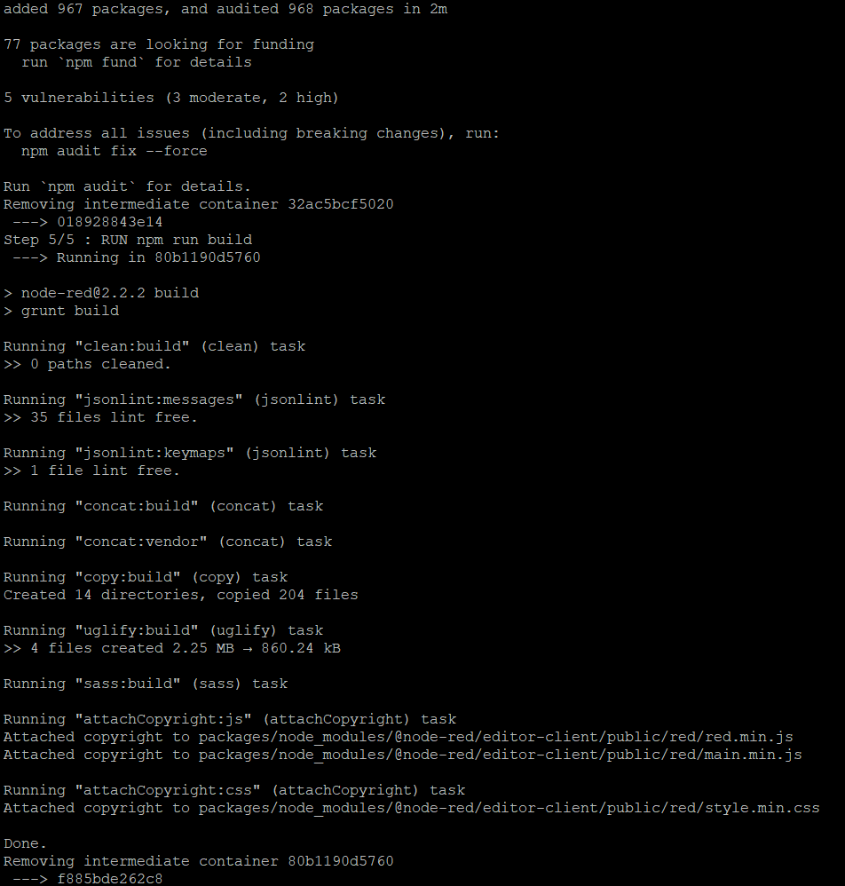

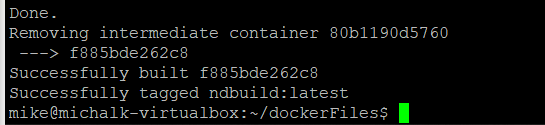

Po przeprowadzeniu powyższych działań uruchomiłem drugi z plików dockerfile tym razem przeprowadzone zostają testy na utworzonym wcześniej obrazie. Polecenie analogiczne ze zmienionymi nazwami pliku oraz docelowego obrazu. Poniżej screeny potwierdzające operacje.

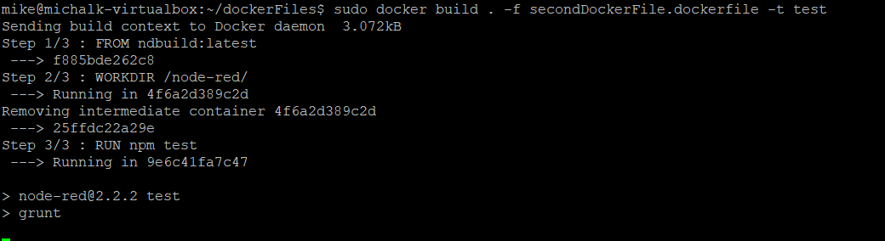

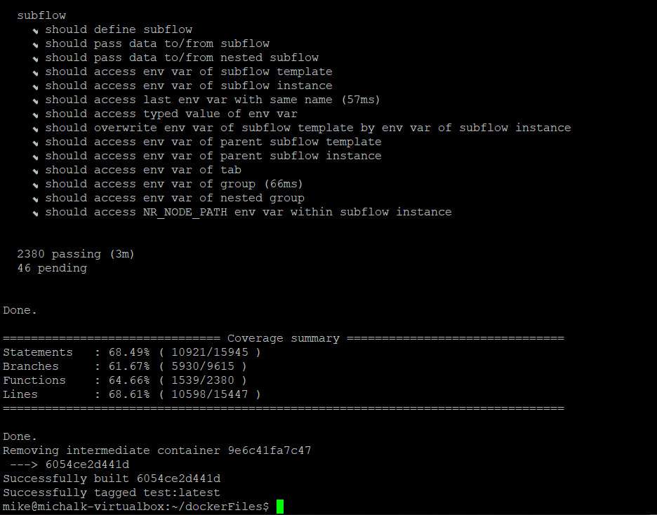


Jak widzimy na ostatnim z powyższych screenów, żaden z testów nie zakończył się niepowodzeniem, co potwierdza że wcześniejsze kilka niepowodzeń testów były spowodowane wyłączenie delayem. 

Pliki  dockerfile wykonały swoje zadanie w sposób prawidłowy, automatyzacja przebiegła pomyślnie. Powyższe operacje pozwalają użytkownikowi na przyśpieszenie pracy poprzez napisanie jednego pliku zarządzającego prace nad projektem.

Dodatkowo wynik operacji poprzeć można poprzez komende ```sudo docker images```, screen poniżej:

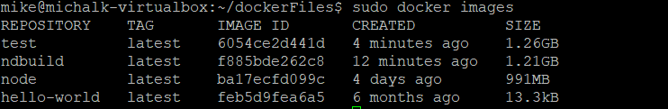

Na koniec na poparcie, że wszystko przebiegło prawdiłowo korzystam z polecenia ```sudo docker run -it --name node-red node:latest i uruchamiam kontener z utworzonego obrazu. Jak widać uruchomiona została aplikacja Node.js v.17.

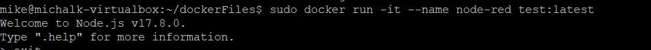


