# Michał Korzym Inżynieria Obliczeniowa nr.albumu 402568
## Sprawozdanie lab.04

1. Zachowywanie stanu.

*1.1 Przygotuj woluminy wejściowy i wyjściowy, o dowolnych nazwach, i podłącz je do kontenera bazowego, z którego rozpoczynano poprzednio pracę.*

W pierwszej kolejności zadaniem jest utworzenie woluwinów, konkretnie wejściowego (***volumein***) jak i wyjściowego (***volumeout***). Tworzenie voluminów odbywa się za pomocą komendy  ```docker volume create```. Dodatkowo użyłem przełącznika --name abym mógł swobodnie zmodyfikować nazwe.

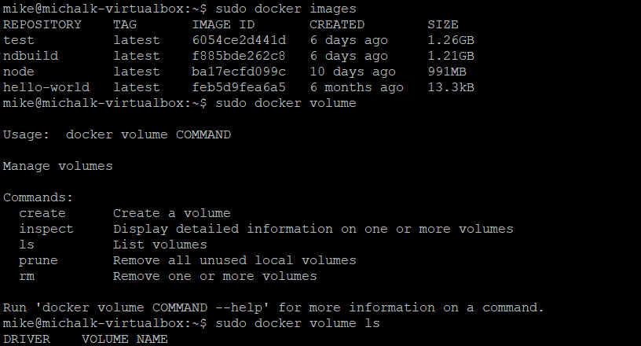

***Tworzenie woluminów***

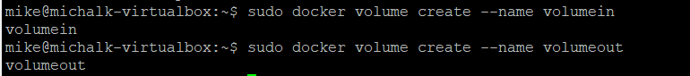

***Potwierdzenie istnienia***

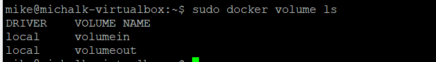

Kolejno aby wyświetlić niezbędne informacje o woliminach korzystam z polecenia ```docker volume inspect "nazwa volumina"```.

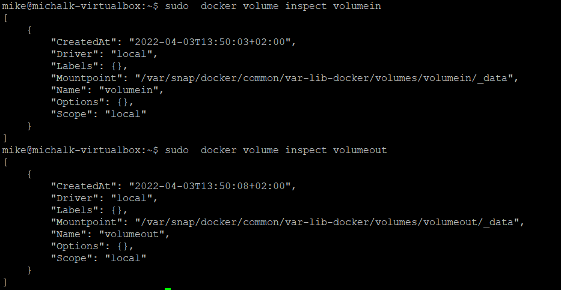

 *1.2 Uruchom kontener, zainstaluj niezbędne wymagania wstępne (jeżeli istnieją), ale bez gita.*

Użytym przeze mnie kontenerem bazowym podczas ostatnich zajęc był kontener ***node:latest***, wymaganie dotyczące braku gita wyklucza jego użycie. Tak więc postanowiłem wybrać jako kontener podstawowy ***node:slim**, który jest wersją node pozbawioną szeregu funkcji/narzędzi międzyinnymi gita.

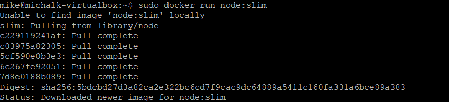


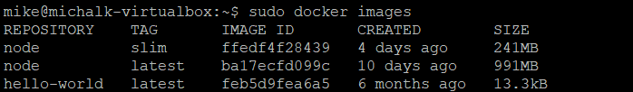

W kolejnym etapie przechodze do uruchomienia kontenera, używam w tym celu komendy ```sudo docker run```, ponadto montuje voluminy zarówno wejściowy jak i wyjściowy służy do tego przełącznik ```-v```. Analogicznie jak poprzednio używam przełącznika ```--name``` aby dostosować nazwe kontenera do własnych potrzeb. Wracając do  przełącznika ***-v*** odpowiedzialnego za montowanie woluminów wymaga on podania miejsca gdzie będą montowane voluminy w kontenerze jak i należy podać nazwe woluminów czyli cel ***"nazwa":/"miejsce":***. Na koniec warto wspomnieć o przełączniku ```-it``` odpowiadającym za uruchomienie interaktywnego terminala.

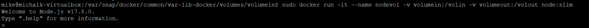

*1.3 Sklonuj repozytorium na wolumin wejściowy.*

Następnie przeszedłem do klonowania repozytorium na wolumin wejściowy, użyte repozytorium to repozytorium z poprzednich laboratoriów https://github.com/node-red/node-red.git (miało być tak w pierwotnej wersji niestety miałem bardzo duże problemy ze zbudowaniem tego repozytorium, po sklonowaniu i próbie zbudowania, proces budowy wymagał ode mnie lokalnie zainstalowanego grunta, nie byłem tego w stanie zrobić, ponieważ system domagał się istnienia git'a w kontenerze co wykluczało się z założeniem zadania. Tak więc skorzystałem z innego, podobnego repozytorium ). W pierwszej kolejności przeszedłem do odpowiedniej ścieżki zamontowanego wolumina tak aby klonowanie nastąpiło bezpośrednio, aby to zrobić przeszedłem na tryb ***root'a**, korzystając z komendy ```su root```. Poniżej screen ścieżki, a następnie użyłem komendy ```git clone "repozytorium"```. 

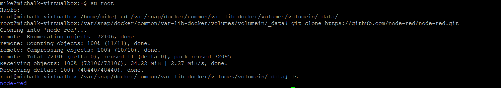

Aby potwierdzić, że wyszstkie kroki zostały zrealizowane poprawnie wyświetlam zawartość sklonowane repozytorium z poziomu kontenera.
 
 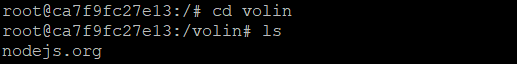

 *1.4 Uruchom build w kontenerze.*

 Następnym etapem jest uruchomienie builda w kontenerze, aby to zrobić poprawnie tj. uruchomić build bezpośednio, należy przekopiować repozytorium z wolumina wejściowego na głównym kontener, korzystam tu z komendy ```cp```.

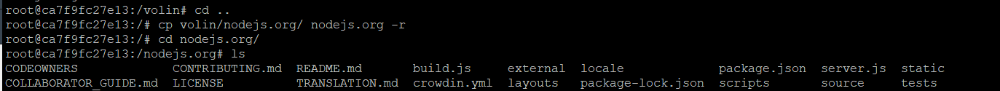

Aby build był możliwy należy zapewnić  wymagane dependecje, dlatego też wykonuje polecenie ```npm ci``` dzięki któremu instaluje najnowszą wersje npm'a.

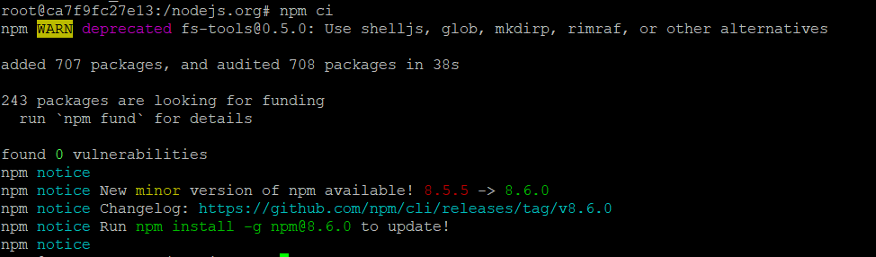

Po zainstalowaniu dependencji przeszedłem do budowania projektu za pomocą komendy ```npm run build```.

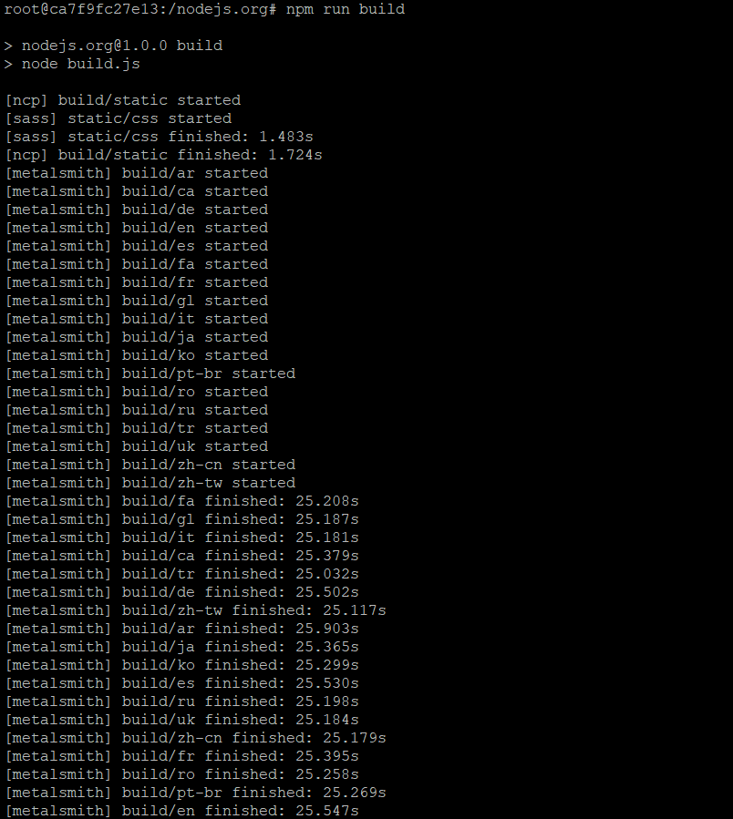

*1.5 Zapisz powstałe/zbudowane pliki  w woluminie wyjściowym.*

Dzięki poprawnemu zbudowaniu projektu uzyskany został folder build, który kopiuje z głównej sekcji do wolumina wyjściowego. Poniżej potwierdzenie poprawnego przekopiowania.

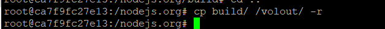

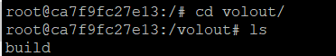

Ponadto aby dodatkowo potwierdzić poprawnie przeprowadzone operacje przeszedłem do hosta/usera i wypisałem na wyjście zawartość woluminu wyjściowego.

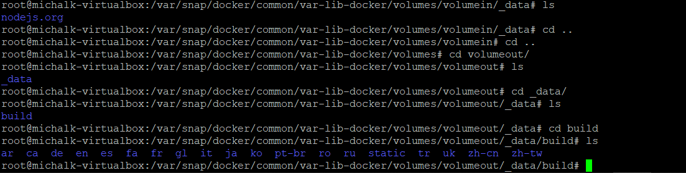

2. Eksportowanie portu.


*2.1 Uruchom wewnątrz kontenera serwer iperf (iperf).*

Aby wykonać to zadanie będe korzystał z postawionej maszyny wirtualnej z Ubuntu oraz obraz  ***clearlinux/ipref***. Początkowo musiałem pobrać obraz korzystając z komendy  ```sudo docker pull clearlinux/ipref```.

!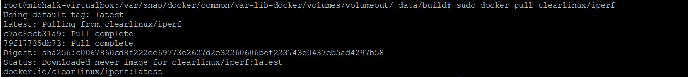

W kolejnym kroku przechodze do uruchomienia serwera, standardowo korzystam z komendy ```docker run```, dodaje przełącznik ```--name``` aby móc nadać nazwe, ```-it``` aby uruchomić terminal jak i ```-p``` co umożliwi publikacje portu. Na końcu warto wspomnieć o przełączniku ```-s``` który pozwala emitować działanie serwera. Dodatkowo aby obraz został usunięty po zamknięciu używam przełącznika ```-rm```.

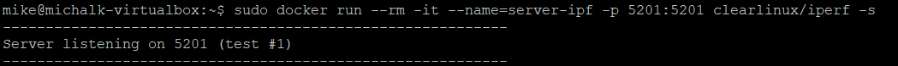

*2.2 Połącz się z nim z drugiego kontenera, zbadaj ruch.*

W pierwszej kolejności przechodze do sprawdzenia czy serwer nasłuchuje, korzystam z komendy ```sudo netstat```, ponadto filtruje poprzez ```grep``` wyświetlane porty na nasłuchujące ***LISTEN***.

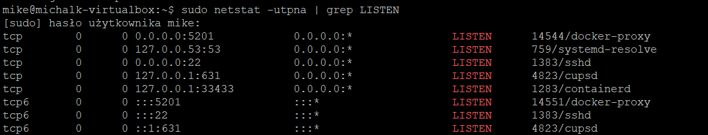

Kolejnym etapem jest połączenie się za pomocą drugiego kontenera, analogicznie jest on uruchamiany za pomocą komendy ```docker run``` pozostawiamy przełączniki do ustalania nazwy, oraz wyłączania obrazu po zamknięciu, lecz zmianie ulega przełącznik ***-s***, tym razem jest to ```-c``` ten przełącznik iperfa umożliwia działanie w roli klienta. Ponadto korzystam z przełączniak ```--time``` aby ustalić czas połączenia. Przechodze do uzyskania połączenia, którego wyniki ukazane są poniżej.

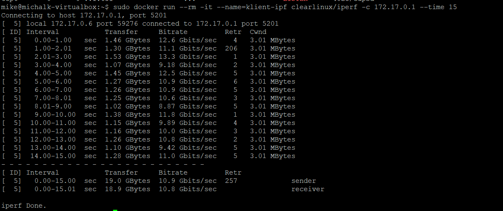

*2.3 Połączenie z poza hosta.*

Realizując kolejny etap tj. połączenia z poza kontenera rozpoczynam od łączenia się z poziomu hosta. Jest to obraz ubuntu postawiony w VBM.

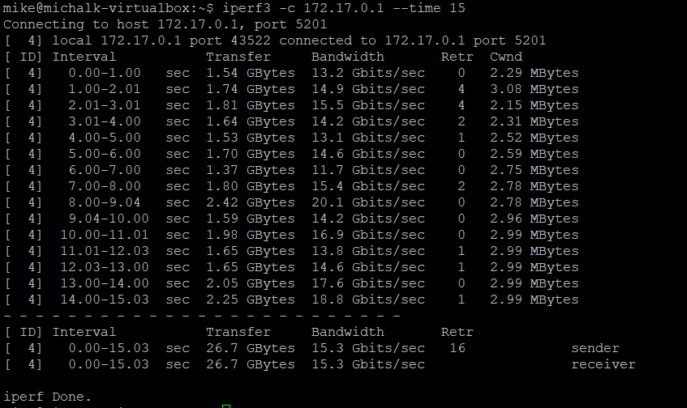


Drugą opcją łączenia się z poza hosta było połączenie się poprzez klienta z poza hosta, w tym celu skorzystałem z mojego postawionego Windowsa10, pobrałem plik ipref.exe aby trasowanie pakietów było możliwe. Przeszedłem do katalogu ze wspomnianym wcześniej plikiem i użyłem komendy ```.\ipre3.exe -c "ip --time 15```.


*2.4 Przedstaw przepustowość komunikacji lub problem z jej zmierzeniem (wyciągnij log z kontenera).*

Poniżej przedstawiam logi umożliwiające analize przepustowości transferu, pomiędzy destynacjami, skorzystałem z komendy ```sudo docker logs server-ipf```. Poniżej wszystkie testy:

***KONTENER==>KONTENER***

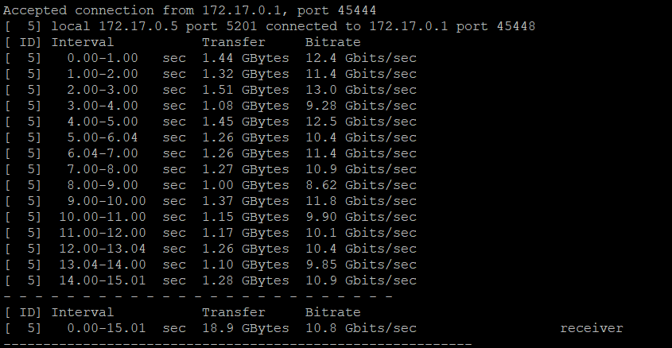

***HOST==>KONTENER***


***HOST ZEWN.==>KONTENER***


Aby przeanalizować połączenia utworzyłem wykres przedstawiający ilość danych jaka została przesłana w czasie 15s dla każdego  z przypadków.

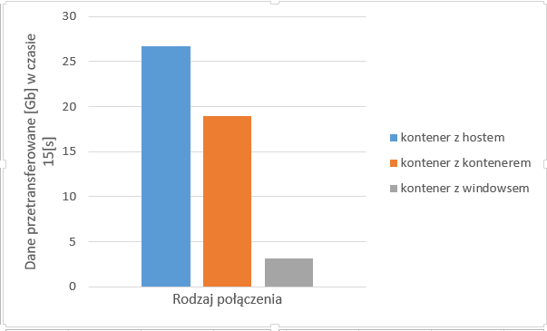

Najlepszą przepustowością wykazało się połączenie host-kontener, nieco gorszym połączeniem okazało się być, połączenie kontener-kontener. Na koniec odnosząc się do połączenia z poza kontenera z urzązenia nie będącego hostem widać, że ten przypadek znacznie odstaje od pozostałych, zarówno transfer jak i bitrate są znacznie słabsze.


3. Instalacja Jenkins

*3.1 Zapoznaj się z dokumentacją https://www.jenkins.io/doc/book/installing/docker/.*
***Zapoznane***

*3.2 Przeprowadź instalację skonteneryzowanej instancji Jenkinsa z pomocnikiem DIND.*

Instalacje sieci dockerowej rozpoczynam od wykonania polecenia ```docker network create jenkins```.

***Tworzenie***

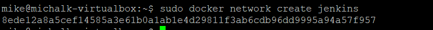

***Potwierdzenie***

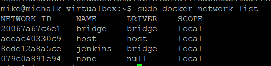


Następny krok instalacji (```docker run \```), kopiuje szereg poleceń zgodnie z instrukcją.

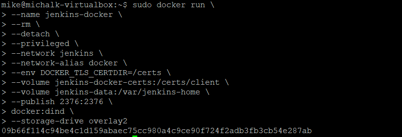

Po zrealizowaniu poprzednich kroków przechodze do zbudowania nowego obrazu dockera korzystając z utworzonego przeze mnie pliku dockerfile, content, który został umieszczony w środku przekopiowałem z instrukcji instalacji. Do zbudowania obrazu użyłem komendy ```sudo docker build -t "nazwa obrazu" -f "nazwa pliku .dockerfile" .```

***Zawartość pliku dockerfile***

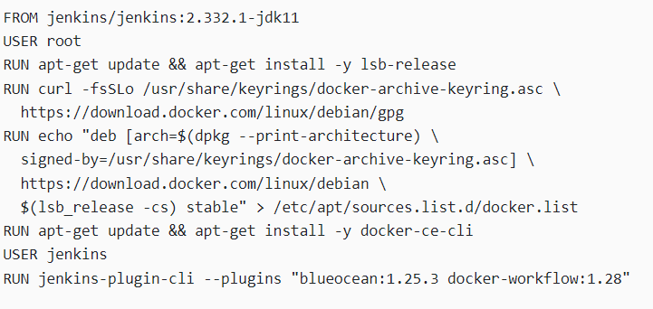


***Początek***

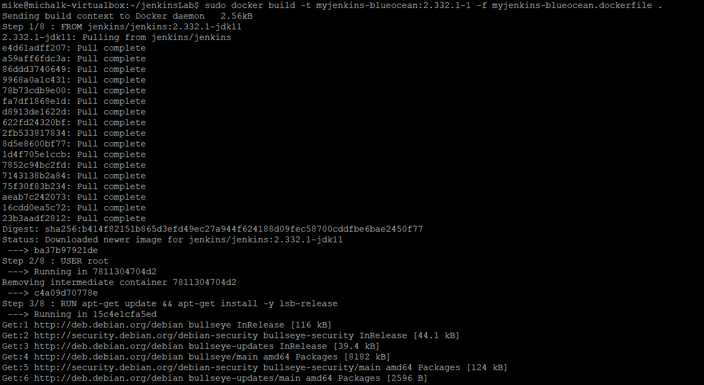

***Koniec***

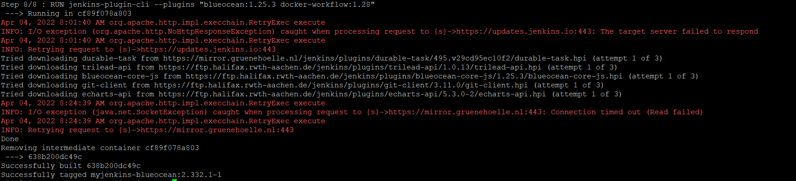

Gdy obraz został już poprawnie zbudowany można uruchomić obraz który powstał, ponownie kopiuje polecenia wskazane w instrukcji.

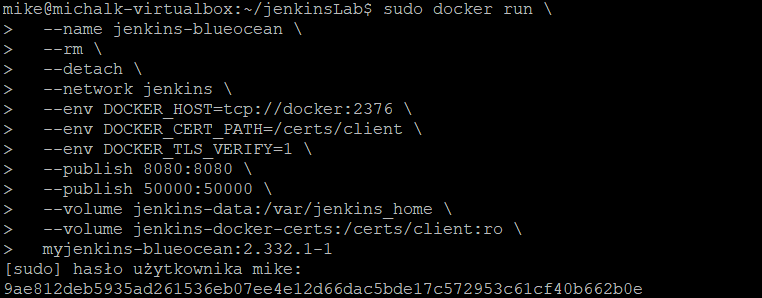


*3.3 Zainicjalizuj instację, wykaż działające kontenery, pokaż ekran logowania.*

Odnosząc się po części do poprzedniego punktu potwierdzam,  ze kontenery zostały utworzone poprawnie.

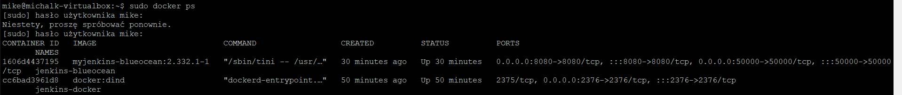

Prace z Jenkinsem rozpoczynam od praktycznego ukazania, że jego instancja została uruchomiona. Poprzez zalogowanie się na ***localhost:8080*** przechodze do ekranu głównego/powitalnego Jenkinsa.

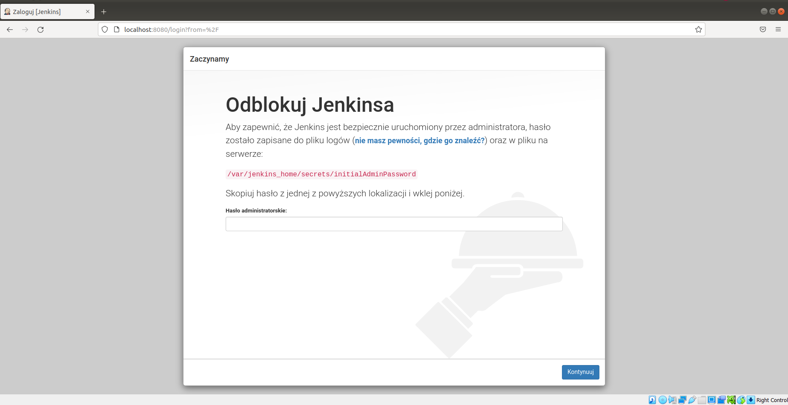

Następnie aby uzyskać hasło uruchamiam kontener w terminalu bashowym za pomocą polecenia ```sudo docker exec -it "id_kontenera" /bin/bash```. Kolejno wyświetlam za pomocą polecenia ***cat** zawartość pliku w podanej ścieżce, który to przechowuje hasło.

***Pozyskanie hasła***
 
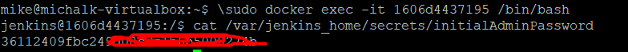

***Po logowaniu***

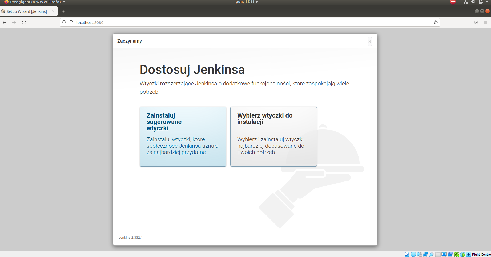

Instaluje domyślne wtyczki, po tej operacji otrzymuje okno utworzenia pierwszego użytkownika.

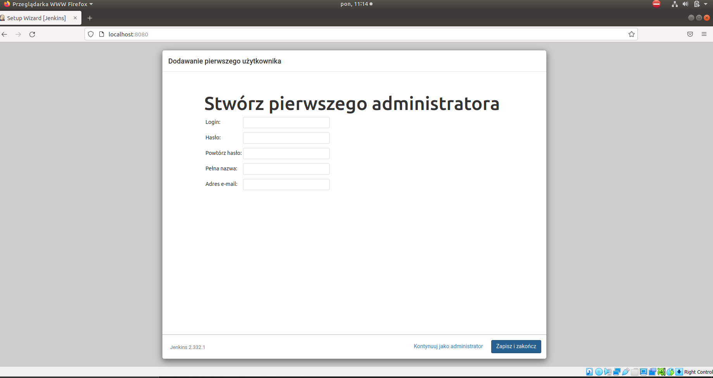

Na sam koniec wyświetlam okno logowania.
 
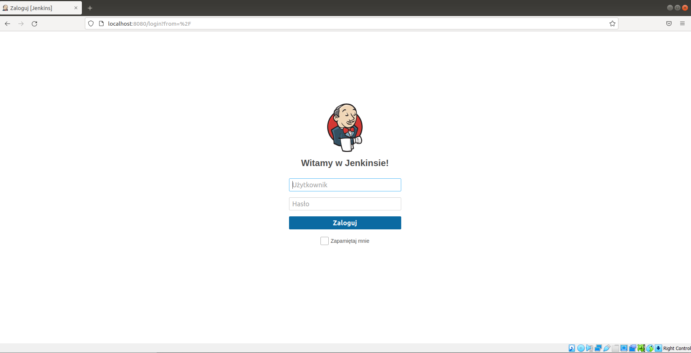


