# Michal Korzym nr.albumu 402568

## Sprawozdanie Pipeline!


1. Przygotowanie środowiska do realizacji zadania.

Zadanie zostaje przeprowadzone na VM utworzonej dzięki skorzystaniu z oprogramowania Oracle Virtual Box, konkretnie jest to obraz Ubuntu wersja 20. Ponadto część z operacji takich jak kopiowanie tworzenie plików wykonywałem na stacji roboczej z systemem Win.10. Na poczet projektu utworzyłem nową maszyne, ponieważ stara nie wyrabiała jeśli chodzi o pamięć. Tak więc przed przystąpieniem do realizacji zadania należy sobie zapewnić (o ile korzysta się z VM) conajmniej 20gb wolnego miejsca, ponieważ tworzone kontenery bardzo szybko pochłaniają miejsce.

2. Podstawa do realizacji pipeline, czyli Kontener Jenkins oraz DIND.

Podczas labolatoriów nr.4 należało utworzyć kontener ```Jenkins``` oraz ```DIND``` będący jego "pomocnikiem". Ich konfiguracja jest zdefiniowana przez zalecenia dostawcy oprogramowania.
*Jenkins* - kontener jenkinsa jest naszym kontenerem bazowym, zapewnia nam on środowisko wdrożeniowe Jenkinsa na którym możliwa jest automatyzacja przeprowadzanych operacji na naszym oprogramowaniu.
*DIND* - (Docker in docker) kontener uruchamiający w sobie kolejny kontener. Możemy dzięki niemu budować/uruchamiać wewnątrz kontenera kolejne kontenery przy pomocy instancji Dockera. 

Dla przypomnienia, na tym etapie należy:
- Utworzyć sieć dockerową (jenkins)
- Utworzyć plik dockerfile pozwalający na budowe obrazu ```myjenkins-blueocean:2.332.1-1``` posiadający WebUI, a następnie uruchomić build w folderze z dockerfilem.
- Uruchomienie kontenera DIND
- Uruchomienie kontenera Jenkins

Uruchomienie kontenerów DIND oraz Jenkins domyślnie będzie konieczne przy każdej nowej sesji, tak więc należy o tym pamiętać! Dodatkowo uruchamianie musi przebiegać z uprawnieniami administratora.

Kontener DIND uruchamiamy jako demona, dajemy mu wszystkie uprawnienia, przypisujemy mu sieć (w naszym przypadku Jenkins). Ponadto podajemy alias sieci używany w kontenerach, czy zmiennne środowiskowe za pomocą flagi ```env```. 

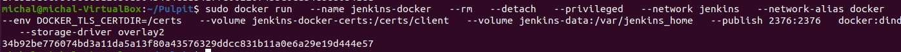

Kontener Jenkins, zbudowany ówcześnie obraz uruchamiamiy z publikacją na port 8080. Dzięki czemu po wyszykaniu adresu ```localhost:8080```w naszej przeglądarce naszym oczom powinien ukazać się interfejs Jenkinsa.

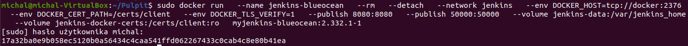

Potwierdzenie utworzenia obu kontenerów umożliwi nam polecenie ```docker ps```. Poniżej umieszczam screen wyników wywołania tej komendy, podkreśliłem ID kontenera Jenkinsa, które to jest istotne w kontekście możliwości uruchomienia w aktywnym kontenerze np.bashowego terminalu.

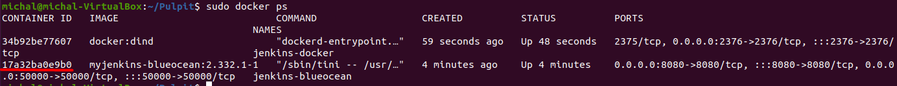

Jeśli chcemy uzyskać domyślne hasło do świeżo utworzonej instancji Jenkinsa w pierwszej kolejności za pomocą komendy ```docker exec -it < ID kontenera > /bin/bash``` a kolejno odczytujemy plik zawierający hasło ```cat /var/jenkins_home/secrets/initialAdminPassword```.

3. Przygotowanie Pipelin'u.

# Definiowanie pipelina.

W pierwszej kolejności należy dokonać forka repozytorium na którym pracujemy, w moim przypadku kontynuuje prace z *nodejs.org*. Fork pozwala nam na utworzenie kopi repozytorium i eksperymentowania na nim nie wpływając na oryginalny projekt. Oczywiście to czy fork będzie możliwy zależne jest od dostawcy oprogramowania.

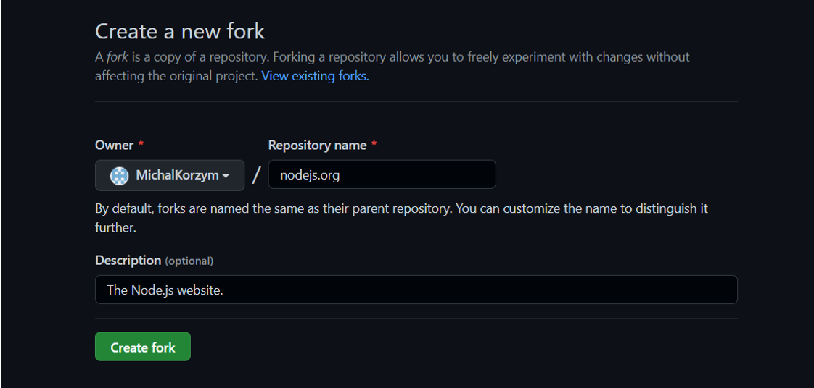

Zforkowane repo klonuje na stacje roboczą aby móc dodawać na nie pliki, konkretnie jenkinsfile'a i dockerfile'e automatyzujące i obsługujące przebieg Pipelina. 

# Opis pliku jenkinsfile

Plik jenkinsfile umieściłem w folderze jenkinsDir w katalogu głównym sklonowanego repozytorium. Jego zawartość prezentuje się następująco:

- Parametres, w sekcji tej umieściłem dwa parametry: programName oraz version. Są one podawane na wejściu, mają w dalszym kroku służyć do nazwania pliku artefaktu .tar. Ponadto wypisuje je w stage'u publisha. Aby potwierdzić poprawność ich zdefiniowania.

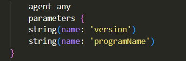

- Build, krok ten to nic innego jak utworzenie aplikacji w kontenerze. Konkretnie kontener *builder* który tworzymy posiada dependencje, w przypadku mojego  repozytorium jest to *npm* będący managerem pakietów dla środowiska Node.js. Tak więc wybór ten wydaje się być oczywistym. Odnosząc się do samego kodu za pomocą ```echo``` komunikuje na wyjściu rozpoczęcie tego etapu a następnie korzystam z pliku dockerfileBuild o którym wspomne później aby zbudować kontener.

- Test, w tym kroku dokonujemy testów, które są obecne w repozytorium. Tak więc tworzymy obraz testujący, u mnie *tester*. Korzystamy z utworzonego wcześniej obrazu buildera! Tak więc, ponownie korzystamy z dockerfila, którego strukture opisze poniżej. A następnie uruchamiamy obraz tester.  

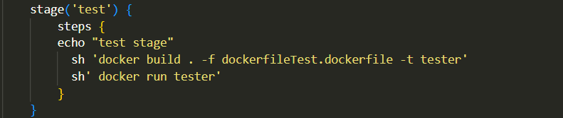

- Deploy, tutaj pojawił się problem z voluminami konkretnie z osiągnięciem destynacji buildera na voluminie wyjściowym. Ciągły błąd ``` no such file in  directory``` sprawił, że odwiesiłem peleryne i zrezygnowałem z voluminów w przypadku deploya. Największym kłopotem było wycofanie się do ścieżki podrzędnej. Tak więc odwołałem się do obrazu buildera, tworzymy więc obraz *deploy* hostujący nasze pliki. Wybór serwera WWW hostującego padł na ```nginx'a```. Łatwa konfiguracja nie powinna sprawić nikomu problemu, jej rozwinięcie podczas opisu pliku dockerfileDeploy. Uruchomienie kontenera standardowo korzystamy z dyrektywy run, jednak następuje tutaj przekierowanie na port 3000 (domyślnie 80). Umożliwi to podgląd hostowanej strony. Na samym końcu wyłączamy kontener, gdyż w przeciwnym wypadku mogło by to doprowadzić do nieskończonego oczekiwania na jego zakończenie.

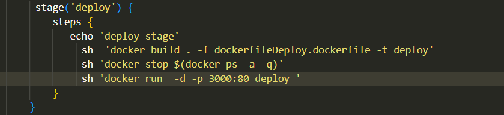

- Publish, po poprawnie przeprowadzonych procesach: build, test oraaz deploy przeszedłem do etapu publish. Tak więc zakładamy, że nasz build powinien zostać jako nowe wydanie programu. Budujemy więc artefakt, w moim przypadku jest to plik *TAR.XZ*. Kolejny raz korzystam z pliku dockerfile, następnie utworzony artefakt "wypycham" do voluminu. Na końcu korzystam z podanych na wejściu parametrów informując o nazwie programu oraz wersji. 

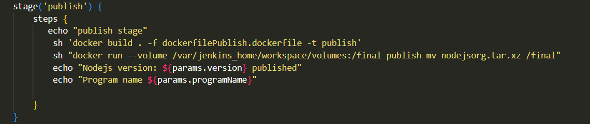

- Sekcja post, ma ona na celu powiadomiść użytkownika o powodzeniu lub niepowodzeniu przebiegu pipelin'a.

# Pliki dockerfile

W katalogu głównym repozytorium umieszczone został 4 dockerfil'e. Kolejno dockerfileBuild, dockerfileTest, dockerfileDeploy oraz dockerfilePublish. Pliki dodatkowo umieszczone zostały na repozytorium przedmiotowym. 

- dockerfileBuild

Kolejno korzystamy z obrazu bazowego *node:last*, następnie klonuje zforkowane repozytorium, poprzez komende ```git clone``` < ścieżka do mojego githuba z repo >. Przechodzimy do folderu roboczego, następnie instalujemy wymagane dependecje co jest bardzo ważne w kontekście poprawnego zbudowania programu. W moim przypadku ogranicza się to npm'a, także nie jest to problematyczne. W ostatnim etapie uruchamiamy builda.

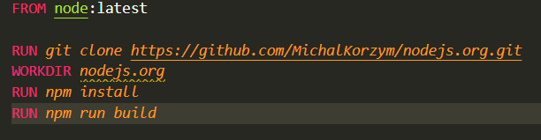

-dockerfileTest

Dockerfile ten bazuje na zbudowanym uprzednio kontenerze *builder*,  następnie ustalamy katalog roboczy, za pomocą polecenia ls printuje zawartość katalogu repozytorium, a na samym końcu uruchamiam załączone testy. 

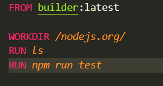

-dockerfileDeploy

Tak jak zostało to wspomniane powyżej praca z voluminami nie należała do najprostszych, tak więc postanowiłem bazować na obrazie builder'a, kopiuje z folderu build odpowiednie pliki do hostującego serwera WWW. Tak więc wyciągam z buildera co warto tutaj zaznaczyć wyłącznie pliki z folderu *en*, gdyż hostowanie reszty uważam za zbędne. Ponadto kopiuje pliki odpowiadające za obsługe frontu html/css.

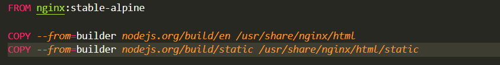

-dockerfilePublish

W ostatnim etapie odwołuje się do kontenera builder, a następnie tworzen paczke tar będącą artefaktem. 

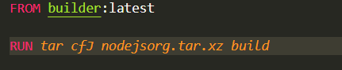

# Konfiguracja JenkinsBlueocean

Przehcodzimy do UI Jenkinsa, w pierwszej kolejności tworzymy nowy projekt.

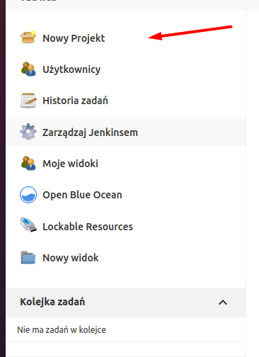

Wybieramy pipeline oraz podajemy nazwe swojego projektu, w moim przypadku nazwałem go najzwyczajniej na świecie ```Test```.

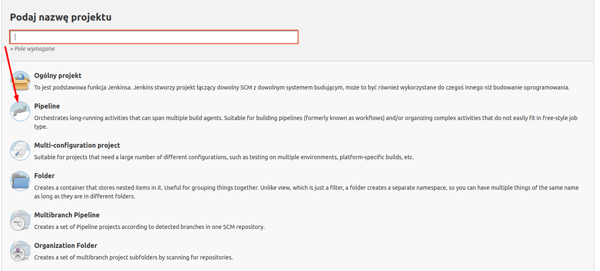

Ustawiamy definicje pipeline'u na ```Pipeline script from SCM``` oraz wybieram źródłówy system kontroli plików w tym przypadku jest to *Git*, na którym przechowuje repozytorium z jenkinsfilem.

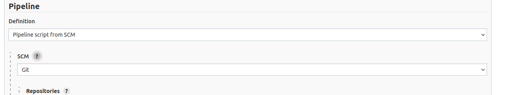

Kolejno ustawiamy źródło URL (tutaj adres repozytorium na moim koncie GitHub) i ustawiamy brancha, tutaj main.

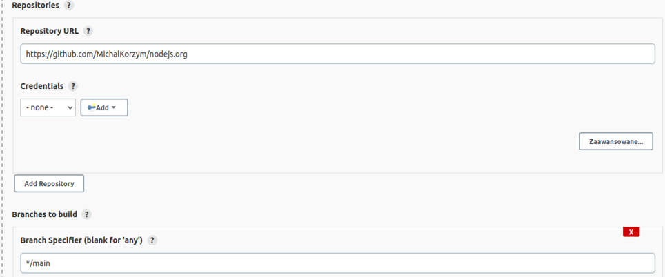

Na sam koniec ustalamy ścieżke do pliku jenkinsFile. W moim przypadku jest to ścieżka do folderu, znajdującego się w katalogu głównym. Na koniec wszystko zapisujemy.

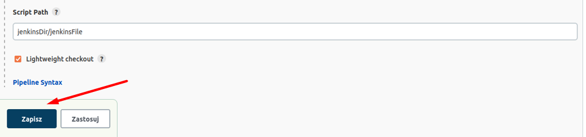

# Rezultat "końcowy", logi uruchomionego Pipelina

Uruchomienie Pipelinu, podajemy początkowe parametry.

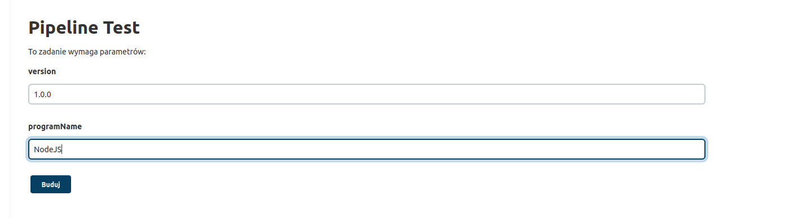


-------------SCM JENKINSFIle------------------

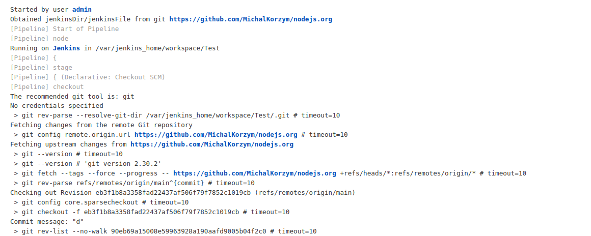

------------BUILD-----------------------------

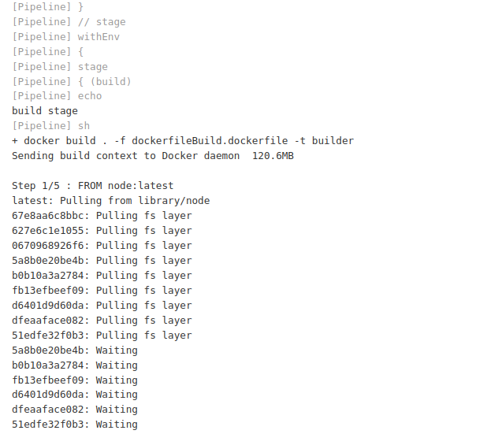

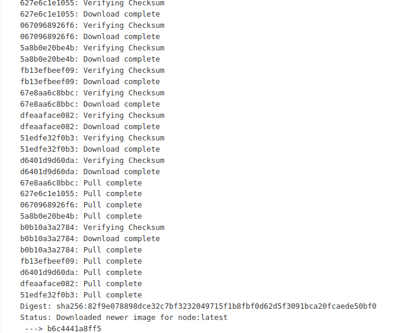

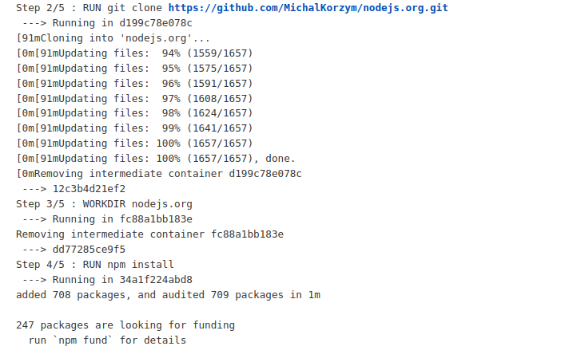

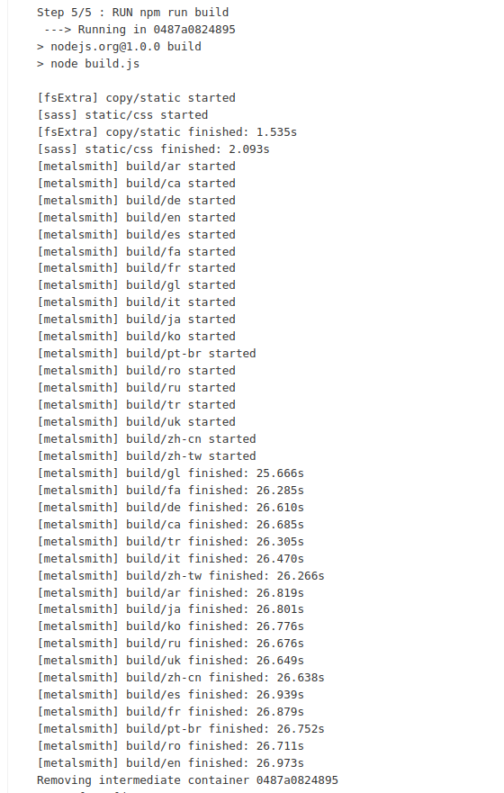


------------TEST---------------------

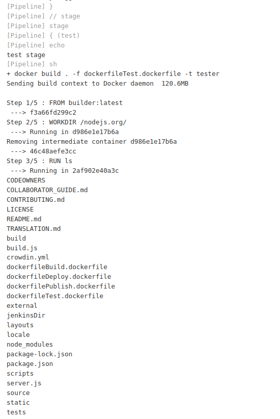

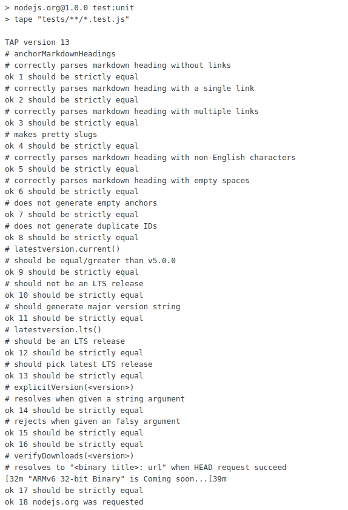

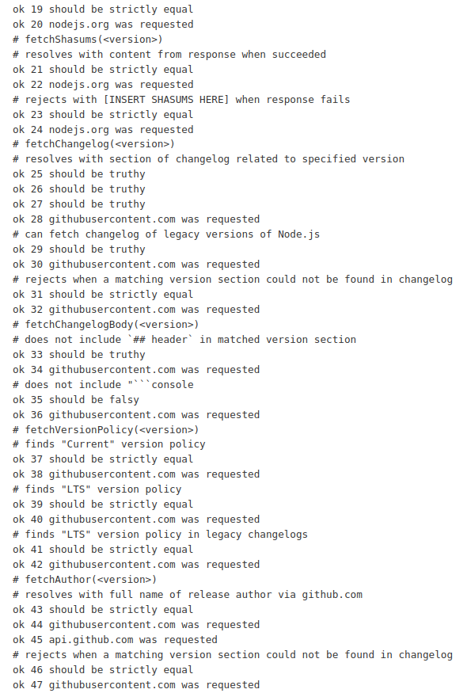

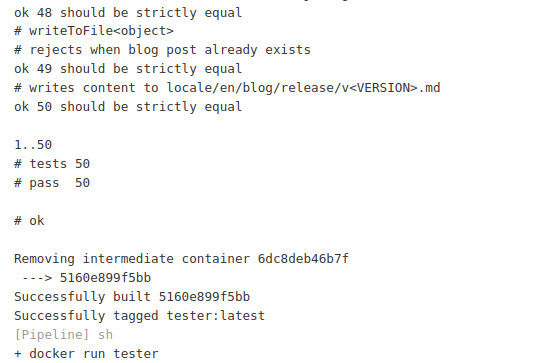

-----------DEPLOY-------------------


----------PUBLISH--------------------

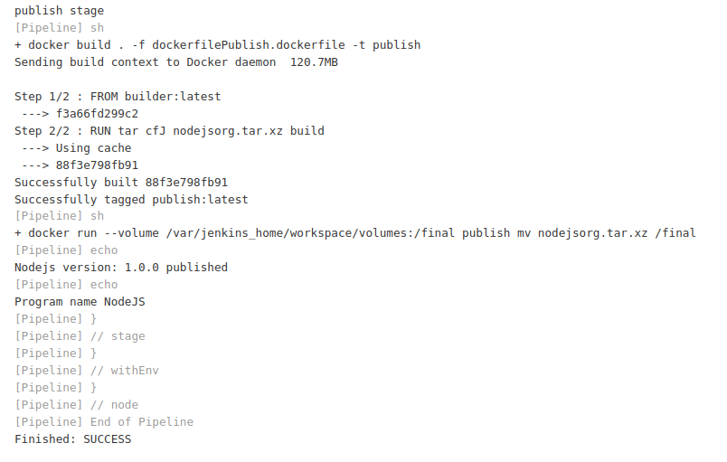


---------LOG CONFIRM------------------

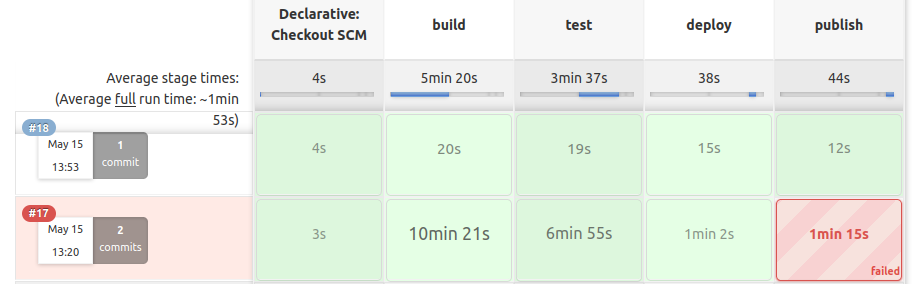

Krótkie wnioski do powyższych wyników, 17 test nie powiódł się gdyż nie zgadzała się nazwa artefaktu, jednak poprzednie stage'e się powiodły jak widać trwały zauważalny czas, szczególnie budowanie i testowanie. Widzimy jednak, że uruchomienie pipelinu po raz kolejny na tej samej sesji znacznie skraca swój czas, część plików zapisuje się w pamięci cache co znacząco skraca proces.

# Wnioski 

Tworzenie pipelinu dla osoby będącej w temacie jedynie powierzchownie jest dość trudne, nie umniejsza jednak to w żaden sposób korzyścią jakie niesie ze sobą pipeline. Automatyzacja, uprządkowanie czy uniwersalność wykonywanych akcji prowadzi do tak powrzechnego zastosowania tego rozwiązania. W projekcie nie udało się skorzystać z voluminów za wyjątkiem publikacji artefaktu. 


