# Sprawozdanie laboratorium nr.9
## MichaL Korzym Inżynieria Obliczeniowa nr.indeksu: 402568 

### Wykonane kroki!

1. Przeprowadź instalację systemu Fedora w VM, skonfiguruj użytkowników (użyj haseł, które można bezkarnie umieścić na GitHubie!), sieć, wybierz podstawowy zbiór oprogramowania, optymalnie bez GUI.

Tak jak zostało to zalecone w poleceniu przeprowadziłem instalacje systemu Fedora w VM, środowiskiem na którym "postawiłem" obraz jest ***Virtual Box***. Instalacje systemu  rozpocząłem od utworzenia nowej maszyny wirtualnej, przydzieliłem jej 30Gb (wedle zaleceń), dynamicznie przydzielana pamięć. Obraz startuje z pliku ```.iso``` co konfiguruje w ustawieniach VM.

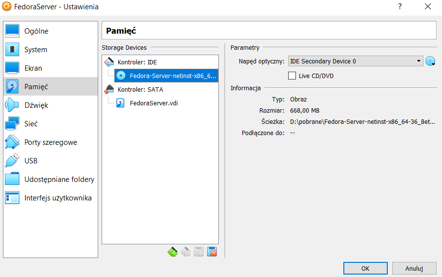

Po odpaleniu maszyny naszym oczom ukazuje się startowy ekran wyboru, wybieramy install Fedora 36. Następnie otrzymujemy interfejs graficzny instalatora Fedory.
W pierwszej kolejności otrzymujemy możliwość wyboru języka, wybrałem język angielski.

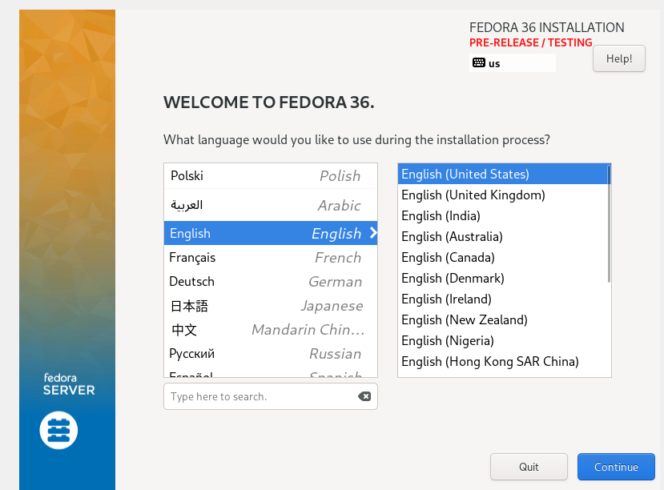

Kolejno potwierdziłem wybór dysku wirtualnego na którym zostanie zainstalowany system Fedora (screen pomijam). 
Tworze użytkownika z dowolną nazwą, prostym hasłem i odznaczam przywileje administracyjne.

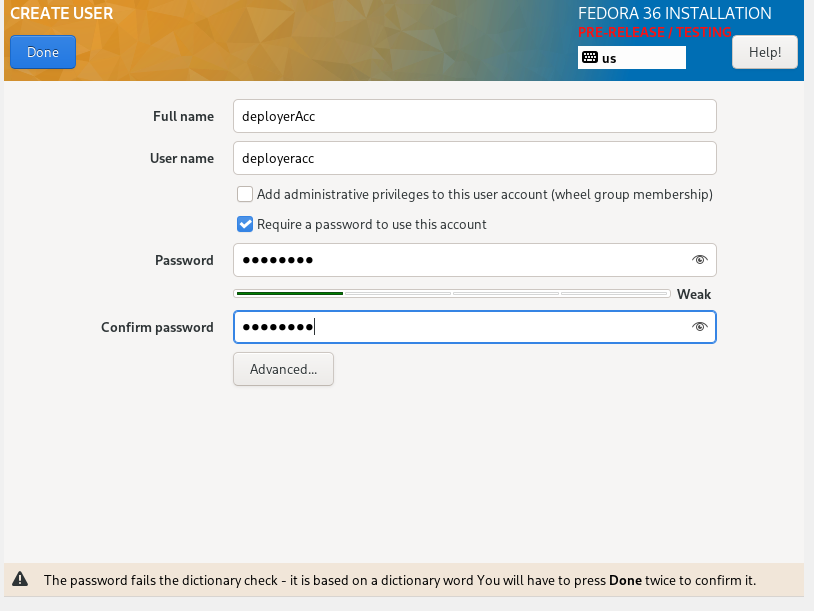

Następnie tworze konto roota, znów z prostym hasłem. Bardzo ważnym jest zatwierdzenie logowania poprzez SSH!.

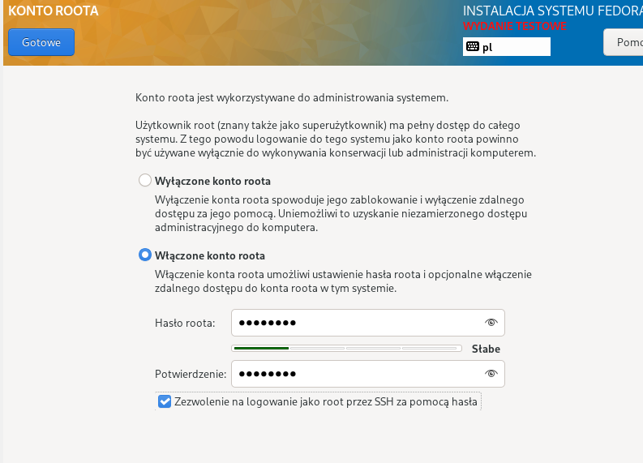

Konfiguruje ustawienia sieci, ustawiając własną nazwe hosta (użyłem nazwy z ćwiczeń).

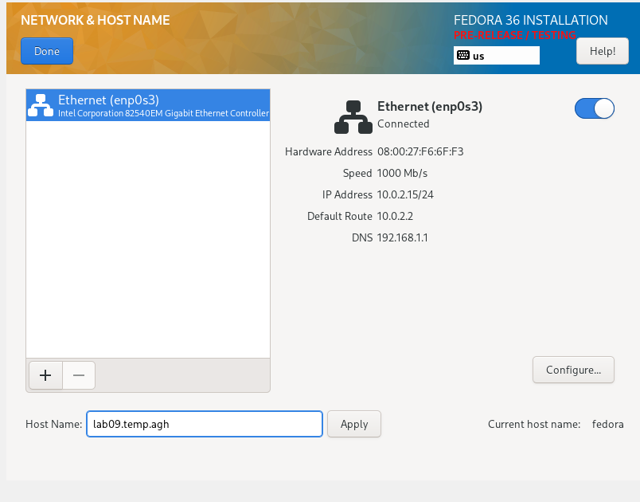

I finalnie wybieram typ instalowanego środowiska, w tym przypadku instalujemy minimalne środowisko wykonawcze, posiadające i mogące obsłużyć podstawowe funkcjonalności.

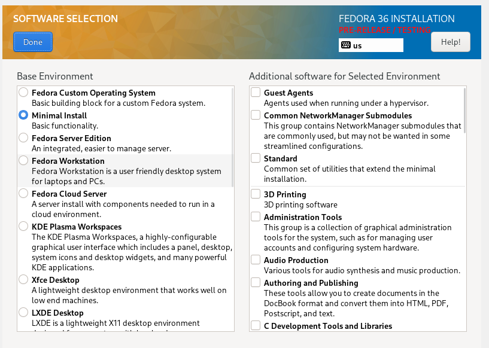

Ostatecznie potwierdzam poprawną instalacje.


2. Przeprowadź drugą instalację systemu Fedora w VM - celem drugiego systemu będzie wyłącznie serwowanie repozytorium przez HTTP.

Jako iż moim artefaktem jest plik tar, potrzebuje drugiej maszyny z systemem Fedora, będzie ona pełniła role serwera. Tak więc ponownie dokonuje instalacji, jednak nie dokumentuje tego screenshotami, ponieważ jest to zbędne. Wszystko przebieg analogicznie.

3. Umieść artefakty z projektu na serwerze HTTP.

W tym kroku prace rozpocząłem od zlokalizowania mojego artefaktu na voluminie w kontenerze Jenkinsowym, który to utworzyłem podczas tworzenia pipelina. Wydobycie go nie było aż tak proste jak mogłoby się wydawać, ponieważ dostęp do niego, jako iż jest opleciony hermetycznym środowiskiem jest ogarniczony. Sprawdzając początkowo jego ścieżke/lokalizacje w kontenerze byłem w stanie za pomocą komendy ```sudo docker cp "nazwa-kontenera":"ścieżka-do-pliku" "ścieżka-miejsca-do-którego-kopiujemy"```skopiować artefakt poza kontener a następnie za pomocą filezilli "wyciągnąć" go z systemu Ubuntu.

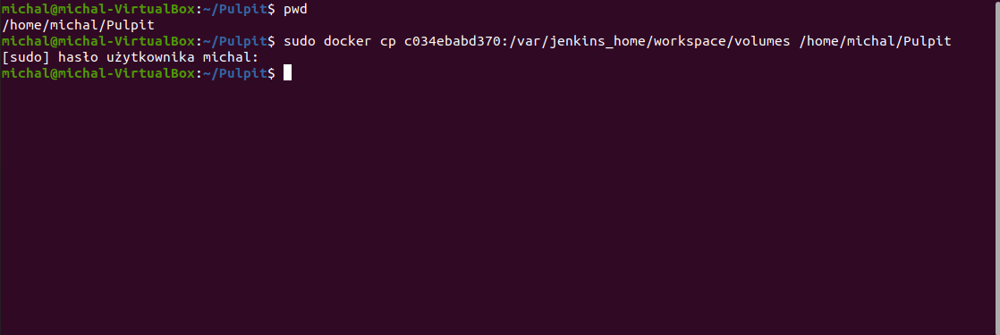

Wyciągnięty uprzednio artefakt umieszczam na serwerze HTTP pod ścieżką ***var/www/html/artefaktLab09***, gdzie artefaktLab09 jest utworzonym przeze mnie folderem. Artefakt umieściłem na serwerze za pomocą Filezilli.

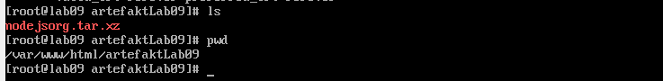

4. Na zainstalowanym systemie wykonaj zbiór poleceń umożliwiających pobranie artefaktu, zapisz polecenia

Aby stworzona uwcześnie instancja Fedory stała się serwerem HTTP, należy wywołać szereg metod, instalujących wymagane pakiety czy konfigurujące fiewall'a. Kolejno:

- Instalujemy pakiety Web Serwera za pomocą komendy ```sudo dnf install httpd```.

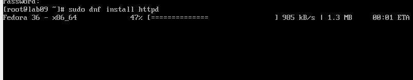

końcowy rezultat:

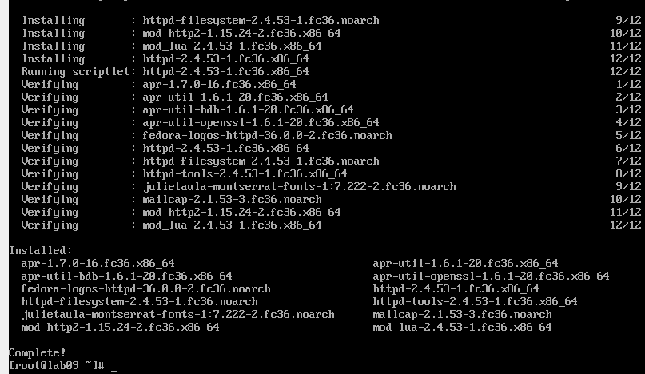

- Instalujemy dodatkowe pakiet "serwer group" za pomocą komendy ```sudo dnf group install "Web Server"

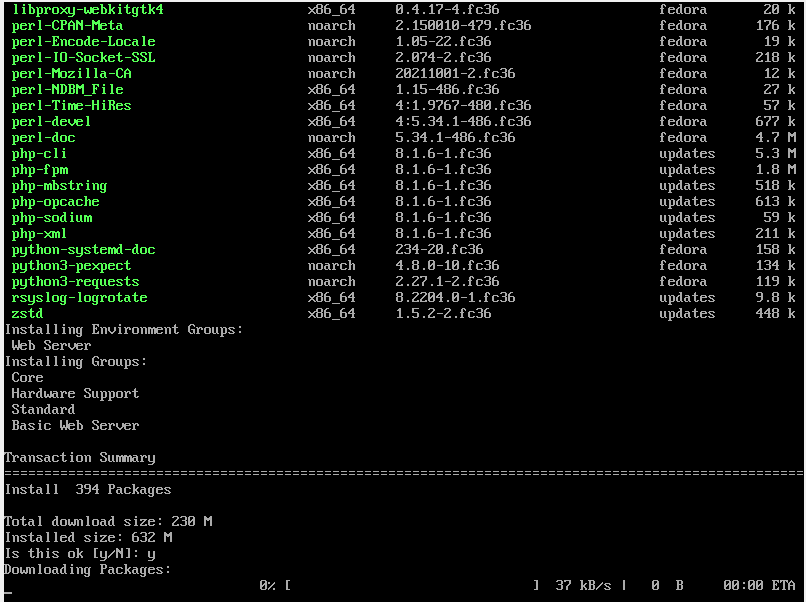

- Startujemy serwer za pomocą komendy ```sudo systemctl start httpd```

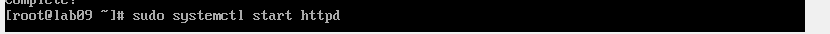

Włączamy serwer za pomocą komendy ```sudo systemcl enable httpd```

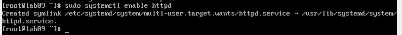

- Następnie, ponieważ Firewall blokuje przychodzące requesty musimy odblokować porty (zarówno dla http jak i szyfrowanego https), dzięki komendzie ```sudo firewall-cmd --add-service=http --add-service=https --permament```

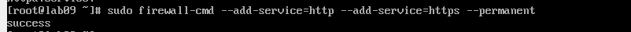

-Przeładowujemy firewalla ```sudo firewall-cmd --reload```

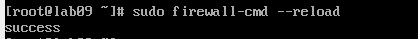


Tak skonfigurowany serwer, powinien działać poprawnie. Wykazuje to odpytując adres ***http://192.168.1.70/artefaktLab09*** pod tym adresem znajdziemy nasz wrzucony na serwer artefakt. Rezultat poniżej. Adres ip serwera otrzymuje wywołując komende ```ip address```, ponadto warto dodać, że w przypadku VirtualBox'a w ustawieniach maszyny należy skonfigurować ustawienia sieciowe na **bridge**.

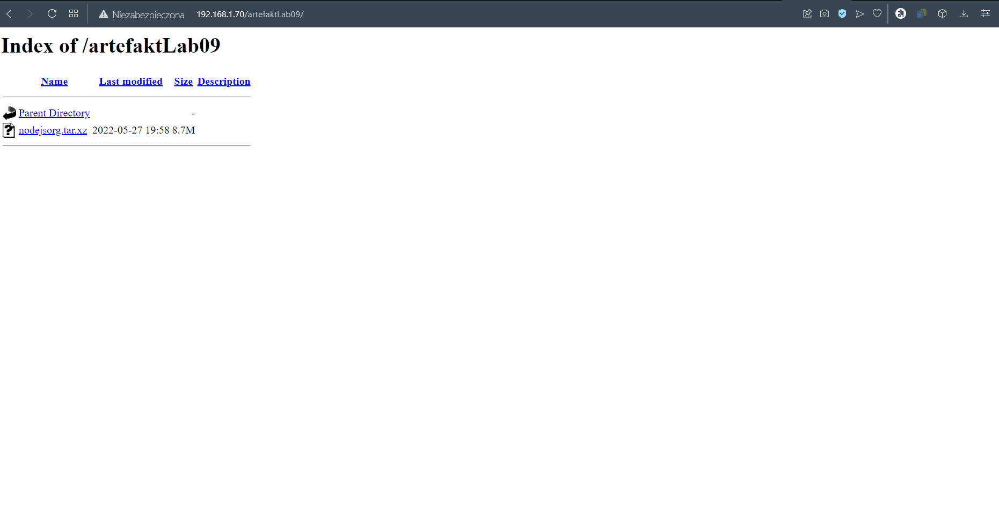


Utworzony początkowo obraz Fedory (deployer) posiada defaultowo plik odpowiedzi ***anaconda-ks.cfg*** jest to służący do konfiguracji instalacji plik, który chcemy zmodyfikować aby pobrać nasz artefakt. 

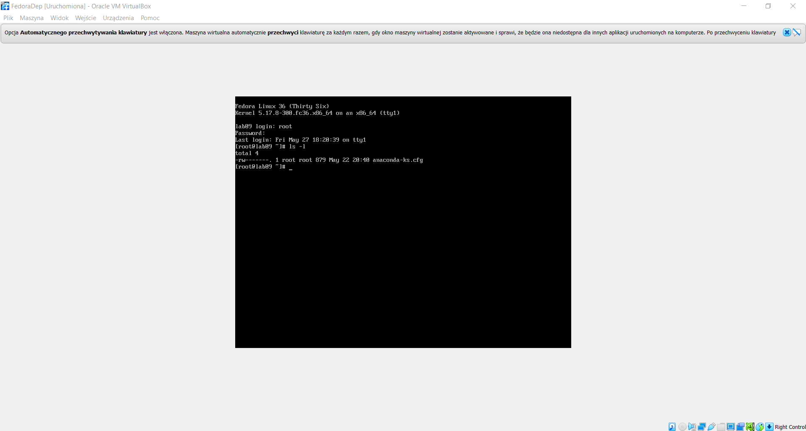

Poniżej wydruk jego zawartości, dla stworzonego przeze mnie obrazu dla deployera.

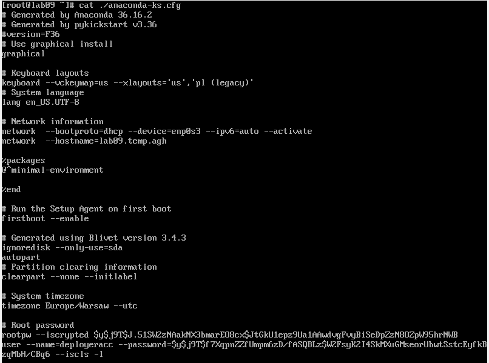


# Infrastructure as a code

 - Plik odpowiedzi kopiuje na stacje roboczą Filezilla, a następnie umieszczam na githubie. 

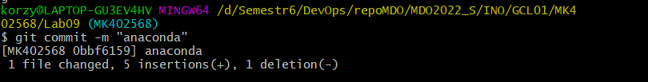

Zawartość pliku anaconda-ks.cfg

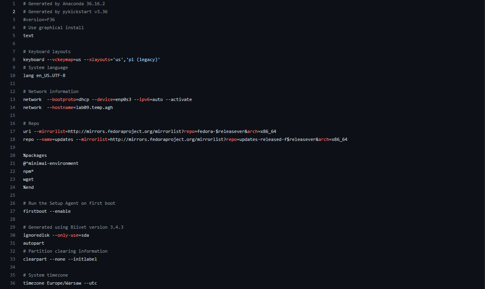

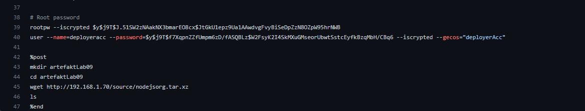

Kolejno wybór języka oraz klawiatury, ustawienia sieci, definiowanie repozytoriów, paczki wymaganych dependencji, bootowanie, przydzielanie pamięci, ustalanie strefy czasowej, konfiguracja konta roota i usera. 

Na końcu definiuje sekcje *post*, w której to pobieramy z serwera HTTP artefakt. Jest to możliwe dzięki wspomnianemu wczęśniej wgetowi, którego instalujemy. Tworzymy ponadto folder w którym będzie się on znajdował.

- Połącz plik odpowiedzi z ISO instalacyjnym

Mamy już wszystko aby połączyć plik odpowiedzi z ISO instalacyjnym, tak więc podczas uruchamiania obrazu Fedoru, gdy pojawia się okno z napisem install Fedora, klikamy tab. Następnie modyfikujemy i uzupełniamy ściężke o link do naszego repozytorium z plikiem anaconda. Uwaga! Ważne aby plik prowadził do formatu RAW w innym wypadku odwołamy się do html'a!!.

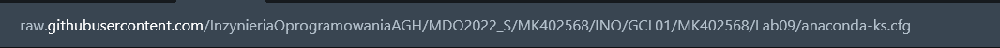

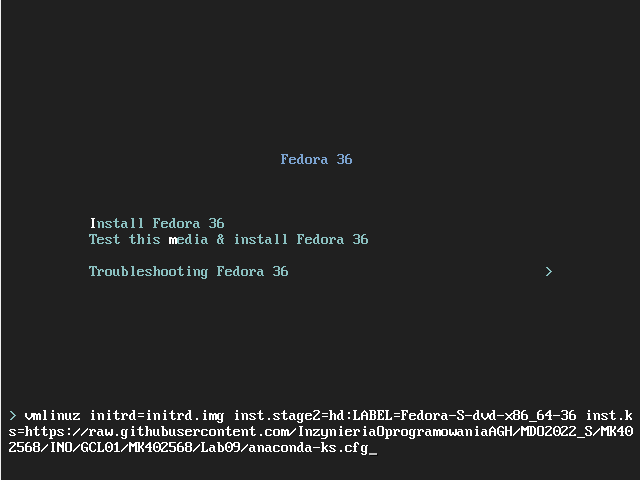

Po poprawnym zdefiniowaniu ścieżki rozpoczyna się proces instalacji, którego część kolejnych etapów udokumentowałem. 

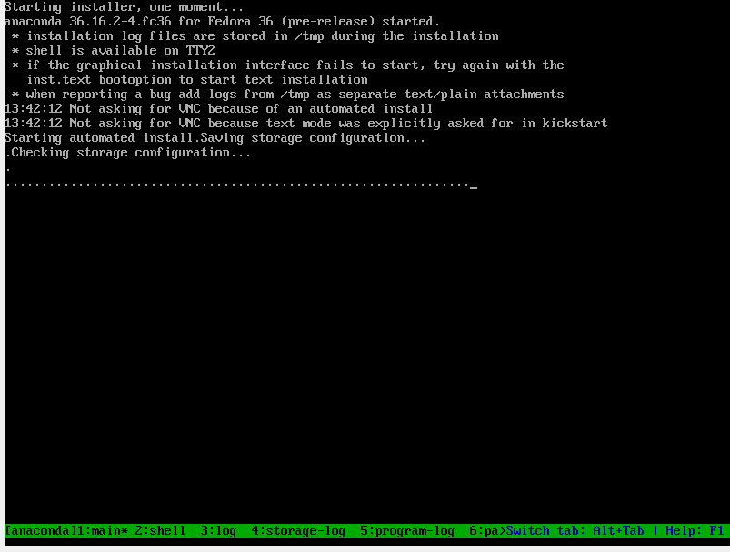

Potwierdzenie zdefiniowania wszystkich kroków w pliku odpowiedzi.

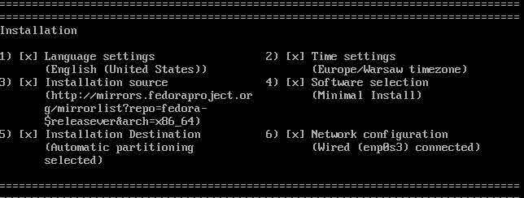

Podbieranie pakietów i ich instalacja

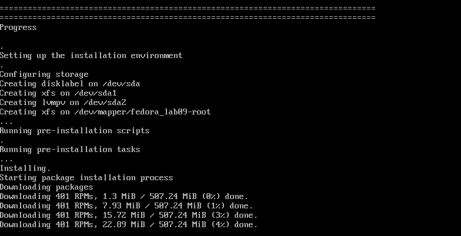

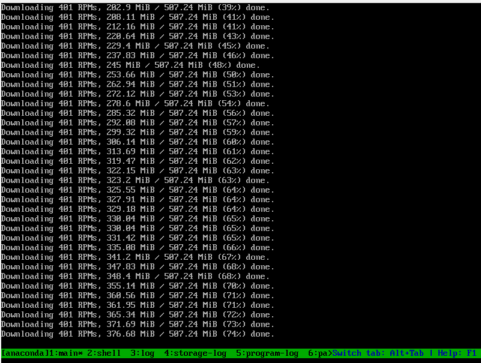

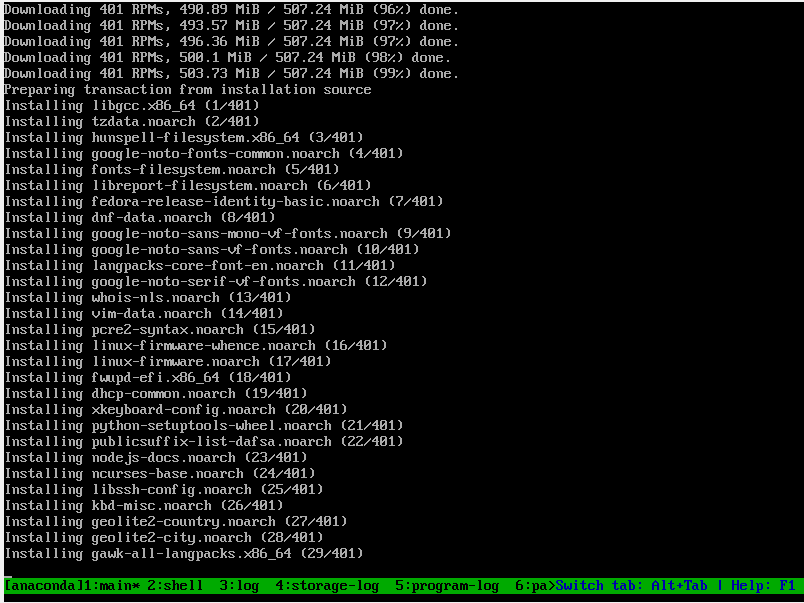

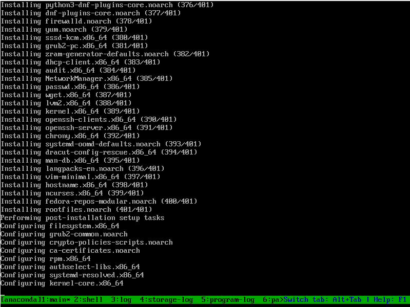

I poprawne zakończenie instalacji

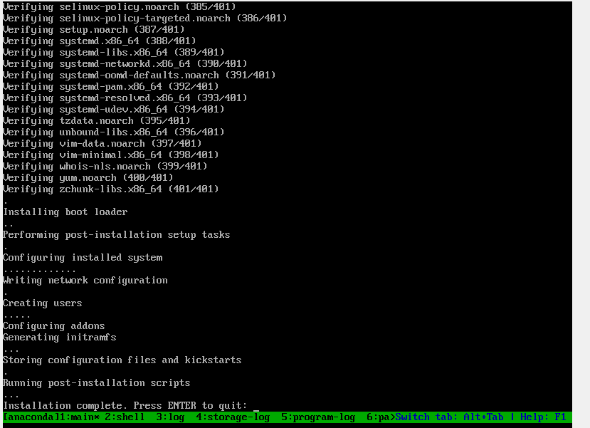

Po ponownym uruchomieniu naszej maszyny i wylistowaniu ujżymy nasz artefakt po wyprintowaniu w folderze artefaktLab09

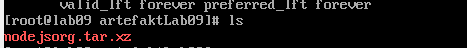


