### Sprawozdanie Lab.11 (Wdrażanie na zarządzalne kontenery: Kubernetes (1))
## Michał Korzym Inżynieria Obliczeniowa

# Instalacja klastra Kubernetes

- Zaopatrz się w implementację stosu k8s minikube, przeprowadź instalację, wykaż poziom bezpieczeństwa instalacji.

Klaster kubernatesa postanowiłem zainstalować na instancji Ubuntu postawionej w VB (co okazało się nie łatwą sprawą opłaconą ofiarami w postaci martwej maszyny wirtualnej). Proces instalacji był przeprowadzany zgodnie z instrukcjami zawartmi pod linkiem załączonym w instrukcji do laboratoriów *https://minikube.sigs.k8s.io/docs/start/*. 
Platforma na jaką instaluje klaster to system Linuxowy z architekturą x86-64 ponadto wybieram wersje stable. Architekture sprawdziłem korzystając z komendy ```uname -a```.


Rozpoczynamy od wprowadzenia komendy (początkowo pracowałem na putty) ```curl -LO https://storage.googleapis.com/minikube/releases/latest/minikube-linux-amd64```.

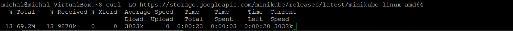

Następnie wprowadzamy komende ```sudo install minikube-linux-amd64 /usr/local/bin/minikube```, instalując tym samym minikube.


Do tego momentu nie wystąpił żadne kłopoty i komplikacje.
Kolejno startujemy klaster ```minikube start```. Wówczas pojawił się pierwszy błąd brak włączonych technologi wirtualizacyjnych VT-X/AMD-v. 

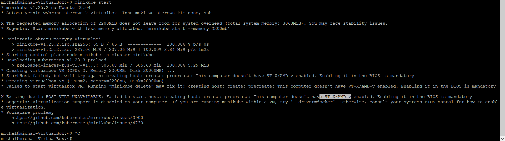

Włączenie tej opcji w ustawieniach VM domyślnie nie było możliwe, jednak w konsoli systemowej po wywołaniu w folderze roboczym VirtualBoxa komendy ```VBoxManage mpdifyvm "nazwa maszyny wirtualnej" --nested-hw-virt on``` funkcja ta zostaje włączona/zmodyfikowana automatycznie.

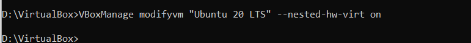

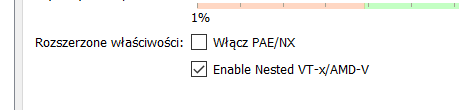

Jednak maszyna nie chciała "wstać" po aktywowaniu tej opcji, crashowała się. 

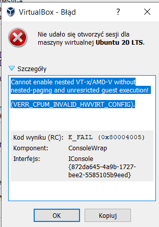

Rozwiązaniem tego problemu okazało się wyłączenie HyperV, którego defakto nie instalowałem więc jest to conajmniej dziwna sytuacja. Niemniej jednak po wprowadzeniu ```bcdedit /set hypervisorlaunchtype off``` i restarcie całej stacji roboczej maszyna wirtualna "wstała".


Jednak po wystartowaniu klastra (użyłem początkowo jako "nośnika" VM ) pojawiały się w dalszym ciągu error. Po próbie instalacji *kubectla* nastąpiła nieprzyjemna sytuacja w postaci usunięcia ważnych pakietów (czemu sam jestem winny) przez co  maszyna się  wysypała. Postawiłem kolejną maszyne aby, gdyż poprzedniej nie dało się uratować powieliłem powyższe kroki i  tym razem postanowiłem jako drivera użyć dockera.

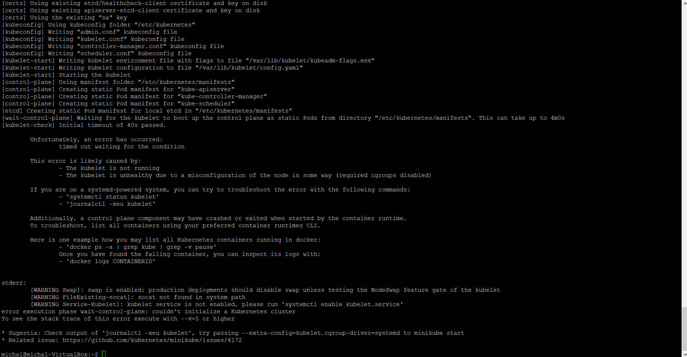

Startuje klaster z kubernetesem z przełącznikiem ```minikube start --driver=docker```. Kolejno dodaje grupe dockerową ```sudo groupadd docker``` i kolejno dodaje do niej użytkownika ```sudo gpasswd -a <konto uzytkownika> docker```. Na końcu aktywuje zmiany w grupach za pomocą komendy ```newgrp docker```.

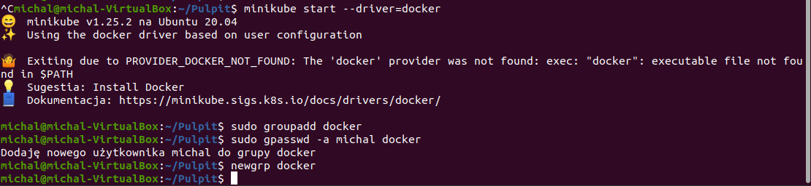

Tak skonfigurowany nośnik pozwala na wystartowanie klastra.

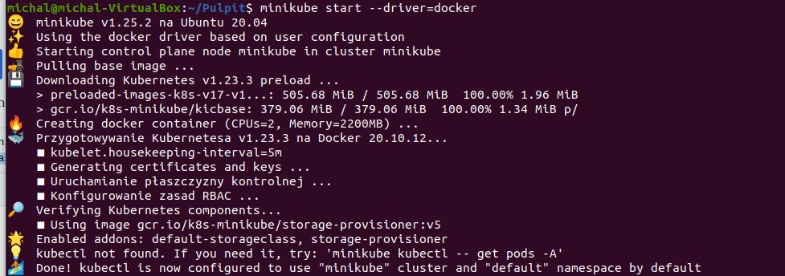

- Zaopatrz się w polecenie kubectl


Następnie aby uzyskać dostęp do klastra wywołuje komende ```minikube kubectl --get pods -A```.

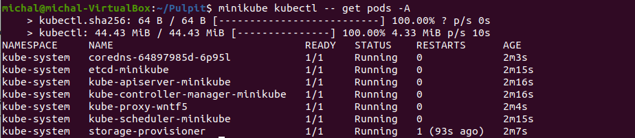

- Uruchom Kubernetes, pokaż działający kontener/worker

Uruchomionienie kontenera potwierdza za pomocą komendy ```sudo docker ps```.

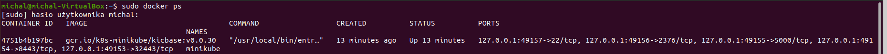

- Zmityguj problemy wynikające z wymagań sprzętowych lub odnieś się do nich (względem dokumentacji)

Na bieżąco. Ponadto warto wspomnieć, że podstawowe wymagania sprzętowe dla minikube zostały spełnione na samym początku tj:

1. Przydzielenie 4 rdzeni procesora
2. 3GB pamięci RAM
3. 50GB miejsca fizycznego
4. Zmostkowane połączenie internetowe maszyny wirtualnej
5. Kontener (docker)

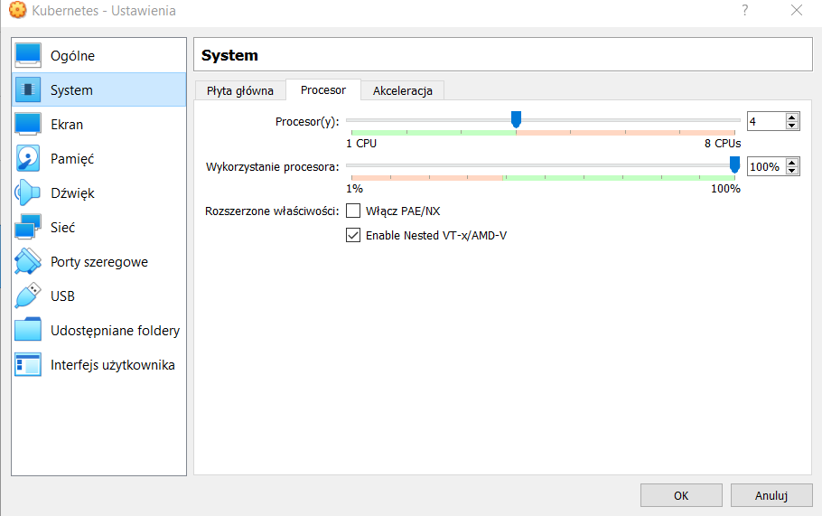


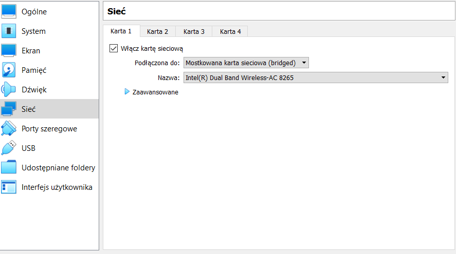

- Uruchom Dashboard, otwórz w przeglądarce, przedstaw łączność

Tak skonfigurowany klaster w kontenerze jest gotowy do wyświetlenia z interfejsem graficznym. W tym celu włączamy dashboad za pomocą komendy ```minikube dashboard```.

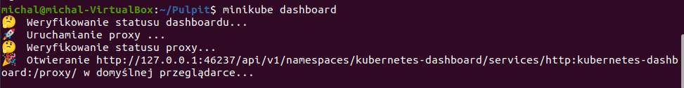

Automatycznie zostajemy przekierowani na adres loopback 127.0.0.1 z przekierowaniem na port 46237 (porty różnią się na wydrukach konsolowych i przeglądarce, ponieważ w podczas pierwszego uruchomienia nie zrobiłem screena). Otrzymuje w ten sposób dostęp do dashboarda Kubernetesa.

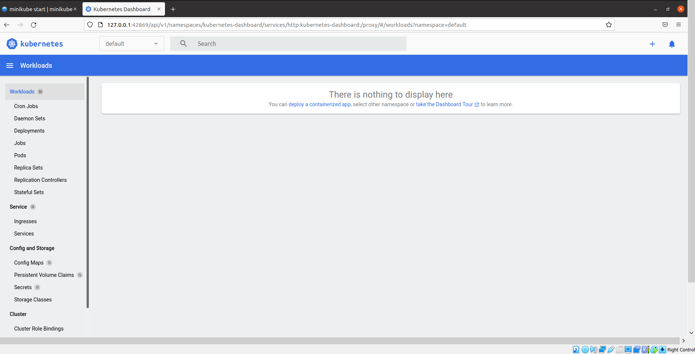

- Deploy aplikacji do minikube'a

W pierwszej kolejności jako deployowanego obrazu użyłem domyślnego obrazu *echoserver:1.4*. Kolejno: 

Tworze deployment, za pomocą komendy ```kubectl create deployment <nazwa> --image=<nazwa_obrazu:tag>```

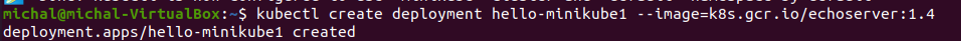

Kolejny krok to expose na port 8080 ```kubectl expose deployment hello-minikub1 -type=LoadBalancer --port=8080```.


Włączamy obsługe deploymentu ```kubectl get services hello-minikube1```

Korzystając z kubectl'a przekierowujemy się na port 7080 ```kubectl port-forward service/hello-minikube1 7080:8080```

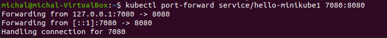

W tym momencie po wysłaniu requesta do adresu *localhost:7080* powinniśmy otrzymać naszą "aplikacje".

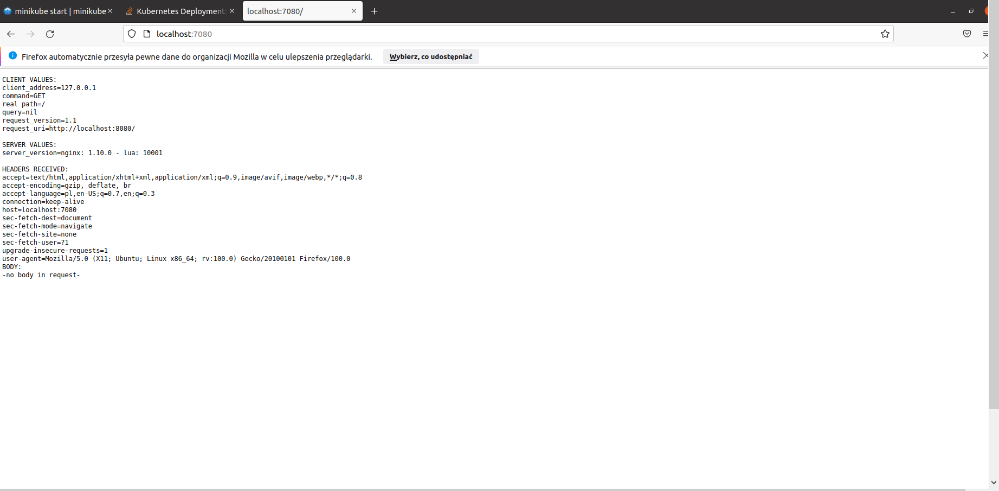

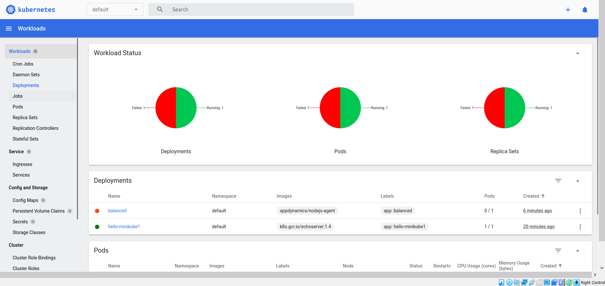


W dalszym kroku próbowałem uruchomić wybrany gotowy obraz z dockehuba, mój wybór padł na nginxa wersje stable. 

W pierwszej kolejności zpullowałem obraz

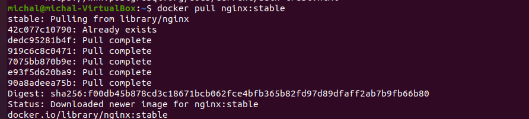

Następnie uruchomiłem wybrany kontener "ubierając go w poda"


Kontener uruchomił się pomyślnie co potwierdzam screenami zarówno z polecenia ```kubectl get pods``` jak i z dashboard'a

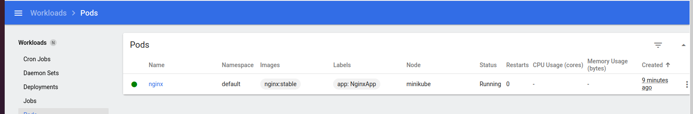

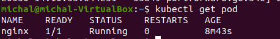

Następnie przeszedłem do przekierowania portu, niestety tutaj pojawił się problem. Problem według mnie występuje problem z mapowaniem requestu pomiędzy podem aplikacji a kontenerem z nginxem. Podjąłem próby rozwiązania tego problemu ingressem, ale nie do końca skuteczne. W tym przypadku bawiłem się z obrazem httpd, niestety jednak miałem problem prawdopodobnie z DNS'em i nie byłem w stanie zrequestować przekierowanego portu. 

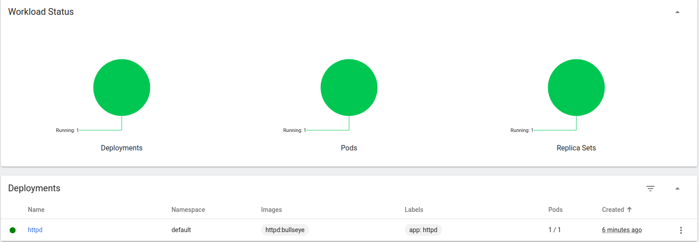

Tak więc na tą chwile moje zaopatrzenie się w klaster Kubernetesa zostało spełnione, podstawowy deploy wykonany w drugiej części postaram się rozszerzyć swoje działania. 


