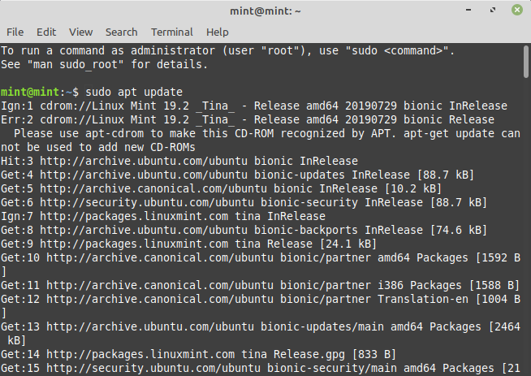
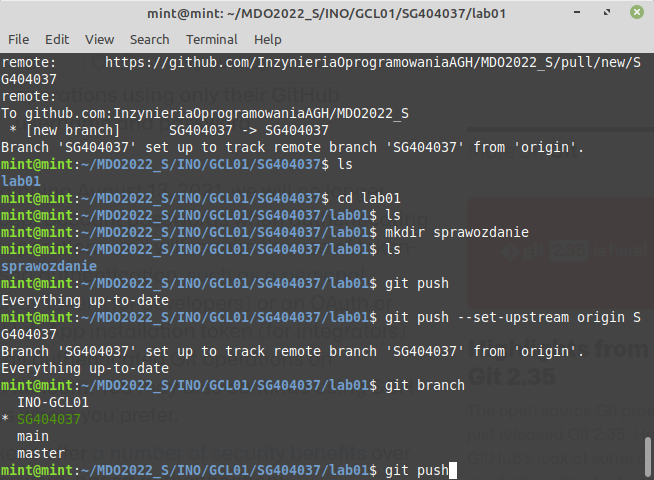

# Sprawozdanie nr 1
## DevOps – Sandra Góra – Nr albumu 404037
	
Przebieg laboratorium nr 1:

Na początku zainstalowałam git :
```
$ sudo apt install git
``` 




Następnie sklonowałam repozytorium:
```
$ git clon https://github.com/InzynieriaOprogramowaniaAGH/MDO2022_S.git
```


wygenerowałam nowy klucz SSH za pomocą komendy:

```
$ ssh-keygen -t ed25519 -f kluczyk.id 
```


Dzięki poniższej komendzie sklonowałam repozytorium za pomocą SSH:

```
$ git clon git@github.com:InzynieriaOprogramowaniaAGH/MDO2022_S.git
```

przełączyłam się na gałąź main przy pomocy komendy:

```
$ git checkout main
 ```
 


zmieniłam na gałąź mojej grupy INO-GCL01 : 

```
$ git checkout INO-GCL01
```

Utworzyłam gałąź :

```
$ git checkout -b SG404037
```


Następnie utworzyłam katalog:
```
$ mkdir SG404037
```
W katalogu utworzyłam podkatalog Lab01:
```
$ mkdir Lab01
```


Dodałam sprawozdanie oraz zatwierdziłam zmiany za pomocą git add .:
```
$ git add .
```


Wysłałam zmiany do zdalnego repozytorium za pomocą git push:
```
$ git push
```
