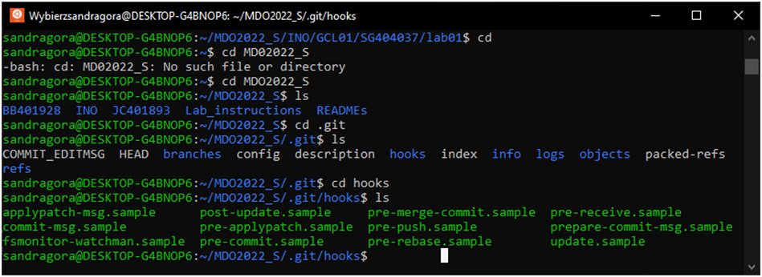
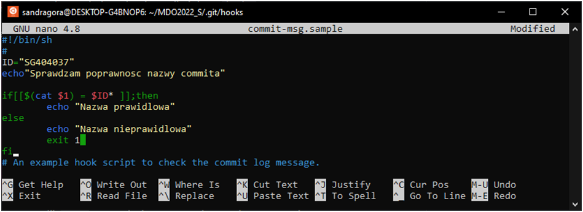
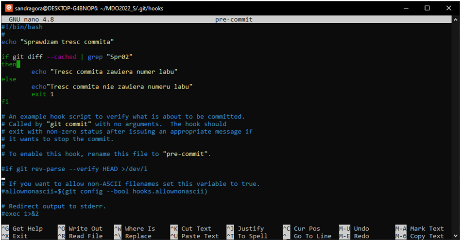
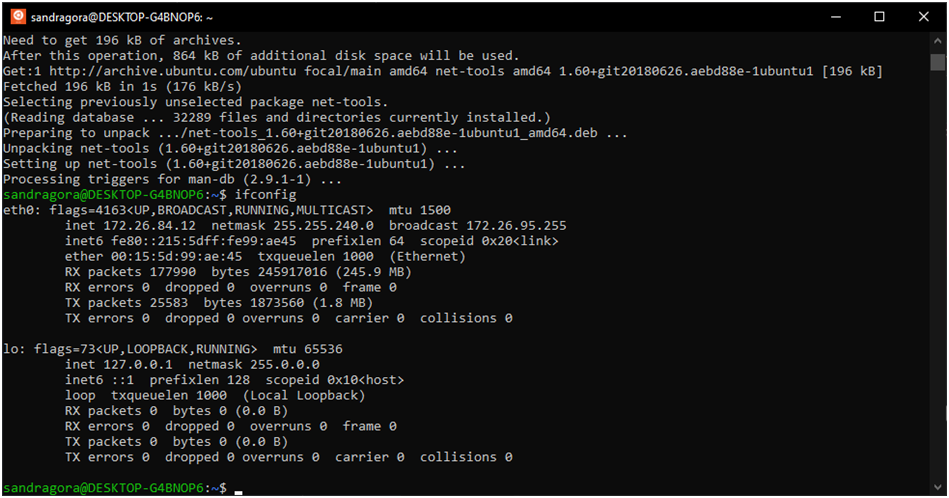
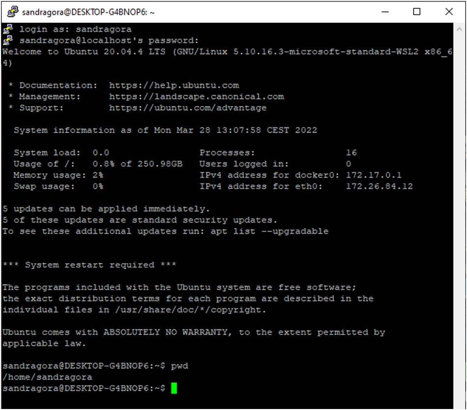
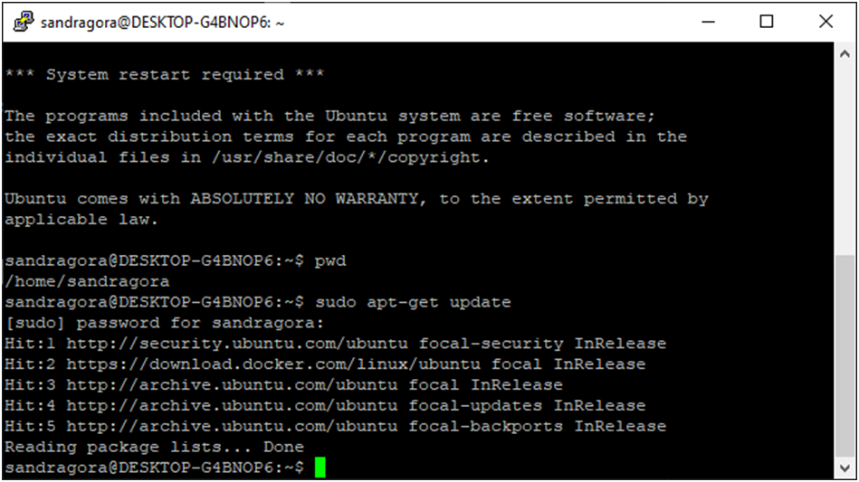
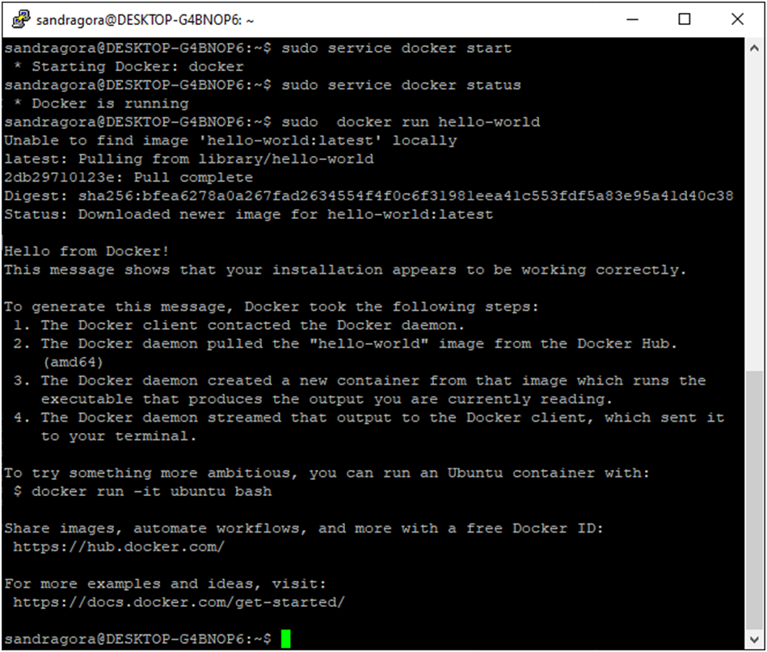
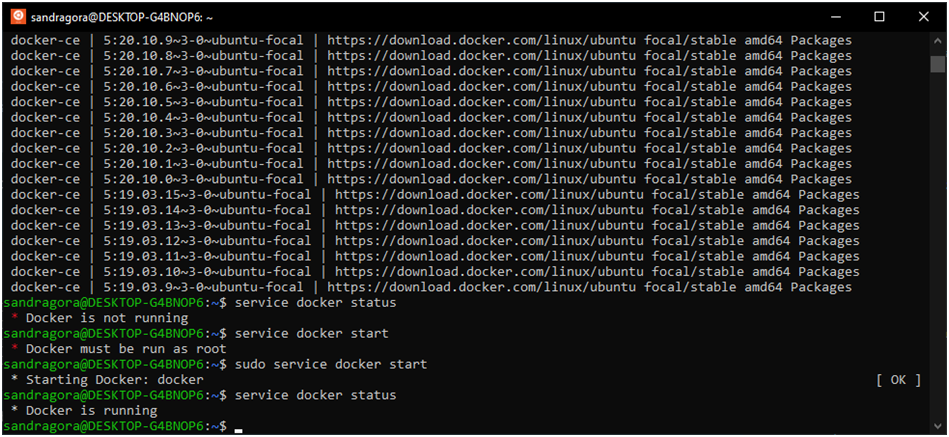
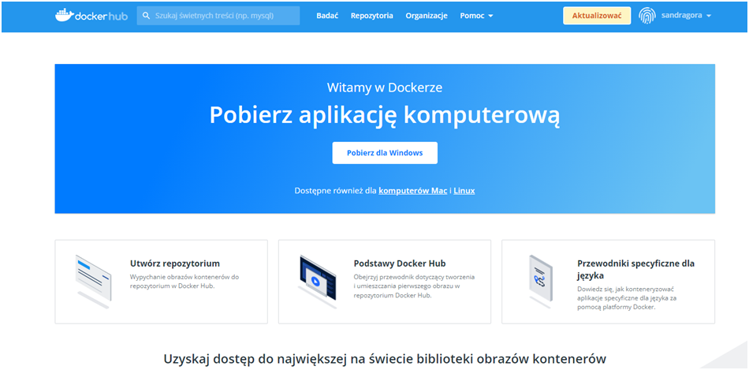

# Sprawozdanie nr 1
## DevOps – Sandra Góra – Nr albumu 404037
	
Przebieg laboratorium nr 2:

1.	Przeszłam do katalogu .git, a następnie do podkatalogu hook

2.	Edytowałam plik commit-msg.sample i zamieniłam nazwę na commit-msg
 
3.	Następnie również edytowałam plik pre-commit.sample i zmieniłam nazwę na pre-commit 
 

4.	Weszłam do swojego katalogu SG404037 i utworzyłam podkatalog lab02, tam utworzyłam plik test.txt, a następnie utworzyłam drugi plik test2.txt  i przetestowa   działanie

6.	Za pomocą ifconfig, sprawdziłam ip, dzięki któremu połączę się przez ssh

 
7.	Połączyłam się z putty:

8.	Przygotowałam i sprawdziłam środowisko dockerowe :

9.	Uruchomiłam obraz hello-world :
 
10.	Pobrałam obraz dystrybucji linuksowej i uruchomiłam go, następnie sprawdziłam pobraną wersję obrazu Ubuntu :
 
11.	Zainstalowanie dockera :

12. Założenie konta na docker Hub :
 
