# Sprawozdanie nr 4
## DevOps – Sandra Góra – Nr albumu 404037
	
Przebieg laboratorium nr4:
1.	Przygotowałam woluming wejściowy (volin) i wyjściowy(out):
  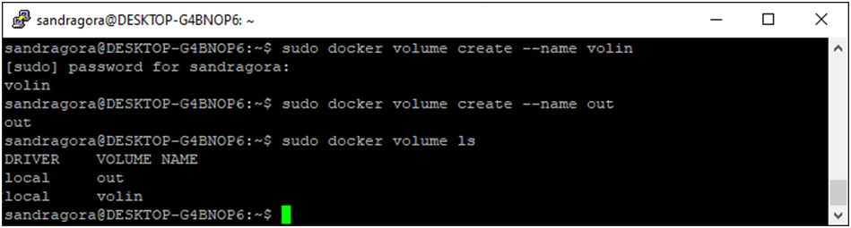

 
2.	Podłączyłam je do kontenera bazowego :
 
 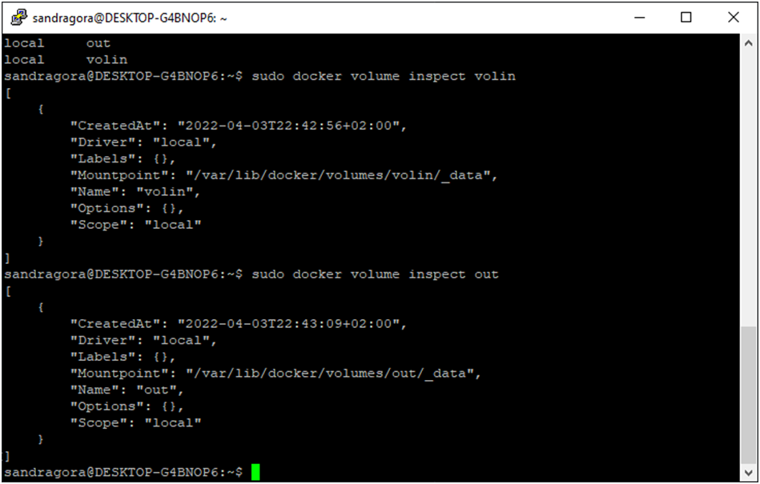

3.	Uruchomiłam kontener i zainstalowałam niezbędne wymagania wstępne:
 
 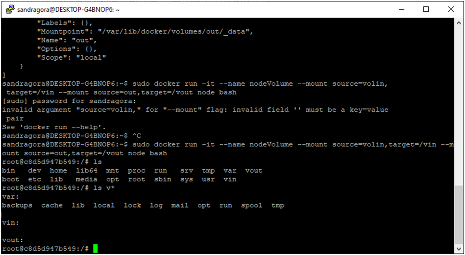

4.	Sklonowałam repozytorium na wolumin wejściowy  :
 
 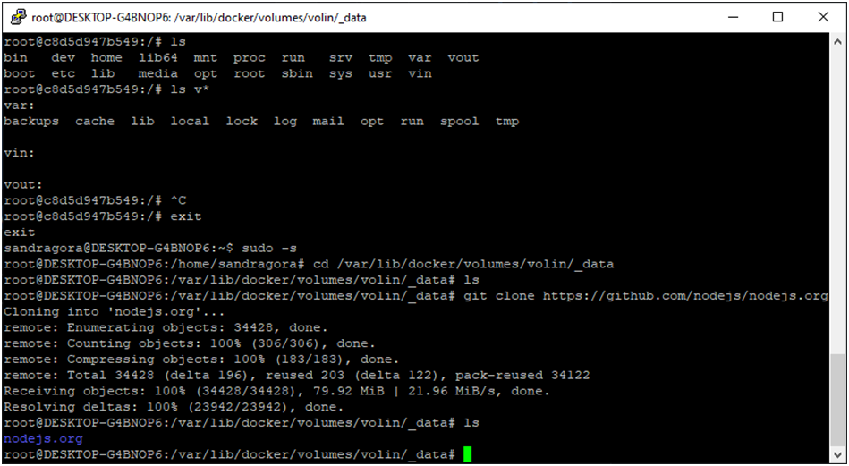

5.	Uruchomiłam builda w kontenerze  i zapisałam powstałe pliki na wolumie wyjściowym:
 
 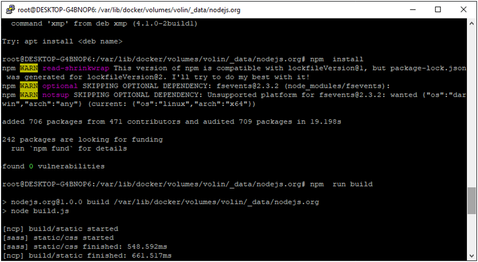
 
 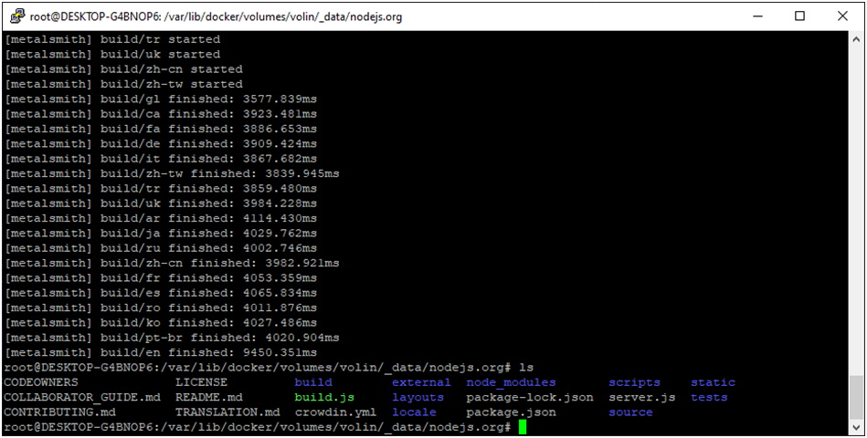
 
6.	Uruchomiłam wewnątrz kontenera serwer iperf3 :
 
 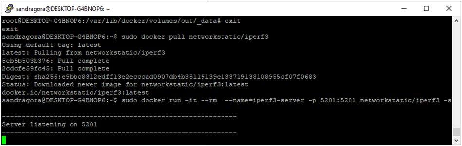

7.	Widoczny obraz dockerowy:
 
 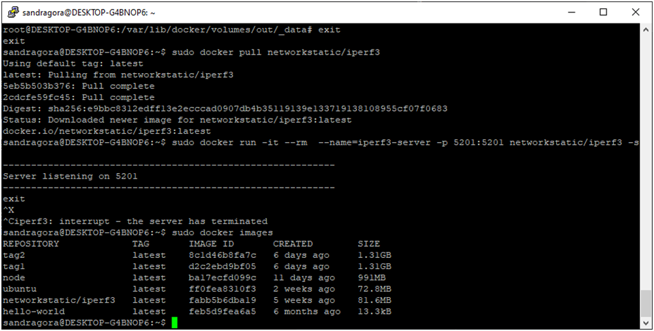

8.	Sprawdziłam czy serwer nasłuchuje:
 
 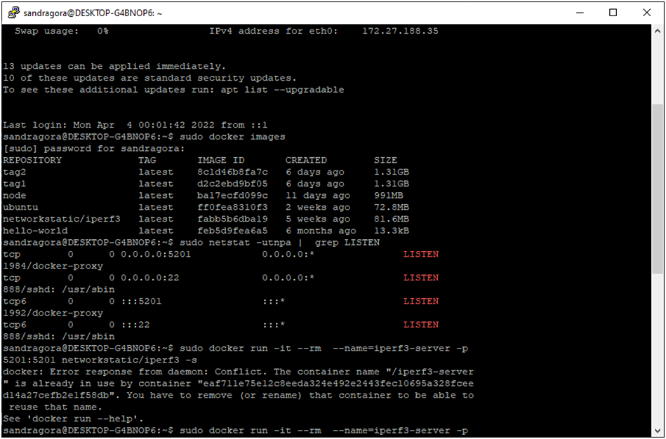

9.	Przeszłam do połączenia z serwerem z drugiego kontenera:
 
 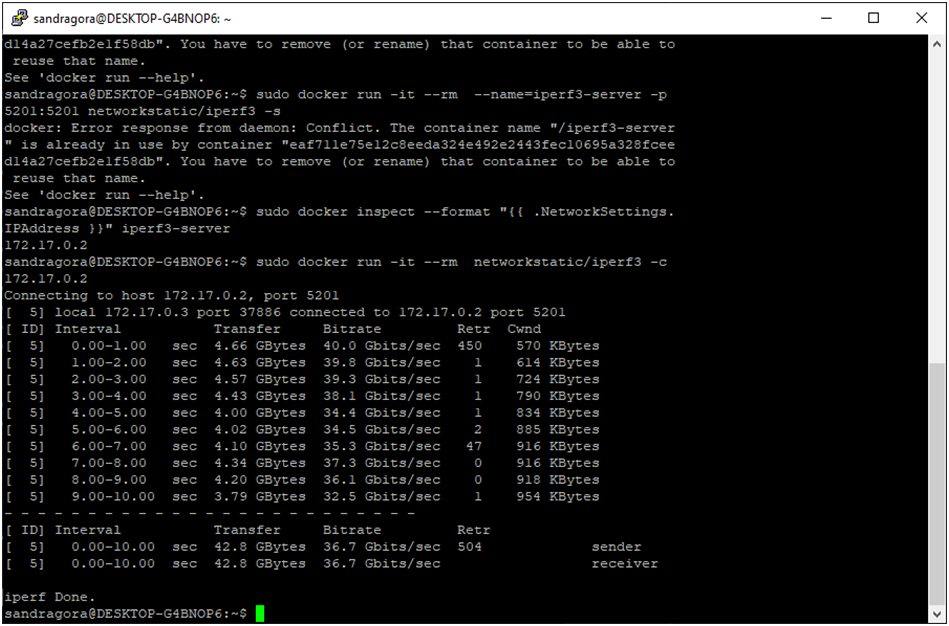

10.	Przeszła do połączenia spoza kontenera:
 
 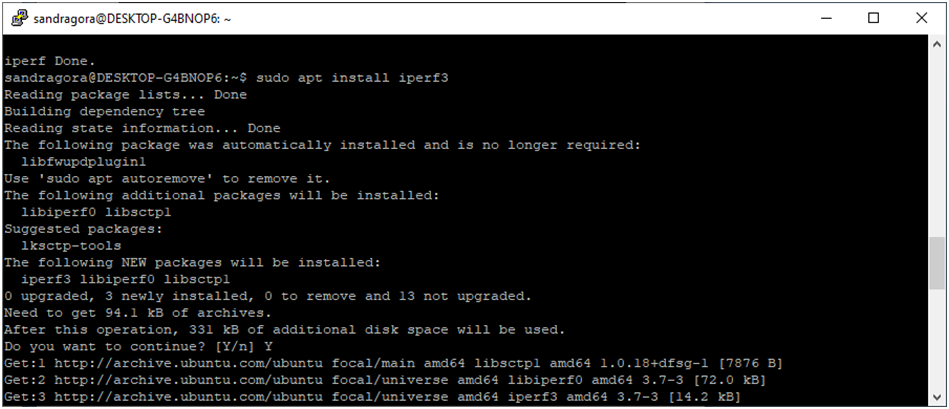

11.	Sprawdziłam połączenie z hosta :
 
 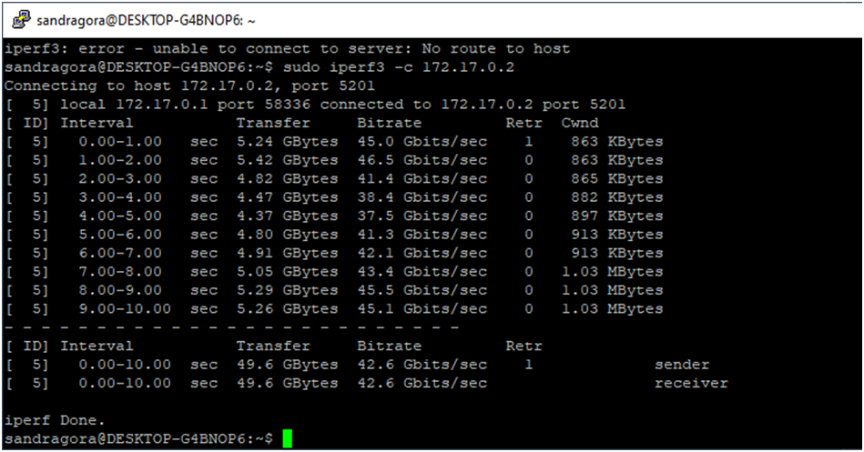

12.	Przedstawienie przepustowości komunikacji :
 
 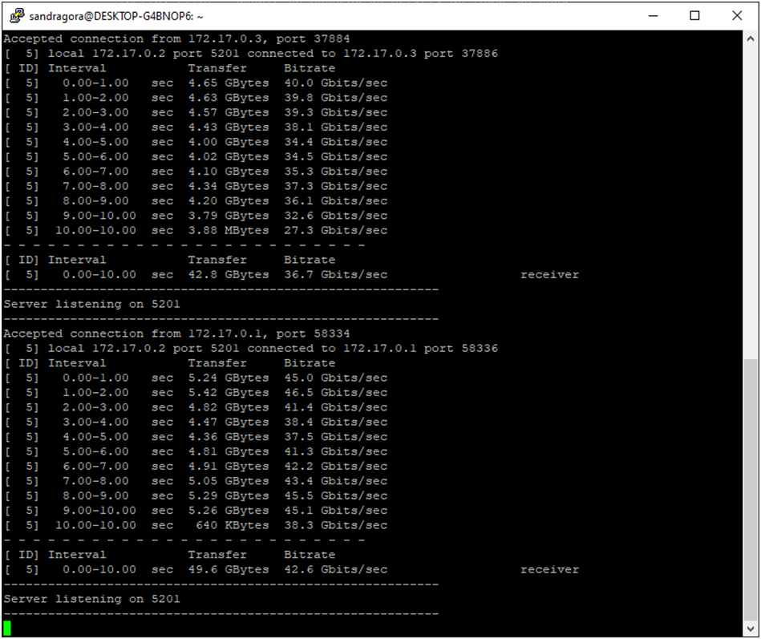

13.	Przeszłam do instalacji Jenkins na podstawie https://www.jenkins.io/doc/book/installing/docker/:
 
 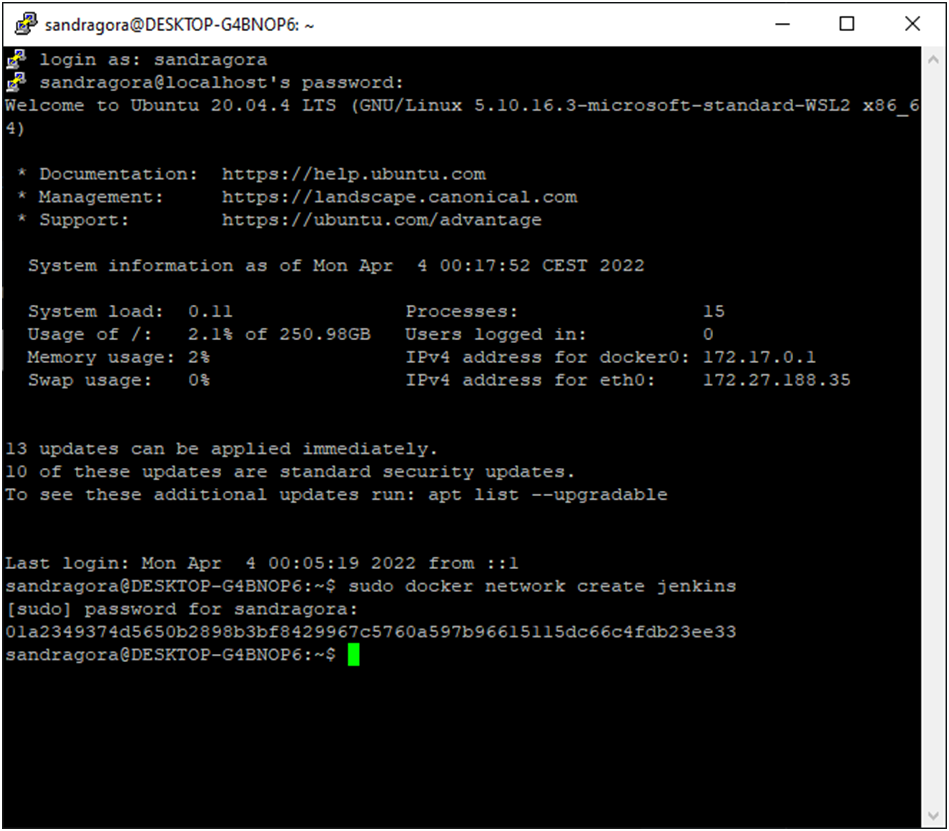

 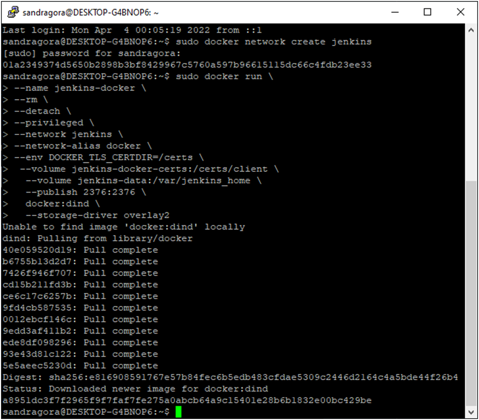
 
  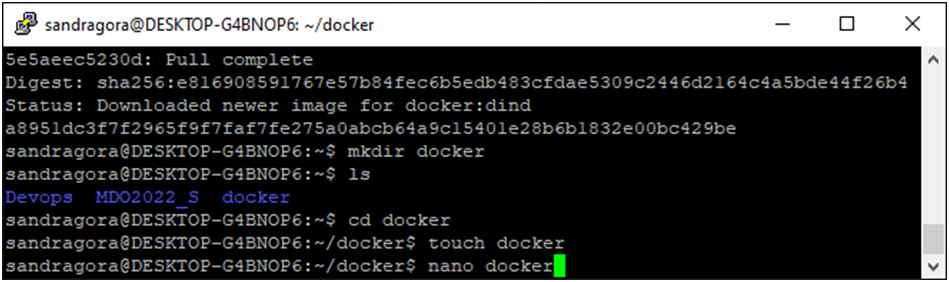
  
   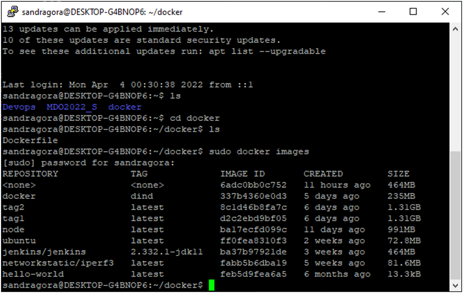
 