# Sprawozdanie nr 9
## DevOps – Sandra Góra – Nr albumu 404037
	
Przebieg laboratorium nr 9 :

1.	Instalacja oraz ustawinie systemu Fedora :
 
 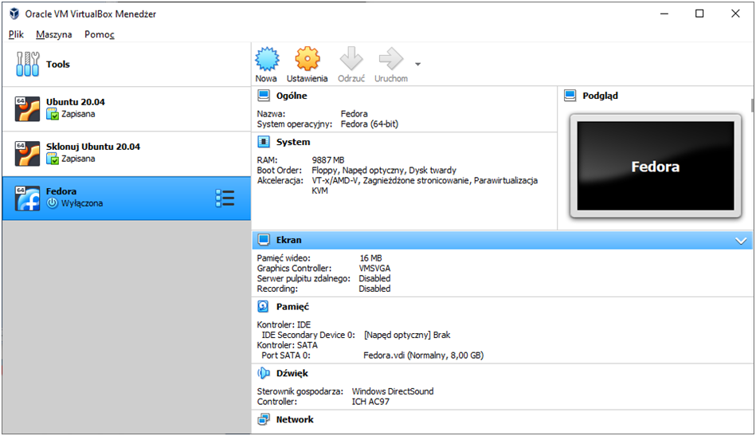

 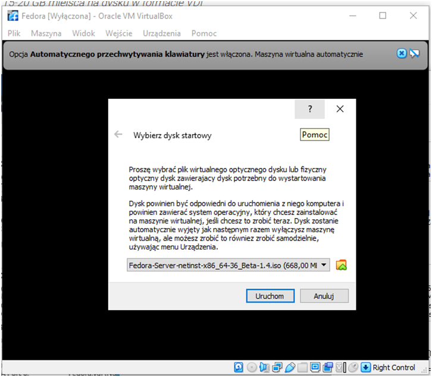
 
 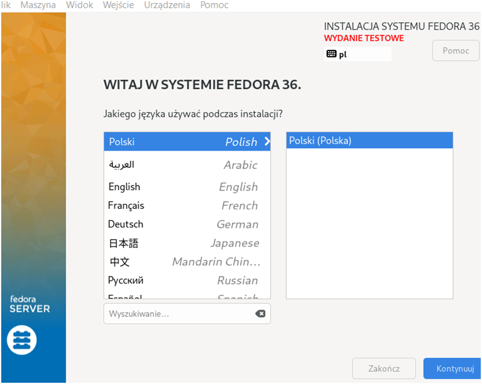
  
 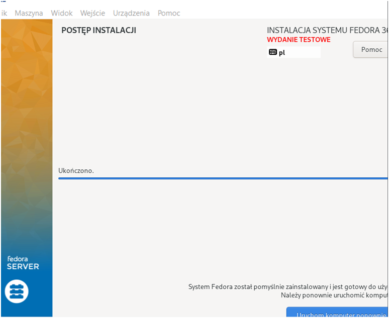
 
  
   
   2. Zalogowanie się do systemu Fedora jako root, by odnależć plik anaconda-ks.cfg :

 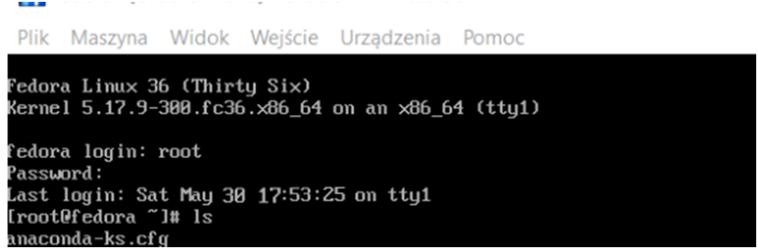
 
 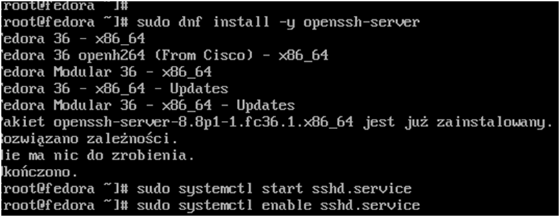
   
   3. Instalacja drugiegi systemu Fedora :
   
 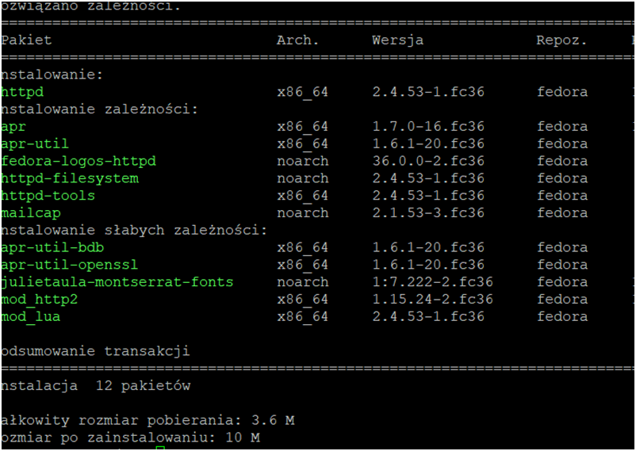

 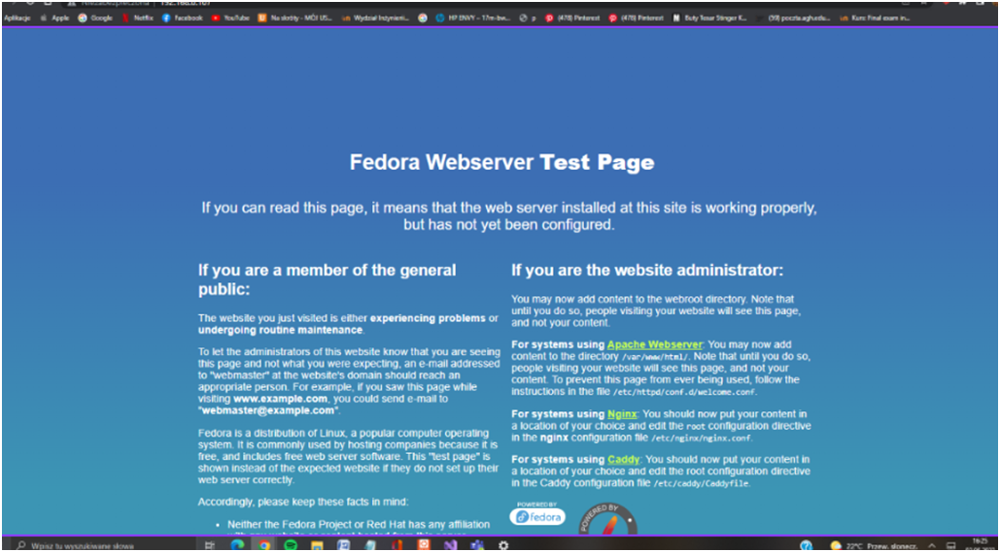

   4. Instalacja nienadzorowana :
   
 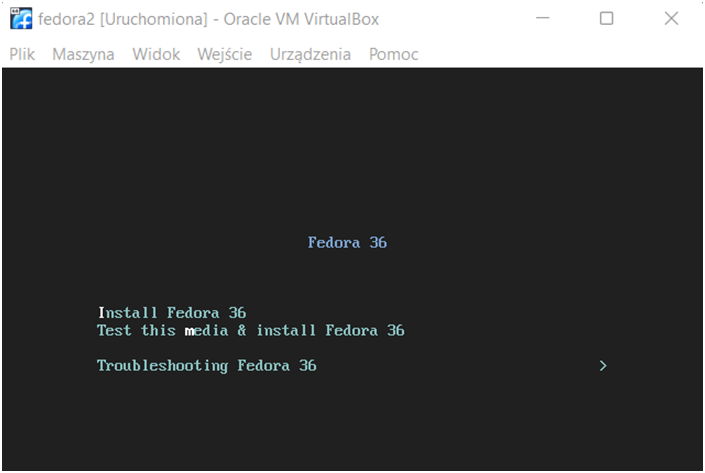
 
 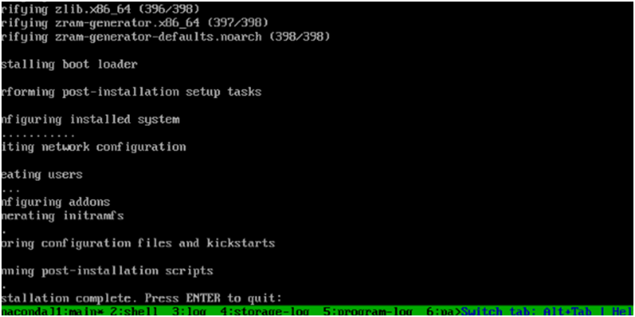

 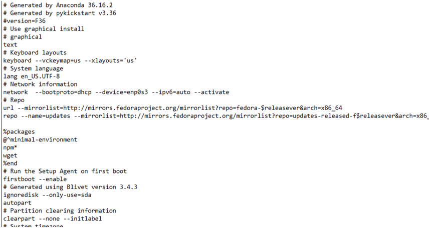

 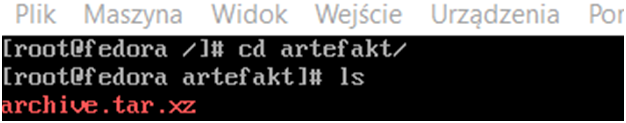

 