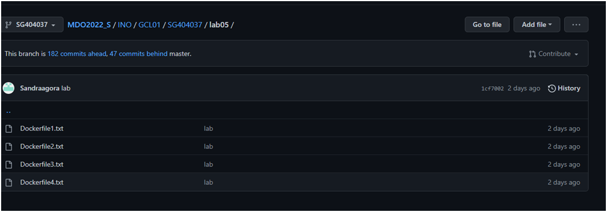
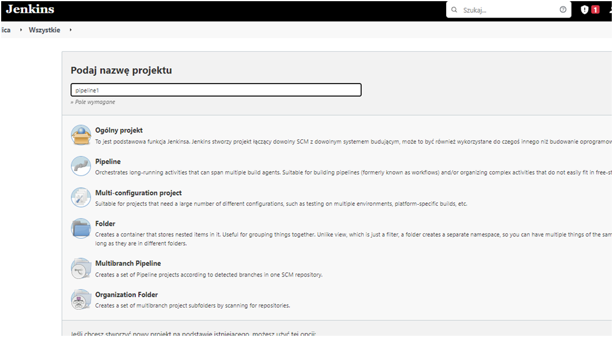
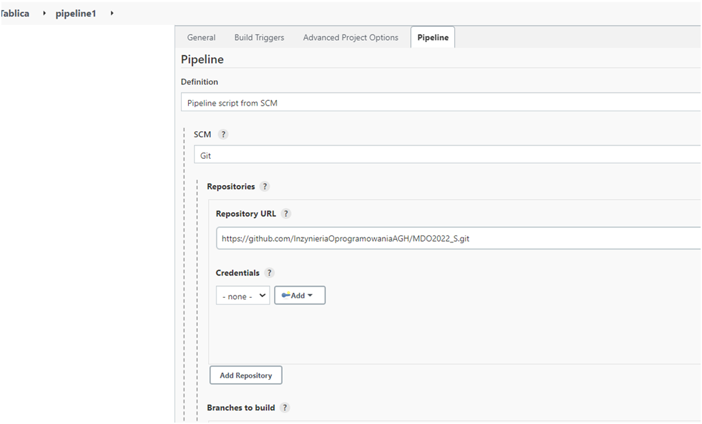
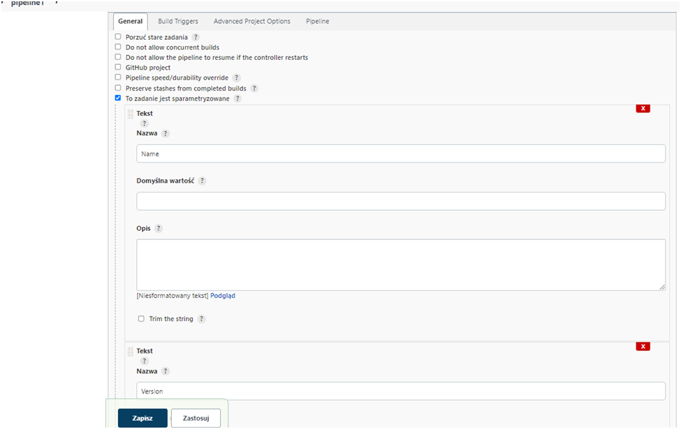
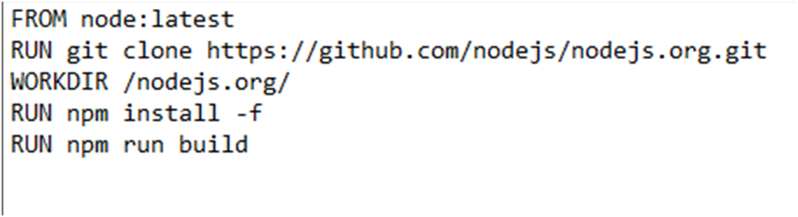
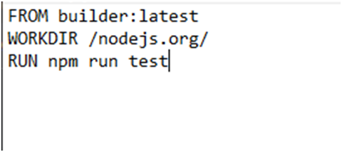
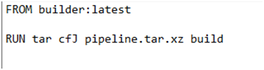
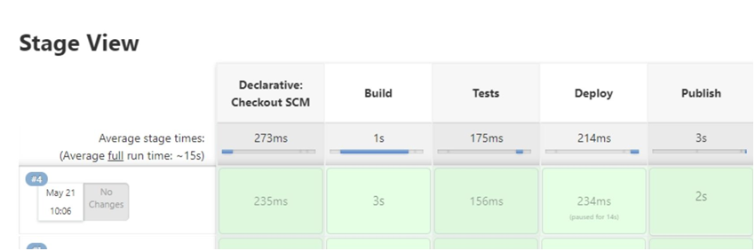

# Sprawozdanie Pipeline
## DevOps – Sandra Góra – Nr albumu 404037
	
Przebieg laboratorium nr 5 :

1.	Instalacji Jenkins na podstawie https://www.jenkins.io/doc/book/installing/docker/:
Kontener Jenkins i DIND skonfigurowany według instrukcji dostawcy oprogramowania :
 
 

 
 
  
  
   
   
   2. Pliki Dockerfile wdrażające instancję Jenkinsa załączone w repozytorium przedmiotowym pod ścieżką i na gałęzi według opisu z poleceń README
   
a) pliki dockerfile:
 
   
   3. Zdefiniowany wewnątrz Jenkinsa obiekt projektowy „pipeline”, realizujący następujące kroki:Build, Test, Deploy, Publish
   
 
 
 
   

   4. Realizacja kroków: Build, Test, Deploy, Publish
            a)Krok Build
 
            b)Krok Test:
  
            c)Krok Deploy:
 
            d)Krok Publish:
 
Zwartość Jenkinsfile:
 
Poprawność działania:
 
