# Zajęcia 01 Sprawozdanie
### 07.03.2022
---
System kontroli wersji oraz narzędzia do obsługi kluczy SSH zostały zainstalowane przeze mnie od razu po instalacji systemu Linux za pomocą komendy:
```bash
$ sudo apt install git
```


Na początku sklonowałam repozytorium za pomocą HTTPS używając komendy:
```bash
$ git clone https://github.com/InzynieriaOprogramowaniaAGH/MDO2022_S.git
```
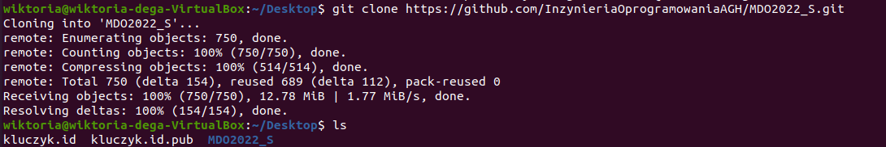

Następnie wygenerowałam nowy klucz SSH za pomocą komendy:
```bash
$ ssh-keygen -t ed25519 -f kluczyk.id
```
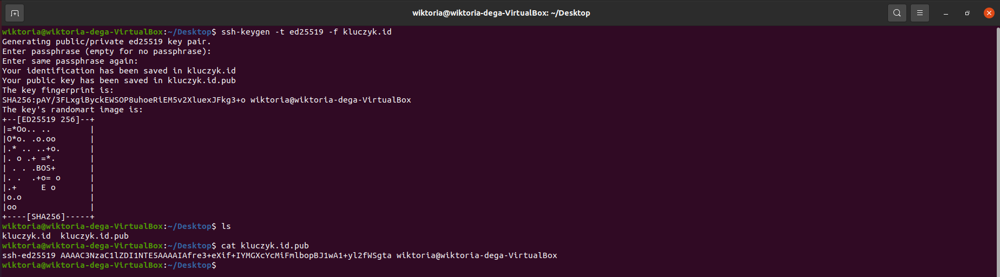

Używając poniższych komend sprawdziłam klucz publiczny, a także jego poprawność, generując go poprzez klucz prywatny.
```bash
$ cat kluczyk.id.pub
```
```bash
$ ssh-keygen -y -f ./kluczyk.id
```
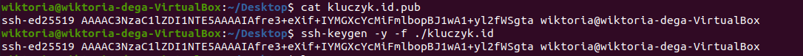

W kolejnym kroku wygenerowałam drugi klucz SSH zabezpieczony hasłem za pomocą poniższej komendy i w ten sam sposób sprawdziłam jego poprawność.

```bash
$ ssh-keygen -t ecdsa -f kluczyk2.id -C `viki99dg@wp.pl`
```

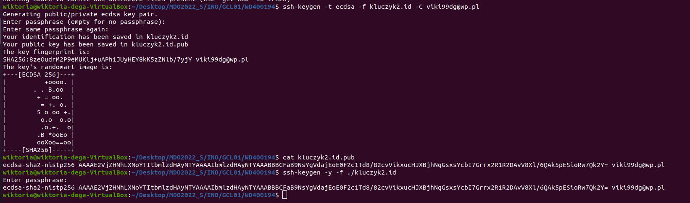

Następnie dodałam klucz publiczny do mojego konta na Github.
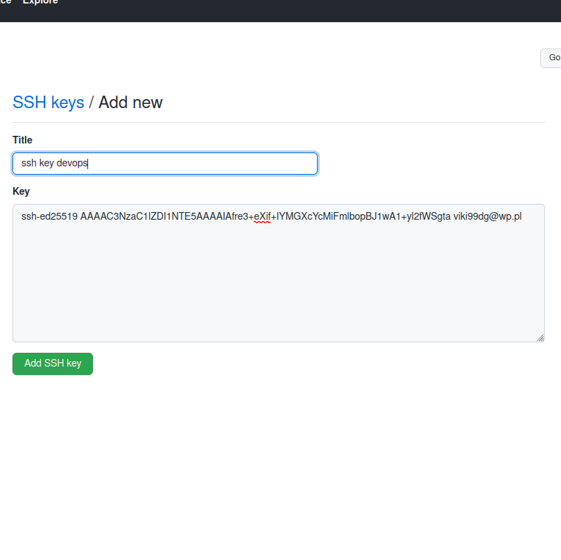


Klucz prywatny został dodany przeze mnie do `ssh-agent` poprzez:
```bash
$ eval `ssh-agent -s`
```
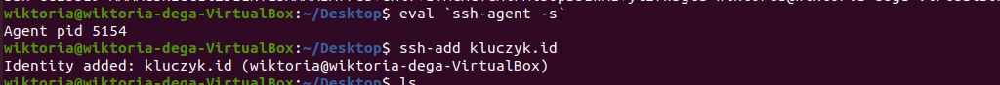

Git jest już skonfigurowany:
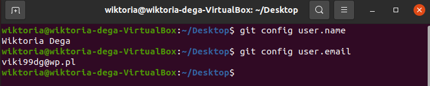

Dzięki poniższej komendzie sklonowałam repozytorium za pomocą SSH:
```bash
$ git clone git@github.com:InzynieriaOprogramowaniaAGH/MDO2022_S.git
```
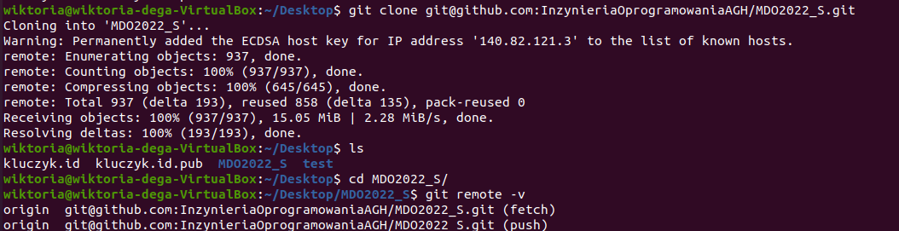

Następnie przełączyłam się na gałąź `main` przy pomocy komendy:
```bash
$ git checkout main
```
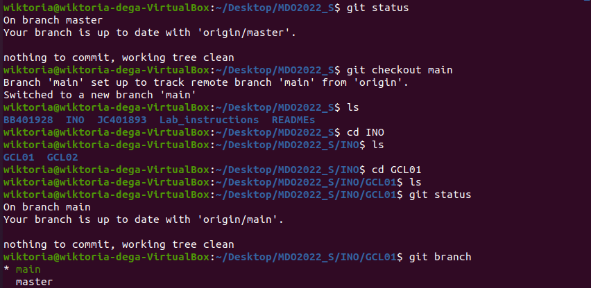

A w następnym kroku na gałąź mojej grupy (`INO-GCL01`) wywołując komendę:
```bash
$ git checkout INO-GCL01
```
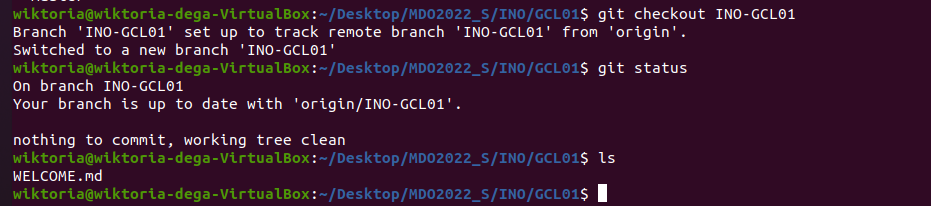

Utworzyłam gałąź o odpowiedniej nazwie, składającej się z inicjałów i numeru indeksu, za pomocą:
```bash
$ git checkout -b WD400194
```
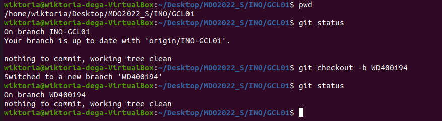

Następnie przystąpiłam do pracy na nowej gałęzi. W odpowiednim katalogu mojej grupy stworzyłam swój katalog o tej samej nazwie co gałąź, tj. `WD400194`, używając komendy:
```bash
$ mkdir WD400194
```
W nowo utworzonym katalogu, stworzyłam katalog `Lab01`, używając poprzednio użytej komendy:
```bash
$ mkdir Lab01
```
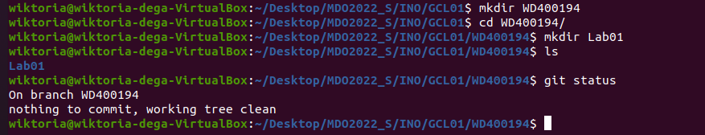

Dodałam sprawozdanie oraz zatwierdziłam zmiany za pomocą `git add .`.

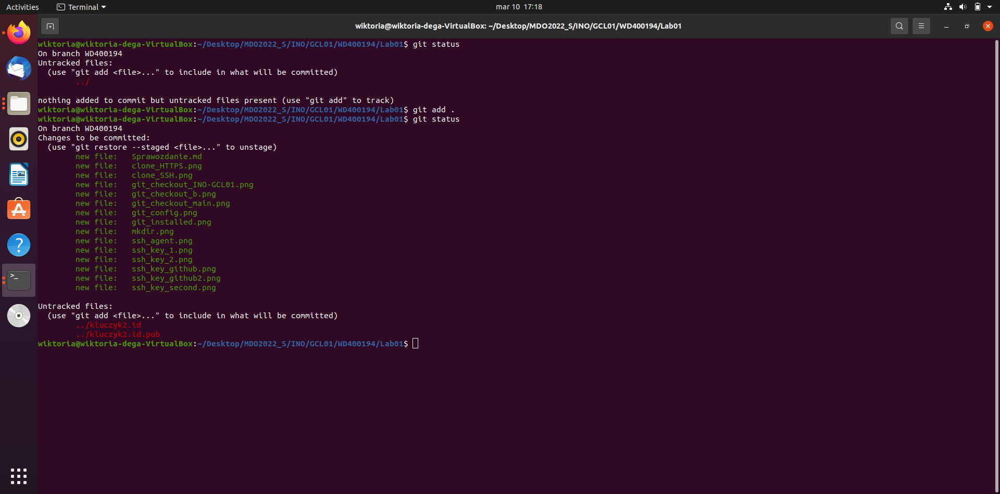

Stworzyłam commit z komentarzem.

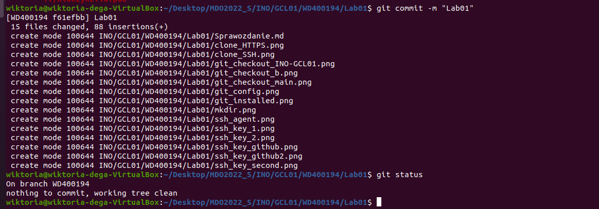

Wysłałam zmiany do zdalnego repozytorium za pomocą `git push`.

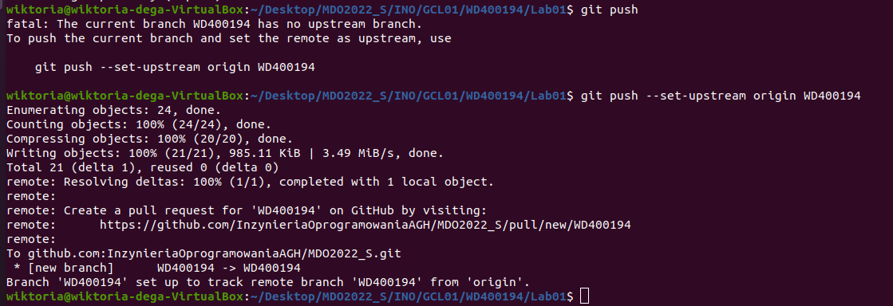

