# Zajęcia 02 Sprawozdanie
### 14.03.2022
---
Pierwszym krokiem, który wykonałam było dostanie się do katalogu `.git`, a w następnej kolejności do podkatalogu `hooks`

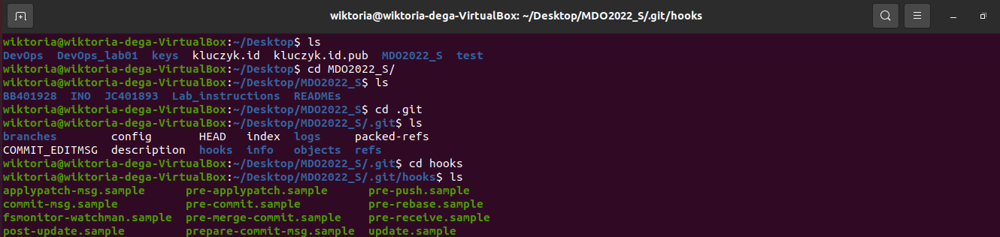

Następnie przeszłam do edycji pliku `commit-msg.sample`, w ten sposób tworząc plik `hook`, sprawdzający czy tytuł commita nazywa się `WD400194`. W przeciwnym razie proces tworzenia commita jest przerywany.

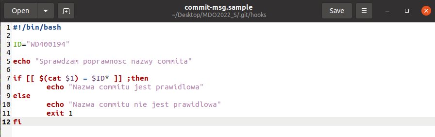

Zmieniłam nazwę pliku `commit-msg.sample` na `commit-msg`.


Stworzyłam plik testowy `test.txt` i sprawdziłam działanie skryptu dla niewłaściwego tytułu oraz dla tytułu `WD400194`.

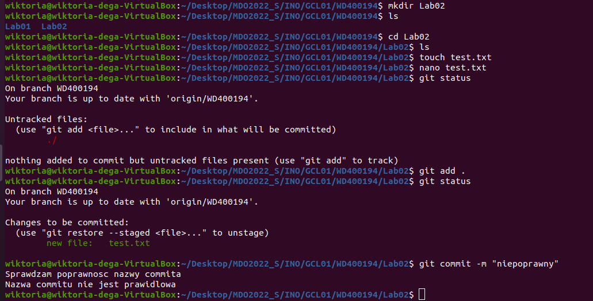
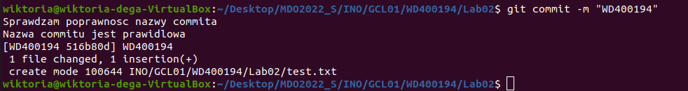

Następnie stworzyłam kolejny `hook`, sprawdzający czy w treści commita pojawia się numer labu. Najpierw zaczęłam od edycji pliku `pre-commit.sample` z podkatalogu `hooks`.

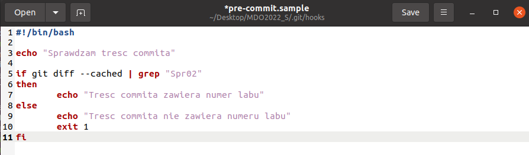

Identycznie jak wcześniej, zmieniłam nazwę pliku `pre-commit.sample` na `pre-commit`.

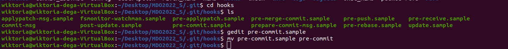

Stworzyłam kolejny plik testowy `test2.txt` i sprawdziłam działanie skryptu dla niewłaściwej treści commita oraz dla treści zawierającej numer labu (Spr02)


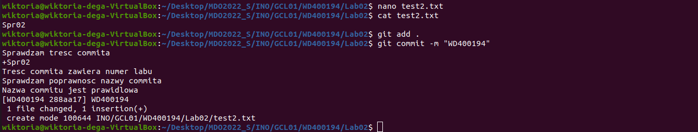

W następnym kroku przeszłam do rozpoczęcia wykonania trzeciego podpunktu. Za pomocą poniższej komendy sprawdziłam status OpenSSH servera:

```bash
$ sudo systemctl status ssh
```
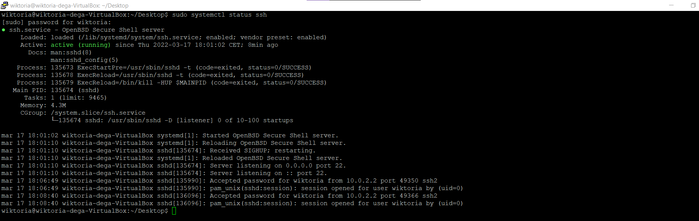

Za pomocą `ifocnfig` sprawdziłam ip, potrzebne w celu połączenia się przez ssh.

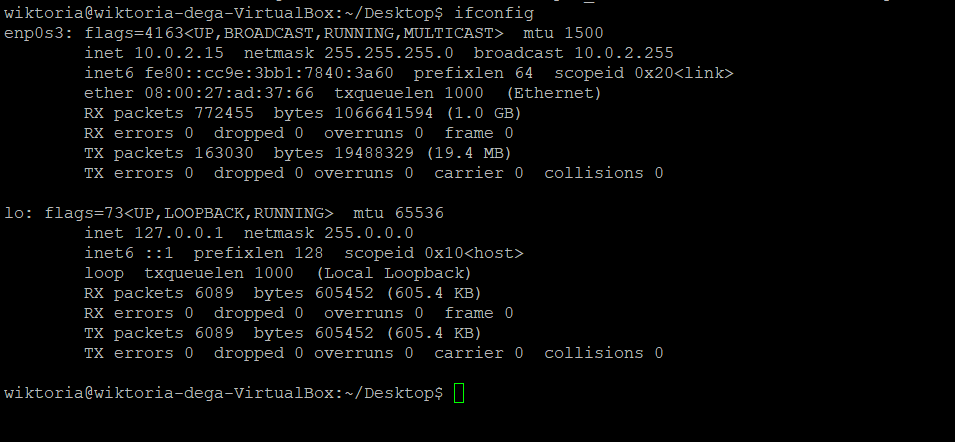

Dzięki programowi `PuTTY` połączyłam się z maszyną wirtualną.

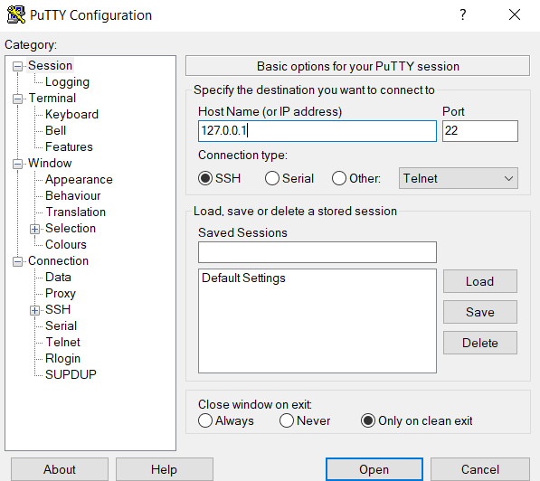

Następnie zalogowałam się.

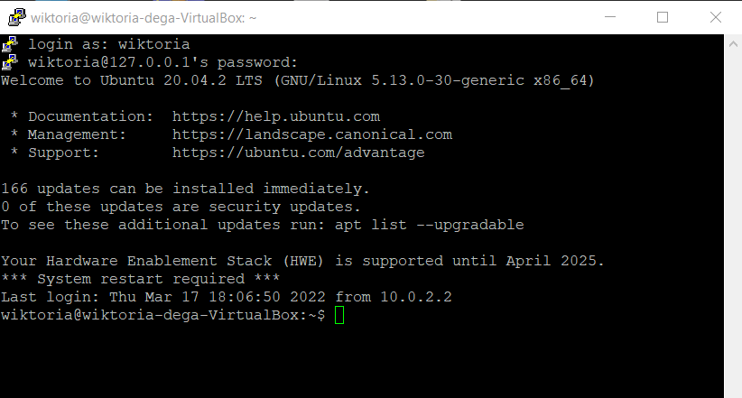

Kolejnym wykonanym przeze mnie krokiem była instalacja dockera. Za pomocą poniższej komendy nastąpiła aktualizacja list paczek z repozytoriów:

```bash
$ sudo apt-get update
```

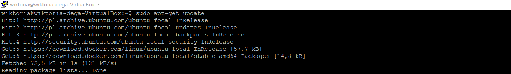

Następnie potrzebne było doinstalowanie szeregu wymaganych dependencji poprzez komendę:

```bash
$ sudo apt-get install \
>     ca-certificates \
>     curl \
>     gnupg \
>     lsb-release
>   
```

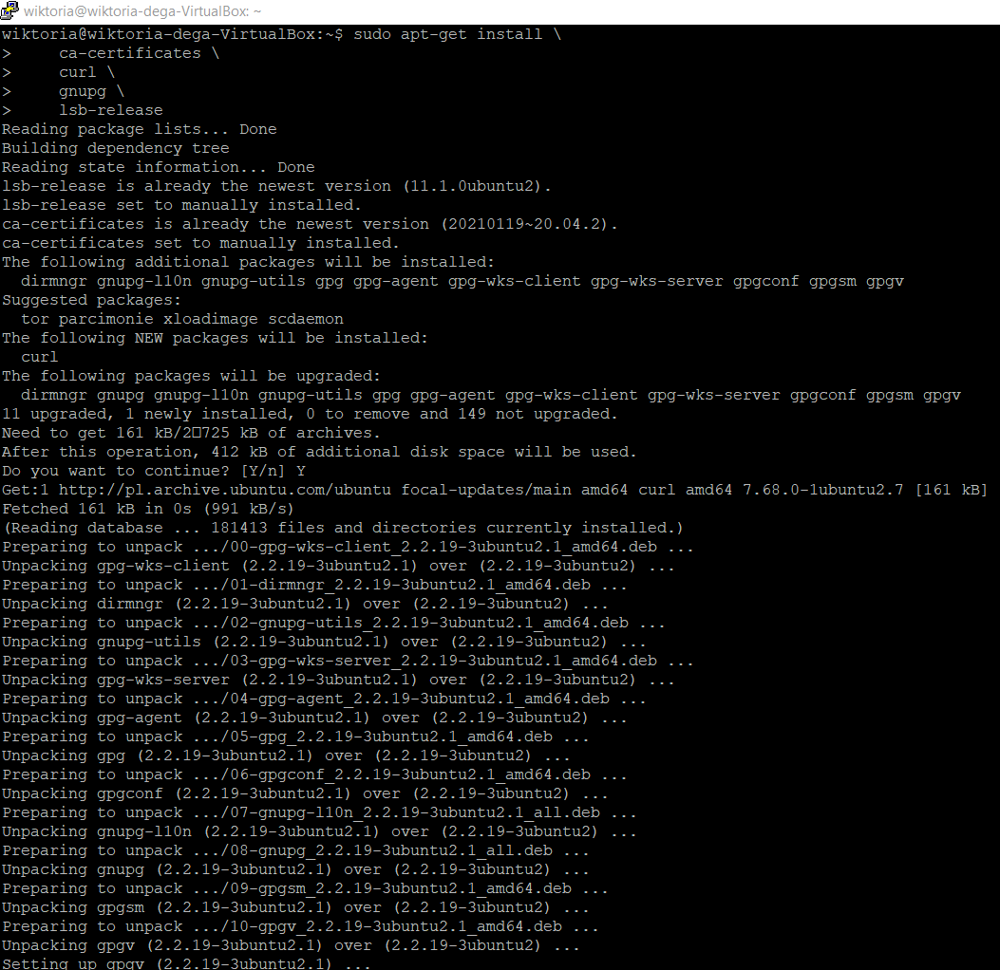
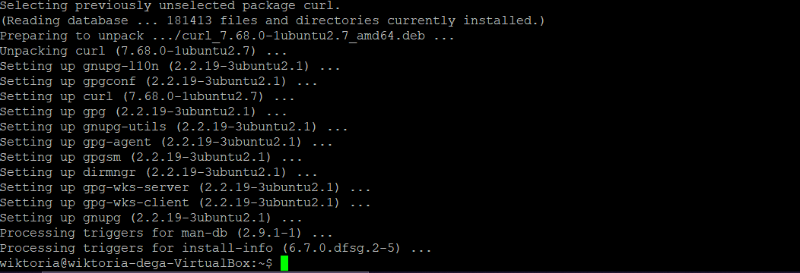

Później dodałam oficjalne klucze GPG Dockera za pomocą:

```bash
$ curl -fsSL https://download.docker.com/linux/ubuntu/gpg | sudo gpg --dearmor -o /usr/share/keyrings/docker-archive-keyring.gpg
```
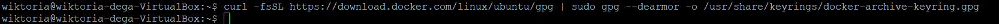

Natomiast repozytorium ustawione zostało przeze mnie na `stable`:

```bash
$ echo \
  "deb [arch=$(dpkg --print-architecture) signed-by=/usr/share/keyrings/docker-archive-keyring.gpg] https://download.docker.com/linux/ubuntu \
  $(lsb_release -cs) stable" | sudo tee /etc/apt/sources.list.d/docker.list > /dev/null
```

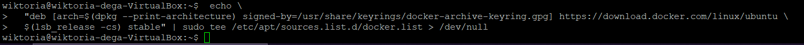

Następnie zainstalowałam Docker Engine poprzez komendę:

```bash
$ sudo apt-get install docker-ce docker-ce-cli containerd.io
```


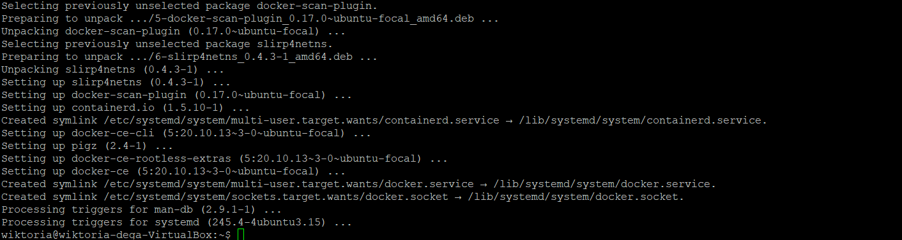

W kolejnym kroku przeszłam do wykonania podpunktu czwartego. Uruchomiłam środowisko dockerowe oraz sprawdziłam jego działanie:

```bash
$ sudo service docker start
$ sudo service docker status
```
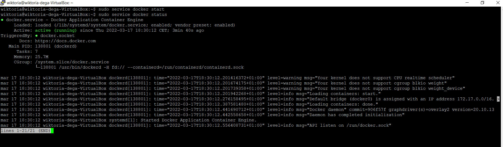

Uruchomiłam obraz `hello-world` przy pomocy komendy:

```bash
$ sudo docker run hello-world
```
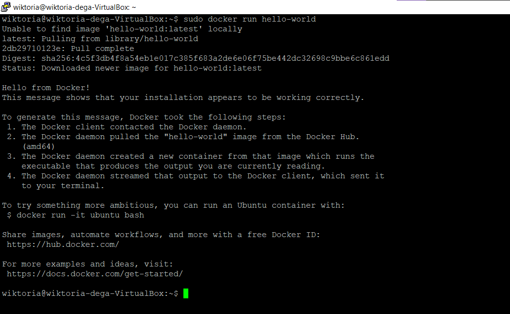

Pobrałam obraz dystrybucji linuksowej i uruchomiłam go:

```bash
$ sudo docker run ubuntu
```
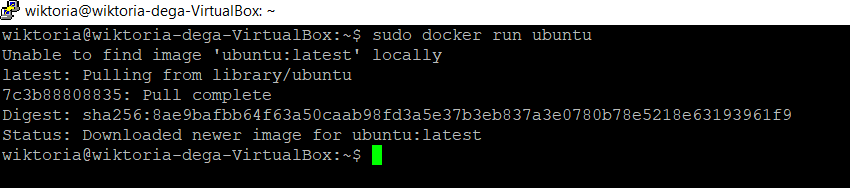

Następnie sprawdziłam pobraną wersję obrazu Ubuntu:

```bash
$ sudo docker images
```
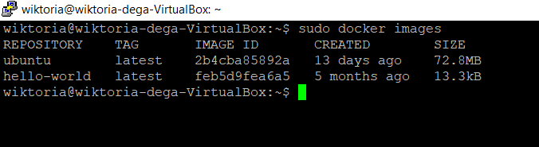
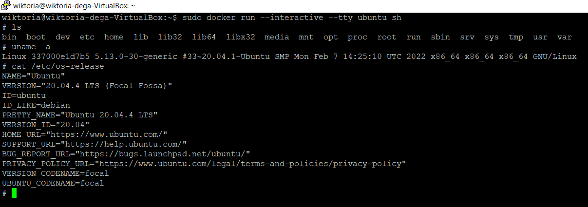

Na koniec założyłam konto na **Docker Hub** .


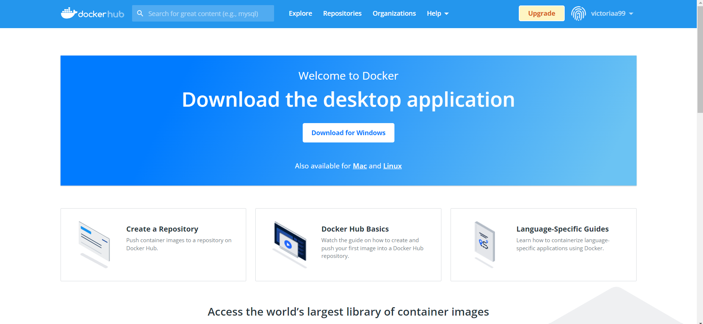


