# Sprawozdanie Lab09
## Przygotowanie wdrożeń nienadzorowanych dla platform z pełnym OS
---
### Przygotowanie systemu pod uruchomienie

Najpierw przystąpiłam do przygotowania maszyny wirtualnej wraz z pobranym przeze mnie wcześniej plikiem instalacyjnym Fedory (.iso) (z powodu zapomnienia zrobienia screena wstawiam screena ustawień)
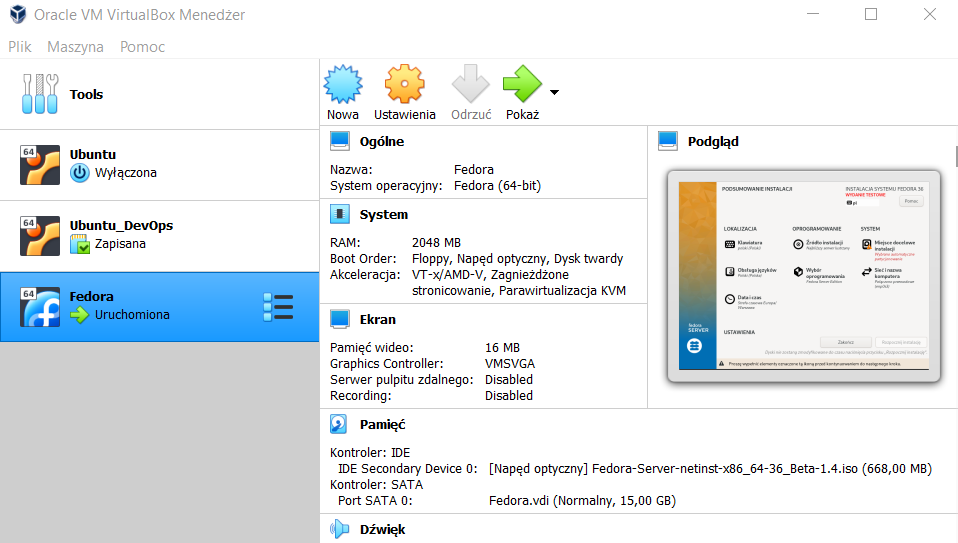

Następnie uruchomiłam instalację systemu Fedora. Pozostawiłam język jako domyślny - polski.
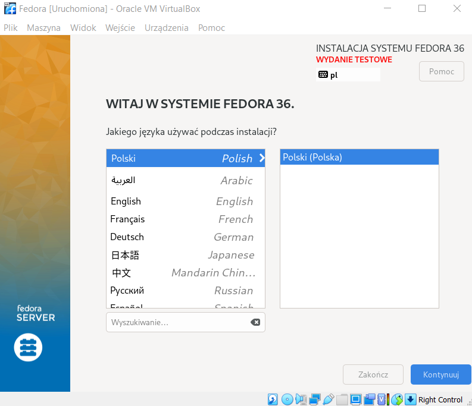

Skonfigurowałam konto roota oraz użytkownika.
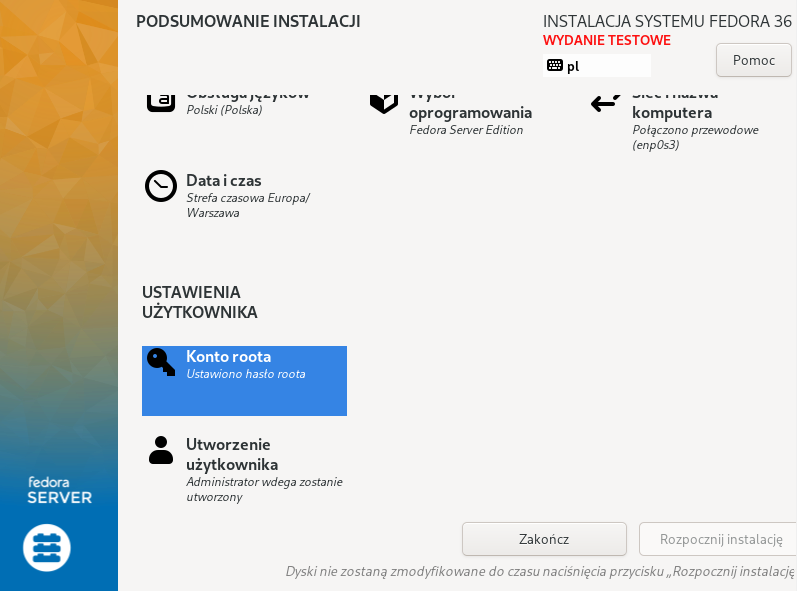
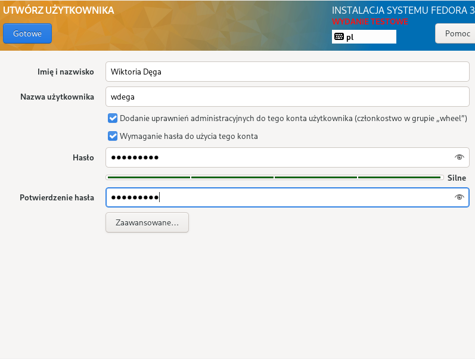
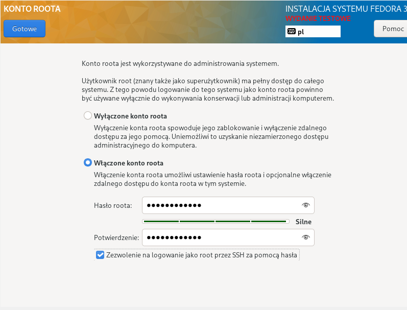

W kolejnym kroku wybrałam instalację minimalną oraz skonfigurowałam miejsce docelowe instalacji.
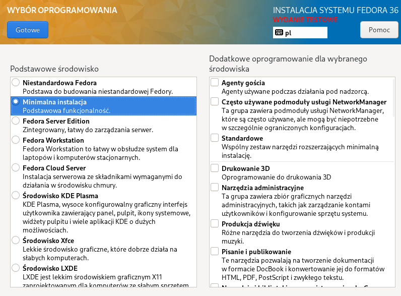
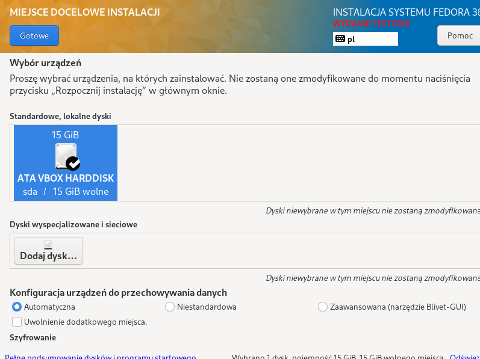
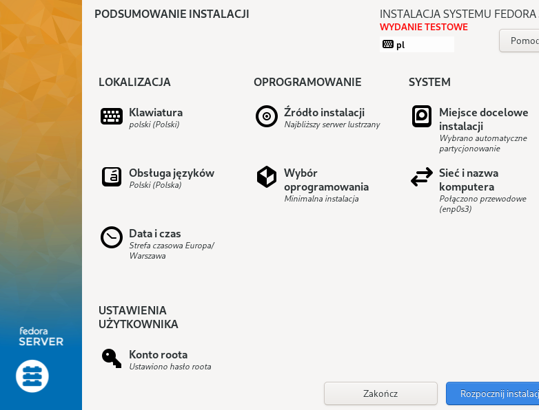

Instalacja przebiegła pomyślnie.

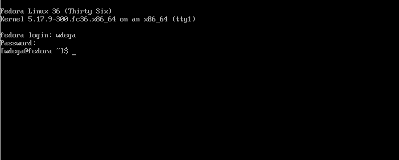

Po instalacji systemu Fedora zalogowałam się jako root, w celu dostania się do pliku odpowiedzi `anaconda-ks.cfg`.
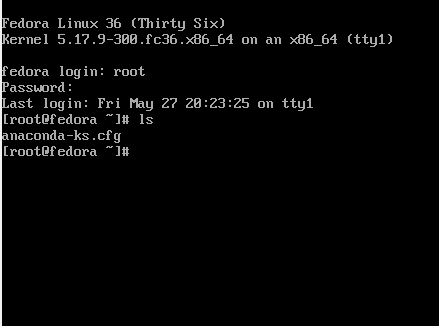

Następnie skonfigurowałam połączenie za pomocą SSH. Zaczęłam od użycia polecenia `dnf install -y openssh-server`.
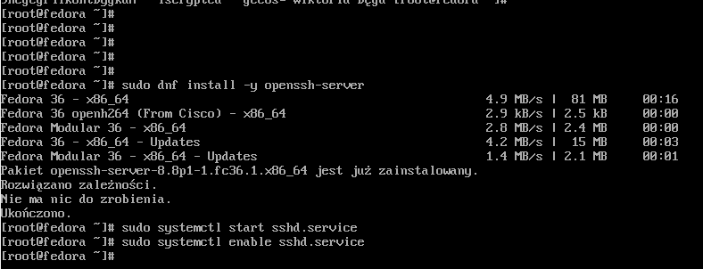

W VirtualBox ustawiłam przekierowanie portu.
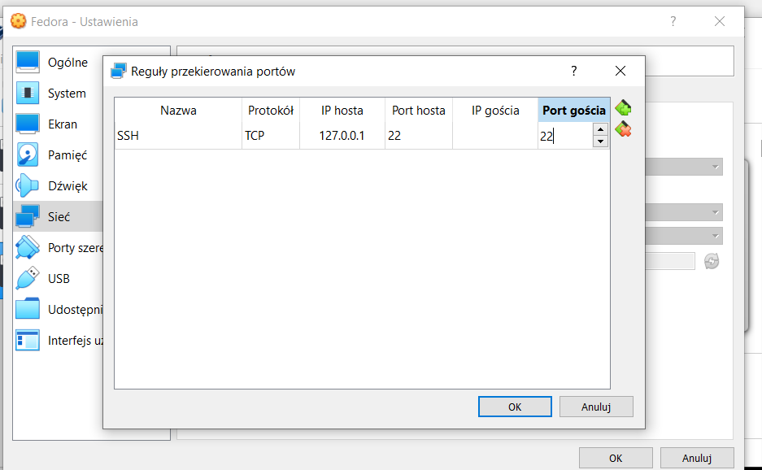
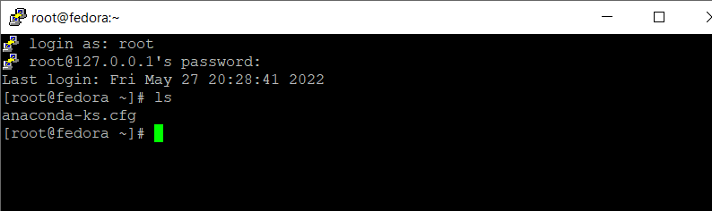

W kolejnym kroku przeszłam do instalacji drugiego systemu Fedora (serwer http). Aby spełniała swoją funkcję skonfigurowałam ją odpowiednio, za pomocą kilku poleceń znalezionych w internecie.
`dnf install httpd`
`dnf group install "Web Server"`
`systemctl start httpd`
`systemctl enable httpd`
`firewall-cmd --add-service=http --add-service=https --permanent`
`firewall-cmd --reload`

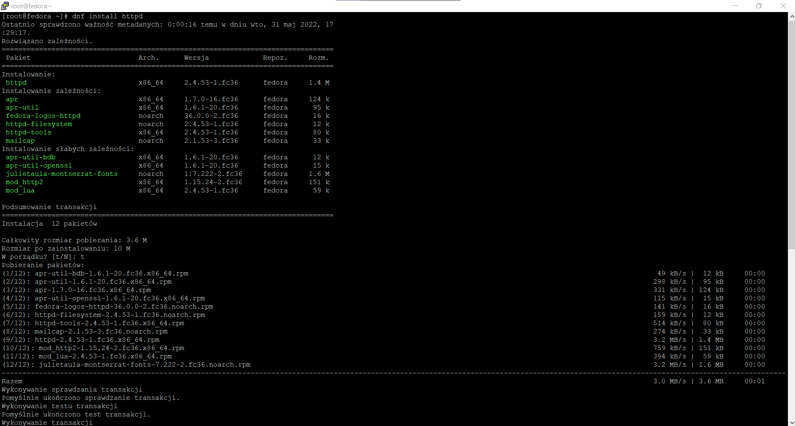
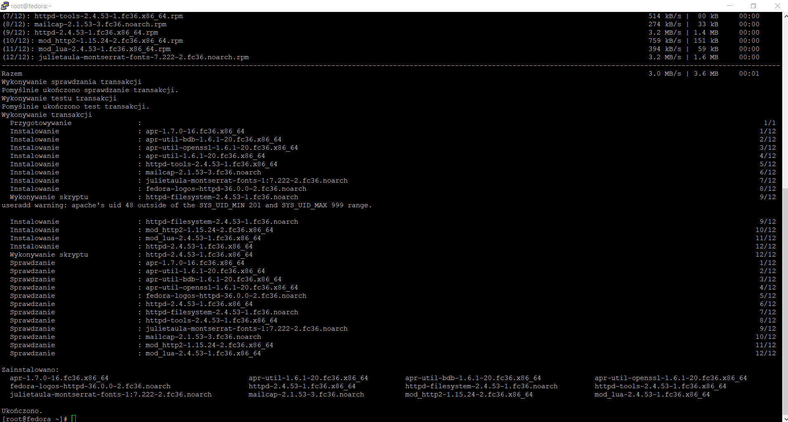
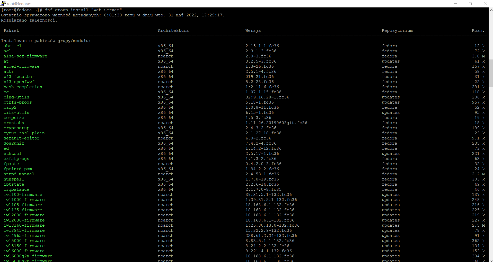
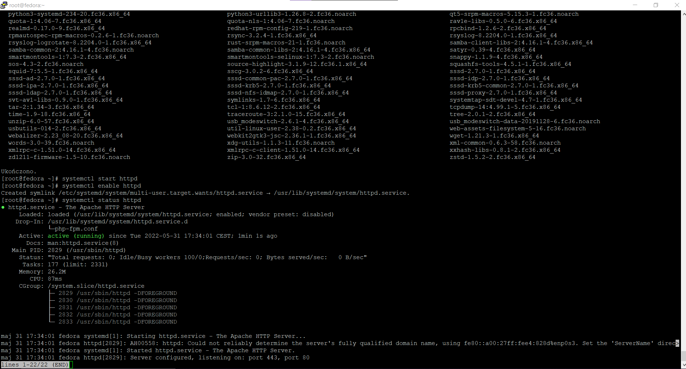
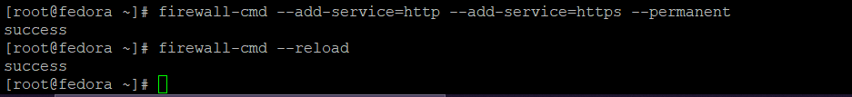

Następnie wzięłam mój artefakt z pipelinu i umieściłam w katalogu `html`
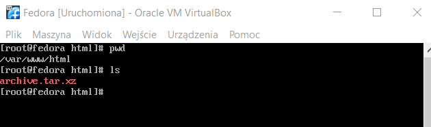

W celu potwierdzenia działania serwera hostującego:
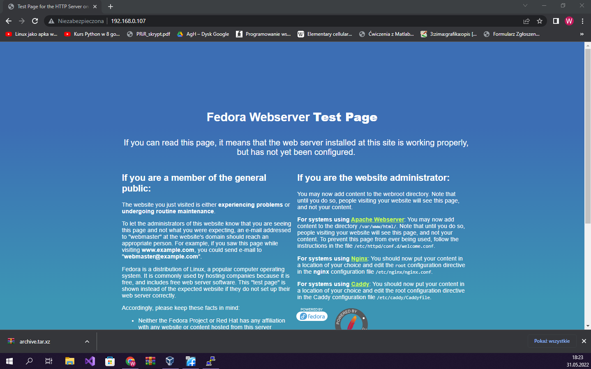

### Instalacja nienadzorowana

W tym kroku za pomocą FileZilli przeniosłam plik `anaconda-ks.cfg` na swój system Windows, w celu edycji tak jak poniżej:
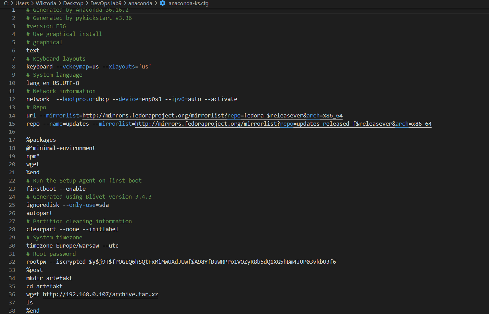

Następnie plik ten wrzuciłam na Githuba.
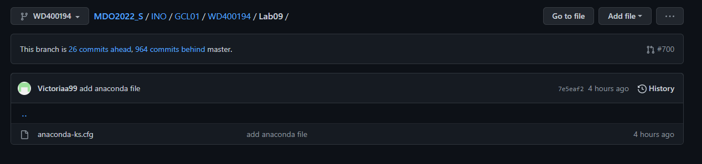

Ścieżka do tego pliku wygląda następująco:
`https://raw.githubusercontent.com/InzynieriaOprogramowaniaAGH/MDO2022_S/WD400194/INO/GCL01/WD400194/Lab09/anaconda-ks.cfg`

Moim kolejnym krokiem była instalacja Fedory, przy użyciu wyżej wspomnianej ścieżki.
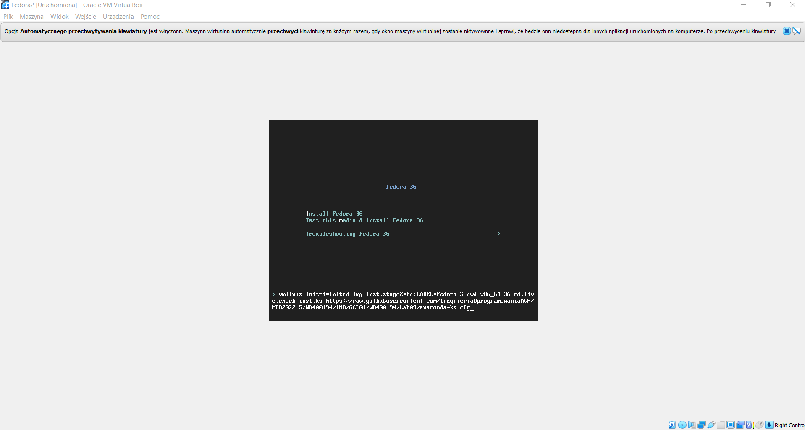

Instalacja przebiegła pomyślnie.
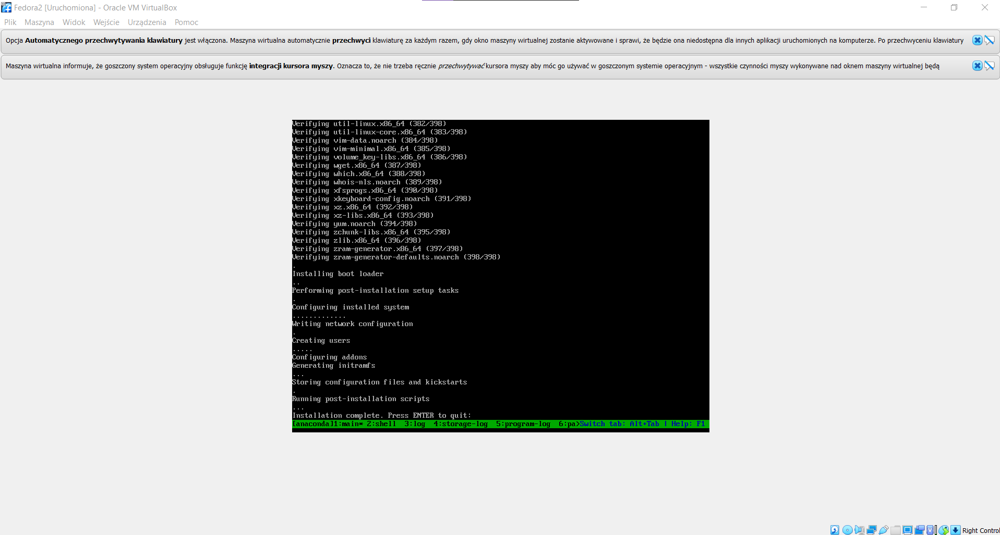

W rezultacie otrzymałam folder z pobranym wcześniej artefaktem w zainstalowanym systemie:
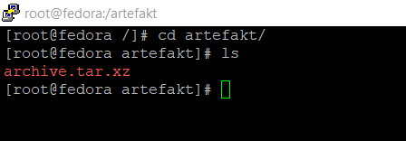
