# Sprawozdanie 02
### 21.03.22
---
Ze względu na problemy z dockerem postanowiłam zmienić SO na którym pracuję i wykonałam zadania z lab01 ponownie na postawionej VM. Repozytorium zostało sklonowane, klucz został wygenerwany, brancha nie tworzyłam nowego. 

## Opis zadań do wykonania
### 1. Przygotuj git hook, który rozwiąże najczęstsze problemy z commitami

Na samym początku znaleziono folder `.git` dzięki komendzie `ls -al`. W folderze `.git` znajduję się folder `hook`, do którego należało wejść w celu wykonania dalszych kroków. 

	

* hook sprawdzający, czy tytuł commita nazywa się ```<inicjały><numer indeksu>```
	* W celu stworzenia hook'a sprawdzającego tytuł commita, należało, skopiować plik `commit-msg.sample` i zmienić jego nazwę za pomocą kodu `cp commit-msg.sample commit-msg`. Dzięki tym działaniom uzyskaliśmy plik, w którym należało napisać odpowiedni skrypt umożliwiający sprawdzanie tytułu commita. Edycja pliku wykonana została za pomocą komendy `nano commit-msg`. 

	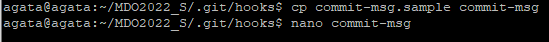
	* Kod skryptu napisano w bash
	
	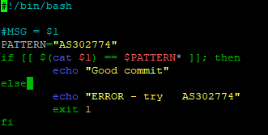

* hook sprawdzający, czy w treści commita pada numer labu, właściwy dla zadania
	* Analogiczne działania z poprzedniego podpunktu wykonano dla pliku `pre-commit.sample`. Skopiowano, zmieniono nazwę i następnie edytowano plik na skrypt w bash umożliwiający sprawdzanie czy commit zawiera w treści numer odpowiedniego labolatorium. 
	
	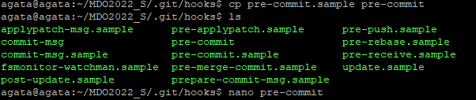
	
	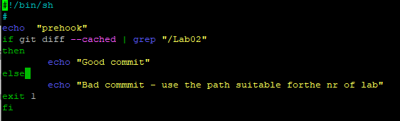


### 2. Umieść hook w sprawozdaniu w taki sposób, aby dało się go przejrzeć

W celu tworzenia testów hooków, tworzono kolejne pliki, dodawano je do śledzenia i następnie commitowano. Po commicie wyskakiwał komunikat o tym, czy commit zakończyl się sukcesem czy porażką. 
	-  TESTY HOOKów
		- Poprawny commit-msg
	
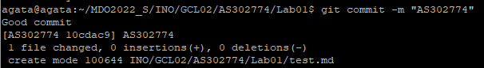
		- Poprawny pre-commit
	
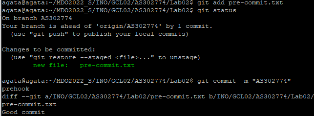
		- bledny pre-commit
			- w katalogu Lab02 stworzono plik i mimo commitu z poprawną nazwą ("AS302774"), commit był błędny. Stało się tak ponieważ warunek  pre-commita nie został spełniony. 
			
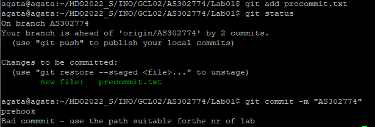
		- poprawny pre-commit i bledny commit-msg
			- edytowano plik test2 istniejacy w katalogu Lab02; commit nadano z bledna wiadomością, ale plik znajduje się w Lab02, więc ścieżka zawierała numer labolatorium. 
			
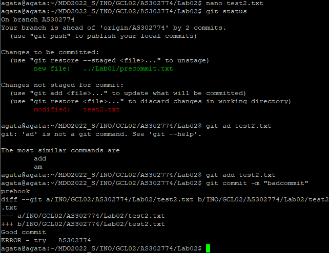

	
### 3. Rozpocznij przygotowanie środowiska Dockerowego
    * Dokumentacja udowadniająca korzystania z VM przez zdalny terminal 
	    * komendą `sudo systemctl status ssh` sprawdzono status ssh 
	    * połączono się z z VM dzięki programie Putty 
	   


 * zainstaluj środowisko dockerowe w stosowanym systemie operacyjnym
	 * zainstalowano dockera używając repozytorium:
	 1. Zainstalowano dockera korzystając z komendy `sudo apt install docker.io`
	
	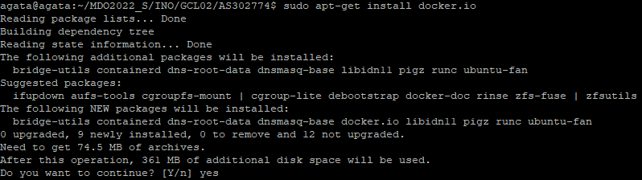
	
	 3. Zaktualizowano listy paczek z repozytorium używając komendy `sudo apt-get update`
	 4. Zainstalowano paczki pozwalające na użycie repozytorium
`sudo apt-get install \
    ca-certificates \
    curl \
    gnupg \
    lsb-release
`
 
		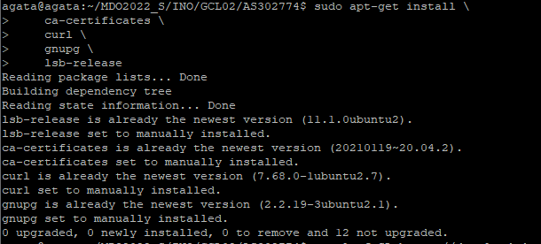
		
	 5. Dodano klucz GPG Dockera

	 6. Doprecyzowano repozytorium stable 
	 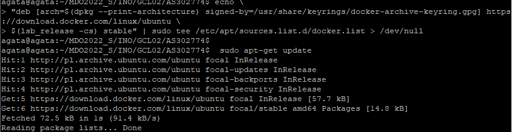
	 7. Ponownie zupdatowano i doinstalowano Docker Engine 
	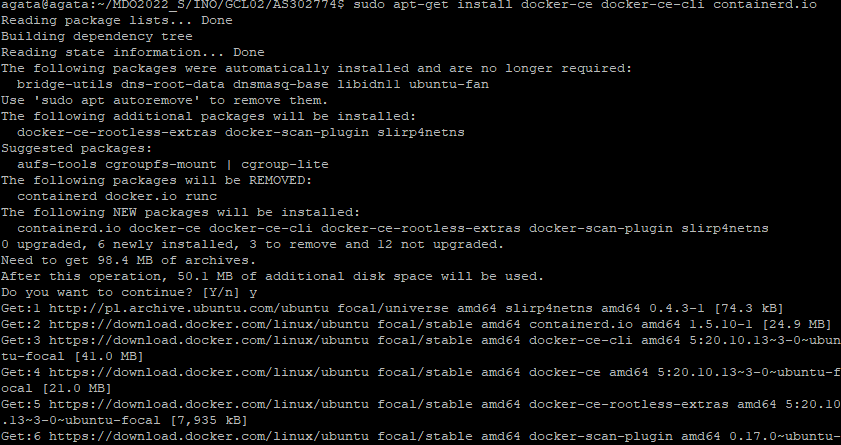
	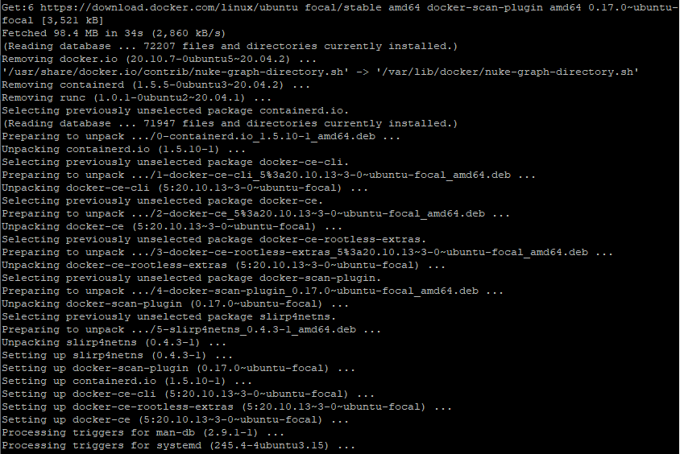
	 9. Sprawdzenie poprawnego zainstalowania Dockera używająć obrazu <hello word>
 
	 11.   Sprawdzono wersję dockera
	  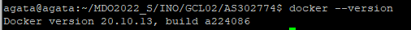 

### 4. Działanie środowiska

   * wykaż, że środowisko dockerowe jest uruchomione i działa (z definicji)
	   * uruchomiono środowisko dockera `sudo service docker start`
	    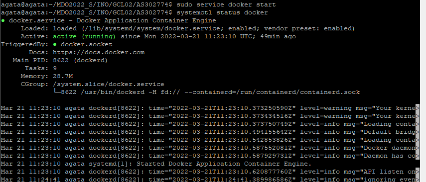
	    * wywołano także widok statusów procesów, gdzie można sprawdzićich  istnienie 
	    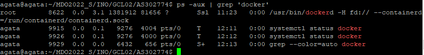
	   
    * wykaż działanie z sposób praktyczny (z własności):
      * pobierz obraz dystrybucji linuksowej i uruchom go 
	      * pobrano obraz fedory z uwagi na korzystanie z ubuntu i sprawdzono poprawność wersji obrazu 
	 
    sudo docker run fedora
    sudo docker images
    
	  
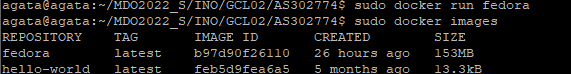
 
 * wyświetl jego numer wersji
	 * w celu wyświetlania numeru wesji skorzystano z komendy `sudo docker run -it fedora `

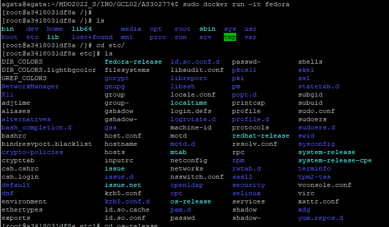
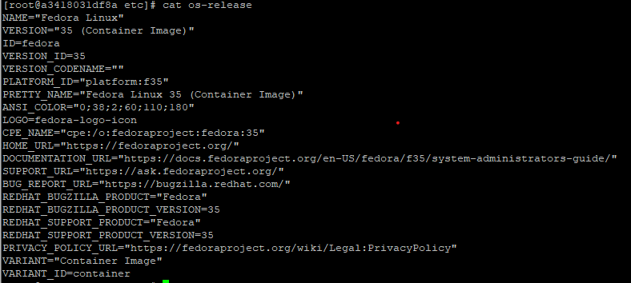

5. Załóż konto na Docker Hub
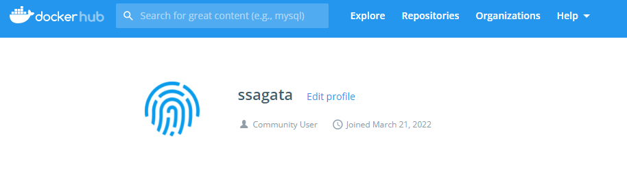
