# Sprawozdanie 02
### 28.03.22
## Opis zadań do wykonania

### Wybór oprogramowania na zajęcia
1.  Znajdź repozytorium z kodem dowolnego oprogramowania, które:
	* dysponuje otwartą licencją
	* jest umieszczone wraz ze swoimi narzędziami Makefile tak, aby możliwe był uruchomienie w repozytorium czegoś na kształt ```make build``` oraz ```make test```. Środowisko Makefile jest dowolne. Może to być automake, meson, npm, maven, nuget, dotnet, msbuild...
	* Zawiera zdefiniowane i obecne w repozytorium testy, które można uruchomić np. jako jeden z "targetów" Makefile'a. Testy muszą jednoznacznie formułować swój raport końcowy (gdy są obecne, zazwyczaj taka jest praktyka)
		*  [LINK](https://github.com/cytoscape/cytoscape.js) do repozytorium 
		* Wybrane repozytorium obsługuje renderowanie obrazów wykresów w Node.js i  posiada duży zestaw testów a językiem programowania tego repo jest JavaScript.
		 
2.  Sklonuj niniejsze repozytorium, przeprowadź build programu (doinstaluj wymagane zależności)
* repozytorium zostało sklonowane za pomocą komendy `git clone https://github.com/cytoscape/cytoscape.js.git`
 
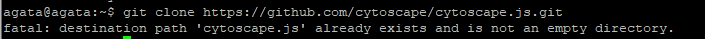

*  po skopiowaniu repozytorium oraz wejściu do niego, zaintalowano npm `npm install`, zbudowano program `npm run build ` 

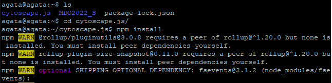


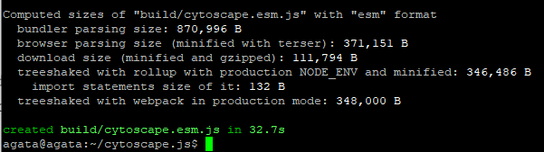

3.  Uruchom testy jednostkowe dołączone do repozytorium
* gdy pomyślnie program się zbudował, uruchomiono testy 

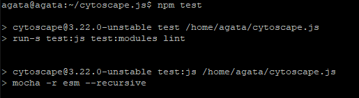

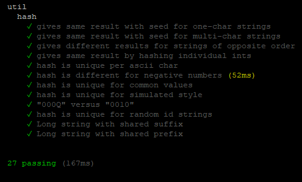


Wszystkie testy zakończyły się sukcesem. 


### Przeprowadzenie buildu w kontenerze
4. Wykonaj kroki build i test wewnątrz wybranego kontenera bazowego. Tj. wybierz "wystarczający" kontener, np ```ubuntu``` dla aplikacji C lub ```node``` dla Node.js
	* w naszym przypadku wybrano `node`
	* najpierw trzeba było go ściągnąć 

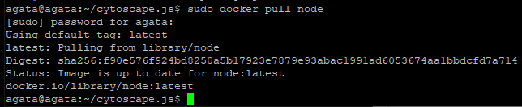

* uruchom kontener
	* za pomocą `sudo docker images` sprawdzone zostało czy `node`już pojawił się w kontenerze


* podłącz do niego TTY celem rozpoczęcia interaktywnej pracy
	* wcześniej wspomniano iż kontenerem, którego użyto w tym zadaniu jest `Node` i aby uruchomić interaktywny terminal użyto przełącznika `-it`. W tej linijce wydano również komendę, dzięki której można pisać w terminalu w shellu a nie w domyślnym node. 

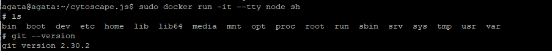

* zaopatrz kontener w wymagania wstępne (jeżeli proces budowania nie robi tego sam)
* sklonuj repozytorium
	* w tym celu należało ponownie użyć komendy `git clone` a następnie zainstalować npm 

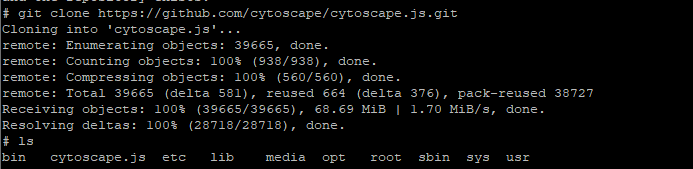

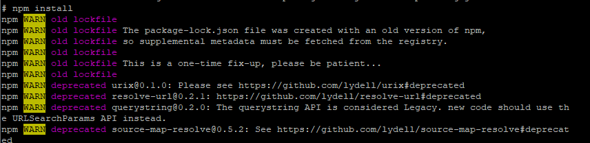


* uruchom build
	* analogicznie do pierwszego zadania zbudowano i przetestowano program, natomiast tym razem wszystkie czynności odbyły się bezpośrednio w kontenerze

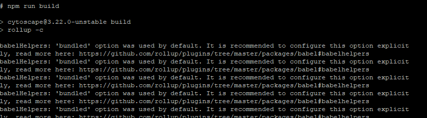


* uruchom testy

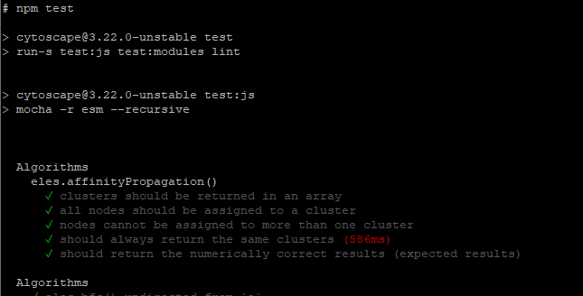

 *  wszystkie testy również przebiegły pomyślnie 

5. Stwórz dwa pliki Dockerfile automatyzujące kroki powyżej, z uwzględnieniem następujących kwestii
* Kontener pierwszy ma przeprowadzać wszystkie kroki aż do builda
* Kontener drugi ma bazować na pierwszym i wykonywać testy
	* Kontenery stworzono za pomocą komendy `touch file1.dockerfile` oraz `touch file2.dockerfile`z rozszerzeniem właśnie dockerfile. Pliki te edytowano wpisując skrypt wykonujące odpowiednio: w pliku pierwszym klonowanie, instalację npm  i budowanie programu, a w drugim pliku testowanie programu bazując na obrazie powstałego dzięki file1.dockerfile.  Obrazowi powstającemu wskutek pracy `file1`, nadano nazwę `image`, a obraz powstały na skutek pracy `file2` -`image2`. 


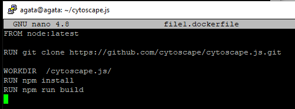


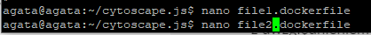


6. Wykaż, że kontener wdraża się i pracuje poprawnie. Pamiętaj o różnicy między obrazem a kontenerem. Co pracuje w takim kontenerze?
	* w takim kontenerze pracuje program, natomiast jest on odizolowany od zewnętrznego systemu 

Screeny świadczące o sprawdzeniu i poprawnym działania dockerfile. 

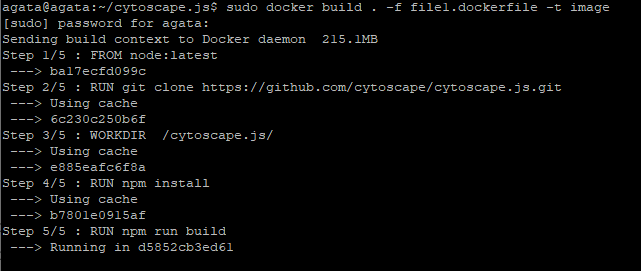


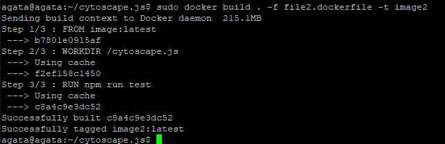

Wszystkie kroki ponownie powtórzone zostały wykonane bezbłędnie, co prawda pojawiły się w trakcie wykonywania tego labolatorium pewne problemy ale ostatecznie udało się wykazać porawność wykonania zadania dzięki komendzie `sudo docker ps -a`


