# Sprawozdanie 04

### 04.04.22

# Opis zadań do wykonania

### Zachowywanie stanu

##### Przygotuj woluminy wejściowy i wyjściowy, o dowolnych nazwach, i podłącz je do kontenera bazowego, z którego rozpoczynano poprzednio pracę
- tworze volumeny 
`docker volume create volume1`
`docker volume create volume2`

- sprawdzam i widzę, że istnieją
`docker volume ls`

##### Uruchom kontener, zainstaluj niezbędne wymagania wstępne (jeżeli istnieją), ale *bez gita*
- tworze nowy dockerfile i uruchamiam kontener bazowy
1. jako bazę wybieram kontener alpine, czyli bazową dystybucję linuxa wewnątrz kontenera dockerowego
`docker run -it alpine:latest`
2. upewniam się, że dany kontener nie ma git'a 

3. Mając już bazę (kontener bez gita oraz dwa volumeny, uruchamiam kontener, podłączając niego oba volumenty za pomocą flagi -v podając nazwę mojego volumenu oraz miejsce gdzie chcę go zamontować ".._incontainer", oraz przechodzę do jego terminala z pomocą flagi -it)
`docker run -it -v volume1:/volume1_incontainer -v volume2:/volume2_incontainer alpine:latest`

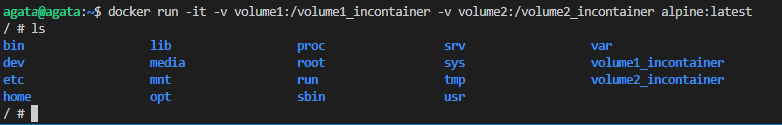

##### Sklonuj repozytorium na wolumin wejściowy
1. musimy wiedziec jaka jest sciezka do naszego volumenu

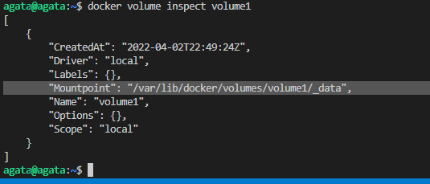

oraz tam pobrac uzywajac naszego komputera dane repozytorium
`docker volume inspect volume1`

wiemy gdzie jest, jest w `/var/lib/docker/volumes/volume1/_data`,
więc tam przechodzimy - `cd /var/lib/docker/volumes/volume1/_data`.
dostajemy `bash: cd: /var/lib/docker/volumes/volume1/_data: Permission denied`
wiec przejdziemy tam jako super user
`sudo su`
`cd /var/lib/docker/volumes/volume1/_data`
Klonujemy repo:

`git clone https://github.com/cytoscape/cytoscape.js`

2. wlaczamy ponownie kontener i widzimy, 

że mamy dostęp do repozytorium, mimo iż nie pobraliśmy go w kontenrze, a podaliśmy volumenem
`docker run -it -v volume1:/volume1_incontainer -v volume2:/volume2_incontainer alpine:latest`

##### Uruchom build w kontenerze
- nie było npm'a więc trzeba było go zainstalować
`apk add nodejs npm`

Zbudowanie repozytorium w naszym obrazie bez gita:

##### Zapisz powstałe/zbudowane pliki na woluminie wyjściowym
- Kopiujemy nasze repozytorium z naniesionymi zmianami do drugiego volumenu

`ls volume1_incontainer/`
`ls volume2_incontainer/`
`cp -R volume1_incontainer/* volume2_incontainer/`

### Eksportowanie portu

##### Uruchom wewnątrz kontenera serwer iperf (iperf3)

-  Potrzebujemy obrazu z serwerem iperf3, networkstatic/iperf3 wybieramy znaleziony w internecie
Z dokumentacji dowiaduje się, że port na któym będziemy oczekawiwać na ruch to 5201, więc za pomocą flagi -p wprost przekazuję żeby został opulikowany w moim komputerze
`docker pull networkstatic/iperf3`

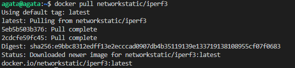

oraz 
`docker run  -it --rm --name=iperf3-server -p 5201:5201 networkstatic/iperf3 -s`

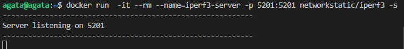

Na zrzucie widzimy, że serwer słucha na porcie 5201.

##### Połącz się z nim z drugiego kontenera, zbadaj ruch
- w celu połączenia się z nim z drugiego komputera najpierw sprawdzono, czy na pewno serwer nasłuchuje za pomocą komendy 

`sudo netstat -utnpa | grep LISTEN`

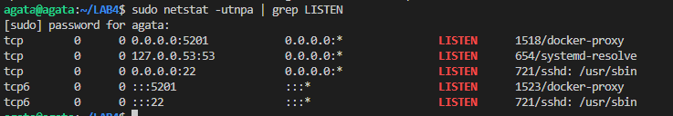

Następnie podłączam się do kontenera.
Najpierw przypominam sobie IP dla dockera i uruchamieam kontener. 
Badanie ruchu przeprowadzałam dla czasu 30s. 

`docker run -it --rm networkstatic/iperf3 -c 172.17.0.2 --time 30`

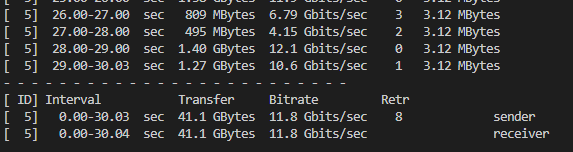

##### Połącz się spoza kontenera (z hosta i spoza hosta)

- w celu połączenia sie spoza hosta i zrobić testy ruchu najpierw należało pobrać iperf3 na windowsa. Pobrano go z internetu. 
Mając już serwer iperf3 na windowsie, za pomocą komendy 
`iperf-3.1.3-win64>iperf3.exe -c 127.0.0.1 --time 30`
połączono się z kontenerem na porcie 5201. 

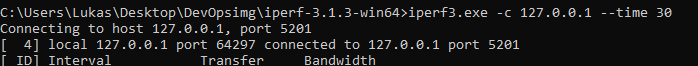

- podczas próby połączenia z hosta, wystąpiły pierwsze problemy z pamięcią. 
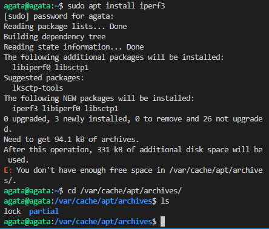

Problem został rozwiązany na zajęciach dzięki odpowiedniemy ustawieniu partycji. 
Partycja to rodzaj woluminu, partycja wydziela logiczny obszar dysku twardego i bez jej rozciągnięcia nie było możliwe zwiększenie pamięci przez same ustawienia dysku w Virtual Boxie. 

- Po rozwiązaniu problemu z pamięcią, pobrano iperf3 i połączono się z hosta. 
`sudo apt-get install iperf3`

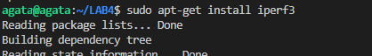

`sudo iperf -c 172.17.0.2 --time 30`

Wyniki: 

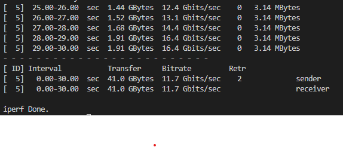

##### Przedstaw przepustowość komunikacji lub problem z jej zmierzeniem (wyciągnij log z kontenera)

`sudo docker logs ef2932c27bbb`

Z uwagi na to, że screeny są nieczytelne, to zrobiłam porównanie w tabeli. 

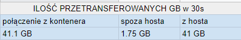

### Instancja Jenkins

##### Zapoznaj się z dokumentacją  https://www.jenkins.io/doc/book/installing/docker/

- zapoznano się z dokumentacją i kolejne kroki wykonywano właśnie zgodnie z nią 

##### Przeprowadź instalację skonteneryzowanej instancji Jenkinsa z pomocnikiem DIND

- tworze nową sieć dockerową 
`docker network create jenkins`

- w celu wywoływania dockera w jenkins, należało zainstalować docker:dind używając komendy: 

` docker run \
  --name jenkins-docker \
  --rm \
  --detach \
  --privileged \
  --network jenkins \
  --network-alias docker \
  --env DOCKER_TLS_CERTDIR=/certs \
  --volume jenkins-docker-certs:/certs/client \
  --volume jenkins-data:/var/jenkins_home \
  --publish 2376:2376 \
  docker:dind \
  --storage-driver overlay2 `

- W celu edycji obrazu stworzono dockerfile 
`touch Dockerfile`

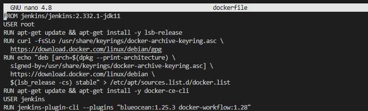

oraz uruchamiam builda 
`sudo docker build -t myjenkins-blueocean:2.332.1-1 . `

- po zbudowaniu obrazu, uruchomiono obraz jako kontener 

docker run \
  --name jenkins-blueocean \
  --rm \
  --detach \
  --network jenkins \
  --env DOCKER_HOST=tcp://docker:2376 \
  --env DOCKER_CERT_PATH=/certs/client \
  --env DOCKER_TLS_VERIFY=1 \
  --publish 8080:8080 \
  --publish 50000:50000 \
  --volume jenkins-data:/var/jenkins_home \
  --volume jenkins-docker-certs:/certs/client:ro \
  myjenkins-blueocean:2.332.1-1 

I następnie sprawdziliśmy za pomoca `sudo docker ps`  czy jenkins działa.

I działa!

##### Zainicjalizuj instację, wykaż działające kontenery, pokaż ekran logowania

- w przegladarce wpisano `localost:8080` 

- w celu znalezienia hasła najpierw sprawdzono container ID a następnie odczytano to hasło i wprowadzono w odpowiednie miejsce w przeglądarce

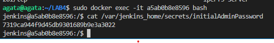

Po zakończeniu instaluje wszystkie sugerowane wtyczki i udowadniam, że kontenery działają poprawnie. 

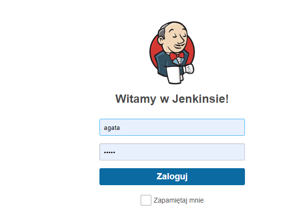

