# Sprawozdanie z projektu

Celem projektu było zapoznanie się z działaniem Jenkins Pipeline, czyli narzędziem ułatwiającym ciągłą integrację, dostarczanie i wdrażanie.  

## Skonfigurowanie Jenkins i DIND

Instalacja Jenkinsa została wykonana zgodnie z  [dokumentacją](https://www.jenkins.io/doc/book/installing/docker/) na poprzednich zajęciach. 
Do uruchomienia kontenerów użyto komend: 

`docker run \
  --name jenkins-docker \
  --rm \
  --detach \
  --privileged \
  --network jenkins \
  --network-alias docker \
  --env DOCKER_TLS_CERTDIR=/certs \
  --volume jenkins-docker-certs:/certs/client \
  --volume jenkins-data:/var/jenkins_home \
  --publish 2376:2376 \
  docker:dind \
  --storage-driver overlay2 `

`docker run \
  --name jenkins-blueocean \
  --restart=on-failure \
  --detach \
  --network jenkins \
  --env DOCKER_HOST=tcp://docker:2376 \
  --env DOCKER_CERT_PATH=/certs/client \
  --env DOCKER_TLS_VERIFY=1 \
  --publish 8080:8080 \
  --publish 50000:50000 \
  --volume jenkins-data:/var/jenkins_home \
  --volume jenkins-docker-certs:/certs/client:ro \
  myjenkins-blueocean:2.332.3-1`

Poniżej przedstawiam screen z potwierdzenia prawidłowego działania obu kontenerów. 

## Pliki Dockerfile
Do działania projektu było potrzebne stworzenie odpowiednich plików Dockerfile. Pliki te zostały stworzone na mojej  gałęzi AS303774 w folderze Lab05. 
Pliki Dockerfile użyto, ponieważ dzięki nim można bardziej dostosować środowisko wykonawcze. Pipeline umożliwia budowanie i uruchamianie kontnera z pliku Dockerfile w repozytorium źródłowym.

### file1. dockerfile - build
Pierszy plik odpowiedzialny jest za build naszego programu

### file2.dockerfile - test
Drugi dockerfile służy odpaleniu testu 

### file3.dockerfile - deploy
Trzeci plik odpowiedzialny jest już za deploy odpowiednieego pliku wykonawczego

### file4.dockerfile - publish
Ostatni plik dockerfile służy wydaniu nowego programu. Wykonano za pomocą zapakowania zawartości woluminu. 
 
### jenkinsfile

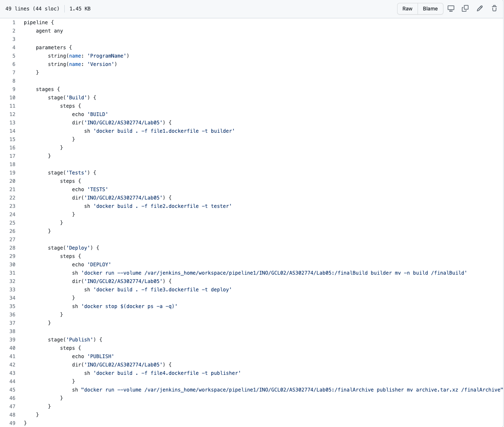

## Stworzenie Pipeline wewnątrz Jenkinsa

Aby wykonać zadanie należało wcześniej stworzyć nowu obiekt projektowy pipeline ( u mnie o nazwie pipeline1). 
Krok ten wykonano poprzez wejście na localhost:8080  i zalogowanie się na swoje konto. 
Nowemu projektowi *pipeline1* zostały nadane dwaa parametry tekstowe - **ProgramName** oraz **Version**.

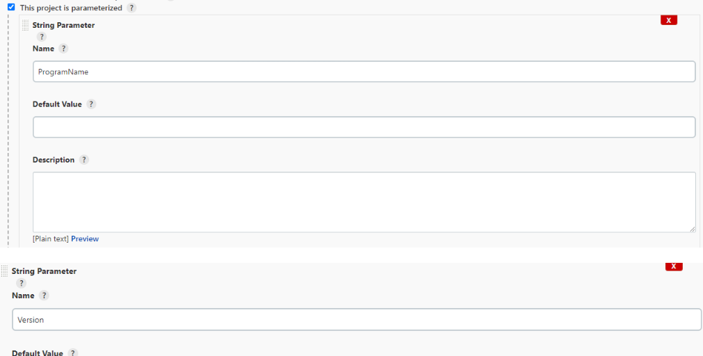

Po dodaniu parametrów należało ustawić definicję pipeline na ***Pipeline script from SCM*** a następnie ustawić repozytorium źródłowe. 

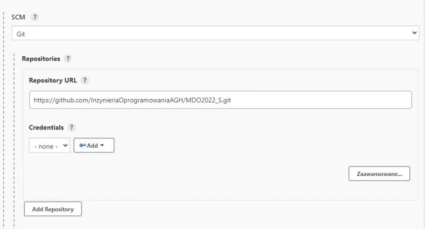

Żeby Jenkins działał na naszym repozytorium i pobierał odpowiednie pliki Dockerfile i Jenkinsfile, należało podać ścieżkę do naszego repozytorium i naszego brancha. Na końcu też oczywiście została podana ścieżka do Jenkinsfile. 

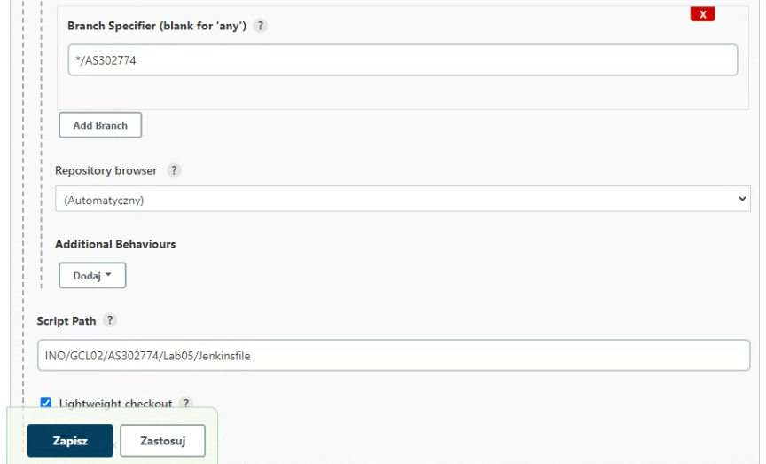

### Kroki Pipeline

1. **Build**

Obraz **builder** tworzymy na podstawie obrazu **node**. 
Za ten krok odpowiedzialny jest wcześniej wspomniany plik file1.dockerfile oraz część kodu w Jenkinsfile. 
Dockerfile zawiera w sobie sklonowanie repozytorium z naszym projektem, następnie przechodząc do folderu z projektem instalowany jest npm `npm install` oraz tworzone zbuildowane pliki   - `npm run build`. 

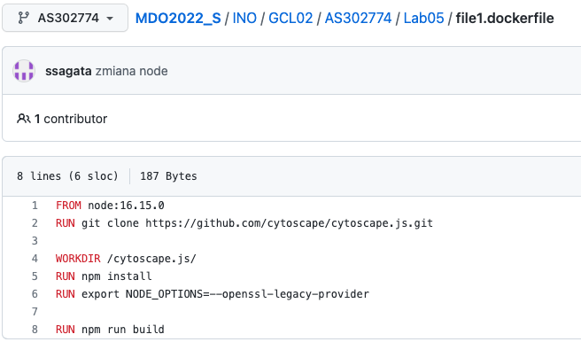

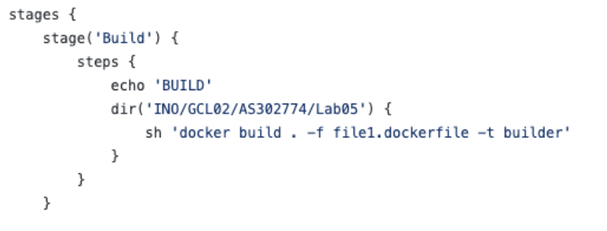

W tym kroku pojawiły się problemy, dlatego zmieniono wersję node z 18 na 16. 
W tym celu w konsoli w Jenkinsie, za pomocą komendy `docker run nod:16.15.0`zmieniono wersję node. 

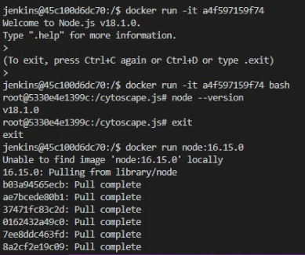

2. **Test**
Obraz **test** tworzony jest na podstawie obrazu **builder** z poprzedniego kroku. 
Test odpowiada za przeprowadzenie testów sprawdzających odpowiednie działanie programu. 
W pliki Dockerfile, podajemy stworzony obraz builda, następnie przechodzimy do nasego projektu i uruchamiamy testy. 

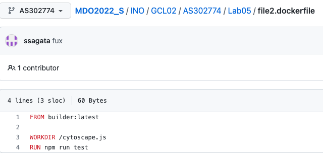

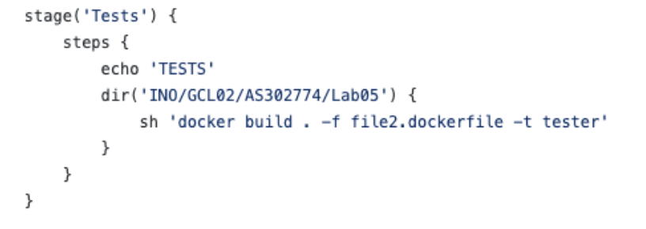

3. **Deploy**
Do tego kroku potrzebne było wykonanie kroku **build**, dzięki któremu otrzymaliśmy zbuildowane pliki programu. 

Krok **deploy** krok po kroku: 

W Dockerfile:
- krok ten wykonywany jest na obrazie node, więc go podajemy, 
- kopiujemy zbuildowane pliki 
- uruchamiamy plik wykonawczy cytoscape.min.js 
W Jenkinsfile:
- uruchomienie obrazu buildera z woluminem znajdującym się w Jenkinsie razem ze sklonowanym repozytorium 
- stworzenie obrazu deploy 

Widzimy, że nasz plik wykonał się poprawnie.  

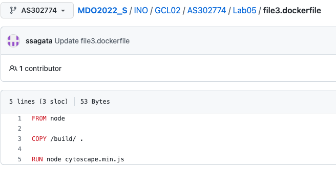

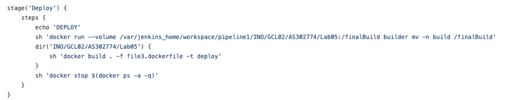

4. **Publish**
Ostatnim krokiem było wypromowanie nowego wydania programu. 
Krok ten został wykonany drogą alternatywną, czyli zawrtość woluminu spakowano do pliku TAR.XZ a następnie odpalono obraz publish. 

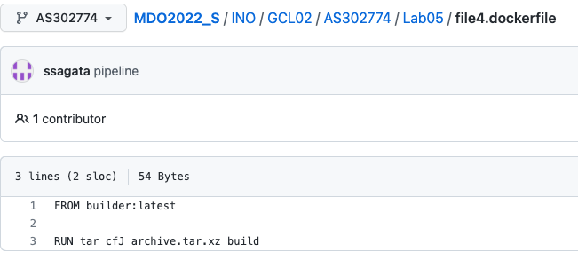

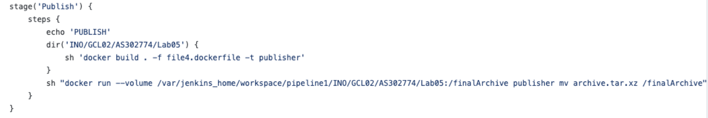

Poniżej zrzuty ekranu potwierdziające działanie pipeline'u. 

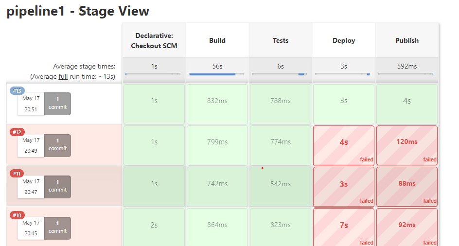

