# Sprawozdanie 9
# Agata Socha Inżynieria Obliczeniowa GCL02

## Przygotowanie systemu pod uruchomienie

1. Przeprowadzono instalacje systemu Fedora w VM i odpowiednio skonfigurowano. 

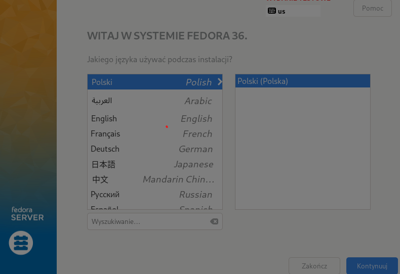

Stworzono usera użytkowniaka i roota

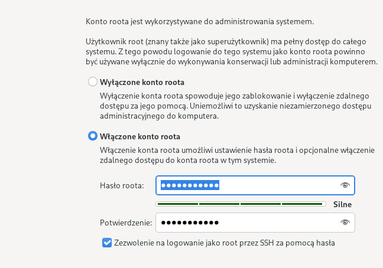

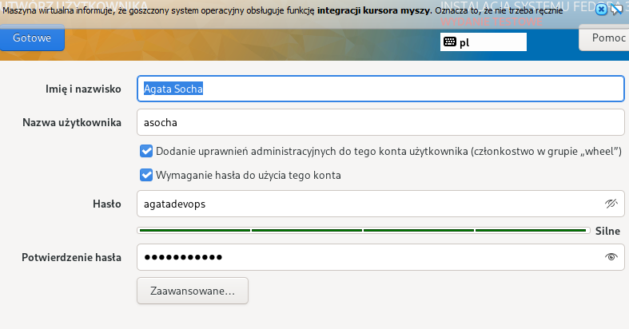

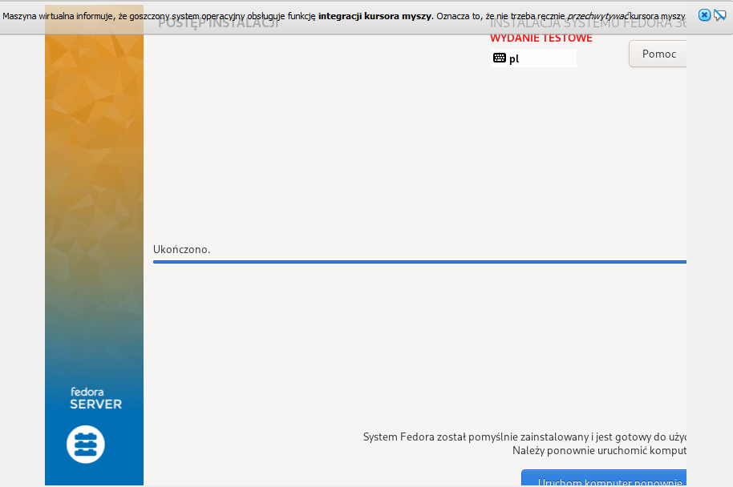

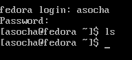

Po zainstalowaniu Fedory, sprawdzono, czy powstał odpowiedni plik anaconda - i powstał - oto dowód:

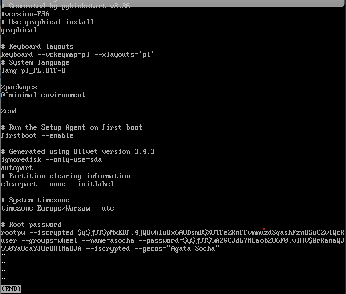

2. Kolejnym krokiem było zainstalowanie drugiej Fedory. W celu odpowiednij konfiguracji wykonano poniższe komendy: 

  sudo dnf install httpd
  sudo dnf group install "Web Server"
  sudo systemctl start httpd
  sudo systemctl enable httpd
  sudo firewall-cmd --add-service=http --add-service=https --permanent
  sudo firewall-cmd --reload
  
  

 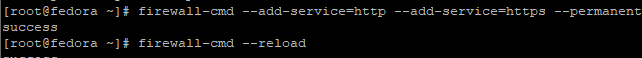
 
 
 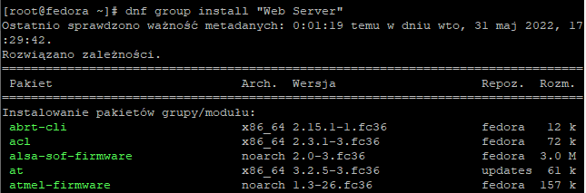
 
 
  
  
 
 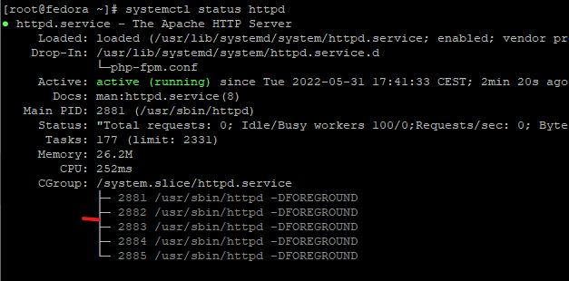
 
 
 
 
 
 
 3. Następnie wrzuciłam mój plik z Pipeline do serwera za pomocą FileZilli i sprawdzono działanie -> tutaj niestety zapomniałam zrrobić screenka ale pięknie wszystko działało więc przeszłam do dalszych kroków. 

4. A tym następnym krokiem była instalacja nienadzorowana. Na początku też za pomocą FileZilli przeniosłam plik anaconda-ks.cfg do miejsca lokalnie żeby łatwo edytowaać kod: 

 

Plik ten można znaleźć na githubie, bo właśnie linka z githubaa wykorzystano do instalacji Fedory. 

 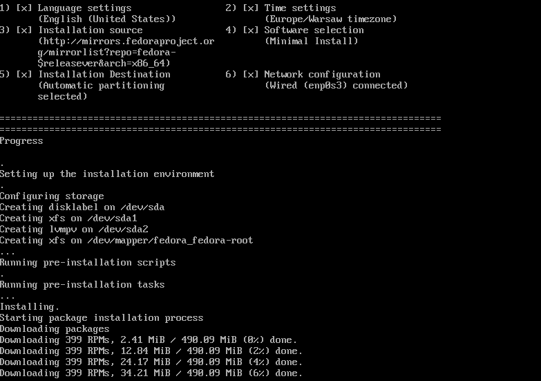
 
 
 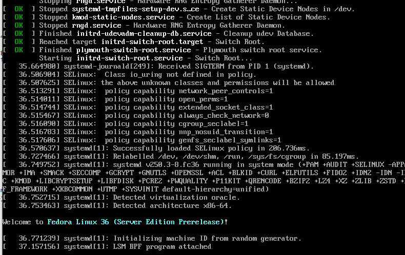
  
  
 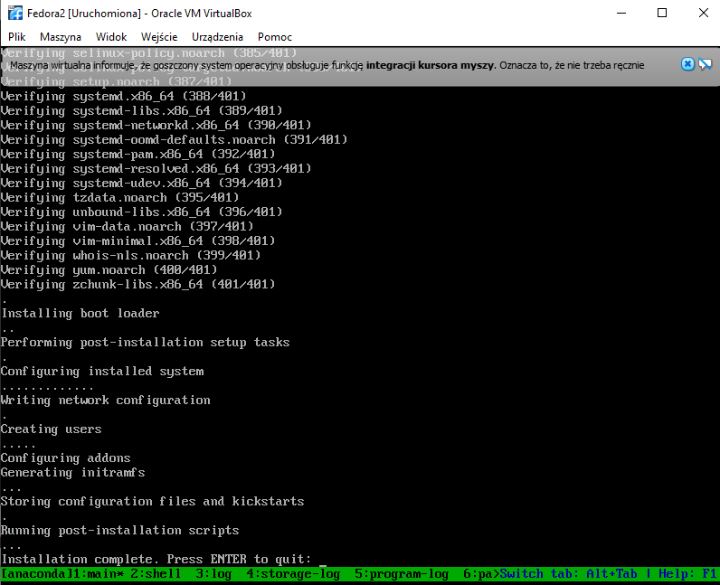
 
 
 Po sukcesie instalacji nienadzorowanej otrzymano artefakt w odpowiednim folderze (stworzynym ofc w pliku anaconda-ks.cfg
 
  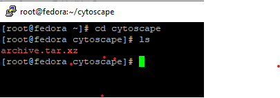

