# Sprawozdanie - lab_01
## Gerard Skomin
### 1. Instalacja Git'a i obsługi kluczy SSH
* Instalacja Git'a  
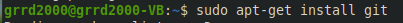
* Sprawdzenie wersji  
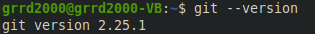
### 2. Klonowanie repozytorium za pomocą HTTPS  
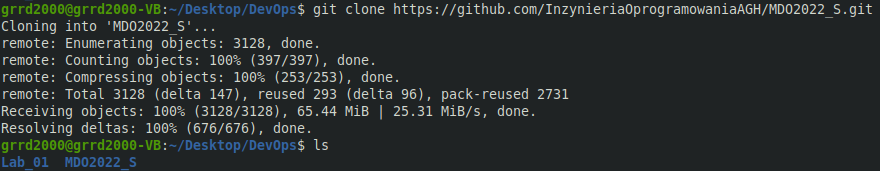
### 3. Klonowanie z wykorzystaniem utworzonego klucza SSH
* Wygenerowanie klucza **SSH ed25519**  
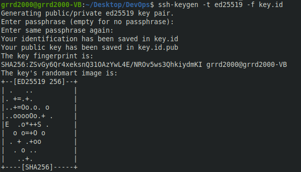
* Wygenerowanie klucza **SSH ECDSA** zabezpieczonego hasłem  
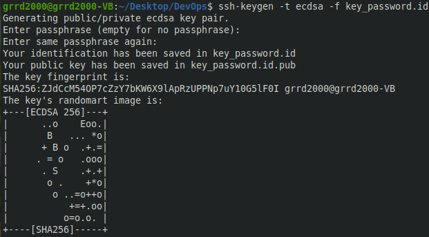
* Dodanie wygenerowanego klucza do konta GitHub
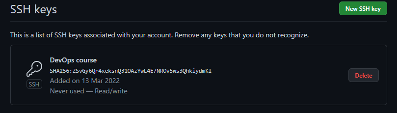
* Dodanie klucza do SSH  
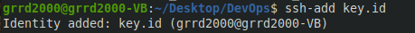
* Klonowanie repozytorium za pomocą SSH  
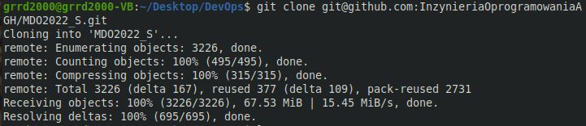
### 4. Przełączanie się między gałęziami
* Przejście na gałąź **main**  
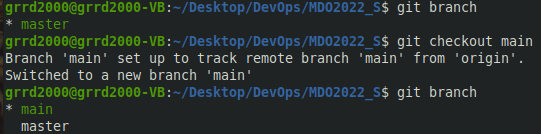
* Przełączenie się na gałąź **INO-GCL02**  
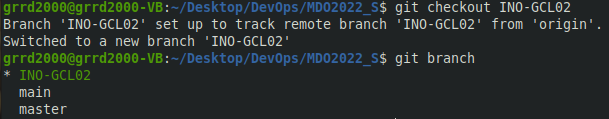
### 5. Tworzenie własnej gałęzi o nazwie **GS403353**  
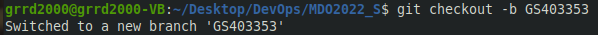
### 6. Praca na nowej gałęzi
* Utworzenie własnego katalogu o nazwie **GS403353**  
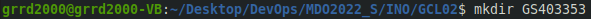
* Utworzenie podkatalogu **Lab01**  
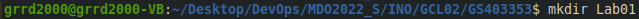