# Sprawozdanie - lab_02
## Gerard Skomin
### 1. & 2. Przygotowanie git hook'a i umieszczenie go w sprawozdaniu
* Sprawdzanie zgodności tytułu commit'a  
  * Kod w **bash'u**  
    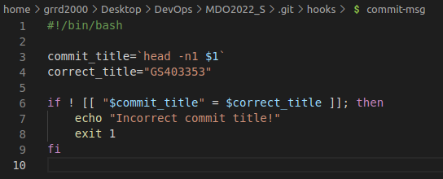
  * Sprawdzenie działania  
    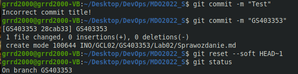
* Sprawdzanie odpowiedniej treści commit'a

### 3. Przygotowanie środowiska Docker
* Konfiguracja środowiska do obsługi środowiska Docker'owego
  * Doinstalowywanie narzędzi  
    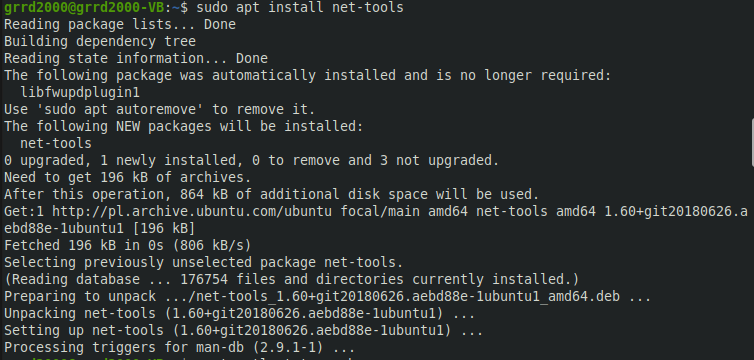  
    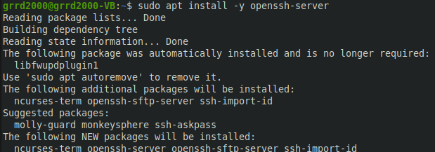  
  * Działanie SSH  
    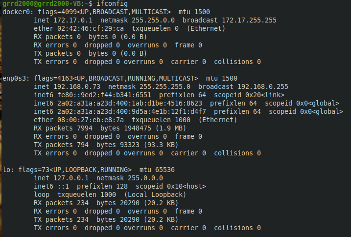
    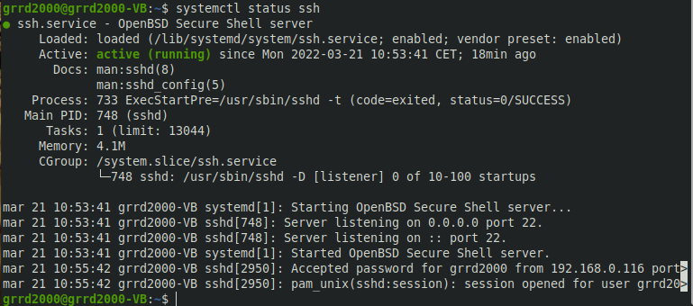  
    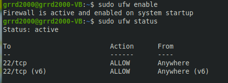  
  * Połączenie systemu Windows z virtualką Ubuntu  
    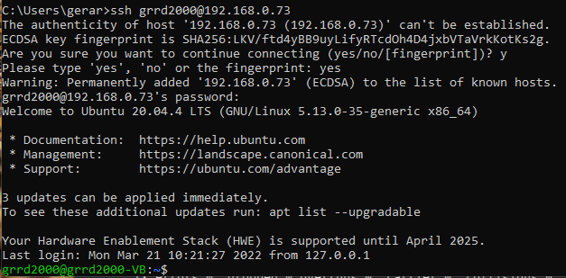
* Instalacja Docker'a - wykonanie poszczególnych kroków z dokumentacji dla Ubuntu: https://docs.docker.com/engine/install/ubuntu/    
  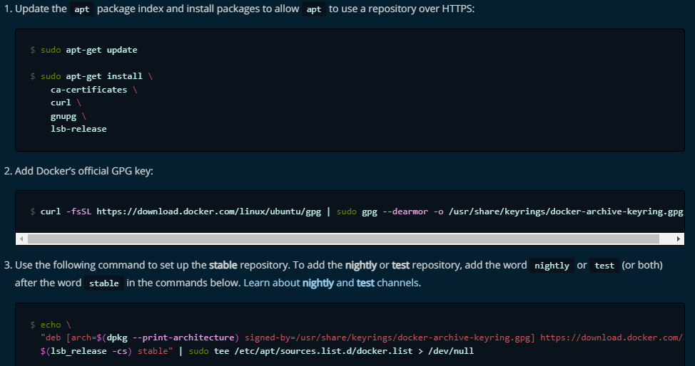  
  ```bash
  sudo apt-get update
  sudo apt-get install docker-ce docker-ce-cli containerd.io
  ```

### 4. Działanie środowiska
* Wykazanie działania z definicji - działanie deamon'a dockerowego, listowanie obrazów, uruchomienie obrazu `hello-world`  
  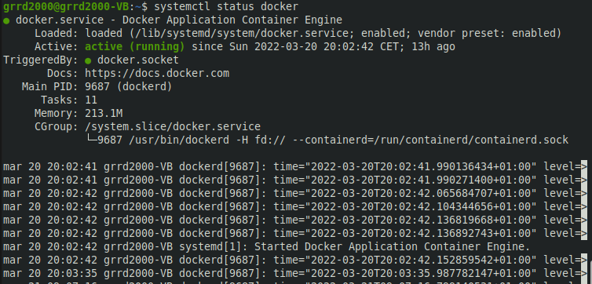  
  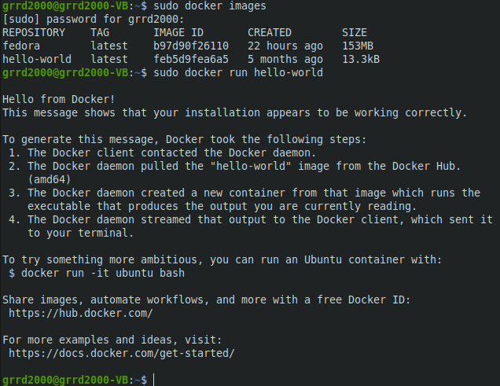
* Wykazanie działania z własności
  * Pobranie obrazu **Fedory** i jej uruchomienie  
    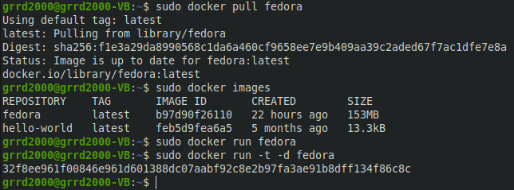
  * Wyświetlenie numeru wersji poprzez interaktywną komunikację z kontenerem  
    
    

### 5. Założenie konta na Docker Hub  
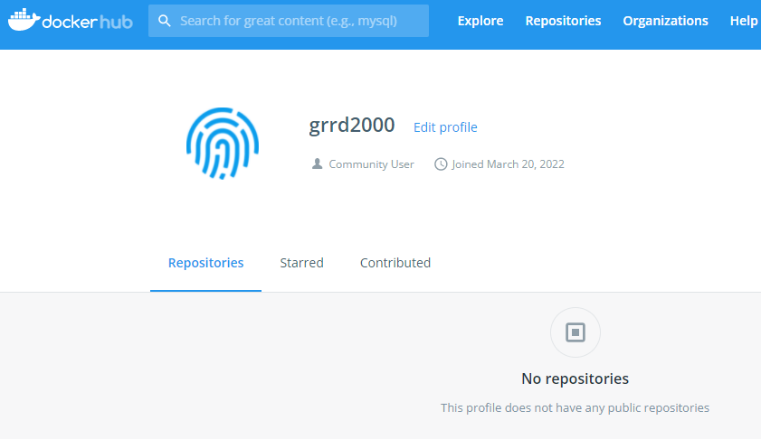