# Sprawozdanie - lab_02
## Gerard Skomin
### 1. Wybór oprogramowania na zajęcia
* Wybranym oprogramowaniem na potrzeby zajęć jest program z repozytorium:  https://github.com/mevdschee/2048.c  
* Spełnia ono następujące wymagania:
  - dysponuje otwartą licencją
  - umieszczone jest wraz z potrzebnymi narzędziami **Makefile**
  - zawiera testy, które można uruchomić przy pomocy Makefile'a, które formułują jednoznaczny raport końcowy  
* Oprogramowanie napisane jest głównie w języku C.  
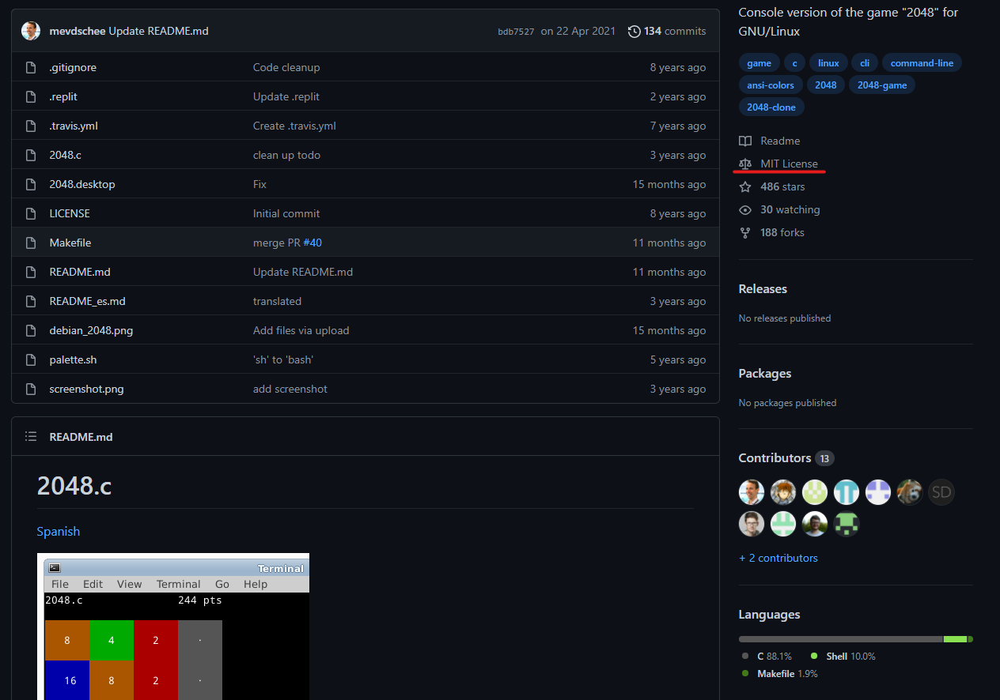
### 2. Test działania bezpośrednio na maszynie virtualnej
* Klonowanie wybranego repozytorium  
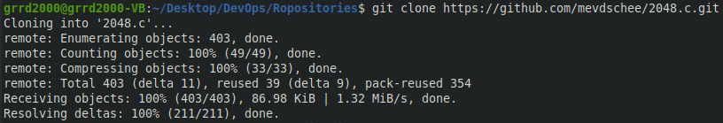  
* Build oprogramowania  
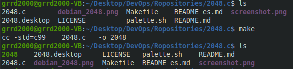  
* Uruchomienie testów dołączonych do repozytorium  
  
* Uruchomienie programu w celu przetestowania działania  
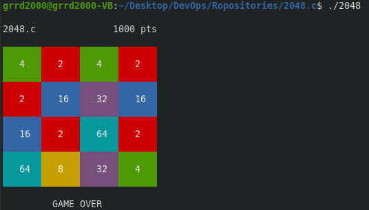  
### 3. Przeprowadzenie build'u w kontenerze  
* Wybranie wystarczającego kontenera - oprogramowanie bazuje na języku C, zatem pobrany zostaje kontener **Ubuntu**  
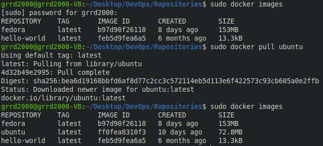  
* Włączenie kontenera w trybie interaktywnym  
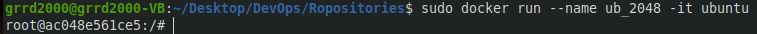  
* Doinstalowywanie **Git'a**  
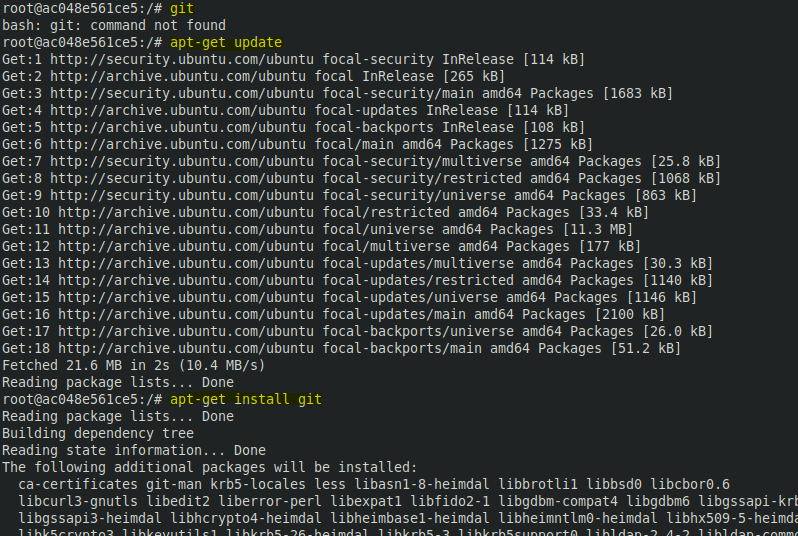  
* Klonowanie repozytorium  
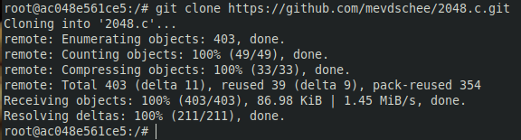  
* Instalacja narzędzia **make** oraz narzędzi do kompilacji C  
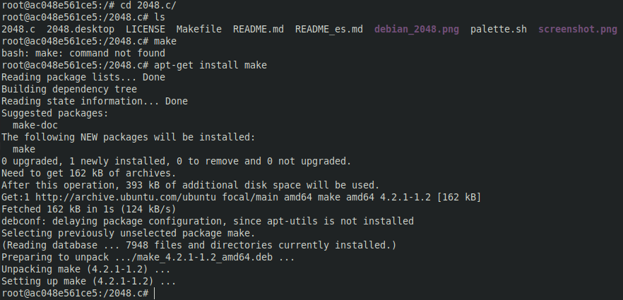  
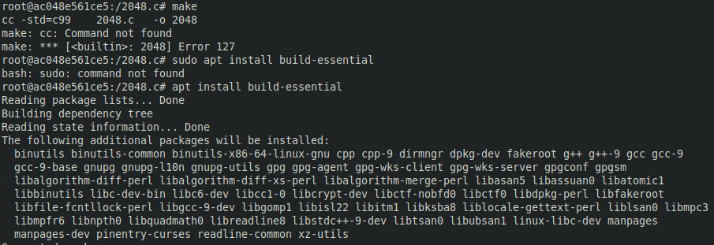  
* Build oprogramowania  
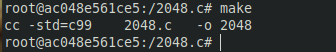  
* Przeprowadzenie testów analogicznie do testów poza kontenerem  
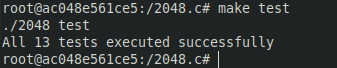  
* Uruchomienie i test działania programu  
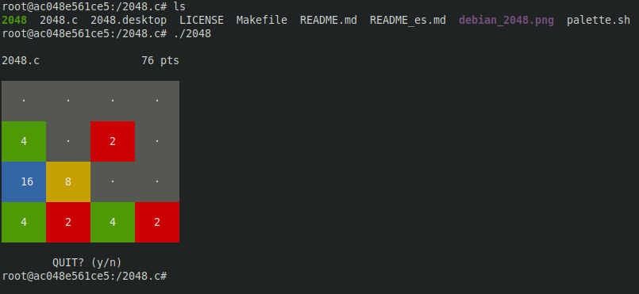  
* Program i jego funkcjonowanie zostało poprawnie uruchomione
### 3. Automatyzacja build'u przy pomocy dwóch Dockerfile'ów  
* W celu przeprowadzenia analogicznych kroków do manualnego przygotowania kontenera wyświetlona została historia użytych komend  
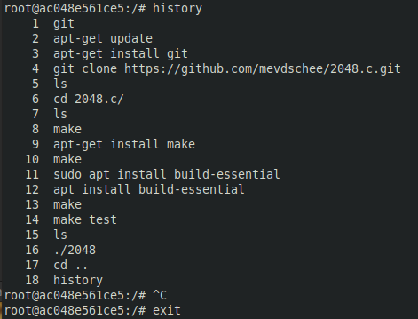  
* Dockerfile przeprowadzający kroki do momentu build'u - użycie odpowiednich dyrektyw **DockerFile** z dokumentacji Docker'a  
  - Przygotowanie pliku  
  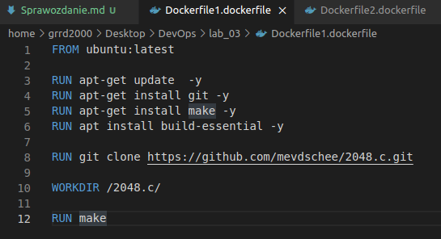  
  - Uruchomienie przy jednoczesnym nadaniu nazwy **tag1**  
  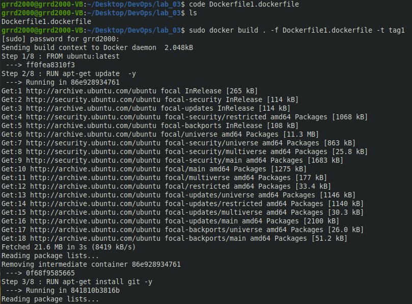  
  - Pomyślne ukończenie budowania  
  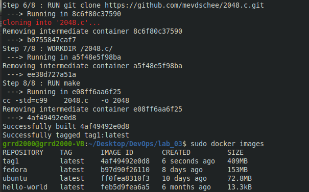  
* Dockerfile bazujący na poprzednim, wykonywujący testy oprogramowania  
  - Przygotowanie pliku  
    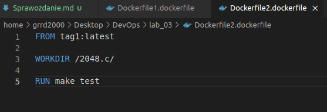  
  - Uruchomienie testów oraz pomyślne ich ukończenie  
      
* Działanie kontenera z programem  
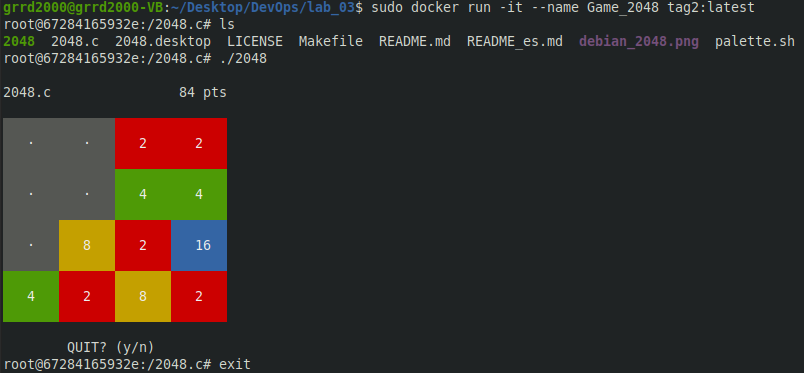
* Oprogramowanie działa poprawnie za pośrednictwem automatycznego build'owania i testowania!