# Sprawozdanie - lab_04
## Gerard Skomin
### 1. Zachowanie stanu
* Przygotowanie voluminów wejściowego i wyjściowego, podłączenie ich do kontenera bazowego  
  * Voluminy o nazwach `in_volume` i `out_volume` przy użyciu komendy `sudo docker volume create`  
  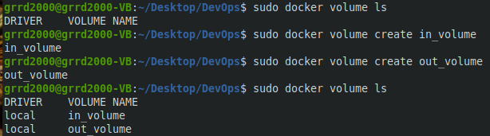  
* Przygotowanie i uruchomienie kontenera  
  * Zamontowanie voluminów i uruchomienie kontenera przy użyciu komendy o strukturze: `sudo docker run -it --name... --mount source=..., target=...`  
  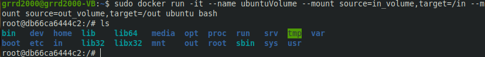  
  * Wyświetlenie informacji o voluminach: `sudo docker inspect`  
  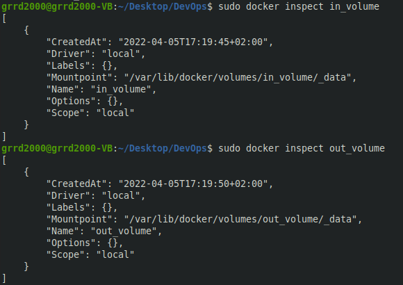  
  * Zainstalowanie niezbędnych dependencji
  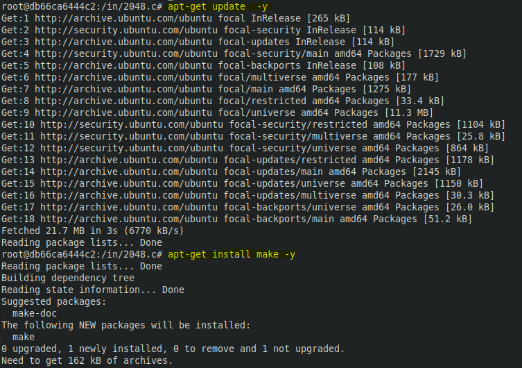  
  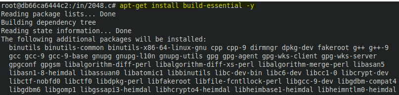  
* Klonowanie repozytorium na wolumin wejściowy  
  * Uruchomienie poziomu *root'a*: `sudo -s`  
  * Sklonowanie repozytorium do danych na voluminie wejściowym: `git clone ...`  
  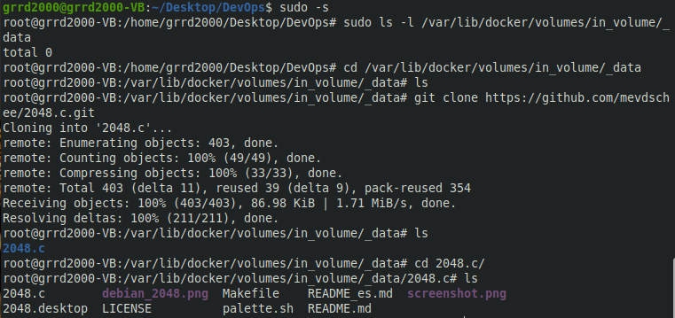  
  * Zawartość volumenu  
  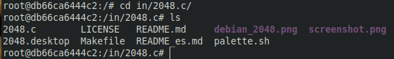  
* Uruchomienie build'a programu w kontenerze  
  * Zbudowanie programu: `make`  
  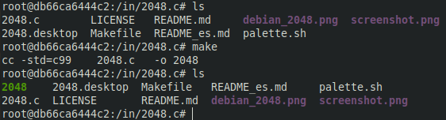  
* Zapisanie zbudowanego programu na woluminie wyjściowym  
  * Przeniesienie gotowego programu na wolumin wyjściowy: `cp -r 2048 /out/`  
  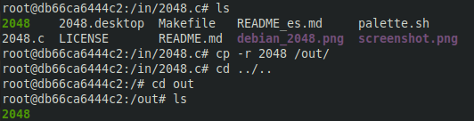  
  * Wykazanie działania programu  
  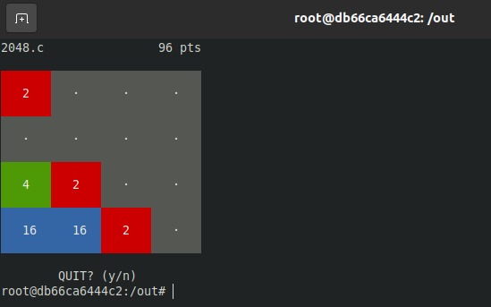  
  * Po wyjściu z kontenera wykazanie dostępności programu na odpowiedniej ścieżce  
  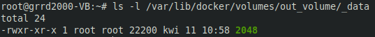  

### 2. Eksponowanie portu  
* Uruchomienie serwera iperf w kontenerze  
  * Pobranie nadającego się obrazu dockerowego: `docker pull clearlinux/iperf`  
  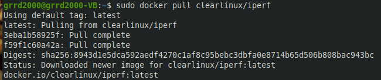  
  * Uruchomienie serwera: `sudo docker run -it --rm --name=iperf -p 5201:5201 clearlinux/iperf -s`  
  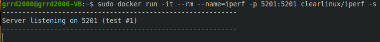  
* Połączenie się z innego kontenera i badanie przepustowości  
  * Sprawdzenie ip
  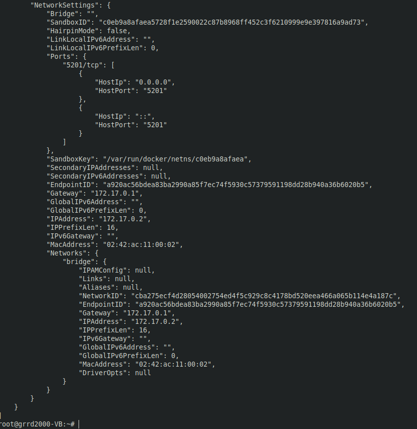  
  * Sprawdzenie nasłuchiwania poleceniem `netstat -utnpa | grep LISTEN`  
  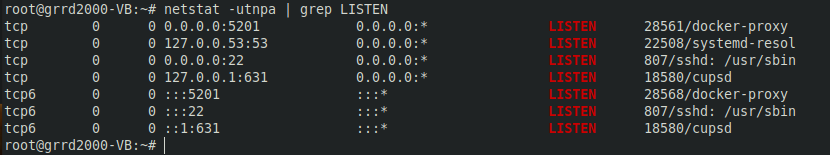  
  * Nawiązanie połączenia z innym kontenerem uruchomionym analogicznie do poprzedniego  
  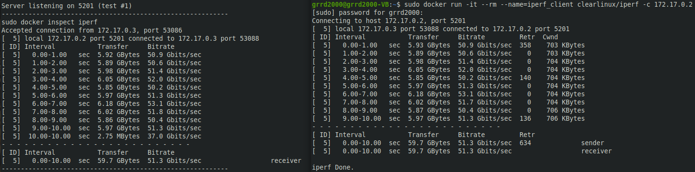  
* Połączenie się spoza kontenera  
  * Instalacja **iperf** na hoście  
  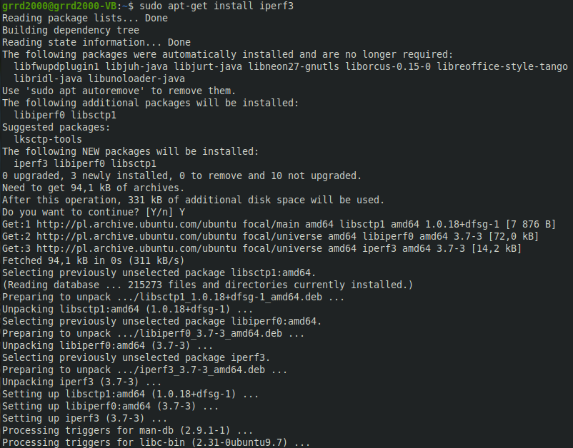  
  * Nawiązanie połączenia z hosta komendą `iperf3 -c 172.17.0.2 -t 30 -p 5201`  
  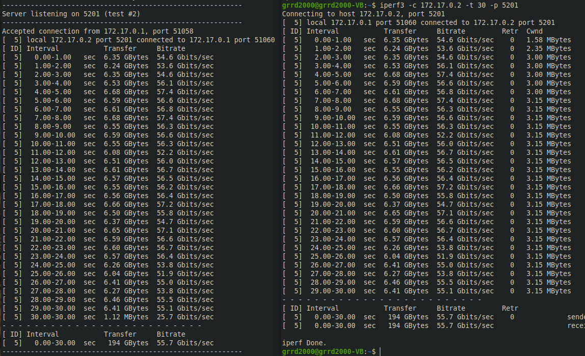  
  * Instalacja iperf na **windows'ie**  
  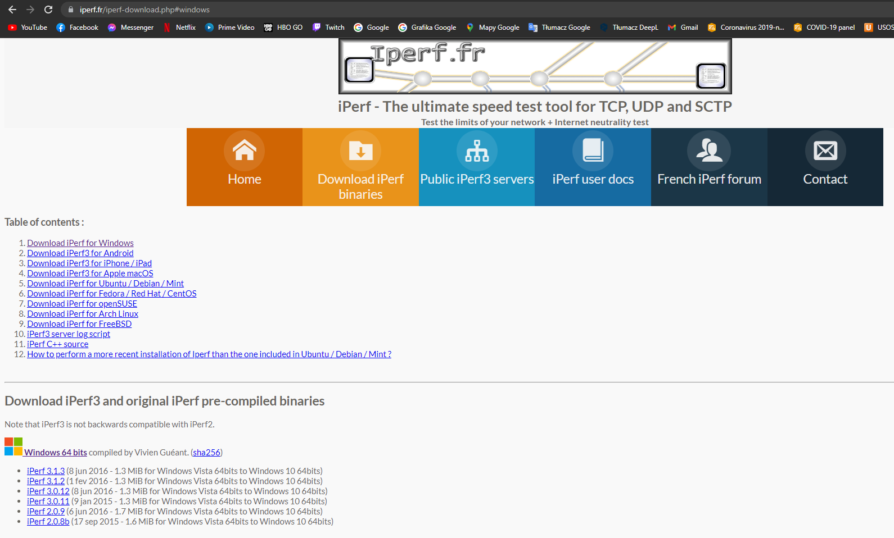  
  * Próba połączenia i błąd  
  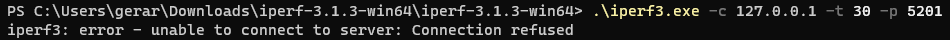  
* Analiza przepustowości  
  * Największa przepustowość połączenia wystąpila w komunikacji między hostem a kontenerem, jednakże różnice są niewielkie.  

### 3. Instalacja Jenkins'a  
* Zapoznanie się z dokumentacją  
  * Wejście na oficjalną stronę Jenkinsa, zapoznanie się z dokumentacją i przebiegiem instalacji  
  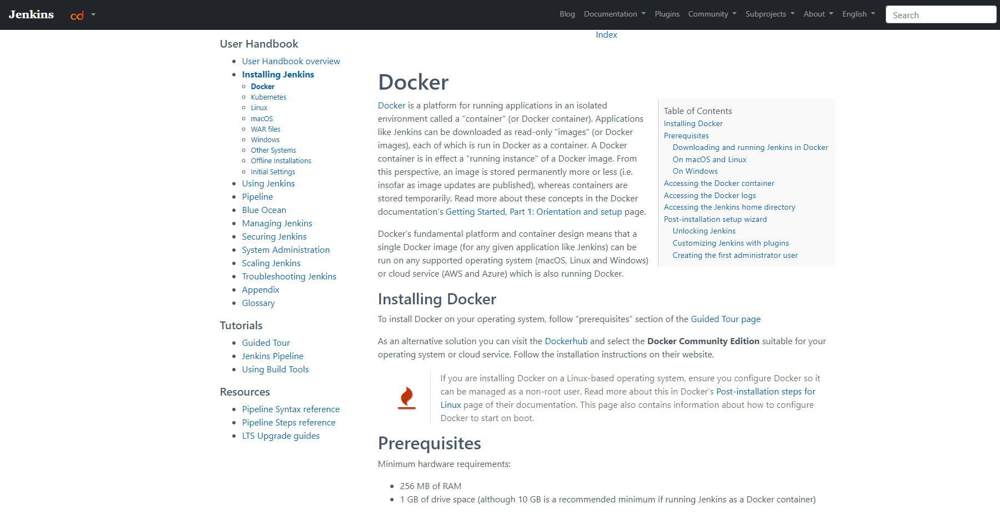  
* Instalacja Jenkins'a z pomocnikiem DIND  
  * Utworzenie "**bridge network**": `docker network create jenkins`  
  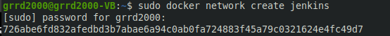
  * Pobranie i uruchomienie przy pomocy komend z dokumentacji  
  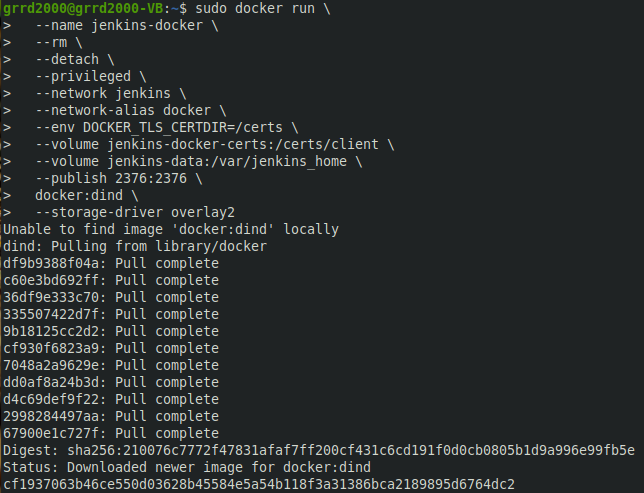  
  * Utworzenie i edycja Dockefile'a: `code Dockerfile`  
  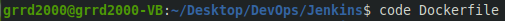  
  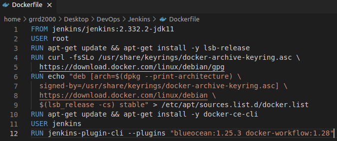  
* Inicjalizacja instalacji  
  * Zbudowanie obrazu jenkinsa inicjalizującego instalację przy pomocy komend z dokumentacji  
  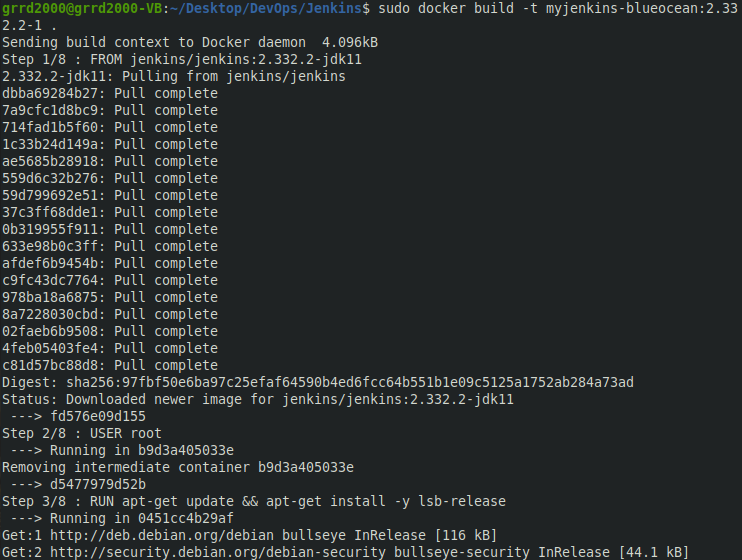  
  * Uruchomienie nowego obrazu jenkinsa  
  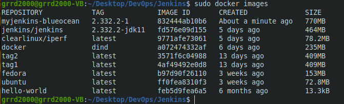
* Wykazanie działania kontenerów  
  * Wyświetlenie działających obrazów dockerowych: `sudo docker images`  
    
  * Wyświetlenie działających kontenerów dockerowych: `sudo docker ps`  
  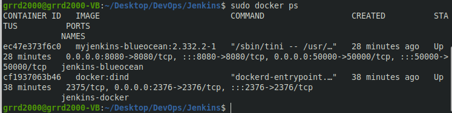  
* Konfiguracja nowego środowiska  
  * Uruchomienie Jenkinsa przy pomocy localhost'a `http://localhost:8080`  
  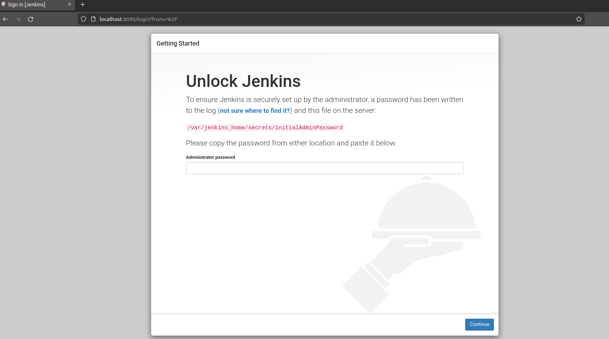  
  * Odczytanie hasła wejściowego z odpowiedniej ścieżki udostępnionej w dokumentacji  
  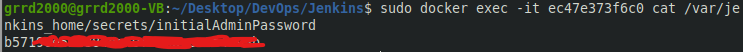  
  * Pierwsze logowanie i istalacja wtyczek
* Działający Jenkins  
  * Ekran logowania Jenkinsa  
  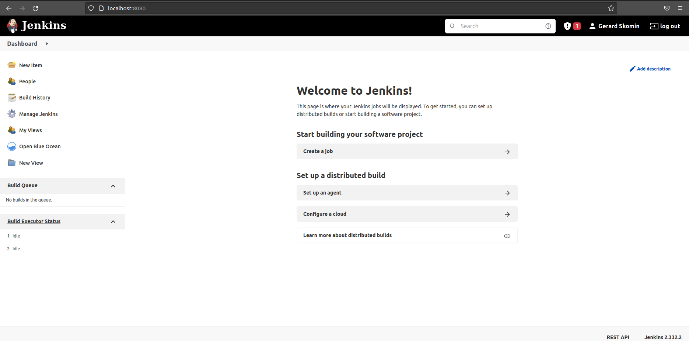  
  * Hub Jenkinsowy po zalogowaniu  
  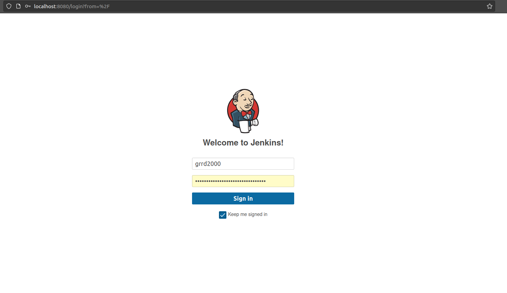  