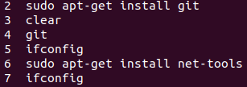
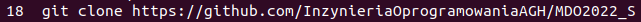
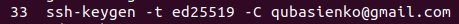
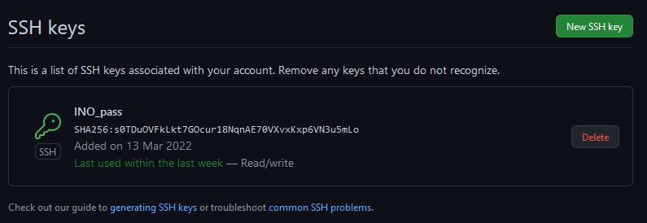
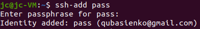
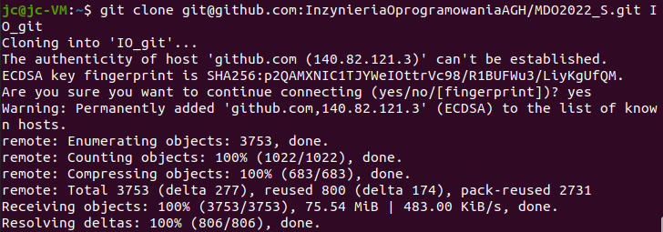
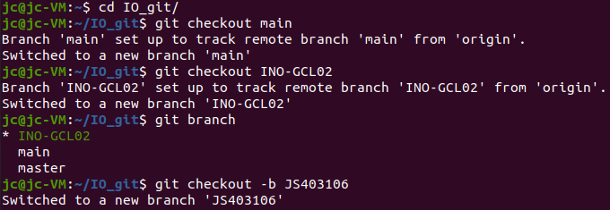
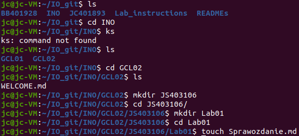
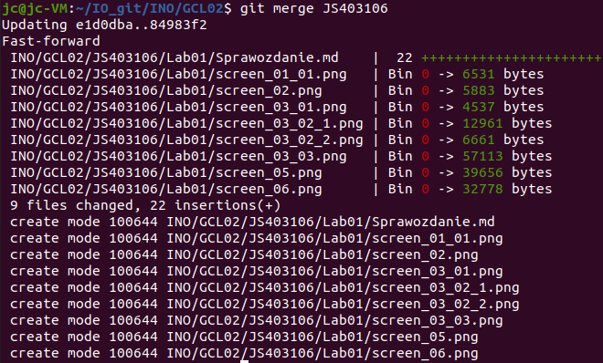
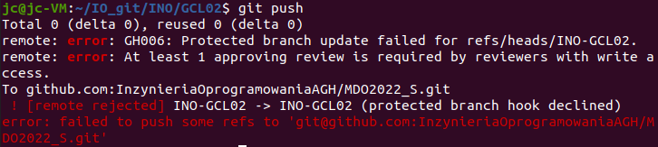

# Sprawozdanie lab_01

## Niestety zapomniałem zescreenować pierwsze dwa i część trzeciego punktu w trakcie robienia, więc musiałem korzystać z historii terminala (polecenie history)

1. Instalacja gita na VM (ssh był już zainstalowany) \
    
    
2. Sklonowanie repo za pomocą https\
    
3. 
    + Utworzenie klucza ssh \
    
    + Skonfigurowanie klucza ssh jako metodę dostępu do GitHuba\
    
    
    + Sklonowanie repo przey użyciu ssh\
    
4. Zrobione w pkt5
5. Przejście do odpowiedniego brancha i utworzenie własnego\
    
6.  + Przejście do odpowiedniej ścieżki i utworzenie pliku sprawozdania\
    
    + Merge \
    
    + Próba wypchnięcia swoich zmian\
    