# Sprawozdanie 1 
# Kamil Pazgan Inżynieria Obliczeniowa GCL02
## Zainstaluj klienta Git i obsługę kluczy SSH.
1. W pierwszej kolejnosci pobralem i zainstalowalem klienta Git na maszyne wirtualna, z ktorej korzystam (Ubuntu).

## Sklonuj repozytorium 
2. Nastepnie sklonowalem repozytorium za pomoca protokolu HTTPS.
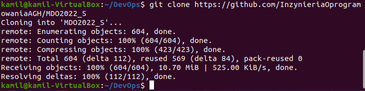
## Upewnij się w kwestii dostępu do repozytorium jako uczestnik i sklonuj je za pomocą utworzonego klucza SSH.
3. Kolejnym krokiem bylo utworzenie kluczy SSH. 
- Utworzylem dwa klucze wykorzystujace *ed25519*, z ktorych jeden zostal zabezpieczony haslem a drugi nie. 
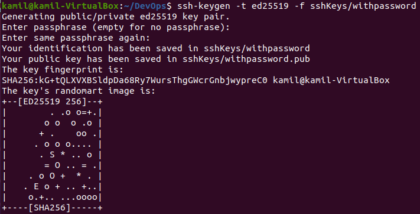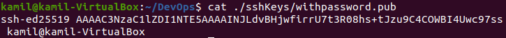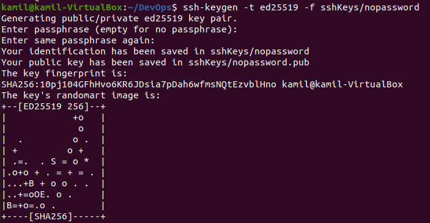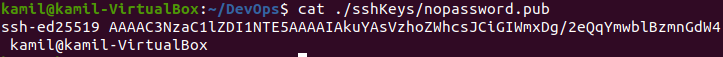
- Nastepnie dodalem klucze publiczne do konta na GitHub. 
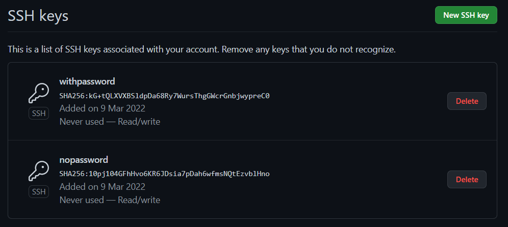
- Po tym sklonowalem repozytorium za pomoca SSH
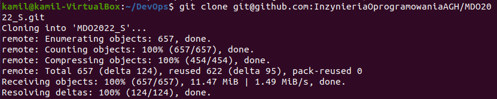
## Przełącz się na gałąź main, a potem na gałąź swojej grupy (pilnuj gałęzi i katalogu!).
4. Dalej za pomoca *git checkout* przeszedlem do odpowiedniego brancha
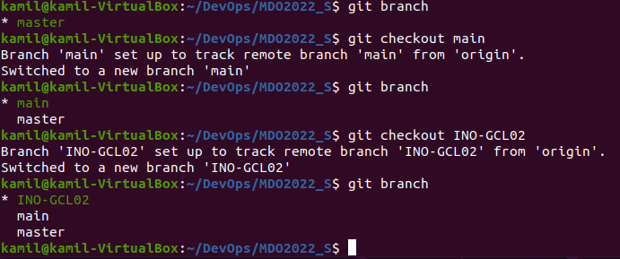
## Utwórz gałąź o nazwie "inicjały & nr indeksu" np. KD232144.
5. Nastepnie stworzylem wlasna galaz *KP404025*
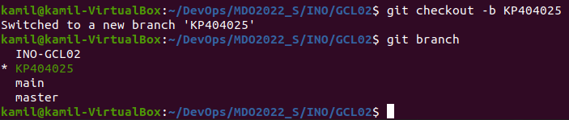
## Rozpocznij pracę na nowej gałęzi.
6. Praca na nowej galezi polegala na wykonaniu odpowiednich krokow
- Zaczalem od utworzenia folderu *KP404025* oraz *Lab1* gdzie umiescilem screeny i sprawozdanie
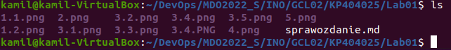
- Nastepnie dodalem zmiany do obszaru pomostowego za pomoaca *git add .* oraz aby zatwierdzic wykonalem polecenie *git commit -m*. Dalej wyslalem zmiany za pomoca *git push* 
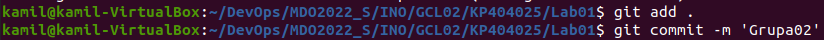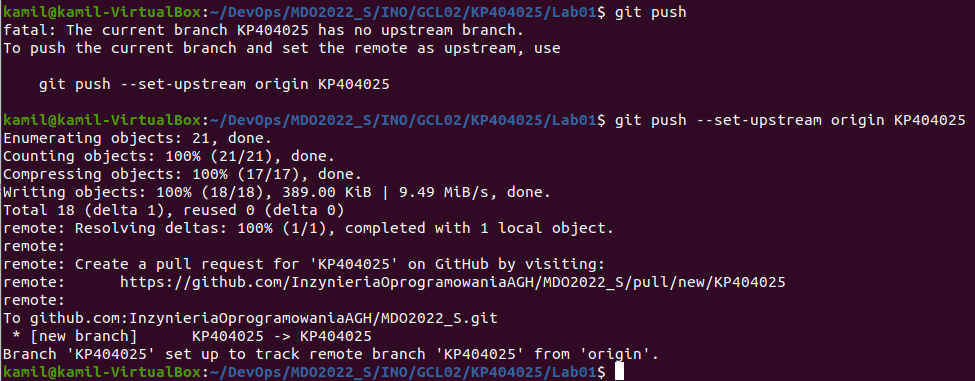
- Ostania rzecza byla proba wciagniecia swojej galezi do galezi grupowej. Na galezi grupowej wykonałem polecenie *git merge KP404025*.
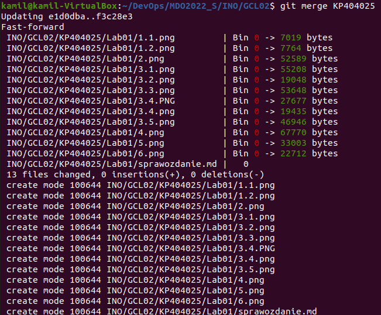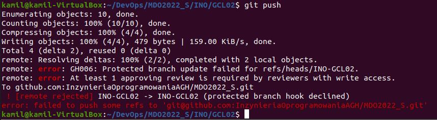
- Zaktualizowalem sprawozdanie i zrzuty i wyslalem aktualizacje
## Wystaw Pull Request do gałęzi grupowej
7. Jako ostatnie wykonalem wystawienie Pull Requesta do galezi grupowej.
