# Sprawozdanie 2
# Kamil Pazgan Inżynieria Obliczeniowa GCL02

## Przygotuj git hook, który rozwiąże najczęstsze problemy z commitami
1. By przygotować hooki przeszedłem do ukrytego folderu */.git/hooks*, gdzie skopiowałem pliki *commit-msg.samgle* oraz *pre-commit.sample*, przy okazji usuwając rozszerzenie *.sample*. Następnie przeszedłem do edycji.\
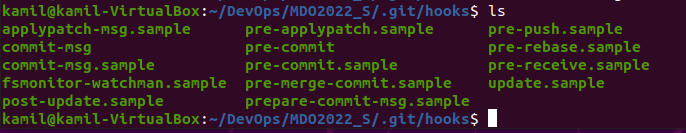
- hook sprawdzający, czy tytuł commita nazywa się '''<inicjały><numer indeksu>''':
hook *commit-msg* ma za zadanie sprawdzić tytuł commita - czy jego wartość to *KP404025*. Sprawdzając argument '''$1''' nastepuje porownanie z docelowa wartoscia i wypisanie komunikatu w zaleznosci od powodzenia. Poniżej skrypt z hooka:\
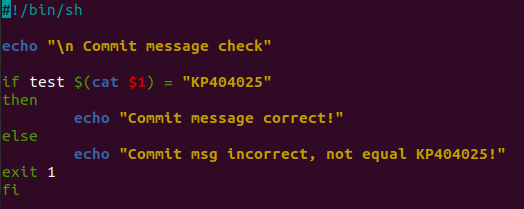
- test pozytywny\
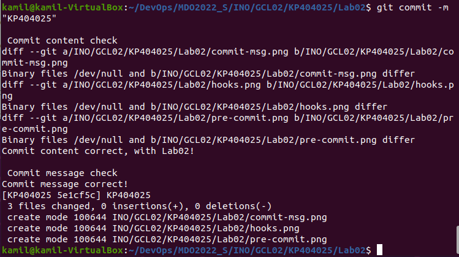
- test negatywny\
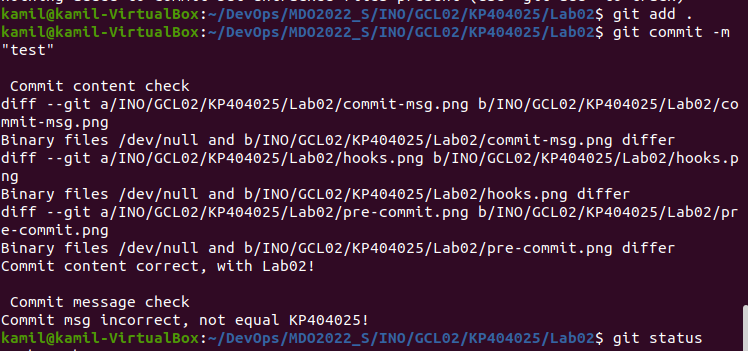
- hook sprawdzający, czy w treści commita pada numer labu, właściwy dla zadania:
hook *pre-commit* ma za zadanie sprawdzenie czy w ścieżce zmian zatwierdzonych do commita jest */Lab02/*. Wykorzystuje do tego '''git diff''' z '''--cached'''. Poniżej skrypt z hooka:\
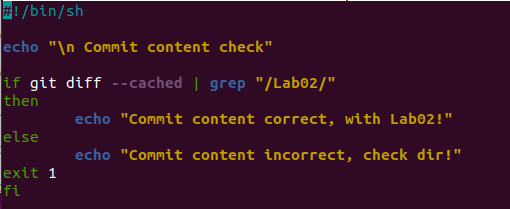
- test pozytywny\

- test negatywny\
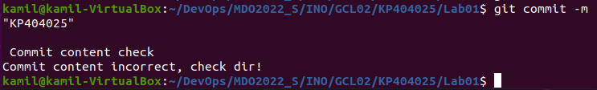
## Umieść hook w sprawozdaniu w taki sposób, aby dało się go przejrzeć
2. Zawartość hooków powyżej.
## Rozpocznij przygotowanie środowiska Dockerowego
3. Druga część laboratoriów dotyczyła środowiska Dockerowego.
- Na zapewnienie dostępu do maszyny wirtualnej przez zdalny terminal pozwoliło mi *PuTTY*:\
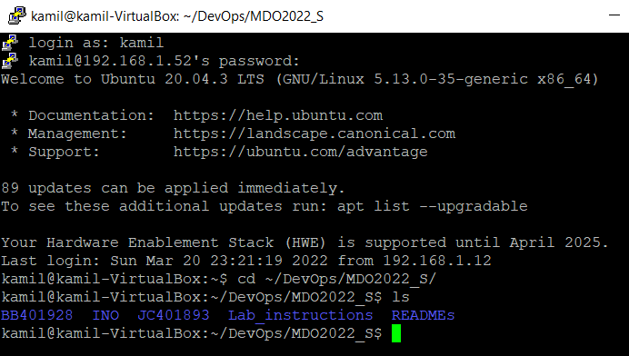
- Instalacje środowiska docerowego w stosowanym systemie operacyjnym rozpocząłem od instalacji za pomocą '''sudo apt install docker.io'''.\
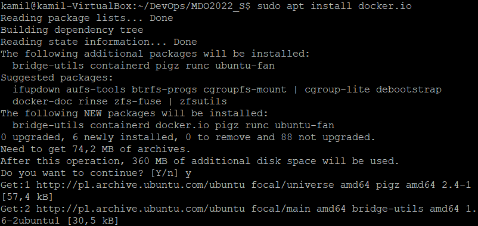
- Następnie zainstalowałem pakiety zależności '''sudo snap install docker'''.\
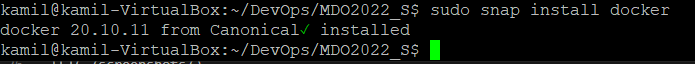
- Sprawdziłem wersje dockera '''docker --version'''.\
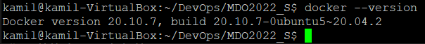
- Na końcu wykonałem test działania za pomocą '''sudo docker run hello-world'''.\
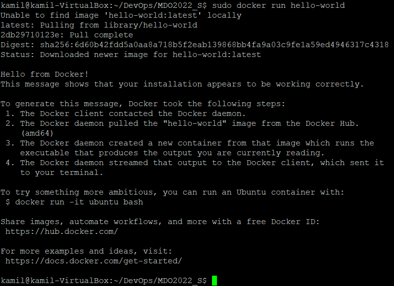
## Działanie środowiska
4. Wykazanie, że docker faktycznie działa. 
- Aby wykazać, że środowisko dockerowe jest uruchomione i działa (z definicji) wykonałem polecenie '''ps -aux | grep 'docker' ''', którego wydruk potwierdza istnienie procesów związanych z dockerami.\
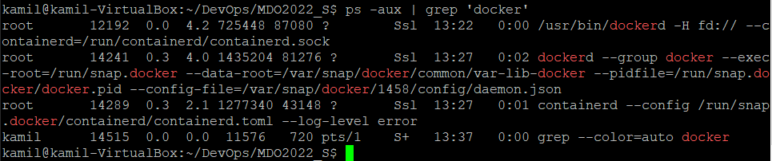
- Aby wykazać, że środowisko dockerowe jest uruchomione i działa w sposób praktyczny pobrałem obraz *Fedory*, korzystając z '''sudo docker run fedora'''.\
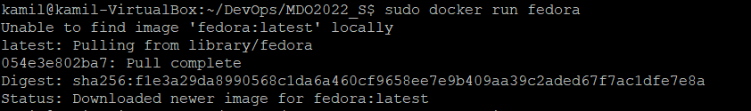
- Obrazy dockerowe:\
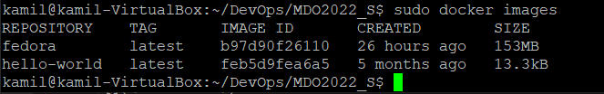
- Wyświetlenie numeru wersji po uruchomieniu, za pomocą '''cat /etc/os-release''':\
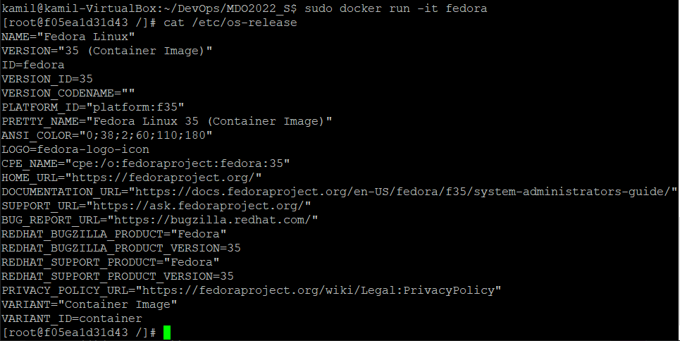
## Załóż konto na Docker Hub
5. Założone konto na Docker Hub\
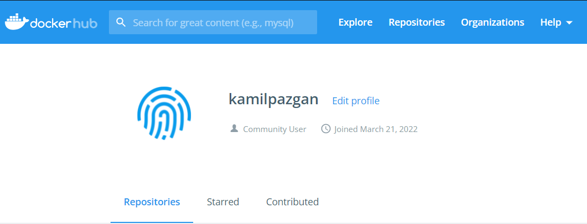