# Sprawozdanie 3
# Kamil Pazgan Inżynieria Obliczeniowa GCL02

## Wybór oprogramowania na zajęcia
1. Repozytorium, które wybrałem w ramach zajęć to node-red: https://github.com/nodejs/nodejs.org
- Posiada ono otwartą licencję
- Narzędzia Makefile, dostępne na potrzeby testów to *npm*
- Sklonowałem repozytorium wykorzystując HTTPS i pobierając link z repozytorium\
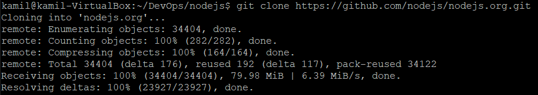
- Zainstalowałem zależności ```npm install```\
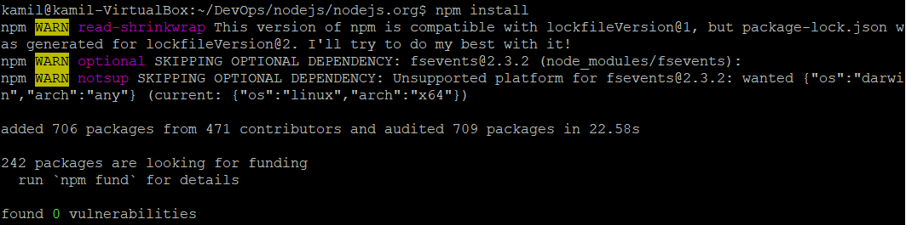
- Następnie buduję projekt za pomocą ```npm run build```\
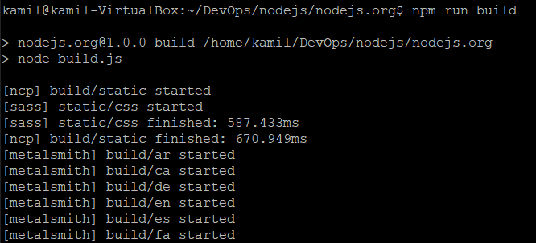\
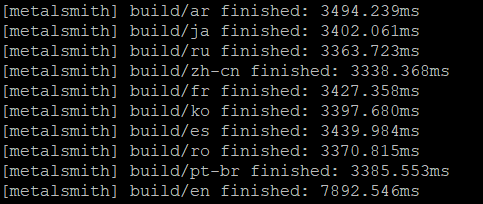
- Na koniec uruchomiłem testy jednostkowe dołączone do repozytorium ```npm test```\

## Przeprowadzenie buildu w kontenerze
1. Kroki wykonane wewnątrz kontenera Node, który jest adekwatny do repozytorium
- W pierwszej kolejności uruchamiam kontener wraz z podłączeniem TTY za pomocą ```sudo docker run```, wykorzystując odpowiednie opcje: ```-p``` - określenie portu, ```-it``` - interaktywny terminal, ```bash``` - bash terminal\
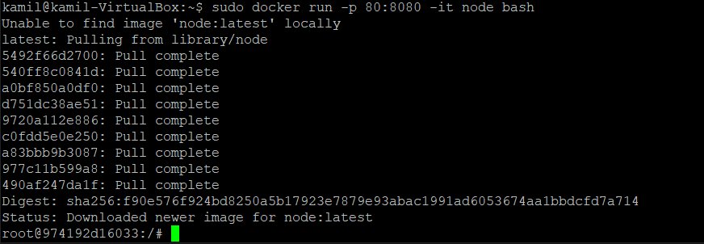
- Następnie klonuje repozytorium ```git clone https://github.com/nodejs/nodejs.org```\
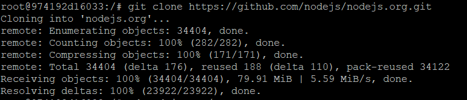
- Instaluje na kontenerze npm ```npm install```\
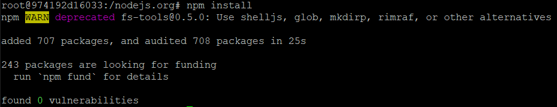
- Uruchomienie buildu ```npm run build```\
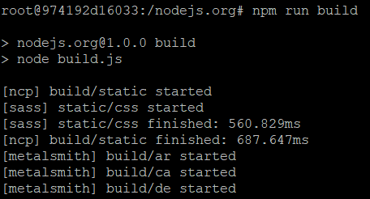\
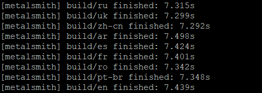
- Na koniec uruchomienie testu za pomocą ```npm test```\
\

2. Pliki Dockerfile automatyzujące kroki powyżej
- Pierwszy plik wykonuje wszytkie kroki, aż do builda: ```FROM``` - najnowszy obraz, ```RUN``` - uruchamianie, ```WORKDIR``` - ścieżka\
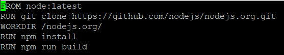
- Drugi plik bazuje na pierwszym i uruchamia testy\
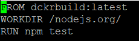
3. Wykazanie, poprawności wdrażania się kontenera i poprawności działania
- W pierwszej kolejności sprawdziłem działanie pierwszego Dockerfile poprzez ```sudo docker build```, ```-f``` - wybór pliku, ```-t``` - nazwa obrazu\
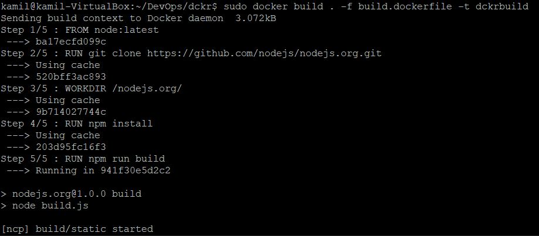\
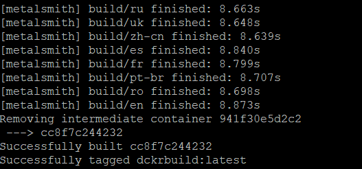
- Następnie drugiego\
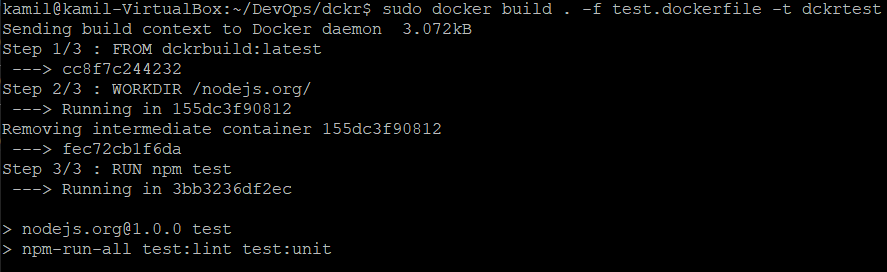\
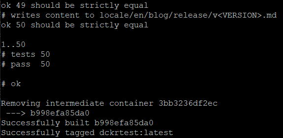
- Stworzone obrazy ```sudo docker images```\
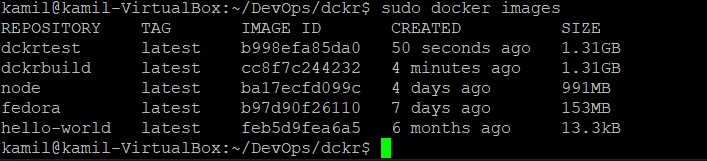
- Potwierdzenie działania, uruchomienie kontenera z utworzonego obrazu\
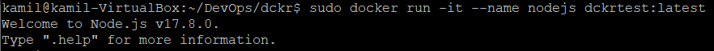

