# Sprawozdanie 4
# Kamil Pazgan Inżynieria Obliczeniowa GCL02

## Zachowywanie stanu
1. Prace rozpoczynam od stworzenia woluminów. ```volumein``` - wolumin wejsciowy oraz ```volumeout``` - wolumin wyjsciowy. Tworze je za pomoca ```docker volume create```\
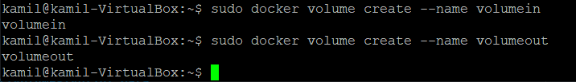\
Następnie wyświetlam szczegóły ```docker volume inspect```, w kolejnych krokach skorzystam z wyswietlonej zawartosci.\
\
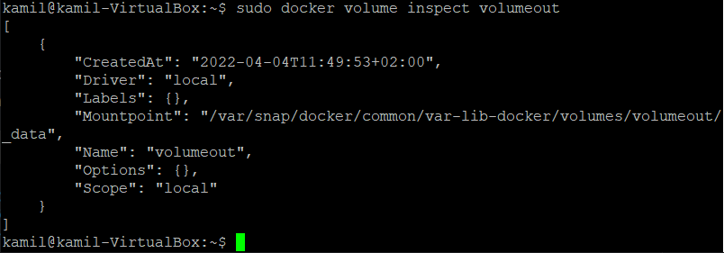\
Pobieram ```node:slim```, który dzieki temu, że jest duzo mniejszy nie zawiera gita.\
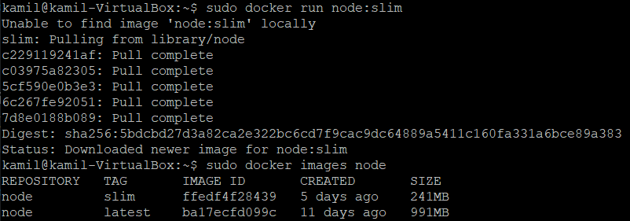\
2. Uruchamiam kontener montujac woluminy za pomocą ```docker run```. ```-v``` - montowanie przełącznika, ```-it``` - interaktywny terminal, ```--name``` - nadana nazwa, ```bash``` - terminal bash.\
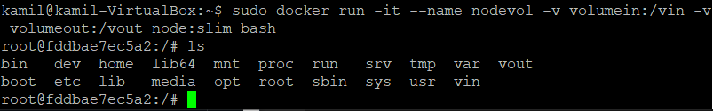\
Zamontowane woluminy:\
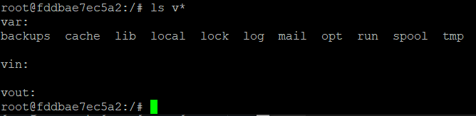\
3. Kolejnym krokiem było sklonowanie repozytorium na wejściowy wolumin ```volumein```. Wykorzystując ścieżke z inspecta klonuje repozytorium w odpowiednim miejscu.\
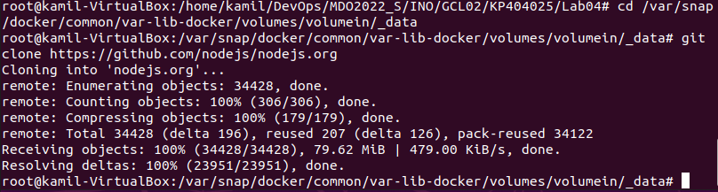\
Zawartość:\
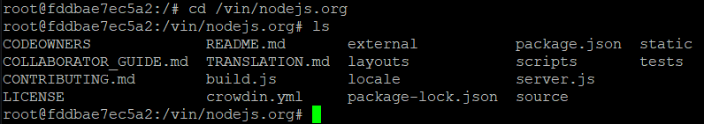\
4. Następnie skopiowałem katalog na kontener, zainstalowałem dependencje oraz uruchomilem build, ```npm run build```.\
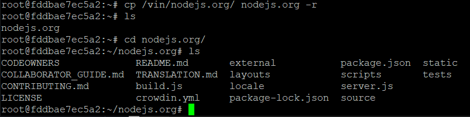\
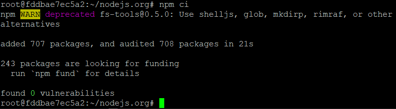\
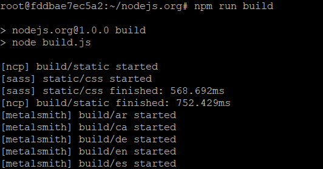\
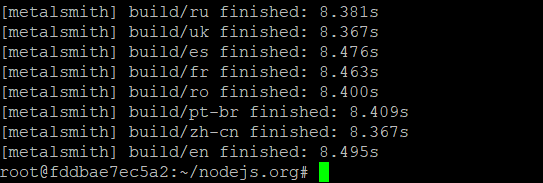\
5. Ostatnim krokiem było zapisanie plików na woluminie wyjściowym:\
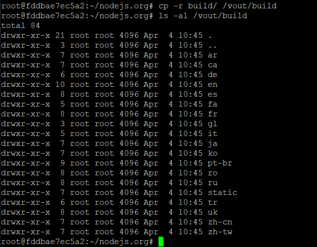\
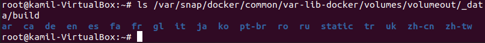\

## Eksponowanie portu
1. W kolejnej części laboratoriów uruchomiłem wewnątrz kontenera serwer iperf (iperf3). W pierwszej kolejnosci pobrałem obraz: ```sudo docker pull clearlinux/ipref```\
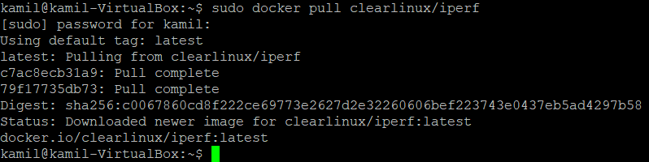\
Następnie uruchomiłem serwer za pomocą ```docker run```. ```-p``` - publikacja portu, ```-s``` - emitowanie działania serwera, ```-rm``` - usuniecie po zamknieciu.\
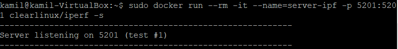\
2. Przeszedłem do sprawdzenia czy serwer nasłuchuje:\
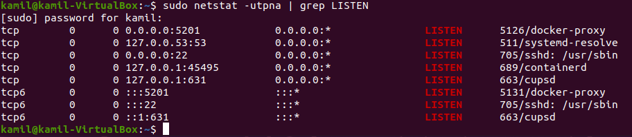\
Następnie połaczyłem sie z drugiego kontenera. ```--time``` - czas połączenia, ustawiam na 15.\
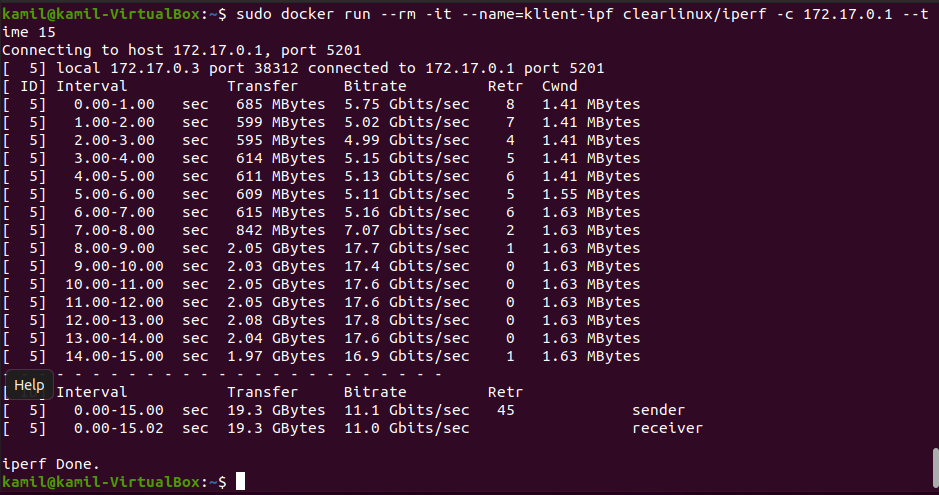\
3. Pozostałe połączenia:\
Połączenie z kontenerem z hosta (VM Ubuntu):\
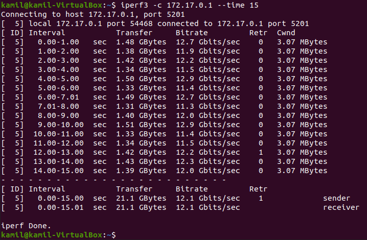\
Połączenie z kontenerem spoza hosta (Windows 10 na PC):\
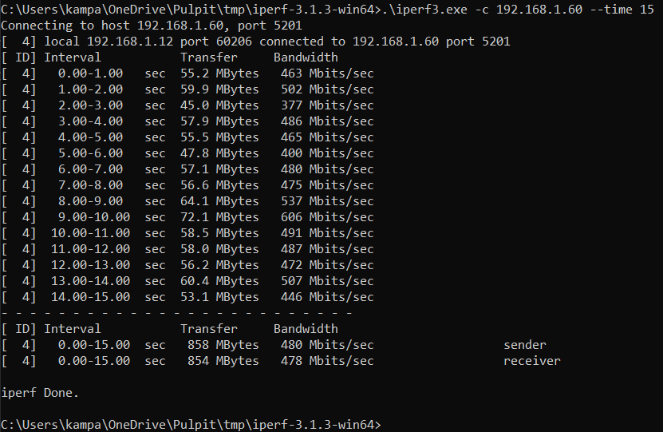\
4. Przepustowość komunikacji:\
- *Kontener --- Kontener*\
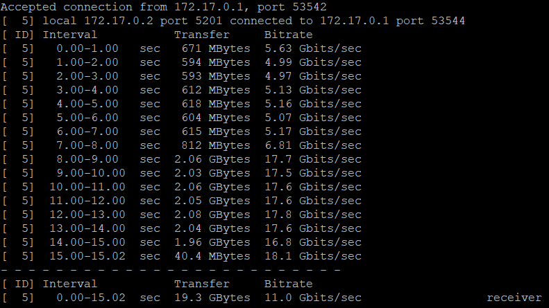\
- *Host --- Kontener*\
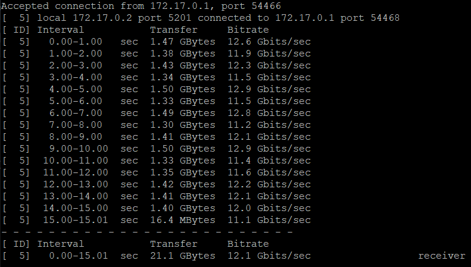\
- *Host zewnętrzny --- Kontener*\
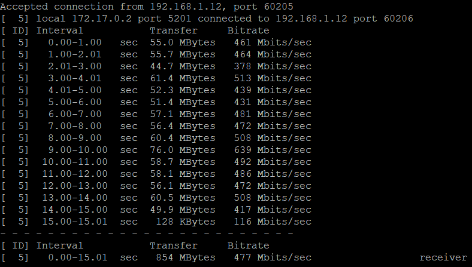\
- Wykres porównawczy:\
\
Najlepszą przepustowość wykazuje połączenie kontener z hostem, nie wiele gorsze jest połączenie kontener - kontener. Host zewnętrzny jest kilkukrotnie gorszy w połączeniu z kontenerem.

## Instancja Jenkins
1. Po zapoznaniu się z dokumentacją zawartą w instrukcji, przeszedłem do instalacji.
- Instalacja sieci dockerowej:\
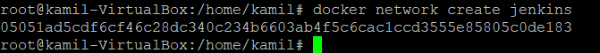\
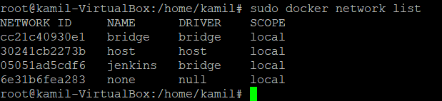\
- Postępując zgodnie z instrukcją kontynuuje instalację:\
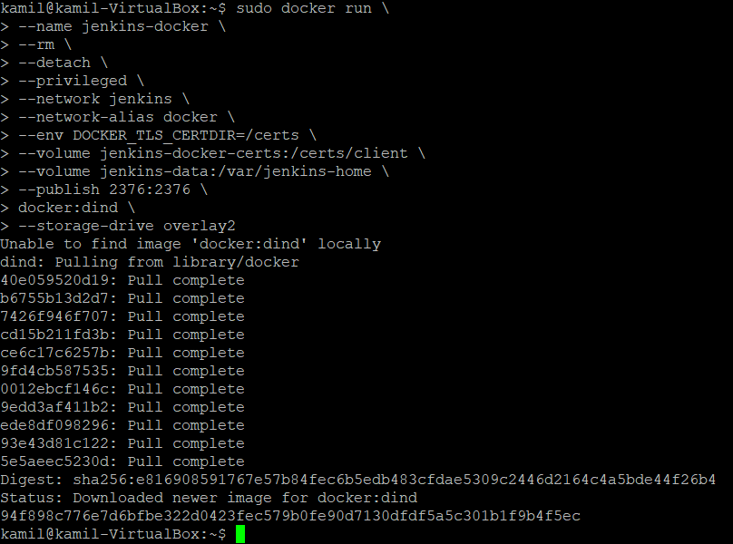\
- Stworzyłem dockerfile i skopiowałem zawartość z instrukcji:\
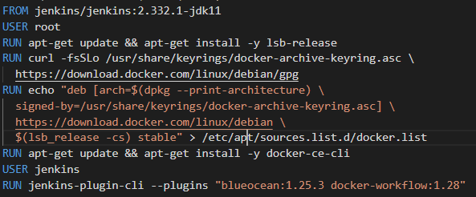\
- Następnie przeszedłem do budowania obrazu za pomocą ```suddo docker build```:\
\
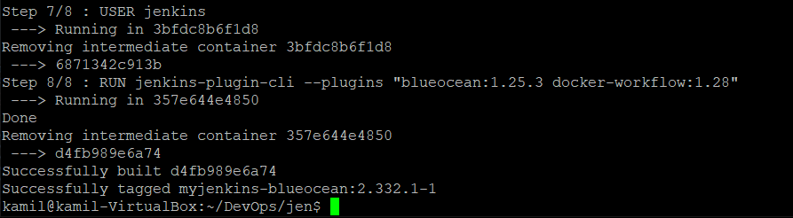\
- Korzystając z instrukcji uruchamiam obraz:\
\
- Potwierdzenie utworzenia konteneru:\
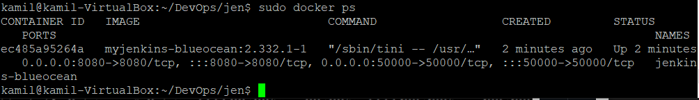\
2. Jenkins
- Przez przegladarke wchodze na *localhost:8080*\
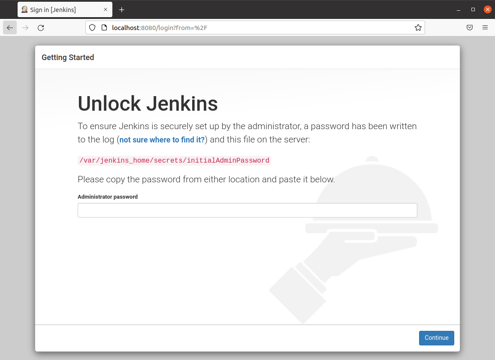\
- Nastepnie z poziomu kontenera pobieram hasło:\
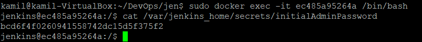\
- Po zalogowaniu instaluje domyślne wtyczki\
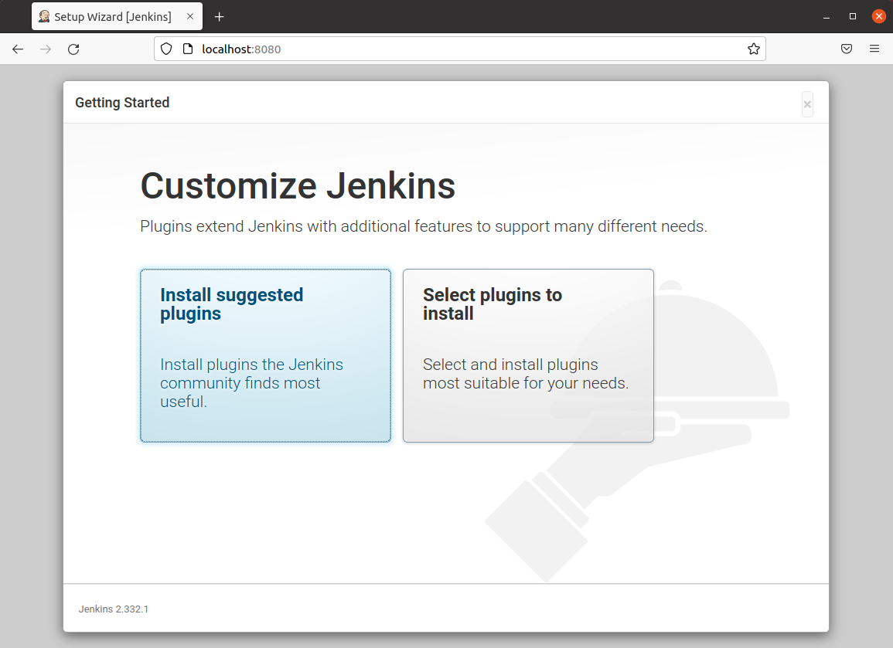\
- Przechodze do panelu logowania:\
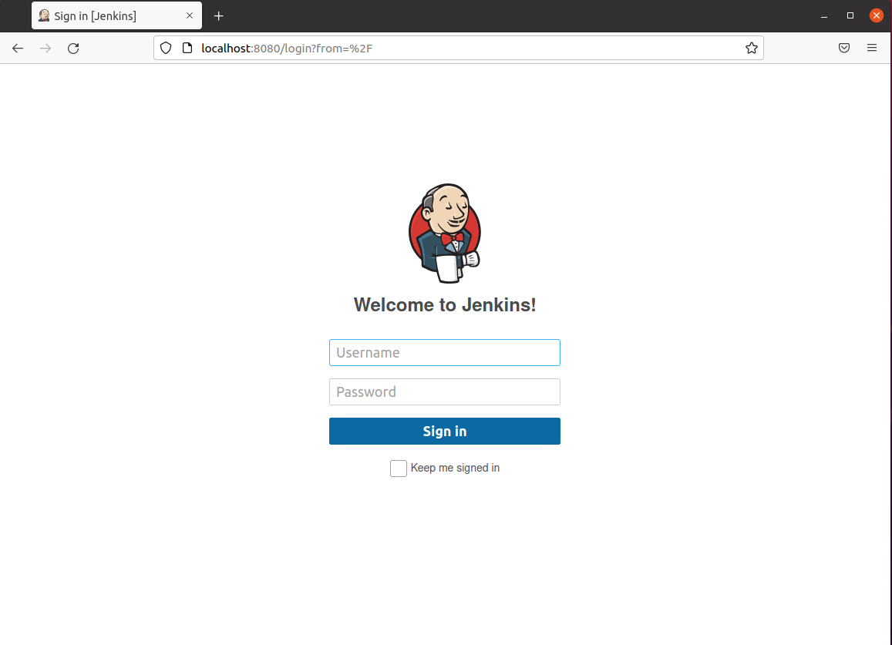\


