# Sprawozdanie Pipeline
# Kamil Pazgan Inżynieria Obliczeniowa GCL02

## Realizacja Projektu

### Wstęp
Na poprzednich laboratoriach tworzyliśmy kontener *Jenkins* oraz *DIND*, które pozwalają nam zrealizować temat bierzący, czyli przygotowanie *pipeline*.

*DinD*, odpowiada za uruchamianie Dockera w kontenerze Dockera. Oznacza to, że instancja Dockera w kontenerze byłaby w stanie budować kontenery, a także je uruchamiać.

*Jenkins* - ```myjenkins-blueocean:2.332.1-1``` - jest kontenerem bazowym i zapewnia możliwość automatyzacji przeprowania operacji na wybranym repo.

Instalowanie tych kontenerów zaprezentowane poprzednio. Teraz konieczne jest uruchomienie obu kontenerów.

DinD:\


Jenkins:\
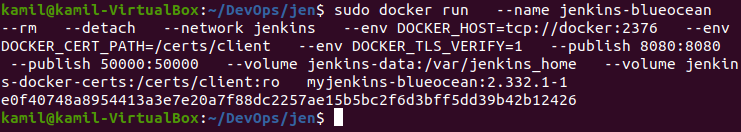

Utorzenie kontenerów można potwierdzić wypisując informacje ```docker ps```.\
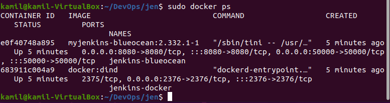

### Definiowanie pipeline dla Jenkins

1. Pracuje jak poprzednio na https://github.com/nodejs/nodejs.org
Wykonuje forka i kopiuje repozytorium do siebie, by móc swobodnie modyfikować pliki. Następnie klonuje je do siebie na Windows 10, żeby dodać istotne pliki i pracować z repo.\
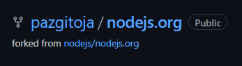

2. Przygotowane dockerfile, umieściłem w katalogu głownym repozytorium.

- ```docker1.dockerfile``` - odpowiedzialny za build - tworzy obraz ```builder```, który ma za zadanie pobrać wymagane dependencje za pomocą ```npm install``` oraz stworzenie plików poprzez ```npm run build```.\
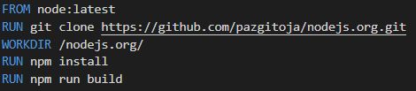

- ```docker2.dockerfile``` - odpowiedzialny za testy - przeprowadza testy sprawdzające poprawność działania kodu.\
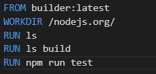

- ```docker3.dockerfile``` - odpowiedzialny za deploy - z foldera build kopiowane są właściwe pliki do flderu z ```nginx```. Biorę pod uwagę tylko język angielski chcąc jak najbardziej oszczędzać na pamięci. Kopiuje też pliki odpowiedzialne za styl, html i css.\
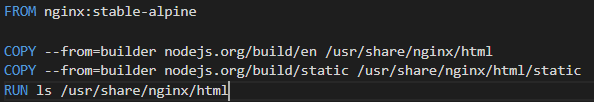

- ```docker4.dockerfile``` - odpowiedzialny za publish - korzystając z kontenera builder tworzę archiwum, które jest artefaktem.\
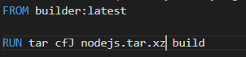

3. Jenkinsfile (```jenkins```) wrzuciłem do folderu ```jenkins```, który stworzyłem wcześniej w katalogu głownym repozytorium.

Dzięki niemu mamy możliwość stowrzenia kilku projektów, wykorzystując tylko jedną instancję Jenkinsa. Dzieje się tak ponieważ, możemy użyć rozproszonej kompilacji odwołując się do węzłów agentów.\
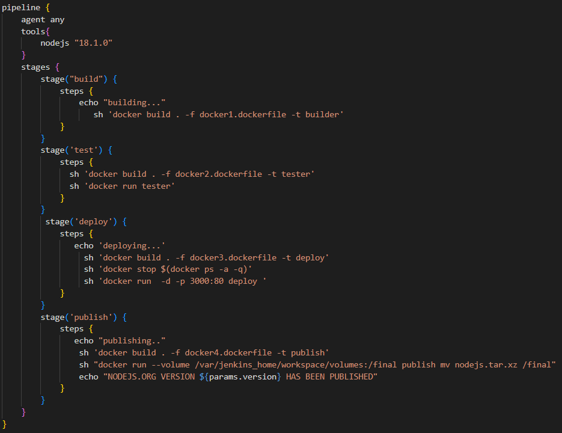

- ```stage("build")``` - utworzenie aplikacji w kontenerze *(builder)*. W przypadku mojego repozytorium posiada on dependencję,którą jest *npm*.

- ```stage('test')``` - uruchommienie testów, będących częścią projektu. Dzieje się to za pomocą stworzonego obrazu tester.

- ```stage('deploy')``` - utworzenie obrazu deploy hostującego pliki. serwer hostujący - ```nginx``` - z przekierowaniem portu. Następnie uruchominie kontenera oraz zakończenie jego pracy. 

- ```stage('publish')``` - ostatni etap, czyli wydanie nowej wersji oprogramowania. Zbudowanie artefaktu i podpięcie do voluminu.

### Konfiguracja Jenkinsa

1. Najpierw tworzymy nowy projekt.\
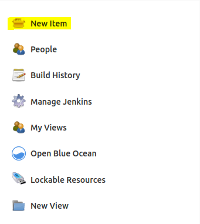

2. Wybieramy pipeline i wprowadzamy nazwe.\
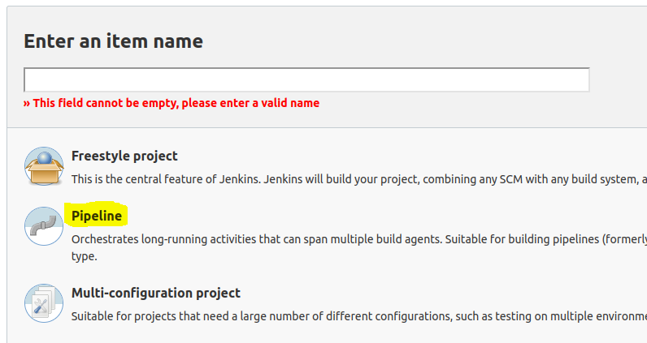

3. Definicja - *Pipeline script from SCM*, kontrola plików - Git, link do repozytorium, odpowiedni branch.\
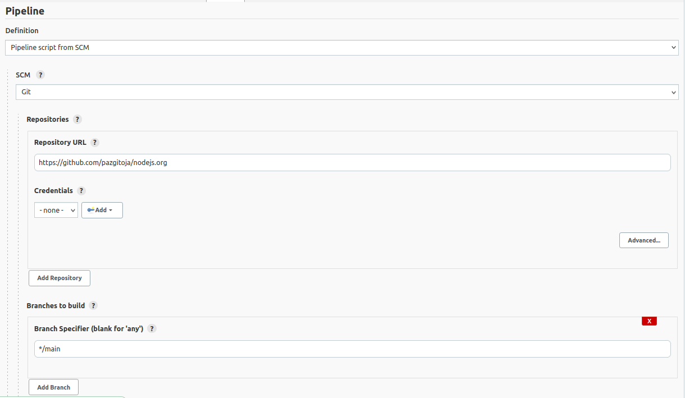

4. Ścieżka do jenkinsfile.\
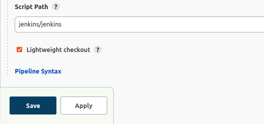

### Uruchominie Jenkinsa

1. Sklonowanie.\
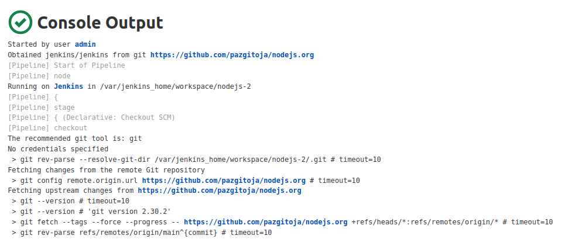

2. Build.\
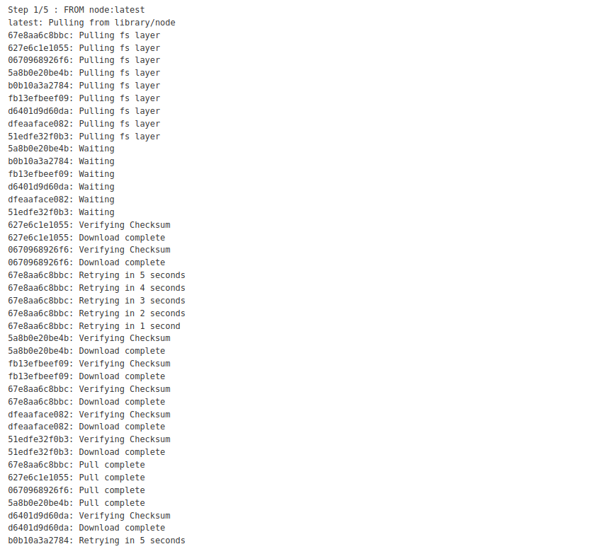
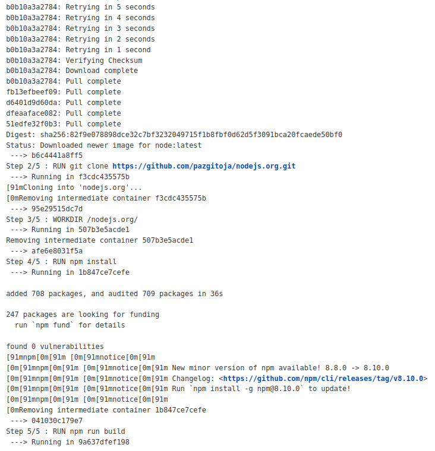
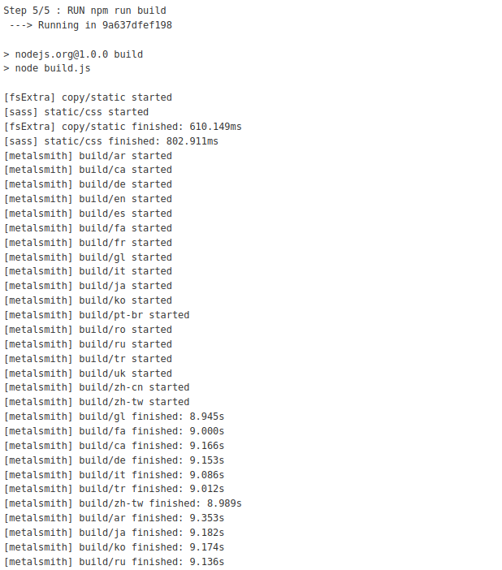
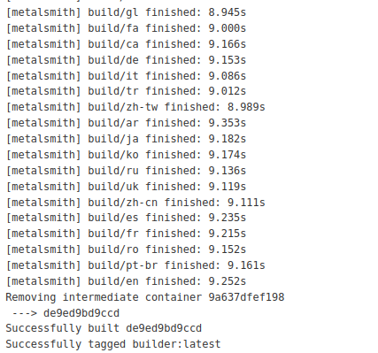

3. Test.\
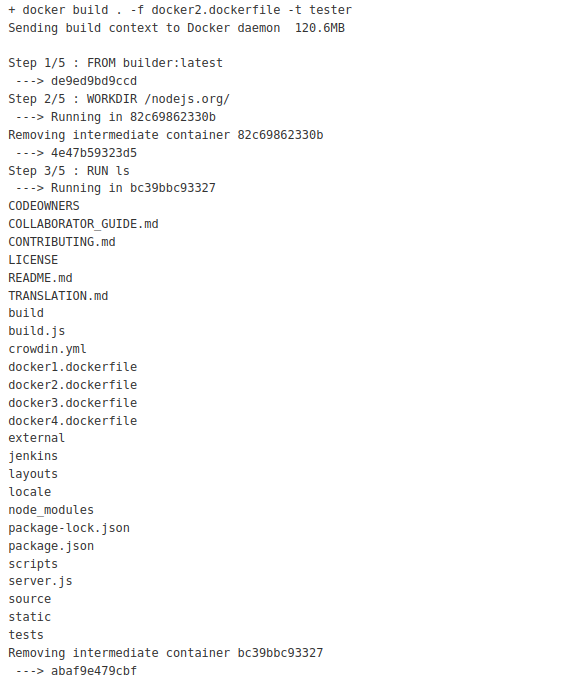
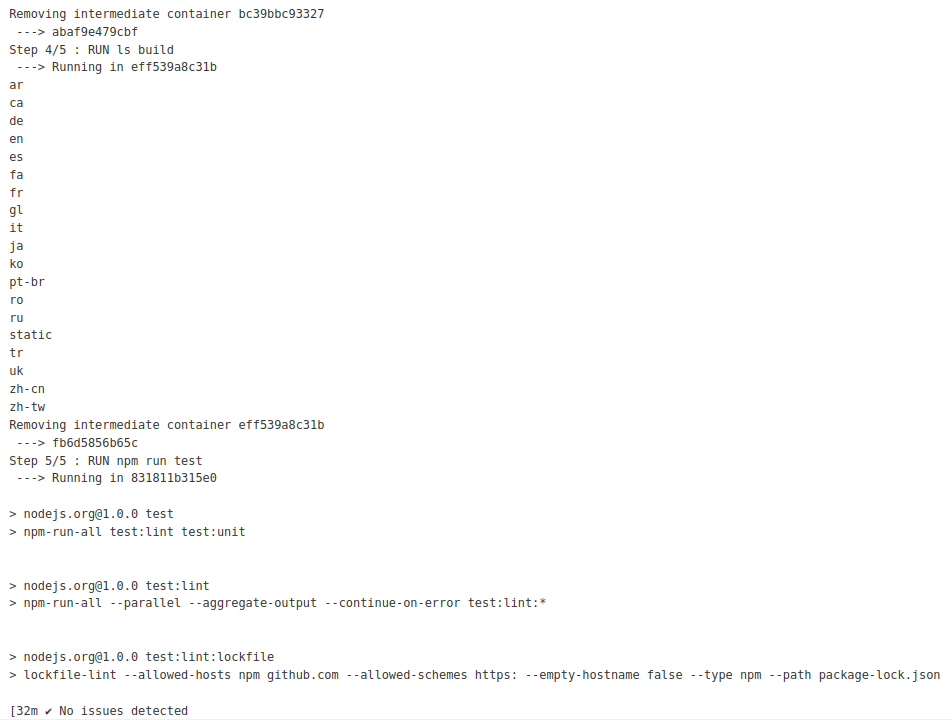
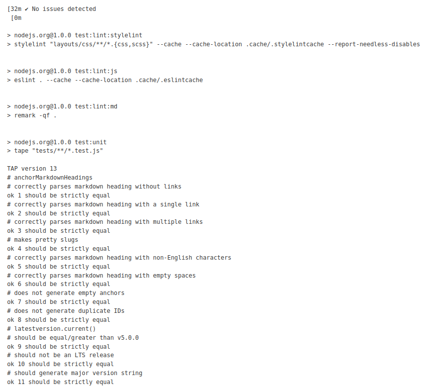
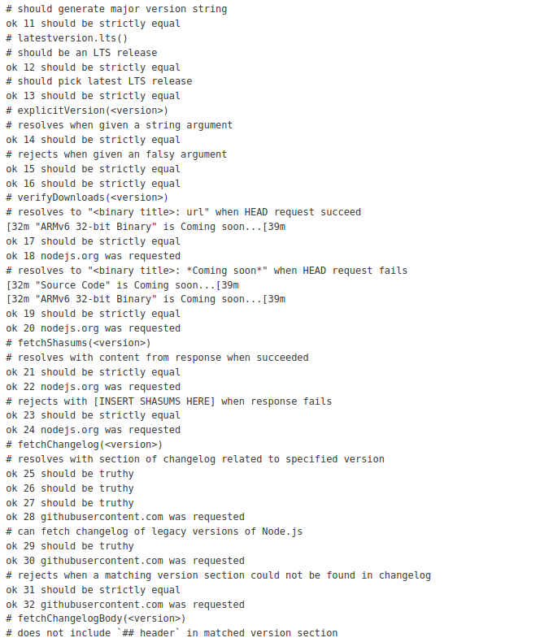

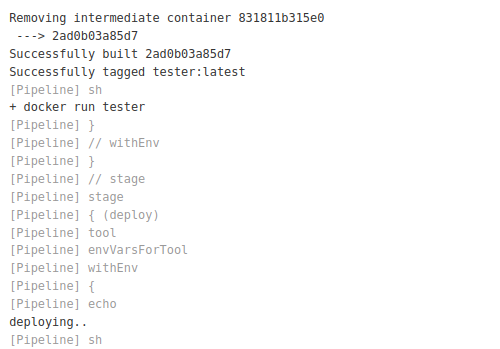

4. Deploy.\
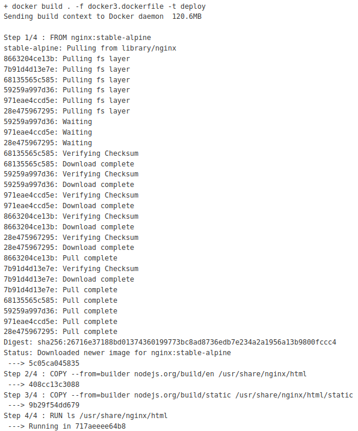
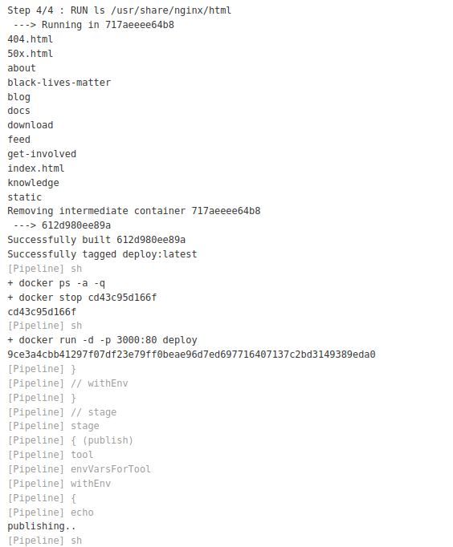

5. Publish.\


6. Stage View.\
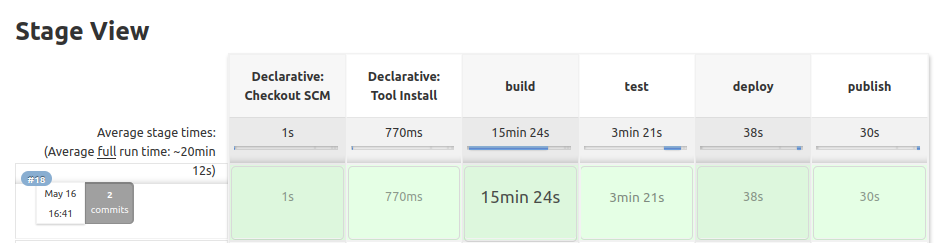

Kiepskie czasy to wynik kiepskiego łącza w moim pokoju na mieszkaniu.

### Wnioski

Tematyka nie jest taka prosta i dla zwykłego programisty czy informatyka jest to problematyczne, chociaż po zagłębieniu się w tematykę możliwe. Pipeline jest bardzo użyteczny i można dzięki niemu ułatwić sobie znacznie pracę.

