# Sprawozdanie 9
# Kamil Pazgan Inżynieria Obliczeniowa GCL02

## Przygotowanie systemu pod uruchomienie

1. Najpierw zająłem się instalacją systemu Fedora 36 na VirtualBox, z odpowiednią konfiguracją.\
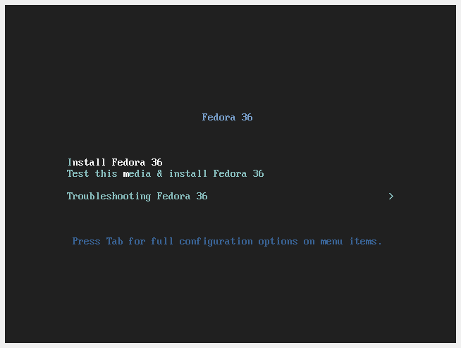
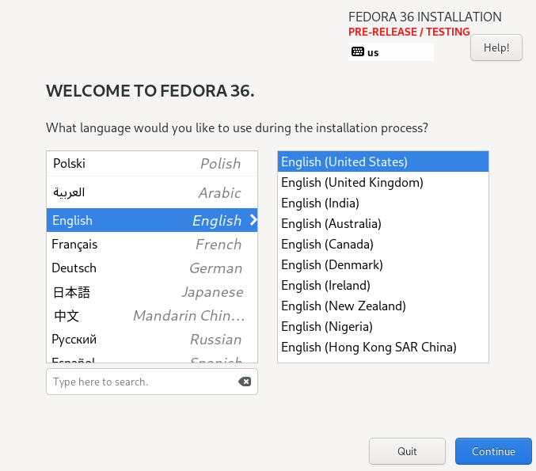
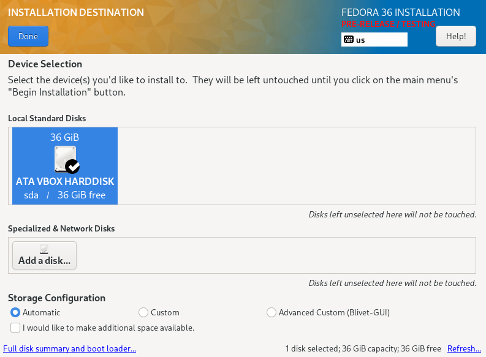
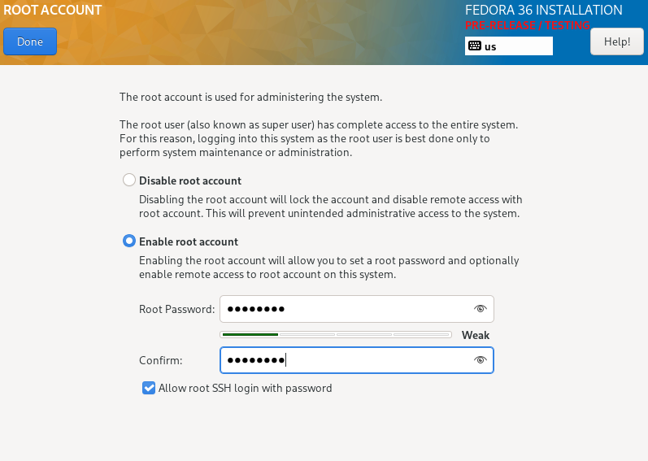
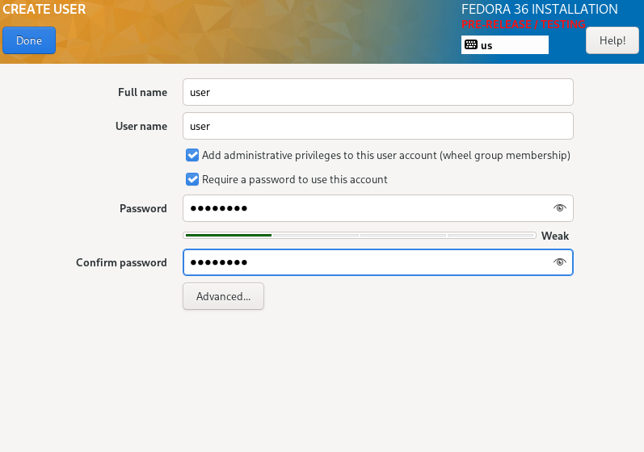
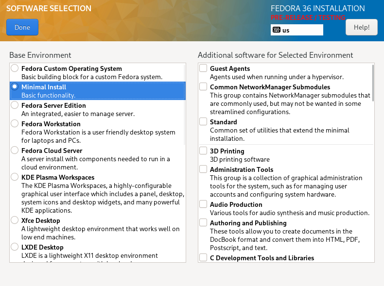

2. Następnie zainstalowałem drugą Fedore, pełniącą rolę serwera.
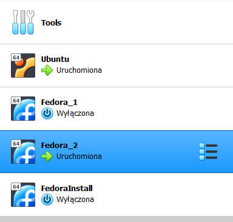

3. Fedora_2, będąca serwerem aby mogła pełnić założone funkcje musi zostać odpowiednio skonfigurowana. W tym celu wykonuje serie poleceń z tutoriala wykopanego z podziemi internetu (How to install Apache on Fedora server).\
```sudo dnf install httpd```
```sudo dnf group install "Web Server"```
```sudo systemctl start httpd```
```sudo systemctl enable httpd```
```sudo firewall-cmd --add-service=http --add-service=https --permanent```
```sudo firewall-cmd --reload```

4. Kolejnym krokiem było wrzucenie artefkatu z Pipeline do serwera, w odpowiednim katalogu. Wykorzystałem do tego *FileZilla*.
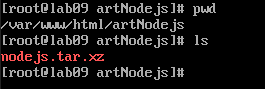

5. Efekt powyższych działań :
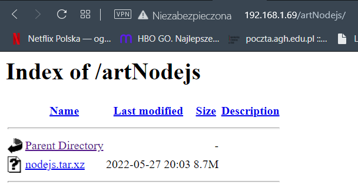
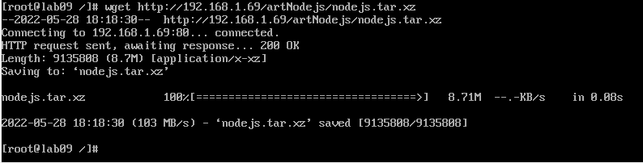

## Instalacja nienadzorowana

1. Dzięki *FileZilla* przeniosłem wygenerowany plik ```anaconda-ks.cfg``` do swojego systemu gdzie dokonałem edycji. Dodałem ścieżkę do repo, usunąłem utworzenie urzytkownika, dodałem odpowiednie narzędzia i pobranie artefaktu:
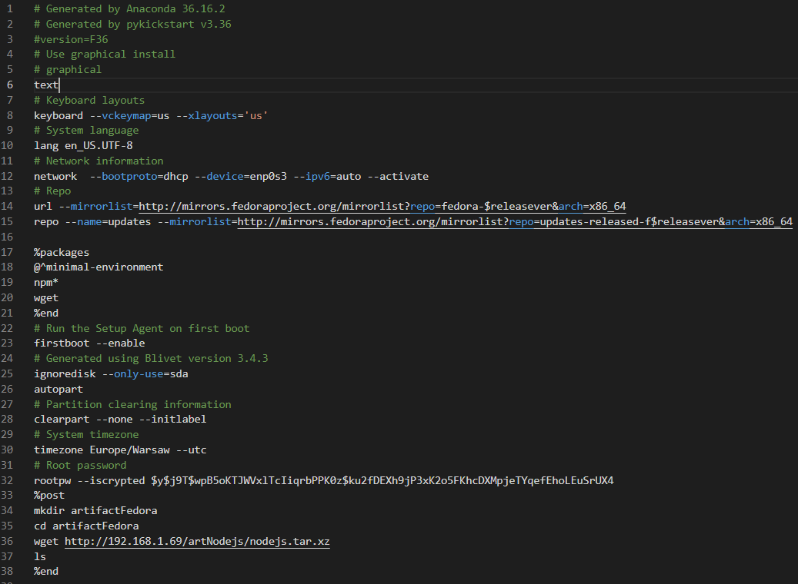

2. Po tym umieściłem plik na repozytorium. Ścieżka do pliku: ```https://raw.githubusercontent.com/InzynieriaOprogramowaniaAGH/MDO2022_S/KP404025/INO/GCL02/KP404025/Lab09/anaconda-ks.cfg```

3. Następnie przeszedłem do instalacji Fedory, gdzie użyłem powyższej ścieżki.


4. Instalacja zakończona pwodzeniem:
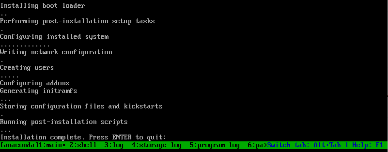

5. Na koniec prezentuje stworzony folder z pobranym artefaktem w zainstalowanym chwilę wcześniej systemie:
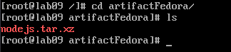

## Problemy

Podczas instalacji napotkałem pewne problemy, które bezlitośnie odebrały mi ze dwie godziny życia. Z tego co przeczytałem dotyczyły DHCP/DNS. Nie pomagały restarty czy jakieś polecenia z forów. Jednak następnego dnia po problemach, wystarczyła jedna próba, która zakończyła się powodzeniem. Nie wiem co się stało, ale to pewnie wynik DHCP/DNS.
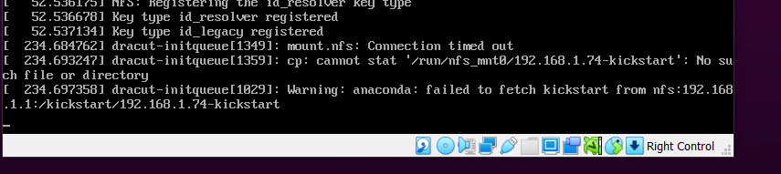