# Sprawozdanie 11
# Kamil Pazgan Inżynieria Obliczeniowa GCL02

## Instalacja klastra Kubernetes

1. W pierwszej kolejności pobrałem i zainstalowałem minikube'a.
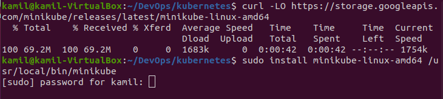

2. Pojawiły się pierwsze problemy, gdy chcaiłem uruchomić minikube'a:\
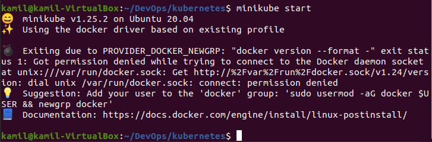

Zgodnie z sugestią dodałem urzytkownika do grupy ```docker```.
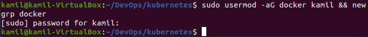

Następnie ponownie spróbowałem uruchomić minikube'a tym razem z pomyślnym wynikiem.
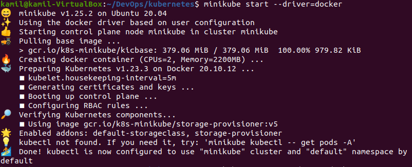

3. Widoczny działający kontener:
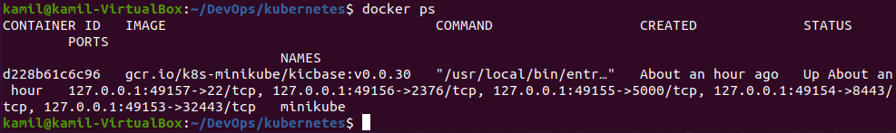

4. Co do wymagań sprzętowych to musiałem zwiększyć ilość rdzeni dla postawionego Ubuntu, ponieważ minikube wymaga 2 lub więcej, Przydzieliłem też więcej pamięci RAM, żeby usprawnić działanie całości.

5. W kolejnym kroku zainstalowałem ```kubectl```.
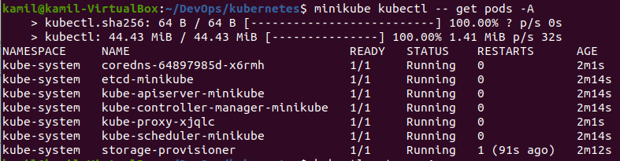

6. Uruchomiłem Dashboard, w przeglądarce:
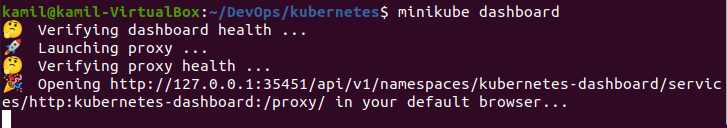
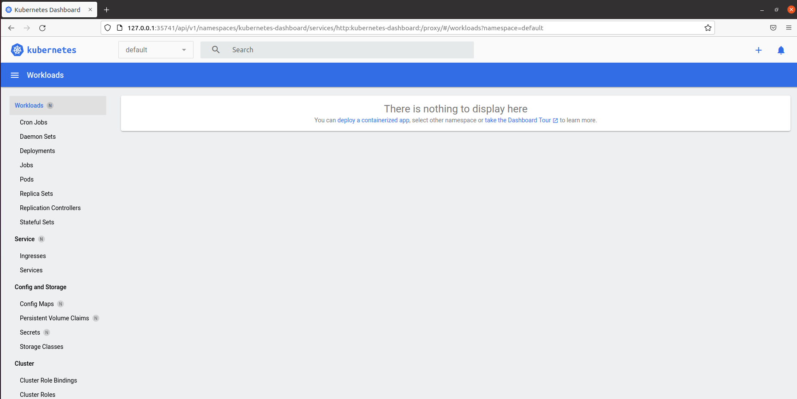

## Uruchamianie oprogramowania

1. Wykorzystałem obraz z tutoriala minikube'a do podstawowej prezentacji działania.


Stworzyłem deploy i wyeksponowałem na porcie 8080. Następnie za pomocą ```service``` wystawiałem aplikację działającą na zestawie podów jako usługę sieciową. Na koniec użyłem prekierowania portów żeby możliwe było wejście poprzez ```http://localhost:7080/``` na aplikacje.
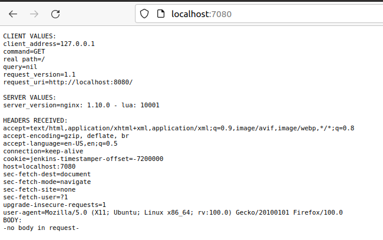

2. Widok z poziomu dashoboard:
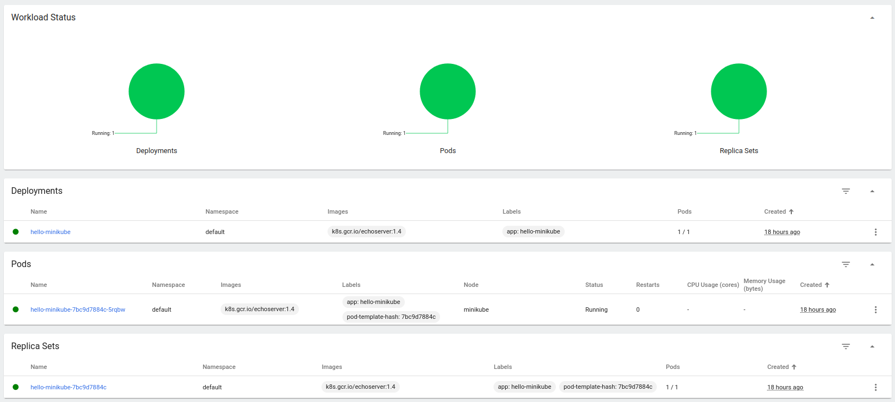
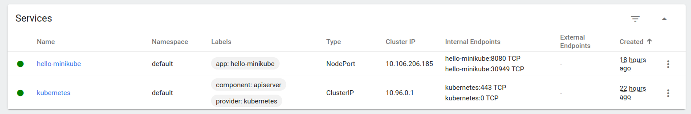
