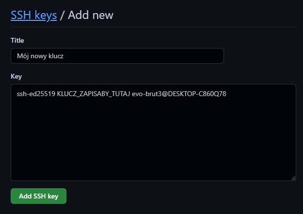
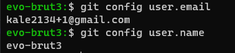
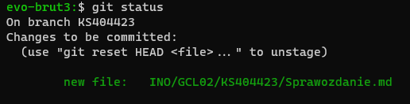

# Zajęcia 01
### 07.03.2022
---

Narzędzia Git oraz do obsługi kluczy SSH mam już zainstalowane domyślnie w systemie (W systemach Ubuntu na przykład można doinstalować pakiety za pomocą `apt-get`).

Najpierw klonuję repozytorium przez HTTPS za pomocą komendy:

```bash
$ git clone https://github.com/InzynieriaOprogramowaniaAGH/MDO2022_S.git
```

Następnie generuję nowy klucz SSH:

```bash
$ ssh-keygen -t ed25519 -C "kale2134+1@gmail.com" -f key_pass
```


Następnie podaję hasło i tworzę jeszcze jeden klucz SSH:

```bash
$ ssh-keygen -t ecdsa -C "kale2134+1@gmail.com" -f key
```

Już wcześniej miałem skonfigurowane klucze dla konta:


Gdybym nie miał należałoby dodać prywatny klucz SSH do `ssh-agent`:

```bash
$ ssh-add key
```

Oraz dodać klucz publiczny do ustawień GitHuba:



Git na komputerze również mam skonfigurowany:



Chcąc sklonować repozytorium za pomocą SSH używam komendy:

```bash
$ git clone git@github.com:InzynieriaOprogramowaniaAGH/MDO2022_S.git
```

Dalej przełączam się na gałąź `main`:

```bash
$ git checkout main
```

Później na gałąź swojej grupy:

```bash
$ git checkout INO-GCL02
```

Tworzę gałąź o odpowiedniej nazwie, odgałęziając się od brancha grupy:

```bash
$ git checkout -b KS404423
```

W katalogu `INO/GCL02` tworzę swój katalog `KS404423`:

```bash
$ cd INO/GCL02
$ mkdir KS404423
```

Utworzony plik:


W swoim katalogu tworzę sprawozdanie.

Dodaję utworzone rzeczy do zmian:

```bash
$ git add .
```



Tworzę commit z wiadomością:

```bash
$ git commit -m "Grupa 02"
```


Wysyłam zmiany do zdalnego źródła, tworząc utworzoną lokalnie gałąź na serwerze:

```bash
$ git push --set-upstream origin KS404423
```

