# Zajęcia 03
### 21.03.2022
---

## Kompilacja, budowanie i uruchomienie testów aplikacji Node.js w środowisku WSL2

Na początku próbowałem z silnikiem Godot ale z uwagi na szacunek do zdrowia psychicznego projekt porzuciłem i zmieniłem na [prosty Tetris napisany w Node.js](https://github.com/ernespn/nodejs-calculator).

Program ten oparty jest o wolną licencję MIT License oraz ma napisane testy.

Rozpoczęto poprzez sklonowanie repo lokalnie na WSL2:

```bash
$ git clone https://github.com/robertrypula/simple-tetris.git
```

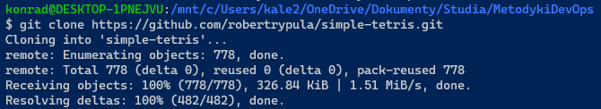

Następnie pobrano zależności wymagane do kompilacji:

```bash
$ sudo apt-get update
$ sudo apt-get install nodejs npm
```
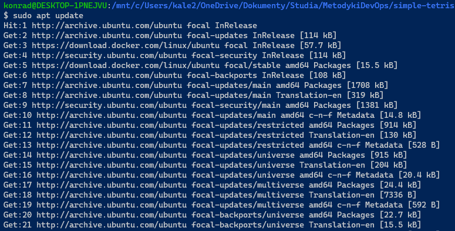

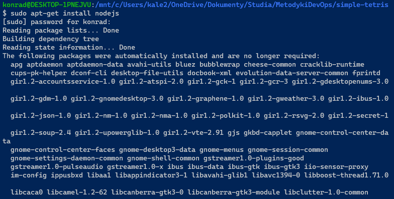

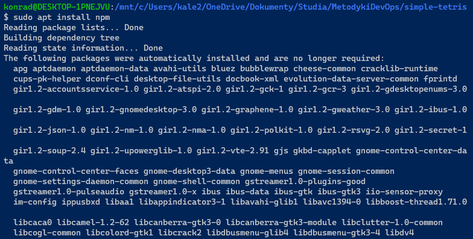

Dalej zainstalowano program wraz z zależnościami:

```bash
$ npm install
```


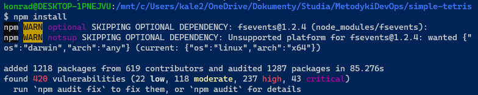

Następnie uruchomiono aplikację:

```bash
$ npm run dev-node
```


*(Gra odpaliła się w terminalu na liście zbudowanych elementów)*

Dalej uruchomiono testy:

```bash
$ npm test
```

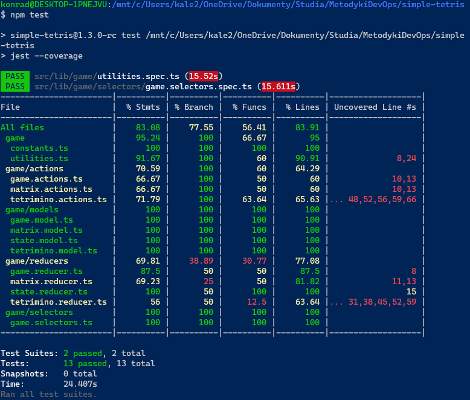


---

## Kompilacja, budowanie i uruchomienie projektu w środowisku skonteryzowanym

Następnie wyżej opisane czynności powtórzono tym razem wewnątrz kontenera bazowego. Do tego celu wykorzystano obraz Node.js:

```bash
$ docker pull node
$ docker image list
```

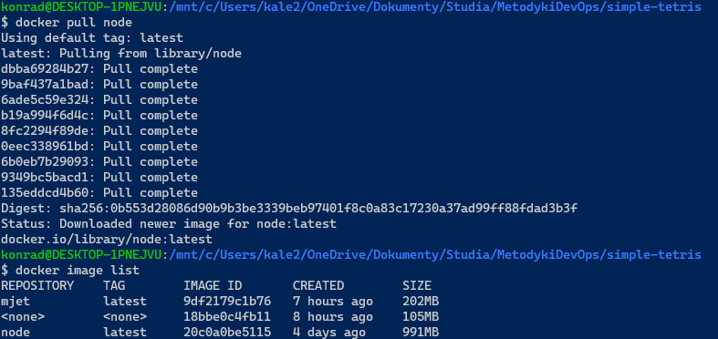

Kontener `node:latest` wdrożono i podpięto do niego terminal:

```bash
$ docker run --interactive --tty node sh
```


Następnie zmieniono ścieżkę na katalog domowy `/home`:

```bash
$ cd home
```

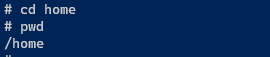

I pobrano kod źródłowy oprogramowania:

```bash
$ git clone https://github.com/robertrypula/simple-tetris.git
$ cd simple-tetris
```

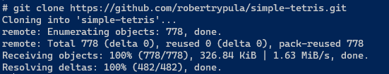

Dalej zainstalowano program wraz z zależnościami:

```bash
$ npm install
```

 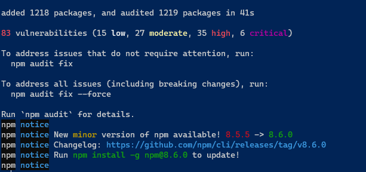

Uruchomiono testowo aplikację w terminalu:

```bash
$ npm run dev-node
```

Wyskoczył następujący błąd:

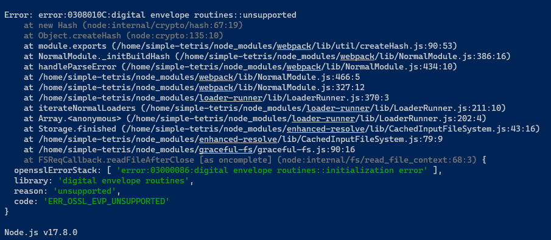

Szybkie googlowanie wskazało [odpowiedź na StackOverflow](https://stackoverflow.com/questions/69692842/error-message-error0308010cdigital-envelope-routinesunsupported):

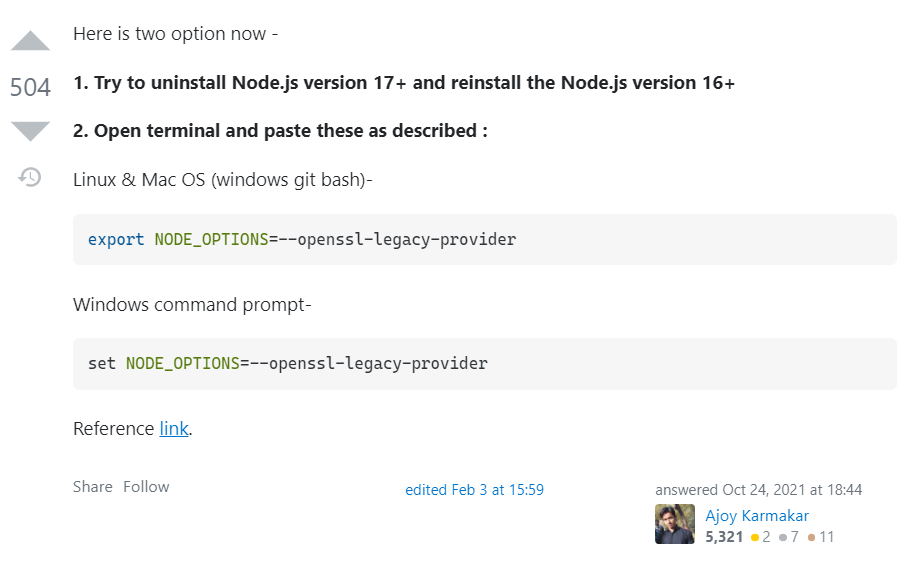

Zaproponowany sposób podziałał:

```bash
$ export NODE_OPTIONS=--openssl-legacy-provider
```


I po uruchomieniu ponownie wyskoczył poprawny obraz gry:

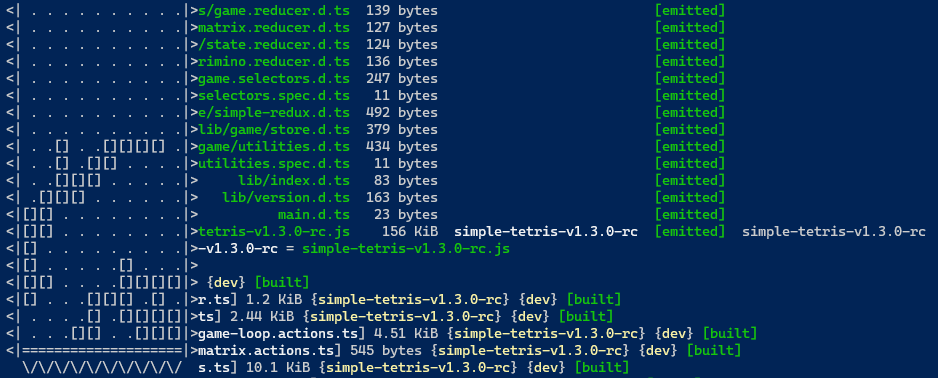

Dodatkowo jeszcze sprawdzono testy:

```bash
$ npm test
```

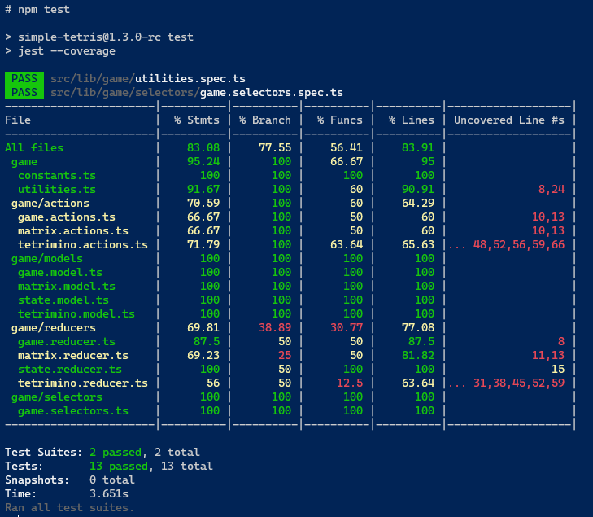


---

## Automatyzacja procesu z użyciem plików Dockerfile

Utworzono: `docker/build/Dockerfile` o następującej treści, którego zadaniem jest:

* Pobranie jako bazy obrazu Node.js
* Sklonowanie repozytorium simple-tetris
* Zbudowanie gry i pobranie zależności 

```dockerfile
FROM node:latest
WORKDIR /home 
RUN git clone https://github.com/robertrypula/simple-tetris.git
WORKDIR /home/simple-tetris
RUN npm install
```

Następnie z pliku tego rozpoczęto proces tworzenia obrazu Dockera:

```bash
$ docker build -f ./docker/build/Dockerfile -t simple-tetris .
```

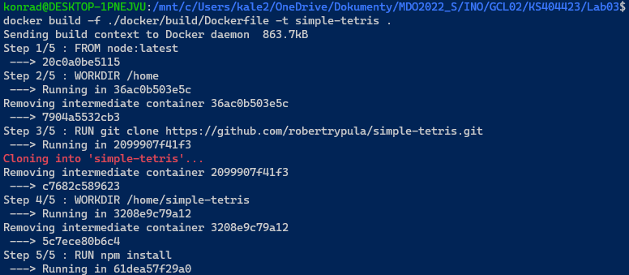

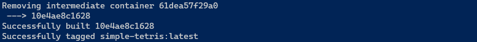

Następnie wylistowano utworzony obraz:

```bash
$ docker image ls -a
```


Dalej utworzono plik `docker/test/Dockerfile` odpowiedzialny za utworzenie obrazu z `simple-tetris:latest` oraz uruchomienie testów:

```dockerfile
FROM simple-tetris:latest
WORKDIR /home/simple-tetris
RUN npm test
```

```bash
$ docker build -f ./docker/test/Dockerfile -t simple-tetris-test .
```

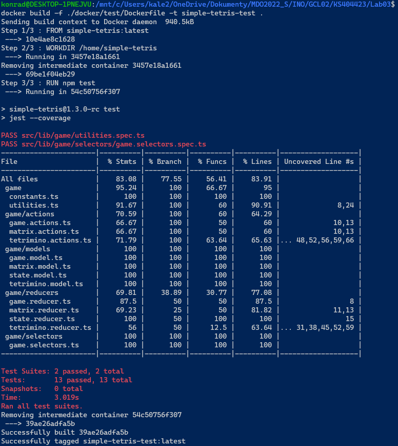

Powstałe obrazy wylistowano ponownie:

``` bash
$ docker image list
```

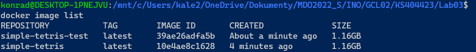

Dla ostatecznego testu upewniono się, że w Tetrisa ze zbudowanego obrazu można pograć, dlatego wdrożono kontener:

```bash
$ docker run -it simple-tetris bash
```


Wylistowano również powstały w ten sposób kontener:

```bash
$ docker container list
```

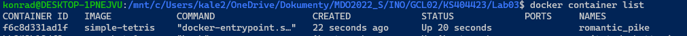


Różnicą pomiędzy obrazem a kontenerem jest to, że:

* **obraz** (image) - to wzorzec używany do wdrażania kontenerów,
* **kontener** (container) - to instancja utworzona z owego wzorca
