# Pipeline
---

Zadaniem projektu było utworzenie pełnoprawnego pipeline'a. Jako oprogramowanie wykorzystano [prosty Tetris napisany w NodeJS](https://github.com/robertrypula/simple-tetris) oparty o licencję MIT.

Do implementacji projektu wykorzystano Docker oraz Jenkinsa, krótki słowniczek pojęć:

**Jenkins** - otwartoźródłowy serwer automatyzujący proces budowania, testowania oraz wdrażania oprogramowania.

**Docker** - oprogramowanie wirtualizujące pozwalające na "konteneryzację" aplikacji.

**DIND (Docker in Docker)** - pozwala na uruchomienie Dockera w kontenerze Dockera, w praktyce przekłada się to na to, że używam skonteneryzowanego Jenkinsa, który może tworzyć wewnątrz następne kontenery.

Więcej szczegółów odnośnie zaplecza oraz przygotowań zostało wprowadzonych w sprawozdaniach do poprzednich laboratoriów.


## Weryfikacja działania środowiska


### Jenkins

Za pomocą poniższej komendy można uruchomić Jenkinsa, którego interfejs webowy zostanie wyprowadzony na localhoście na porcie 8080.

```bash
$ docker run --name jenkins-blueocean --rm --detach \
   --network jenkins \
   --env DOCKER_HOST=tcp://docker:2376 \
   --env DOCKER_CERT_PATH=/certs/client \
   --env DOCKER_TLS_VERIFY=1 \
   --volume jenkins-data:/var/jenkins_home \
   --volume jenkins-docker-certs:/certs/client:ro \
   --publish 8080:8080 \
   --publish 50000:50000 \
   myjenkins-blueocean:2.332.1-1
```

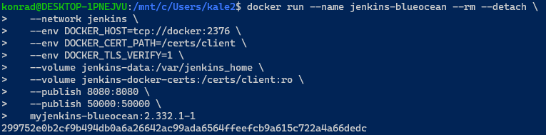


### DIND

Poniższa komenda uruchamia warstwę DIND.

```bash
docker run --name jenkins-docker --rm --detach \
  --privileged --network jenkins --network-alias docker \
  --env DOCKER_TLS_CERTDIR=/certs \
  --volume jenkins-docker-certs:/certs/client \
  --volume jenkins-data:/var/jenkins_home \
  --publish 2376:2376 \
  docker:dind --storage-driver overlay2
```

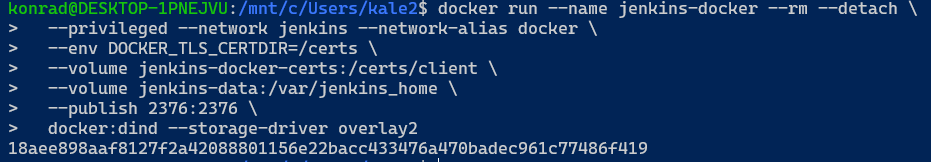


### Sprawdzenie stanu obu kontenerów

```bash
$ docker ps -a
```

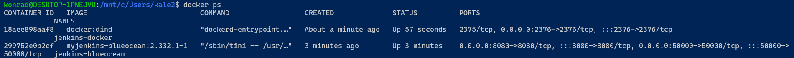

Oba kontenery działają więc można przejść do pracy!


## **Rozpoczęcie projektu w Jenkins**

W interfejsie GUI postawionym na localhost na porcie 8080, wybrano opcję **Nowy Projekt**:

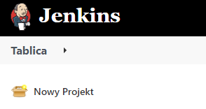

Następnie podano nazwę oraz wybrano kategorię projektu jako **Pipeline**:

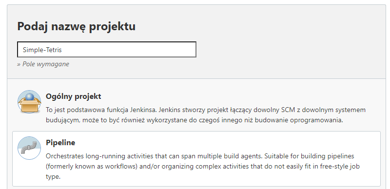


W dalszej kolejności zmieniono ustawienia spod zakładki **Pipeline:**

* Pochodzenie skryptu na pochodzący z systemu kontroli wersji
  * **Definition** - Pipeline script from SCM
* System kontroli wersji jako Git
  * **SCM** - Git
* Repozytorium jako repo projektowe
  * **Repository URL** - https://github.com/InzynieriaOprogramowaniaAGH/MDO2022_S.git
* Gałąź własnego projektu
  * **Branch Specifier** - */KS404423

* Lokalizację pliku zawierającego instrukcję pipeline'a Jenkinsfile
  * **Script Path** - INO/GCL02/KS404423/Pipeline/Jenkinsfile


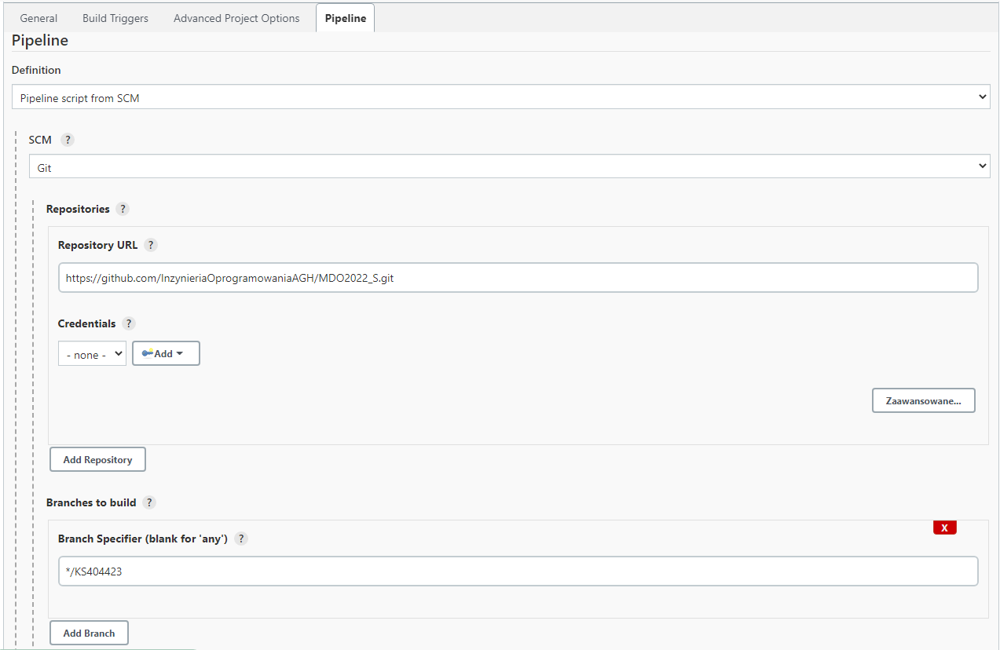

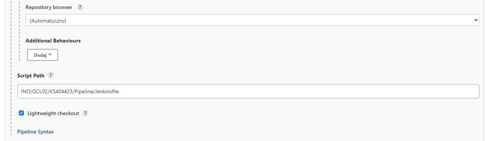


Ostateczna postać pliku Jenkinsfile prezentuje się następująco:

```yaml
pipeline {
  agent any
  
  stages {
    stage('Build') {
      steps {
        echo '1. Building step...'
        dir ('INO/GCL02/KS404423/Pipeline') {
          sh 'docker build -f ./docker/build/Dockerfile -t simple-tetris-builder .'
        }
      }
    }
    
    stage('Tests') {
      steps {
        echo '2. Running tests...'
        dir ('INO/GCL02/KS404423/Pipeline') {
          sh 'docker build -f ./docker/test/Dockerfile -t simple-tetris-tester .'
        }
      }
    }
    
    stage('Deploy') {
      steps {
        echo '3. Deploying...'
        dir ('INO/GCL02/KS404423/Pipeline') {
          sh 'docker run -v $PWD:/home/vol-out simple-tetris-builder:latest cp -r /home/simple-tetris/dist /home/vol-out/'
          sh 'docker build -f ./docker/deploy/Dockerfile -t simple-tetris-deploy .'
        }
        sh 'docker run --detach simple-tetris-deploy:latest'
      }
    }
    
    stage('Publish') {
      steps {
        echo '4. Publishing package...'
        dir ('./artifact') {
          sh 'docker run -v $PWD:/home/vol-publish simple-tetris-builder:latest bash -c \"npm pack /home/simple-tetris --pack-destination=/home/vol-publish/\" '
          archiveArtifacts artifacts: '*.tgz'
        }
      }
    }
    
  }  
}

```


## Opis architektury pipeline'a

### Schemat działania

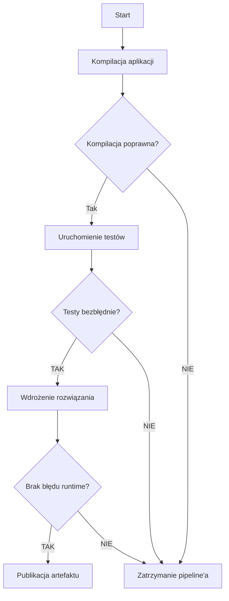


### Opis etapów

#### Build

Głównym zadaniem pierwszego etapu jest zbudowanie aplikacji

*Jenkinsfile*

```bash
...
stage('Build') {
  steps {
    echo '1. Building step...'
	dir ('INO/GCL02/KS404423/Pipeline') {
	  sh 'docker build -f ./docker/build/Dockerfile -t simple-tetris-builder .'
    }
  }
}
...
```

Za pomocą funkcji `dir()` modyfikowana jest obecna lokalizacja wykonywania kodu. Następnie przy użyciu komendy `sh` wywoływany jest build obrazu Dockera *simple-tetris-builder*, którego głównym zadaniem jest kompilacja oraz budowanie kodu. 

> Argumenty polecenia **docker build**:
>
> * **-f** : ścieżka do wybranego pliku zawierającego instrukcje do tworzenia obrazu
> *  **-t** : nazwa wynikowego obrazu

*Dockerfile*

```dockerfile
FROM node:latest
WORKDIR /home 
RUN git clone https://github.com/robertrypula/simple-tetris.git
WORKDIR /home/simple-tetris
ENV NODE_OPTIONS=--openssl-legacy-provider
RUN npm install
RUN npm run-script build
```

Obraz ten bazuje na obrazie `node:latest` który zawiera wymagane zależności NodeJS. Następnie ustawia katalog pracy na `/home` by do niego sklonować repozytorium z kodem programu, później ustawia katalog z kodem jako katalog pracy.

Wywołanie komendy `ENV` następuje w związku z błędem w kontenerze:

```sh
Error: error:0308010C:digital envelope routines::unsupported
    ...
  opensslErrorStack: [ 'error:03000086:digital envelope routines::initialization error' ],
  library: 'digital envelope routines',
  reason: 'unsupported',
  code: 'ERR_OSSL_EVP_UNSUPPORTED'
}
command terminated with exit code 1
```

Jest on związany z niekompatybilnością jednego z algorytmów szyfrujących z nową wersją OpenSSL.

Na końcu następują instrukcję komend `npm` do instalacji wymaganych modułów npm oraz buildowania programu. Wynik budowania znajduje się w folderze `/home/simple-tetris/dist`.

**Końcowy obraz składa się z:**

* NodeJS
* Deweloperskich modułów npm
* Kodu źródłowego aplikacji
* Zbudowanej aplikacji


#### Tests

Zadaniem następnego etapu jest przeprowadzenie testów na zbudowanym rozwiązaniu.

*Jenkinsfile*

```bash
stage('Tests') {
  steps {
    echo '2. Running tests...'
    dir ('INO/GCL02/KS404423/Pipeline') {
      sh 'docker build -f ./docker/test/Dockerfile -t simple-tetris-tester .'	
	}
  }
}
```

Etap z poziomu konfiguracji działa na takiej samej zasadzie. Następuje przejście do folderu projektu oraz wywoływana jest instrukcja budowania obrazu na pliku z instrukcjami. Gotowy zostaje nazwany *simple-tetris-tester*.

*Dockerfile*

```dockerfile
FROM simple-tetris-builder:latest
WORKDIR /home/simple-tetris
RUN npm test
```

Obraz opiera się na utworzonym w poprzednim etapie obrazie *simple-tetris-builder* w najnowszej wersji. Następnie ustawia folder roboczy na folder z kodem oraz uruchamia polecenie `npm test` wywołujące wszystkie testy na skompilowanym kodzie.

W przypadku gdy jakiś test nie przejdzie `npm` zwraca wartość różną od zera, co powoduje przerwanie etapu, a w rezultacie całego pipeline'a.

**Końcowy obraz wygląda tak samo jak obraz _simple-tetris-builder_.**

> **Jeżeli obrazy są takie same to dlaczego nie uruchamiać testów w kontenerze zamiast tworzyć nowy obraz?**
>
> Otóż w przypadku chęci rozbudowania projektu, np. dodania prostej funkcjonalności przechowywania zapisanego logu z testów w obrazie, nastąpiłaby komplikacja. Gdzie przechowywać powstały log? Jeżeli aplikacja rozrosłaby się do kolosalnych rozmiarów, skomplikowałby się również ekosystem testów. Z uwagi na to - lepiej od razu zacząć od tworzenia obrazu.


#### Deploy

Głównym zadaniem tego etapu jest wdrożenie powstałego kodu. 

_Jenkinsfile_

```bash
stage('Deploy') {
  steps {
    echo '3. Deploying...'
      dir ('INO/GCL02/KS404423/Pipeline') {
      sh 'docker run -v $PWD:/home/vol-out simple-tetris-builder:latest cp -r /home/simple-tetris/dist /home/vol-out/'
      sh 'docker build -f ./docker/deploy/Dockerfile -t simple-tetris-deploy .'
    }
    sh 'docker run --detach simple-tetris-deploy:latest'
  }
}
```

**Osobny obraz wdrożeniowy** potrzebny jest dlatego aby nie wdrażać się wraz z całym środowiskiem deweloperskim, zdradziłoby to cały kod źródłowy oraz wszystkie sekrety związane z produkcją, pomijając najważniejsze kwestie bezpieczeństwa (byłoby to istnym samobójstwem), konkurencja mogłaby przeanalizować w pełni nasze rozwiązanie. Z najlżejszych problemów (ale wciąż problemów!) klient otrzymałby produkt końcowy w olbrzymich rozmiarach i skomplikowanego.

Mając powyższe na uwadze - Jenkins najpierw tworzy nowy kontener na bazie utworzonego obrazu, czyli tworzy nową nadpisywalną warstwę na szczycie stałych warstw obrazu. Do powstałego kontenera wiąże wolumin - obecną ścieżkę w hoście (Jenkins) montuje w lokalizacji domowej kontenera (*simple-tetris-builder*).  Następnie wywołuje komendę kopiującą folder ze zbudowanym kodem do ścieżki w hoście - w ten sposób "wyciągany" jest produkt końcowy ze środowiska deweloperskiego.

> Argumenty polecenia **docker run**
>
> * **-v** : montowanie ścieżki host-kontener
> * **cp -r** : polecenie bash do rekurencyjnego kopiowania plików
> * **--detach** : uruchomienie kontenera w tle

W dalszej części uruchamiane jest tworzenie kolejnego obrazu, tym razem wdrożeniowego, na samym końcu polecenia tworzącego *simple-tetris-deploy* znajduje się `.` (kropka): jest to przesłanie obecnej ścieżki jako kontekstu do zbudowania obrazu. W tym przypadku oznacza to, że tworzony obraz w czasie uruchamiania instrukcji *Dockerfile* będzie miał dostęp do wszystkiego co zostało podane w zadanym kontekście - czyli tutaj kodu źródłowego.

_Dockerfile_

```dockerfile
FROM node:latest
COPY dist /home/simple-tetris
ENTRYPOINT ["node", "/home/simple-tetris/ascii-runner-node.js"]
```

Obraz bazowany jest na obrazie NodeJS, następnie polecenie `COPY` kopiuje folder z hosta ze zbudowanym rozwiązaniem do katalogu domowego obrazu.

Na końcu jako `ENTRYPOINT` ustawiane jest wywołanie `node` na pliku `ascii-runner-node.js` - czyli uruchomienie programu. Przy każdorazowym utworzeniu kontenera ta komenda będzie wywoływana jako pierwsza (o ile nie zostanie to nadpisane przez polecenie `--entrypoint`). 

---

W momencie kiedy zostanie utworzony obraz wdrożeniowy *simple-tetris-deploy*, jest on następnie uruchamiany w formie `--detach`, tzn. odłączonej. Niestety nie sprawdzam w żaden sposób czy kod wywołuje się poprawnie, nie zaimplementowałem również zatrzymywania powstałego konteneru oraz jego usunięcie.

**Końcowy obraz składa się z:**

* NodeJS
* Zbudowanej aplikacji


#### Publish

Zadaniem ostatniego etapu jest opublikowanie powstałego artefaktu. Artefaktem w moim przypadku **nie jest** obraz wdrożeniowy Dockera z aplikacją, jest nim tylko plik zawierający moduł, z uwagi na to, że końcowy użytkownik dostaje paczkę `npm`, nie ma potrzeby zmuszania go do przygotowania środowiska dockerowego na jego komputerze, które jest bardziej zasobożerne niż NodeJS.

_Jenkinsfile_

```bash
stage('Publish') {
  steps {
    echo '4. Publishing package...'
    dir ('./artifact') {
      sh 'docker run -v $PWD:/home/vol-publish simple-tetris-builder:latest bash -c \"npm pack /home/simple-tetris --pack-destination=/home/vol-publish/\" '
      archiveArtifacts artifacts: '*.tgz'
    }
  }
}
```

Najpierw tworzony jest nowy folder `artifact`, w którym uruchamiany jest kontener obrazu *simple-tetris-builder* z zamontowaną obecną ścieżką oraz poleceniem spakowania w niej modułu do pliku `.tgz`.

Na końcu za pomocą funkcji Jenkinsa `archiveArtifacts` wskazywany jest plik o rozszerzeniu `.tgz`, forma ta została użyta z uwagi na to, że `npm pack` może utworzyć różną nazwę paczki w zależności od jej wersji. Aby zaoszczędzić dodatkowych operacji, utworzony artefakt, który weźmie Jenkins będzie zawsze tym co zostało utworzone przez npm.

> Argumenty **npm pack**:
>
> * **--pack-destination** : destynacja utworzonej paczki z modułem 

*Brak Dockerfile'a z uwagi na formę publikowania artefaktu.*


## Uruchomienie i test pipeline'u

Utworzony w ten sposób pipeline uruchomiono z poziomu interfejsu Jenkins'a (zielona strzałka):

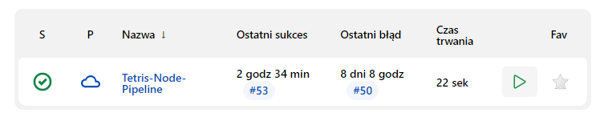

### Uzyskany rezultat

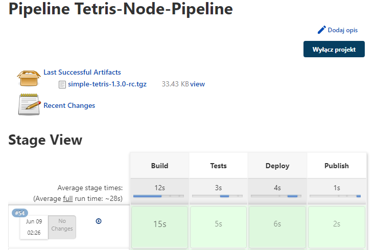


### Logi konsoli

| 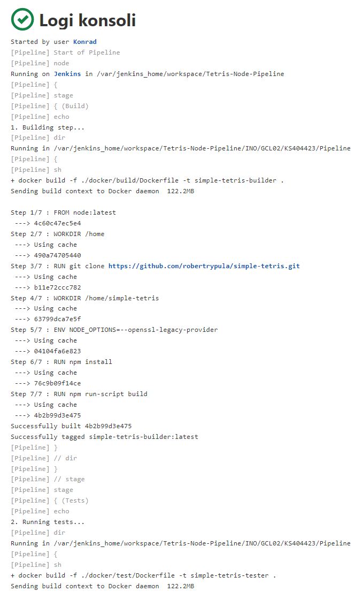 | 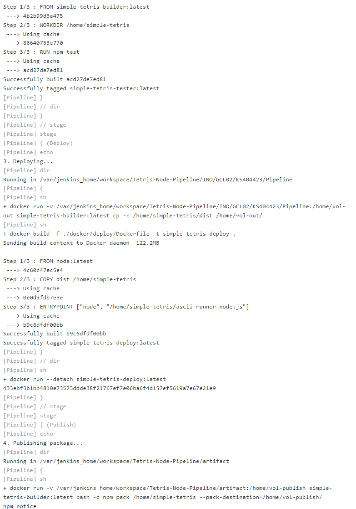 |
| ------------------------------------------------------------ | ------------------------------------------------------------ |
| 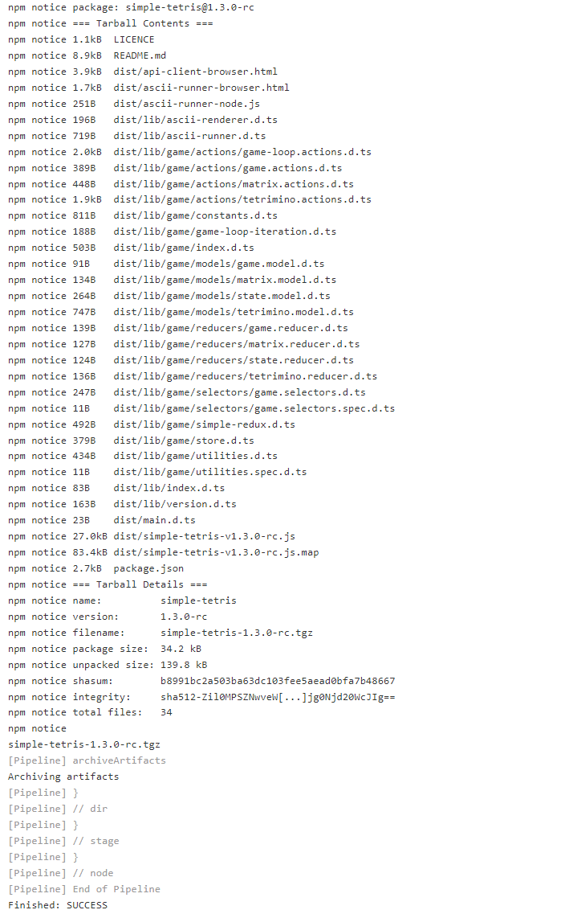                                                               |

### Uruchomiona aplikacja

#### Uruchomiona z powstałego artefaktu

Powstały plik `simple-tetris-1.3.0-rc.tgz` pobrano oraz wypakowano

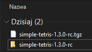

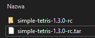

Uruchomiono plik `ascii-runner-browser.html` (jeden z prostszych sposobów uruchomienia aplikacji w przeglądarce):

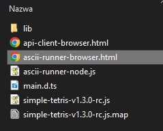

Aplikacja:

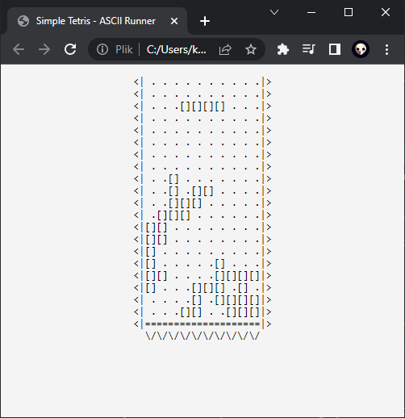


#### Z obrazu Dockera

Najpierw poszukano id kontenera uruchomionego Jenkinsa:

```bash
$ docker container list -a
```


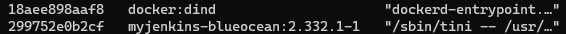

Następnie uruchomiono w nim `bash`:

```bash
$ docker exec -it 299752e0b2cf bash
```

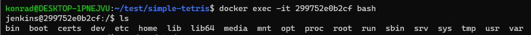

Będąc w środku wylistowano wszystkie kontenery:

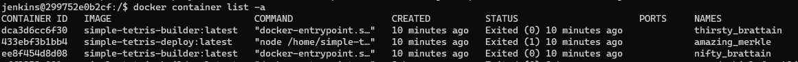

Oraz obrazy:

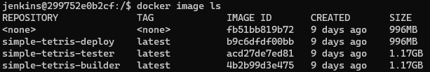

Na końcu uruchomiono ten opatrzony nazwą _simple-tetris-deploy_:

```bash
$ docker run -it simple-tetris-deploy
```

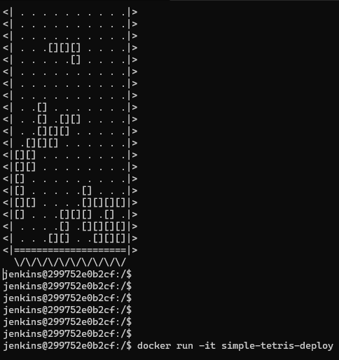

*Renderowanie jest troszkę popsute w terminalu.*


## Podsumowanie i wnioski

Technologie Jenkins oraz Docker umożliwiają utworzenie pełnoprawnego oraz zautomatyzowanego systemu do komplikacji, budowania kodu, przetestowania powstałego rozwiązania, wdrożenie do środowiska produkcyjnego oraz publikację w formie artefaktu.

Docker zdejmuje z użytkownika obowiązek powtarzalnego procesu przygotowania środowiska deweloperskiego, umożliwia za pomocą prostego zestawu instrukcji instalację konteneryzowanego zestawu narzędzi w dowolnym wybranym zestawie. Ponadto rozdzielenie obrazów od kontenerów pozwala na przechowywanie nienadpisywalnej formy owego środowiska i wykonywanie wszelkich modyfikacji na nadpisywalnej warstwie kontenera, umożliwia to płynny recycling.

Jenkins z kolei pozwala na wyższe zarządzanie pipelinem, pozwala na automatyzację procesów np. Dockerowych za pomocą DIND. W zaprezentowanym projekcie, Jenkins pełni rolę managera obrazów oraz kontenerów dockerowych.

Zastosowanie powyższych technologii w procesie ciągłego rozwijania kodu umożliwia płynne wdrażanie nowych rozwiązań i dostarczanie ich klientowi. Pozwala na ujednolicenie wymagań od programistów, pracujących nad kodem, odnośnie środowiska deweloperskiego. Stosując pipeline w chmurze dla przykładu - programista nie musi posiadać nawet wymaganych zależności na swoim komputerze.


## Napotkane błędy oraz problemy

Główne problemy związane były z błędami spowodowanymi niekompatybilnością wersji poszczególnych wymagań. Jednym z takich problemów, które wymieniłem wyżej była nieobsługiwana nowa wersja OpenSSL przez jedną z dependencji npm. Ponadto niektóre komendy Jenkinsa wydawały mi się niejasne, np. Jenkins zezwala na użycie polecenia:

```bash
agent {
  docker { image 'node:16.13.1-alpine' }
}
```

Jednak wywołuje ono błąd i nie byłem w stanie zrozumieć dlaczego.

Dodatkowo momentami nie miałem uprawnień do tworzenia folderów wewnątrz Jenkinsa przez Jenkinsfile za pomocą `makedir`, dlatego używałem głównie dedykowanej metody `dir()`.
