# Sprawozdanie - Lab01
## Instalacja klienta Git i obsługi kluczy SSH
1. W pierwszym kroku upewniłem się, że posiadam już zainstalowanego Gita oraz obsługe kluczy ssh
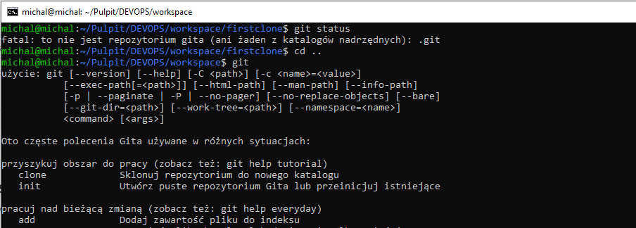
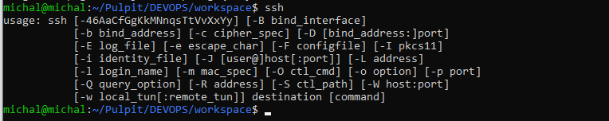

## Klonowanie repozytorium za pomocą HTTPS
2. Następnie sklonowałem repozytorium https://github.com/InzynieriaOprogramowaniaAGH/MDO2022_S za pomocą HTTPS
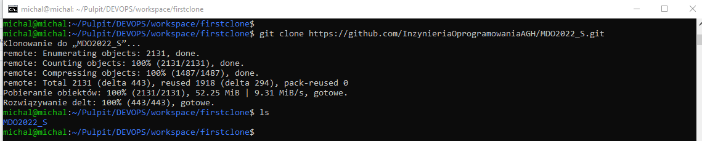
   
## Protokół SSH
3. W celu wykorzystania protokołu SSH w dostępie do repozytorium, utworzyłem dwa klucze SSH. 
W tym celu wykorzystałem polecenie ssh-keygen podając również swój mail z github oraz ścieżkę zapisu i nazwę klucza.
4. Jeden klucz zabezpieczony hasłem z weryfikacją działania:
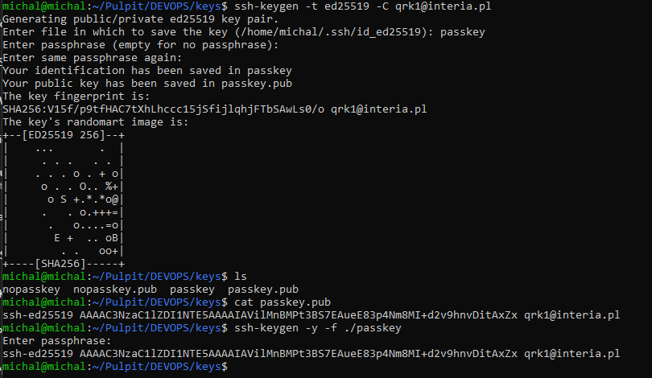
   
5. Jeden klucz bez hasła z weryfikacją działania: 
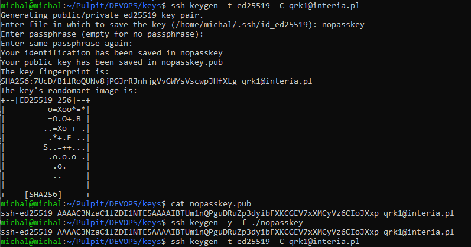

6. Dodanie kluczy na Githubie:
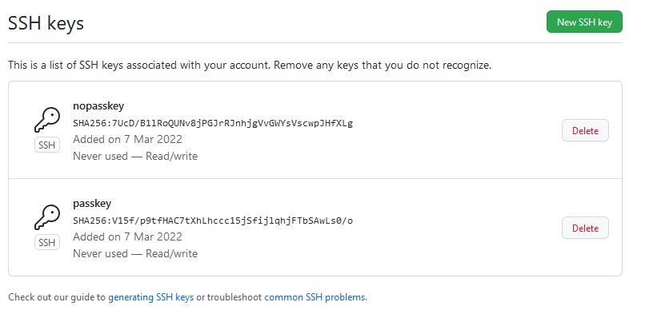

7. Aby móc używać  używać ssh przez moje konto wykorzystałem polecenie "eval":
   
   
## Praca z repozytorium
8. Pobrałem repozytorium przez SSH
   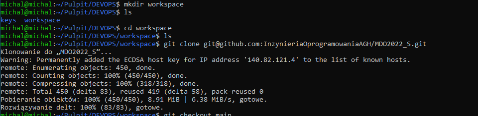
9. Przełączyłem się na gałąź main a następnie na gałąź swojej grupy 
   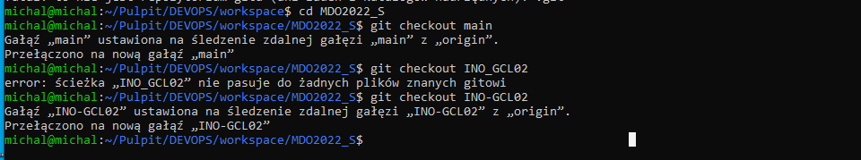
10. Utworzyłem swoją gałąź zgodnie z przedstawioną w instrukcji konwencją, na którą odrazu się przełączyłem (checkout -b).  Po czym przeszedłem w odpowiednie miejsce w katalogiach i utworzyłem swó folder na sprawozdanie i pliik, które w nim umieściłem
   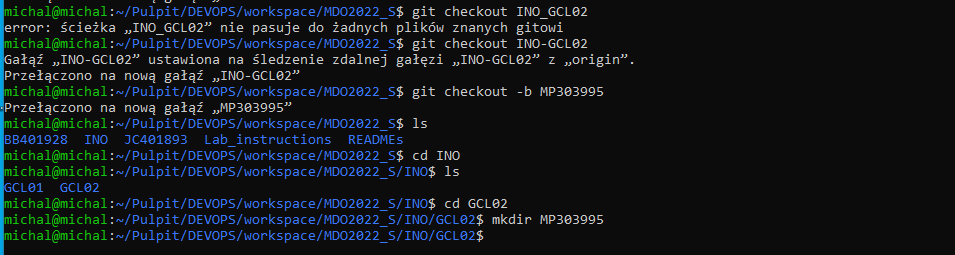
11. Dodałem aktualny stan sprawozdania wraz ze wszystkimi zrzutami ekranu, które wykonałem, a następnie utworzyłem commita i wypchnąłem zmiany do zdalnego repozytorium.
  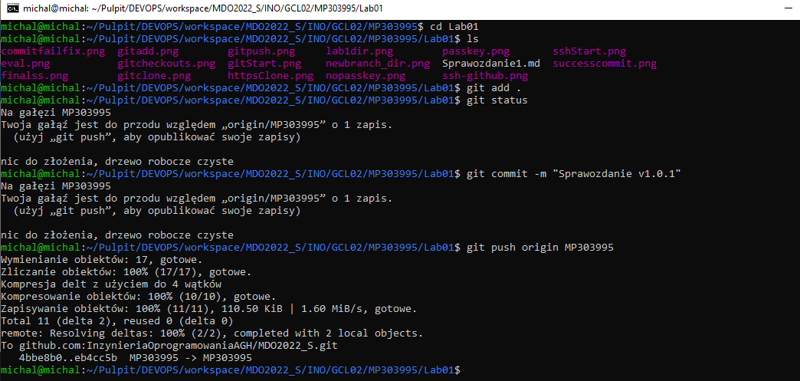
12. Spróbowałem wciągnąc swoją gałąź do gałęzi grupowej. W tym celu spróbowąłem zmergowania swojego brancha z branchem grupy korzystając z polecenia git merge.
Operacja nie powiodła się, poniewaz branch grupowy jest na remote branchem typu protected co powoduję, że przy takiej operacji nastepuje odmowa bezpośredniego merga.
  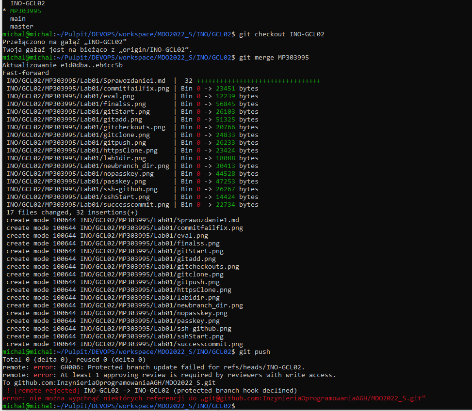
13. Dokonczyłem sprawozdanie i utworzyłem pull requesta.
  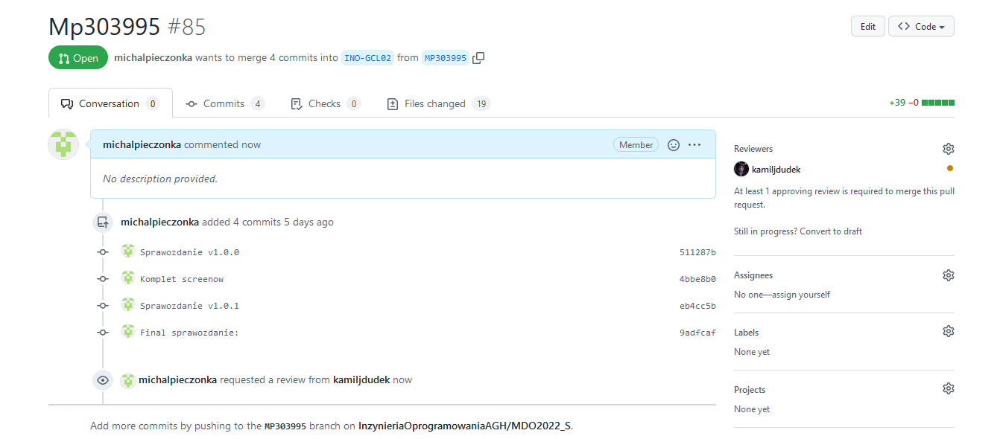
