# Michał Pieczonka - 303995
## Sprawozdanie - LAB02
## Git hook
### Hook sprawdzający czy tytuł commita nazywa się ```<inicjały><numer indeksu>```
* W celu przygotowania hooka w pierwszym kroku przeszedłem do ukrytego katalogu ```\.git\hooks```
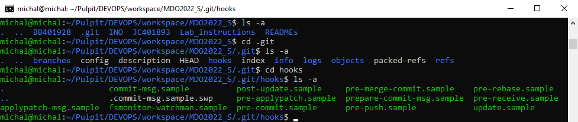
* W następnym kroku w celu przygotowania hooka sprawdzającego poprawność tytułu commita otworzyłem za pomocą NANO plik ```commit-msg.sample```, który jest wykonywany w trakcie tworzenia wiadomości commita. 
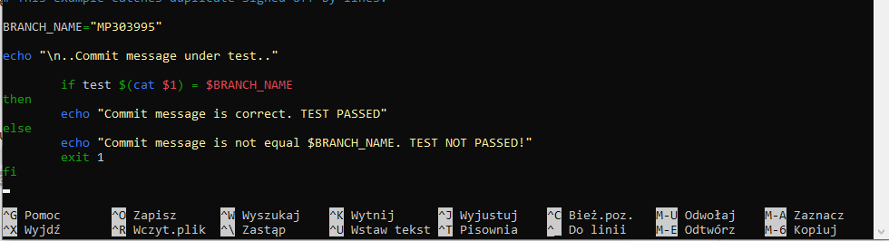
* W argumencie $1 znajduje się treść commita. W skrypcie, wykorzystując funkcję test sprawdzam czy argument $1 zawiera wartość argumentu ```BRANCH_NAME``` będącego złączeniem mojego inicjału oraz numeru indeksu. W zależności od uzyskanego wyniku wyświetlam odpowiednią informację. Na końcu plik zapisuje pod własciową, domyślną nazwą (```commit-msg```)
* W kolejnym kroku przystąpiłem do przetestowania działania. 
* Pierwsza próba zakończyła się niepowodzeniem z następującym wynikiem:

* Wynik braku działania hooka został spowodowany faktem, iż tworząc nowy plik ```commit-msg``` domyślnie został on utworzony, jako plik niewykonywalny. Aby uczynić go plikiem wykonywalnym musiałem wykorzystać komendę ```chmod +x commit-msg```, co naprawiło problem.
 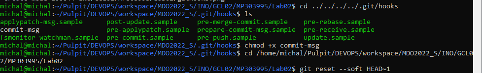
* Wynik działania dla niepoprawnej treści commita
 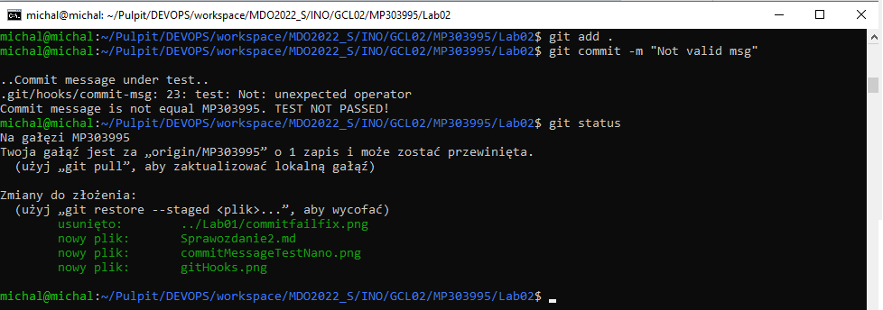
* Wynik działania dla poprawnej treści commita 
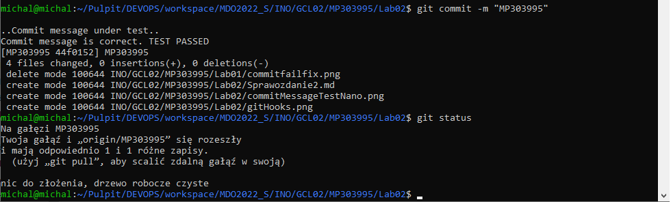
* Kod hooka został zamieszczony poniżej 
```bash
BRANCH_NAME="MP303995"

echo "\n..Commit message under test.."

        if test $(cat $1) = $BRANCH_NAME
then
        echo "Commit message is correct. TEST PASSED"
else
        echo "Commit message is not equal $BRANCH_NAME. TEST NOT PASSED!"
        exit 1
fi
```
### Hook sprawdzający, czy w treści commita pada numer labu, właściwy dla zadania
* W celu przygotowania hooka wykonałem kroki analogiczne jak w powyżej opisanym przykładzie. Plikiem który wykorzystałem, jako bazę do utworzenia hooka był ```pre-commit```, który wykonywany jest przed utworzeniem wiadomości.
* Tym razem w kodzie hooka poprzez diff z przełącznikiem cached sprawdzam czy w zmianach do zacommitowania zawarta jest wartość ścieżki ```/Lab02/```. Dzięki takim modyfikacją commit zostanie zaakceptowany tylko gdy zostaną dokonane zmiany w katalogu aktualnych laboratoriów.
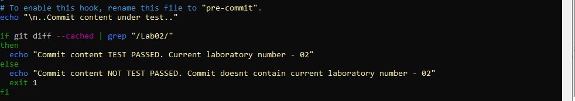
*  W kolejnym kroku przystąpiłem do przetestowania działania.
*  Wynik działania dla niepoprawnej zawartości (Katalog Lab01)
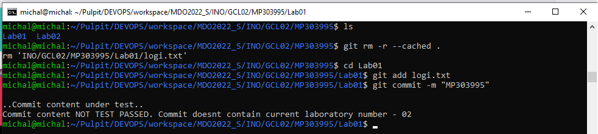
*  Wynik działania dla poprawnej zawartości 
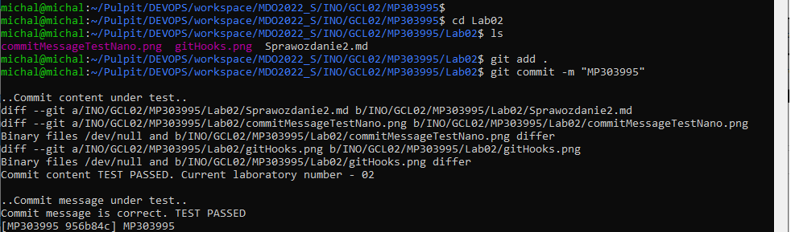

* Kod hooka został zamieszczony poniżej 
```bash
echo "\n..Commit content under test.."

if git diff --cached | grep "/Lab02/"
then
  echo "Commit content TEST PASSED. Current laboratory number - 02"
else
  echo "Commit content NOT TEST PASSED. Commit doesnt contain current laboratory number - 02"
  exit 1
fi
```

## Docker
### **Przygotowanie środowiska Dockerowego**
* **zapewnij dostęp do maszyny wirtualnej przez zdalny terminal (nie "przez okienko")**
* W swojej pracy na zajęciach korzystam z Ubuntu 20.04 na VirtualBox, do której mam dostęp poprzez SSH co widać na przedstawionych wcześniej zrzutach ekranu dotyczących przygotowania Git hook'ów, a w celu ponownej weryfikacji przedstawiłem poniżej zrzut ekranu przedstawiający tworzenie połączenia poprzez cmd
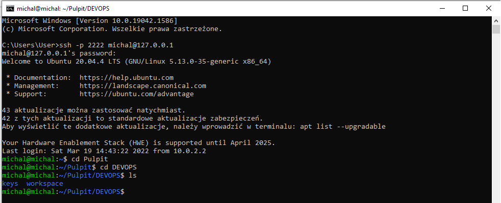
* **zainstaluj środowisko dockerowe w stosowanym systemie operacyjnym**
* Na przygotowanej VM posiadałem już zainstalowanego dockera, dlatego nie instalowałem go ponownie. Dodatkowo uruchomiłem hello-worlda aby wykazać działanie.
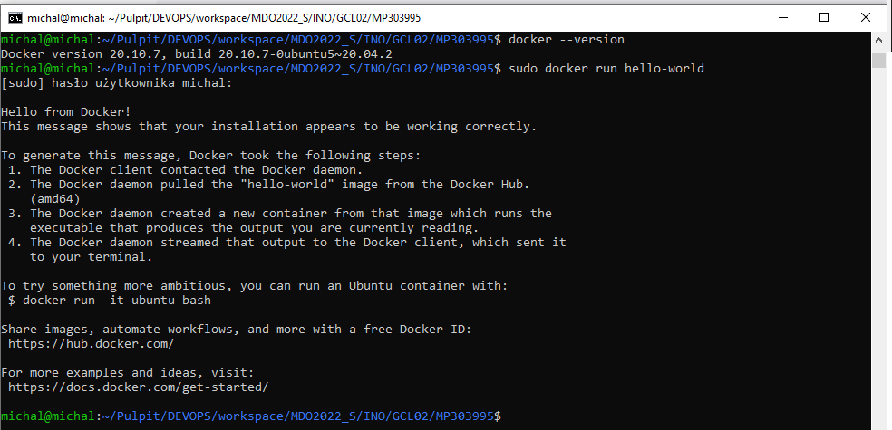

### **Działanie środowiska Dockerowego**
* **wykaż, że środowisko dockerowe jest uruchomione i działa (z definicji)**
* Z definicji dzialanie środowiska docerowego mogę pokazać przez sprawdzenie statusu procesów poleceniem ps z przełącznikiem -aux. Dodatkowo przez użycie grep szukam słowa docker. Jak widać na poniższym zrzucie ekranu na VM jest proces dockerd oraz containerd.
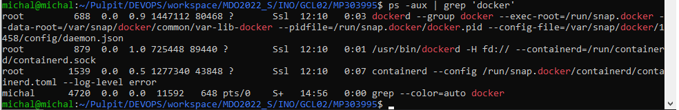
* **wykaż działanie z sposób praktyczny (z własności)**
* Działanie wykazuje przez pobranie obrazu Fedory i uruchomienie systemu poleceniem ```docker run```. Sprawdzam również wersję poprzez ```docker images```. 
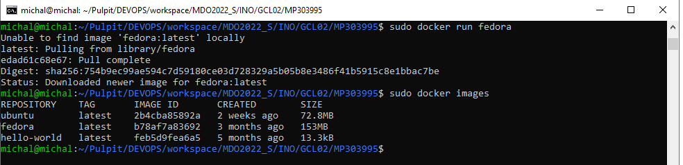
* Dodatkowo aby sprawdzić dokładną wersję w kontenerze uruchamiam polecenie ```cat /etc/os-release```.Dokładna wersja systemu to Fedora 35.
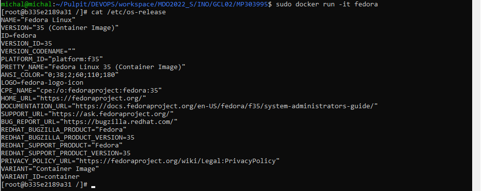

### **DockerHub**
* Założyłem konto na DockerHub
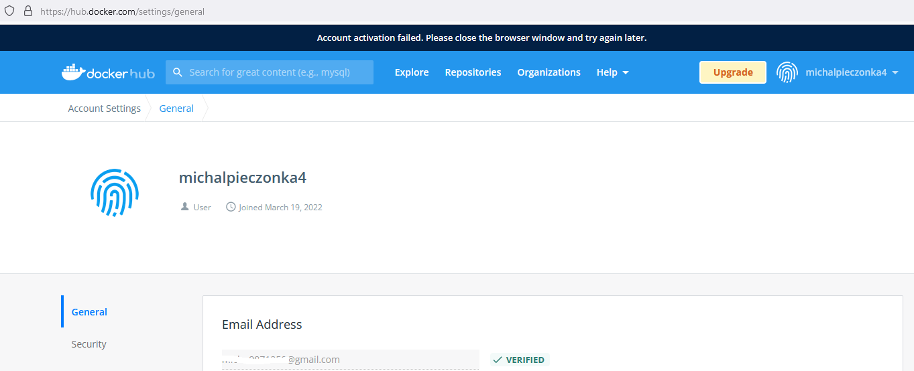
