# Michał Pieczonka - 303995
## Sprawozdanie - LAB03
## Wybór oprogramowania na zajęcia
* Repozytorium, które wybrałem w celu realizacji zadań, zawartych w temacie zajęć laboratoryjnych było jedno z oficjalnych repozytoriów ```Spring.io```.
Konkretniej było to repozytorium projektu  ```PetClinics```  - ```https://projects.spring.io/spring-petclinic/``` - będącego jednym z głównych projektów open-source Springa, prezentujących użycie Spring Boot z Spring MVC i Spring Data. Link do repozytorum ```https://github.com/spring-projects/spring-petclinic``` Projekt ten napisany jest w Javie (wykorzystując Spring-Boota), a narzędziem do budowania jest Maven (dostępny jest też Gradle, ale preferuje Maven'a w codziennej pracy, dlatego też w późniejszych krokach będe z niego korzystał).
 Dodatkowo wybrane repozytorium spełnia wszystkie niezbędne wymagania, to znaczy:
	* dysponuje otwartą licencją ```Apache-2.0 License```
	* jest umieszczone wraz ze swoimi narzędziami Makefile -w tym wypadku jest to Maven, co umożliwia uruchomienie w repozytorium ```mvn install ``` (odpowiada ```make build```) oraz ```mvn test``` (odpowiada ```make test```) 
	* Zawiera zdefiniowane i obecne w repozytorium testy, które można uruchomić. 

## Build 'lokalny'
* Powyższe repozytorium sklonowałem ```git clone git@github.com:spring-projects/spring-petclinic.git```
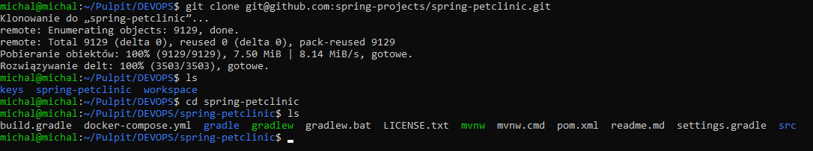
* Następnie wykorzystując komendę ```./mvnw install -DskipTests``` przeprowadziłem build programu. (```-DskipTests``` pozwala na tym etapie pominąć fazę uruchamiania testów)
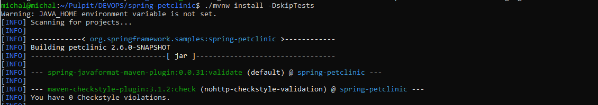
Wszystkie etapy budowania przebiegły poprawnie w wyniku czego otrzymałem następujący komunikat:
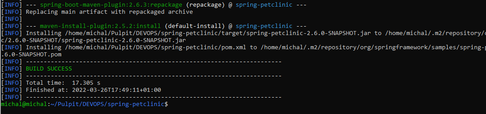
Wszystkie niezbędne w programie zależności, zawarte w pliku ```pom.xml``` zostały dociągnięte w trakcie przez Mavena.
* W ostatnim kroku pracy 'lokalnej'/wstępnej uruchomiłem zawarte w projekcie testy wykorzystując komendę ```./mvnw test```
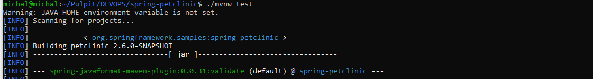
Po dłuższej chwili, ze względu na to iż w projekcie w "skład testów", poza testami jednostkowymi, wchodzi też kilka testów integracyjnych, które wymagają uruchomienia kontekstu Springa (aplikacji) otrzymałem wynik - 1 test został pominięty, a wszystkie pozostałe zostały uruchomione, 1 oraz wszystkie 'przeszły'.
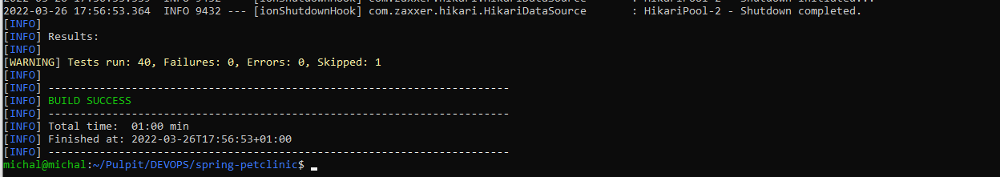
## Build w kontenerze
* Z dokumentacji Spring'a, dotyczącej uruchamiania aplikacji w kontenerze, zawartej na ```https://spring.io/guides/gs/spring-boot-docker/``` wynika iż preferowany/'wspierany' kontener to ```OpenJDK```.  Z uwagi na fakt iż zgodnie z instrukcją wymagany był "wystarczający" kontener, a nie najbardziej rozbudowany/preferowany przez oficjalne 'dokumentacje' - w związku z tym przechodząc głębiej, konkretniej do Githuba [OpenJDK](https://github.com/docker-library/docs/blob/master/openjdk/README.md#supported-tags-and-respective-dockerfile-links), znalazłem informację, iż najmniejszą, wystarczającą wersją jest wersja ```alpine``` bazująca na [Alpine Linux project](https://alpinelinux.org), która jest znacznie mniejsza (~5MB) niż sam 'defaultowy' OpenJDKs
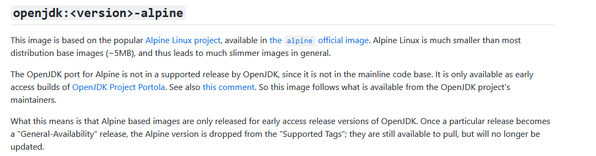
* W związku z powyższym pobrałem kontener poleceniem ```sudo docker pull openjdk:17-jdk-alpine``` - wersja 17, dlatego, że jest to wersja ```LTS``` - teoretycznie powinna być 'najlepsza'.
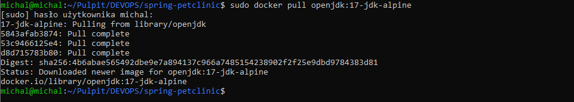
* W kolejnym kroku za pomocą polecenia ```sudo docker run -it --name petClinic openjdk:17-jdk-alpine sh``` uruchomiłem kontener i podłączyłem do niego TTY. Przełącznik -it pozwolił uruchomić interaktywny terminal, natomiast sh na końcu polecenia pozwoliło użyć terminala ``sh`` zamiast domyslnego ``jShell``.
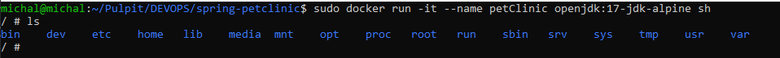`
* Następnie, zakładając, że kontener powinien mieć już wszystko 'co potrzebne' do odpalenia builda, za pomoca polecenia ```git clone https://github.com/spring-projects/spring-petclinic.git``` próbowałem sklonować repozytorium, jednak okazalo się, że oczywiście - nie posiada gita, dlatego doinstalowalem go poleceniem ```apk add git``` - co zalatwiło problem i repozytorium udalo się pomyślnie sklonowac.


* Po pomyślnym klonie uruchomiłem build poleceniem ```./mvnw install -DskipTests``` (ponownie pomijając testy na tym etapie) 
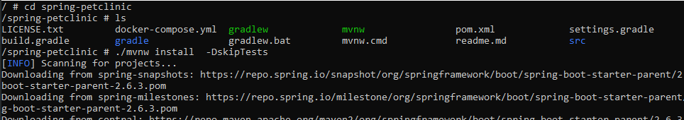
* Po kilku dłuższych chwilach i pobraniu całego szeregu zależności - proces budowania zakonczył się z wynikiem sukcesu.
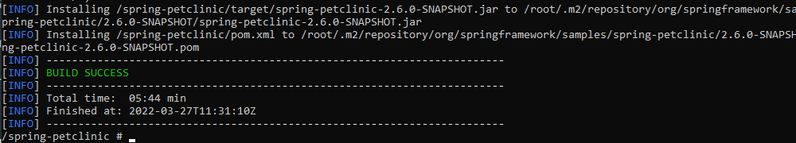
* Następnie poleceniem ```./mvnw test``` uruchamiam testy (jednostkowe i integracyjne) zawarte w projekcie - ponownie wszystkie uruchomione 'przechodzą'.
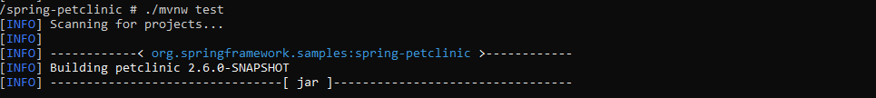
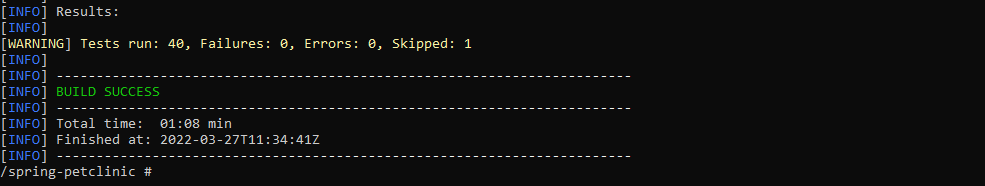
## DockerFile
* W kolejnym kroku stworzyłem dwa pliki Dockerfile automatyzujące powyższe kroki, z uwzględnieniem odpowiedzialności kazdego z nich. 
* Pierwszy utworzony DockerFile wykonuje wszystkie powyzsze kroki aż do builda (włącznie). Na początku za pomocą ```FROM``` wybierany jest obraz ```openjdk:17-jdk-alpine```. Następnie poprzez ```RUN``` uruchamiane jest polecenie pobierające gita. W kolejnym kroku, także poprzez ```RUN``` klonowane jest docelowe repozytorium projektu. Następnie poprzez ```WORKDIR``` ustawiana jest poprawna ścieżka robocza. W ostatnim kroku ```RUN``` 'uruchamia' komendę odpowiedzialną za utworzenie builda.  Utworzony DockerFile:
```bash
FROM openjdk:17-jdk-alpine
RUN apk add git
RUN git clone https://github.com/spring-projects/spring-petclinic.git
WORKDIR /spring-petclinic/
RUN ./mvnw install -DskipTests
```
* Drugi utworzony DockerFile bazując na pierwszym wykonuje testy - w pierwszym poleceniu wybierany jest najnowszy obraz stworzonego wcześniej obrazu, następnie ustawiana jest ścieżka robocza i uruchamiane są testy. Utworzony DockerFile:
```bash
FROM petClinic:latest
WORKDIR /spring-petclinic/
RUN ./mvnw test
```
## Wykazanie wdrożenia i poprawnej pracy.
* W pierwszym etapie, aby wykazać poprawność pierwszego z utworzonych DockerFile uruchomiłem budowanie poprzez polecenie ```sudo docker build . -f DockerBuild -t petclinic```. Aby wybrać poprawny (pod względem nazwy) DockerFile wykorzystałem przełącznik ```-f``` , natomiast ```-t``` wykorzystałem w celu okreslenia końcowej nazwy obrazu. Na poniższych zrutach ekranu przedstawiłem wynik działania polecenia:
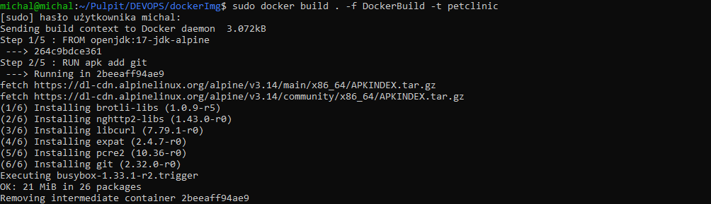
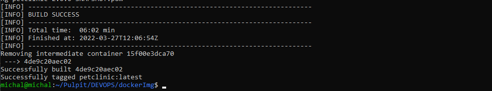
* W następnym etapie, po poprawnym zbudowaniu, uruchamiam drugi z utworzonych DockerFile odpwiedzialny za uruchomienie testów, bazując na pierwszym. W tym celu wykorzystuje polecenie ```sudo docker build . -f DockerTest -t petclinic-test```
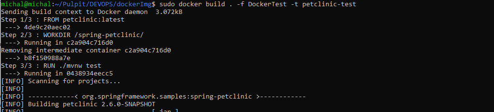
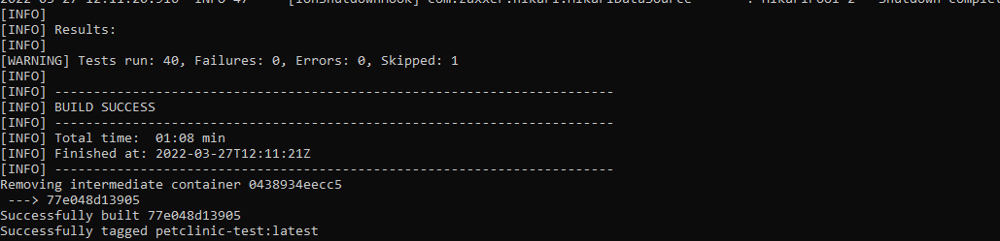
* Kolejno, za pomoca polecenia ```sudo docker images``` mogę sprawdzić powstałe obrazy.
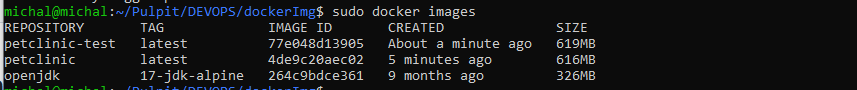
* W ostatnim kroku, za pomoca polecenia ```sudo docker run -it --name pet-clinic-full petclinic-test:latest``` z utworzonego obrazu uruchamiam kontener
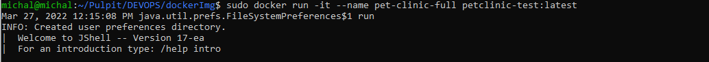
* Na powyższym zrzucie ekranu widac iż sama aplikacja w kontenerze nie jest uruchomiona - domyślnie odpalany jest Jshell, ale wszystkie wymagane wcześniej kroki zostały przeprowadzone prawidłowo, a kontener działa poprawnie.
* W ostatnim kroku wychodząc z Jshell'a komendą ```/exit``` można sprawdzić czy wszystko przebiegło prawidłowo po kodzie wyjścia - w tym celu komendą ``` sudo docker ps -a``` sprawdzam kod wyjścia - w tym wypadku wynosi 0, tak więc na tej podstawie mogę potwierdzić iż caly proces przebiegl prawidłowo,  co potwierdza poniższy zrzut ekranu.
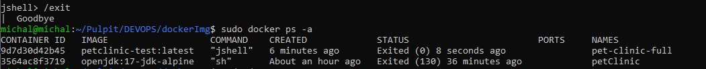
