# Michał Pieczonka - 303995
## Sprawozdanie - LAB04

### Zachowywanie stanu

* **Przygotuj woluminy wejściowy i wyjściowy, o dowolnych nazwach, i podłącz je do kontenera bazowego, z którego rozpoczynano poprzednio pracę**<br>
Prace rozpoczynam od utworzenia dwóch woluminów - wejściowego (```volinput```) oraz wyjściowego (```voloutput```). 
W tym celu wykorzystuje polecenie ```docker volume create``` z  przełącznikiem ```--name```, pozwalającym na nadanie nazwy tworzonemu wouminowi. 
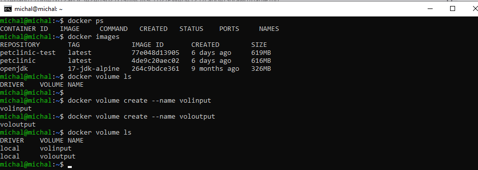<br>
Od razu, w celu wyświetlenia szczegółowych informacji o utworzonych woluminach, w tym między innymi punktów montowania (potrzebnych w późniejszych 
krokach) wykorzystuje polecenie ```docker volume inspect```.
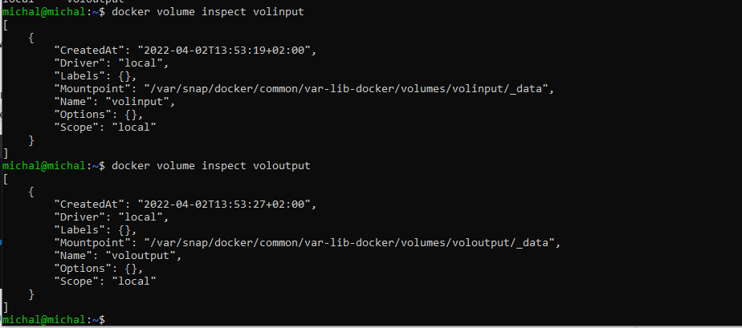<br>
Jako kontener bazowy, do którego zostaną zamontowane powyżej utworzone wolimny, wykorzystam kontener użyty w celu realizacji poprzednich laboratoriów.       (Wykorzystałem maksymalnie "odchudzony" kontener ```OpenJDK:alpine``` (bazujący na Alpine Linux project), który w moim przypadku jest wystarczający,a         dodatkowo jest znacznie mniejszy niż sam 'defaultowy' OpenJDK i co najbardziej istotne - nie zawiera gita.)
* **Uruchom kontener, zainstaluj niezbędne wymagania wstępne (jeżeli istnieją), ale bez gita**<br>
W celu urchomienia kontenera wykorzystuje polecenie ```docker run```. Przełącznik ```--name``` wykorzystuje w celu nadania nazwy kontenerowi. Dodatkowo w trakcie uruchamiania kontenera montuje jednocześnie oba woluminy (wejściowy i wyjściowy) - w tym celu używam przełącznka ```-v``` a następnie podaje        źródło,będące nazwą wolumina, który ma być zamontowany oraz miejsce w systemie plikow w kontenerze, gdzie ma pojawic się wolumin. Korzystam z formatu ```nazwa_volume:/miejsce_montowania_w_konterzene```. Poza tym  wykorzystuje przełącznik ```-it``` w celu uzyskania interaktywnego terminala natomiast sh na końcu polecenia pozwoliło użyć terminala ```sh``` zamiast domyslnego jShell.  Po uruchomieniu, poleceniem ```ls v*``` sprawdzam poprawnośc montowania woluminów w konterze przez ich wylistowanie.<br>
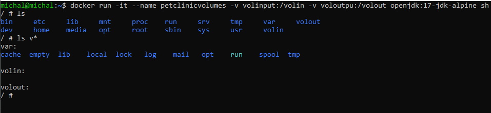<br>
* **Sklonuj repozytorium na wolumin wejściowy** <br>
W celu bezpośredniego sklonowania repozytorium, na którym bazowałem w poprzednich laboratoriach na wolumin wejściowy (```volinput```) w pierwszym kroku przechodzę na zamontowany na hoście volumin jako root, korzystając ze ścieżki, którą przedstawiłem na wcześniejszych zrzutach ekranu (uzyskaną za pomocą polecenia ```docker volume inspect```). Następnie. poleceniem ```git clone``` klonuje reopozytorium z projektem. <br>
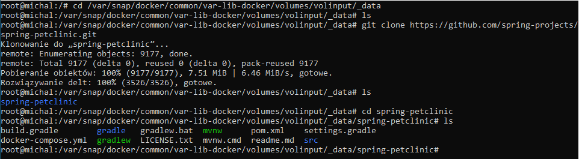<br>
 W ostatnim kroku, w celu weryfikacji poprawności powyższej operacji, z poziomu uruchomionego kontenera - przechodzę na wolumin wejściowy i sprawdzam, czy sklonowane repozytorium rzeczywiscie się tam znajduje.<br>
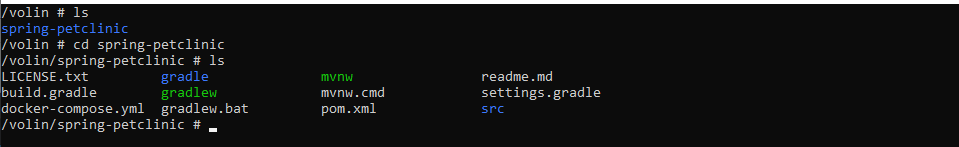<br>
* **Uruchom build w kontenerze** <br>
W celu uruchomienia buildu bezpośrednio w kontenerze kopiuje katalog projeku z wolumina wejściowego bezpośrednio na kontener.<br>
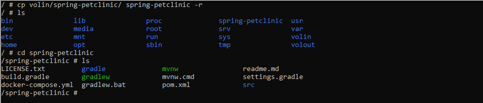<br>
  Po poprawnym skopiowaniu i przejściu do katalogu projektu, uruchamiam cały proces budowania poleceniem ```./mvnw install``` (będącego odpowiednikiem ```build```). Ze względu na sposób działania mavena, polecenie install spowoduje dociągnięcie wszystkich zależności potrzebnych do zbudowania projektu (zawartych w pliku pom.xml). Po dociągnięciu wszystkich niezbędnych dependendencji i zakonczeniu budowania aplikacji uzyskuje informacje, ze build zakonczył się sukcesem, a po wylistowaniu, widać iż został utworzony katalog ```target```, w którym znajduje się zbudowany projekt.<br>
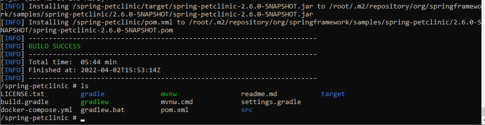<br>
 * **Zapisz powstałe/zbudowane pliki na woluminie wyjściowym** <br>
 Po zbudowaniu powstale pliki (zawarte w katalogu ```target```) przenoszę na wolumin wyjściowy voloutput i listuję jego zawartość.<br>
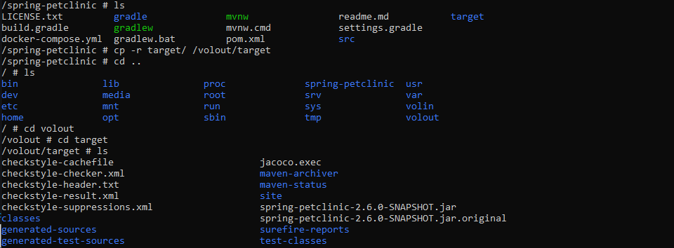<br>
Ostatecznie dla potwierdzenia obecności plików na woluminie wyjściowym, zawartośc katalogu ponownie listuję, ale tym razem z poziomu hosta.<br>
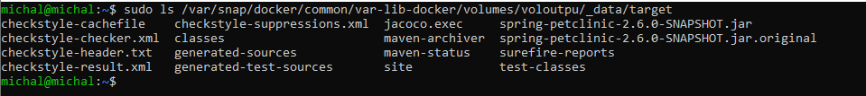<br>
  
### Eksponowanie portu

* **Uruchom wewnątrz kontenera serwer iperf (iperf3)**<br>
W celu wykonania zadania wykorzystam swój prywatny, zewnętrzny serwer VPS z Ubuntu 20.04 oraz obraz ```clearlinux/iperf``` . W tym celu w pierwszym kroku pobieram wybrany obraz.<br>
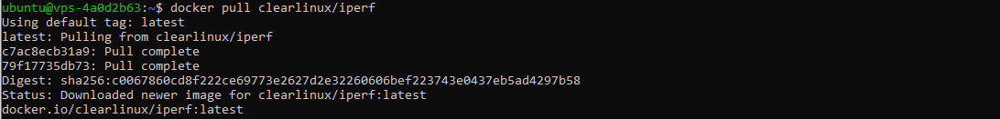<br>
Następnie urchamiam serwer poprzez ```docker run```. Wykorzystuje przełacznik ```-it``` do interaktywnego terminala, ```--name``` w celu nadania nazwy oraz najbardziej istotnego ```-p``` będącego, akronimem publish do publikowania portu - w tym przypadku 5021 oraz ```-s``` pozwalający na działanie jako serwer (emitujemy serwer ktory slucha). Przełącznik ```--rm``` wykorzystałem do usunięcia obrazu po zamknięciu.<br>
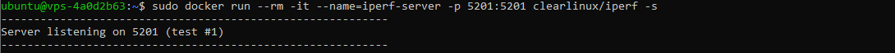<br>
* **Połącz się z nim z drugiego kontenera, zbadaj ruch**<br>
W pierwszym kroku sprawdzam, czy serwer wogóle nasłuchuje. W tym celu uruchamiam polecenie ```netstat``` i poprzez ```grep``` wyszukuje tylko nasłuchujące porty.<br>
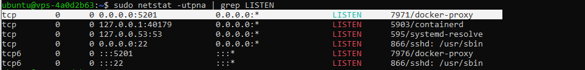<br>
Po weryfikacji poprawności przechodzę do łączenia się z drugiego kontenera. W tym celu, tak jak poprzednio uruchamiam kontener, ale tym razem jako wykorzystuje przełacznik z iperfa ```-c```, który pozwala na działanie jako klient. Dodatkowo określam adres serwera - w moim przypadku ```172.17.0.1```,  a poprzez ```--time``` określam czas połączenia na 30 sekund. Połączenie zostaje nawiązane pomyślnie z następujacym wynikiem: <br>
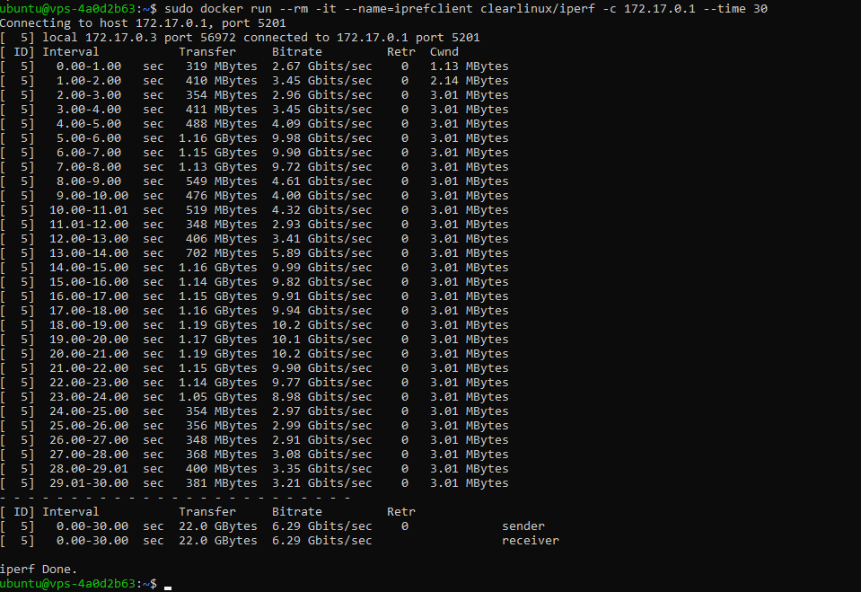<br>
* **Połącz się spoza kontenera (z hosta i spoza hosta)**<br>
* **Połączenie z hosta**<br>
W celu połączenia z hosta, a więc z urządzenia, na którym działa docker - w moim przypadku jest to Ubuntu na Virtualbox, tak więc ponownie uruchamiam polecenie ```iperf3 -c 172.17.0.1 --time 30```, tym razem bezpośrednio w Ubuntu, w wyniku czego uzyskuje następujące wyniki:<br>
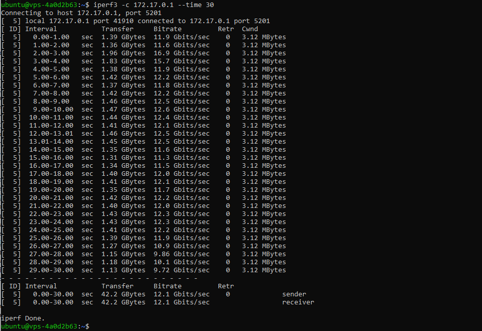<br>
* **Połączenie z poza hosta**<br>
W celu połączenia z poza hosta wykorzystuje tym razem dodatkową maszynę wirtualną z poza sieci VPS'a, zainstalowaną na moim komputerze  - również z Ubuntu (20.04). W tym celu wykorzystuje takie samo polecenie jak poprzednio, jednak tym razem adresem jest adres VPS'a. <br>
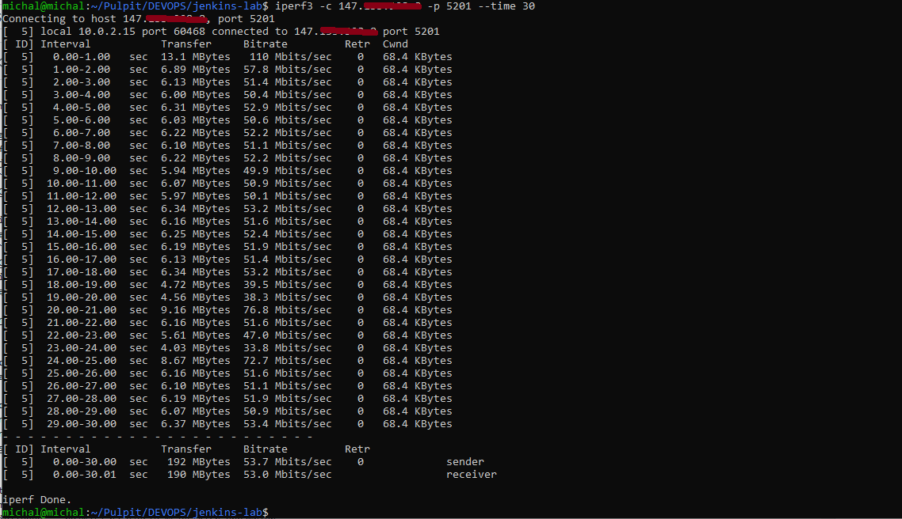<br>
* **Przedstaw przepustowość komunikacji lub problem z jej zmierzeniem (wyciągnij log z kontenera)**<br>
W celu dokonania porównania przepustowości komunikacji, za pomocą polecenia ```docker logs``` pobieram log z kontenera, na którym zostal uruchomiony serwer. Poniżej zamieściłem uzyskane wyniki.
1) Połączenie "kontener -> kontener"<br>
 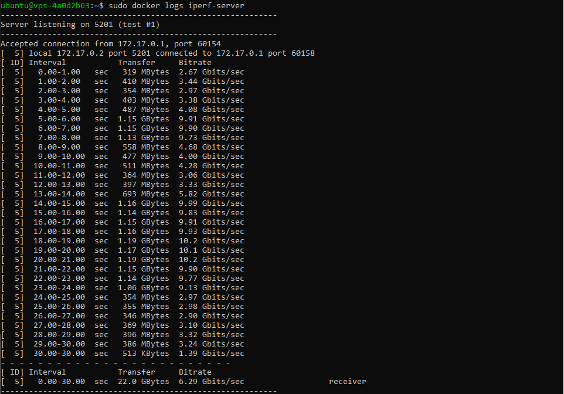<br>
2) Połączenie "host -> kontener"
 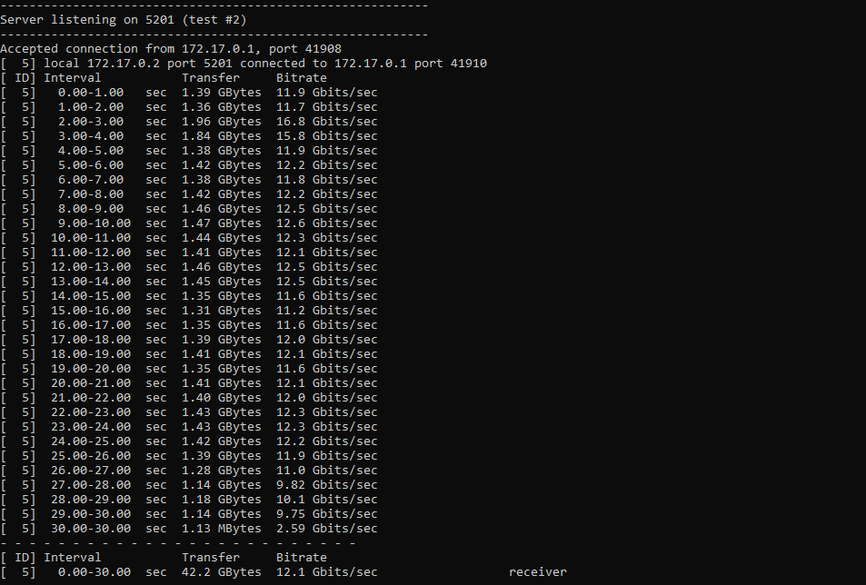<br>
3) Połączenie "host zewnętrzny -> kontener"
 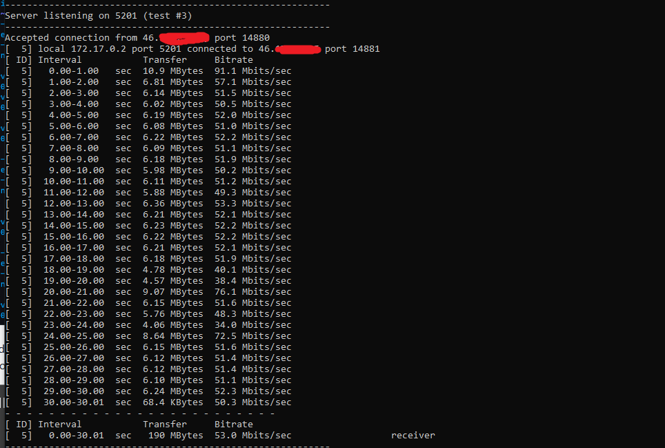<br>
W celu podsumowania i zestawienia zbiorczego wyników utworzyłem wykres zawierający porównanie ilości przetransferowanych danych w czasie 30 sekund w zależności od "źródła".<br>
<br>
Uzyskane wyniki były wynikami podobnymi, do tych uzyskanych w trakcie zajęć laboratoryjnych, a więc były zgodne z oczekiwanymi. Najwyższą przepustowość uzyskałem pomiędzy hostem i kontenerem. Wynik o gorszy, co ciekawe aż o prawie 50% uzyskałem pomiędzy dwoma odrębnymi kontenerami. Najwyższy czas i zdecydowanie bardzo słaby bitrate, uzyskałem przy połączeniu z innego urządzenia, dodatkowo znajdującego się w innej sieci.

### Instancja Jenkins

* **Zapoznaj się z dokumentacją  https://www.jenkins.io/doc/book/installing/docker/**<br>
✔️<br>
* **Przeprowadź instalację skonteneryzowanej instancji Jenkinsa z pomocnikiem DIND**<br>
Po zapoznaniu się z dokumentacją, instalacje, zgodnie z tutorialem w niej zawartym, rozpoczynam od stworzenia nowej sieci dockerowej za pomocą polecenia ```docker network create``` z argumentem ```jenkins``` określającym nazwe sieci, która będzie używana w kontenerach.<br>
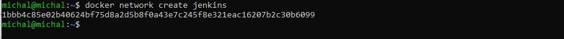<br>
W kolejnym kroku zgodnie z tutorialem pobieram i uruchamiam obraz ```DIND``` kontenera, a następnie, analizując poszczególne fragmenty całego wykorzystanego polecenia, opisanego w dokumentacji, wykorzystane znaniczki służą do: 
1) ```--detach``` uruchamia kontener jako demona.
2) ```--name``` nadaje nazwe kontenerowi. 
3) ```--privileged``` pozwala na użycie wszystkich uprawnień. 
4) ```--network``` nadaje nazwe sieci, która będzie używana w kontenerach. 
5) ```--network-alias``` określa alias sieci, który będzie używany w kontenerach. 
6) ```--env``` pozwala na podanie zmiennych środowiskowych, które będą używane w kontenerach,a także dodaje woluminy.
7) ```--storage-driver``` umożliwia użycie właściwego mechanizmu zapisu danych.
<br>
W następnym kroku tworzę plik Dockerfile, zawarty w dokumentacji. Z jego istotny i zrozumiałych elementów: poprzez ```FROM``` wskazuje, ze kontener będzie dziedziczył z obrazu ```jenkins/jenkins:2.33.1-jdk11```, poprzez ```USER``` określam użytkownika, natomiast poprzez ```RUN``` wykonuje polecenia w kontenerze.<br>
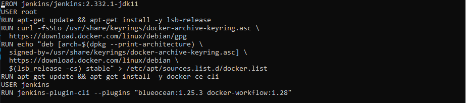<br>
Następnie uruchamiam builda.<br>
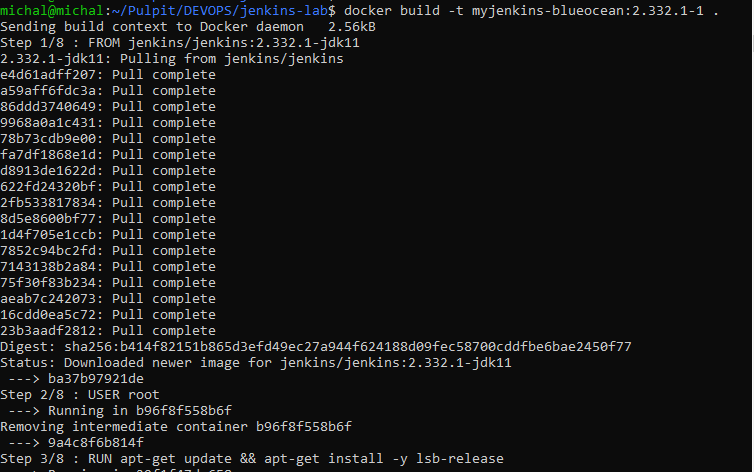<br>
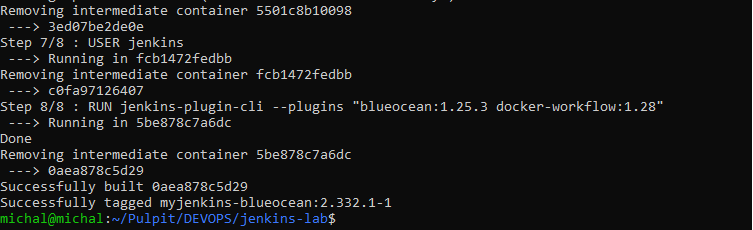<br>
W ostatnim kroku na bazie utworzonego obrazu uruchamiam kontener.<br>
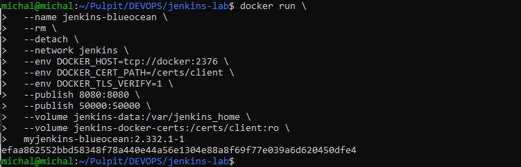<br>
* **Zainicjalizuj instację, wykaż działające kontenery, pokaż ekran logowania**<br>
W pierwszym kroku, w celu sprawdzenia czy kontener działa, wykorzystuje polecenie ```docker ps``` - widać, że aktualnie utworzony kontener ``` myjenkins-blueocean:2.332.1-1``` działa.<br>
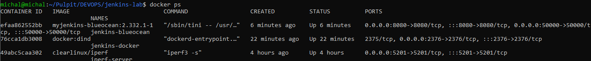<br>
Nastepnie, pokazując działanie praktycznie - uruchomioną instancję -  wchodzę na adres localhost na porcie 8080 i widzę ekran powitalny Jenkinsa.<br>
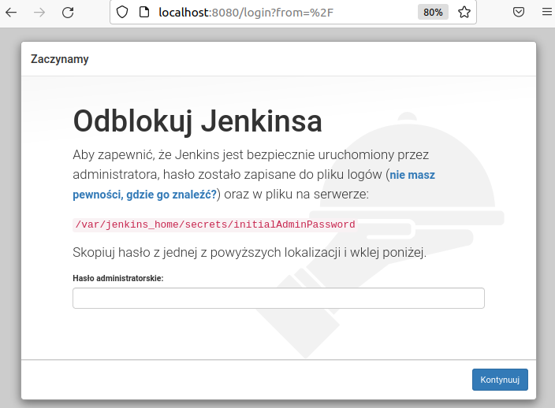<br>
Zgodnie z informacją wyświetloną w oknie przeglądarki,poleceniem ```docker exec``` uruchamiam na aktywnym kontenerze interaktywny terminal z bashem, wewnątrz ktorego poleceniem ```cat``` odczytuje hasło.<br>
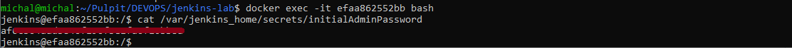<br>
Nastepnie po zalogowaniu jako administrator, pobieram zalecane wtyczki, a w późniejszym oknie konfiguruje dane dostępowe. <br>
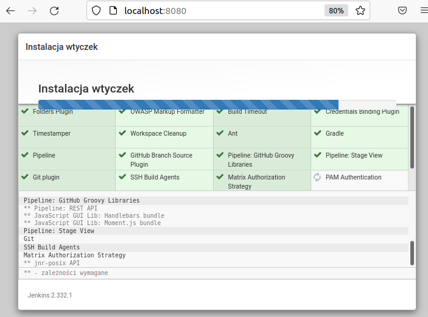<br>
Na zakończenie pokazuje okno logowania<br>
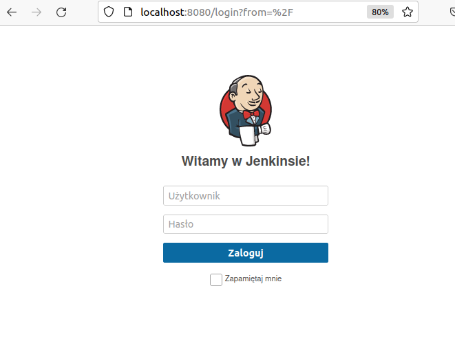<br>
