#  Michał Pieczonka - 303995
## Sprawozdanie 9

### Przygotowanie systemu pod uruchomienie
* **Przeprowadź instalację systemu Fedora w VM, skonfiguruj użytkowników (użyj haseł, które można bezkarnie umieścić na GitHubie!), sieć, wybierz podstawowy zbiór oprogramowania, optymalnie bez GUI**
  
   * W celu instalacji systemu Fedora, w pierwszym kroku tworze nowa VM w VirtualBoxie.<br>

   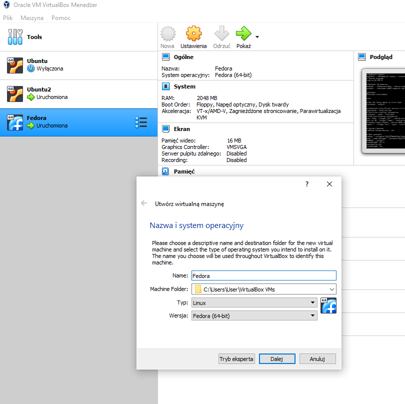

  Nastepnie po zamontowaniu ISO uruchamiam maszynę, w wyniku czego uzyskuje ekran instalacji.<br>
  
  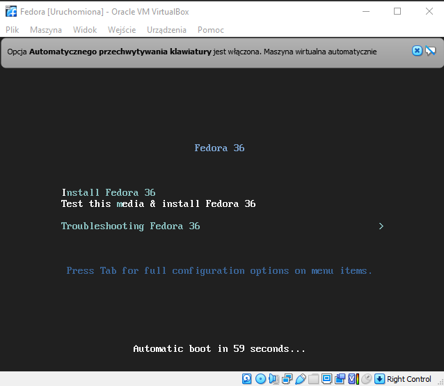

  Przechodzę do instalacji i konfiguruje wszystkie wymienione w poleceniu ustawienia, w szczególności wybieram podstawowy zbiór oprogramowania, bez gui i instaluję system.

  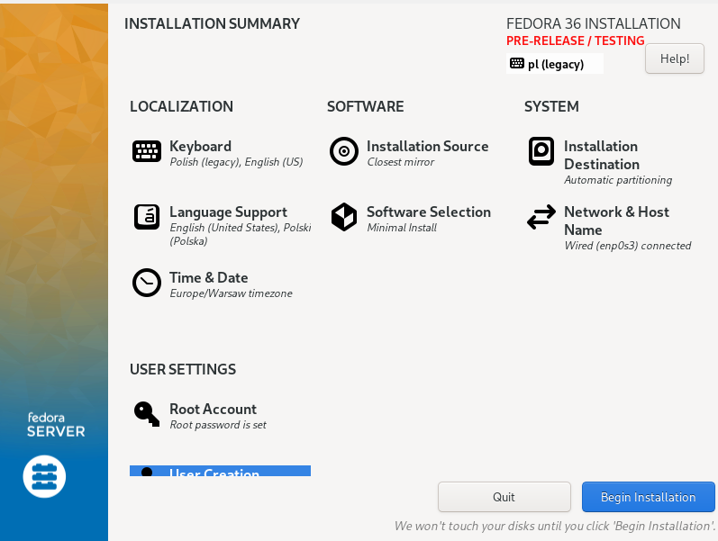
  
  Po krótkiej chwili system został zainstalowany poprawnie.

  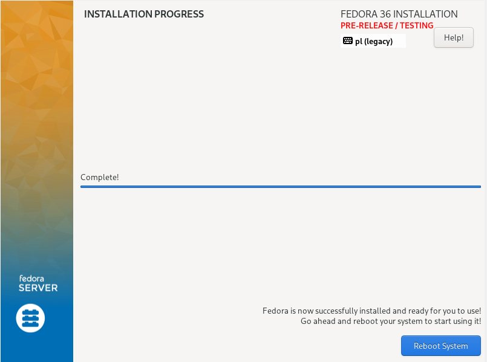

  * **Przeprowadź drugą instalację systemu Fedora w VM - celem drugiego systemu będzie wyłącznie serwowanie repozytorium przez HTTP**

  Krok ten początkowo chciałem pominąć, ze względu na to, iż finalny efekt działania całego pipeline'a - gotowy artefakt (w moim przypadku był to ``big-jar``) był dostępny z poziomu pipeline'a bezpośrednio do pobrania. <br>
  Jednak po krótkim namyśle - dostęp do zasobu wymagał uwierzytelnienia, w związku z czym pod względem działania, nie było to "adekwatne" do "serwera HTTP"/serwowania repozytorium.
  W związku z powyższym utworzyłem nową VM i przeprowadziłem ponownie proces instalacji Fedory, postępując analogicznie jak powyżej.

* **Umieść artefakty z projektu na serwerze HTTP**

   W celu umieszczenia artefaktu z projektu na serwerze HTTP, postanowiłem zamiast rozwiązania "manualnego" (ręcznej kopi), rozbudować dotychczasowy pipeline. <br>
   Konkretniej stage publish rozbudowalem o proces uploadu przez ssh wynikowego artefaktu, na docelowym serwerze (fedora nr2, serwujaca repozytorium przez http). <br>
   <br>
  Rozbudowe pipelien'a rozpocząłem od przygotowania samego kontenera z Jenkinsem (w którym działa caly pipeline) - konkretniej wygenerowalem klucz ssh (tutaj zaskoczył mnie brak potrzeby dodatkowo instalowania ssh - jenkins(blueocean) posiada je 'w standardzie'). <br>
  
  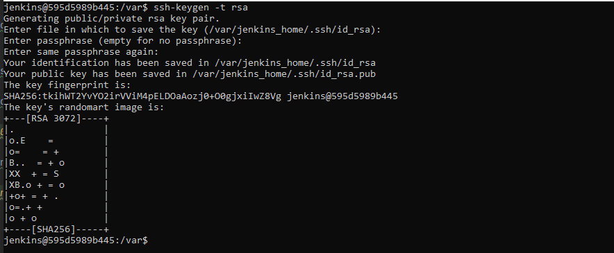
 
  W kolejnym kroku na docelowym serwerze (fedora nr2, serwująca repozytorium przez http) podpiąłem klucz publiczny (wygenerowany w kroku wyżej), tak aby uwierzytelnianie przebiegało bez problemowo - screney z tego etapu pomijam.
  W tym celu w pierwszym kroku tworzę plik ``~/.ssh/authorized_keys``, wewnątrz którego umieszczam wygenerowany powyżej klucz publiczny (``***.pub``) <br>

  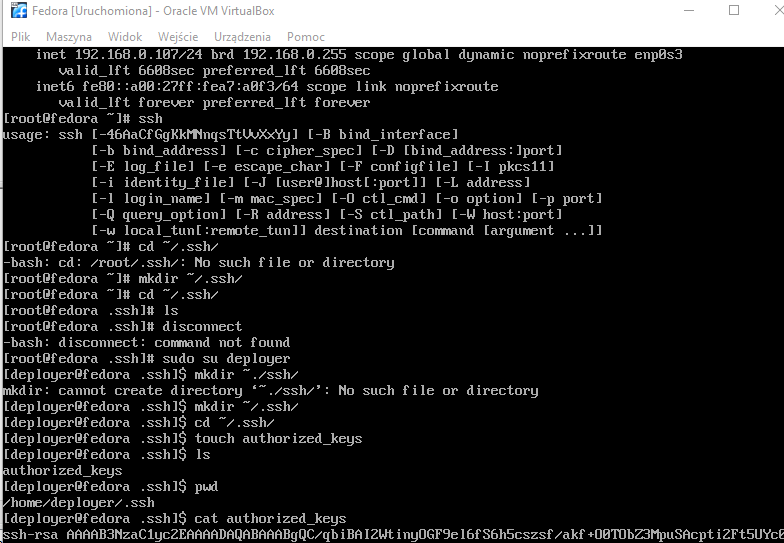

  Następnie nadaje odpowiednie prawa dla wszystkich plików, tak aby próba połączenia z Jenkinsa była możliwa. (Bez tego ssh wogóle nie widziało klucza).
  
  

  Po przeprowadzeniu powyższych czynności wracam do kontenera z Jenkinsem i z jego poziomu (z poziomu Jenkinsa) próbuje połączyc się przez ssh.<br>
  Operacja zakończona sukcesem, hasło nie było wymagane, więc wszystko przebiegło prawidłowo (klucz ssh rozpoznany).

  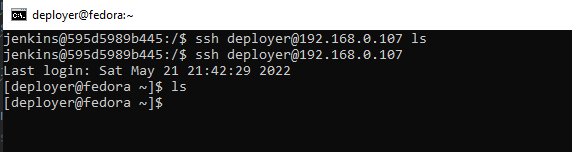

  W kolejnym kroku przystąpiłem do modyfikacji pipeline'a, a konkretniej stage'a publish. (Publish, nie deploy, ponieważ w moim projekcie przyjąłem, że w kroku deploy, po pierwsze, teoretycznie może pójśc coś nie tak (nie działac),<br> 
  a dodatkowo finalny artefakt promowany jest do nowej wersji dopiero w kroku publish. W związku z powyższym, uważam że w moim pipelienie, odpowiednim miejscem do publikowania artefaktu w repozytorium, jest własnie krok publish.<br>
  (Jednak po przemysleniu i wykorzystaniu tego rozwiązania, prawdopodobnie zmienił bym teraz caly krok deploy). <br>
  Po modyfikacjach krok publish prezentował sie następująco (dodanie 2x ssh i wykorzystanie scp do transferu artefaktu).

```groovy
	stage('Publish') {
            when {
                expression { params.PROMOTE == true }
             }
              steps {
                echo '.::Publishing::.'
                sh """ssh deployer@192.168.0.107 rm -rf '~/var/www/html/repo/final_app.jar'"""
                sh """ssh deployer@192.168.0.107 mkdir '~/var/www/html/repo'"""
                sh """scp 'output_volume/final_app.jar' deployer@192.168.0.107:'~/var/www/html/repo/final_app.jar'"""
                sh """mv output_volume/final_app.jar output_volume/'app_realease-${params.VERSION}.jar'"""
                archiveArtifacts artifacts: """output_volume/app_realease-${params.VERSION}.jar""", fingerprint: true			
            }
        }
    }
```
 Ostatecznie po pozytywnym przejściu calego pipeliene'a w konsoli Jenkins, pojawiła się informacja, że transfer zakonczył się sukcesem (pipeline również).

 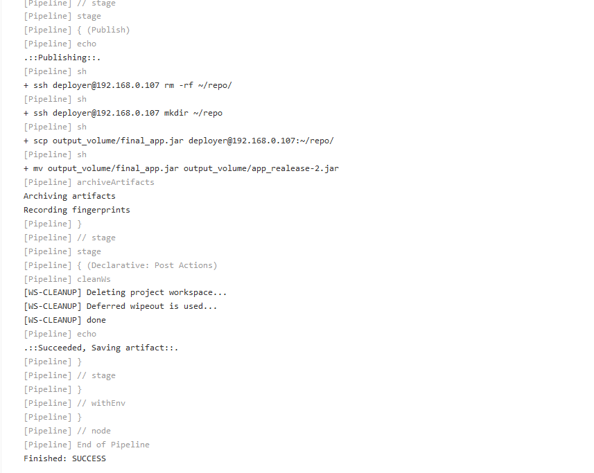

 Natomiast na  docelowym serwerze (fedora nr2, serwujaca repozytorium przez http) pojawił się przetransferowany artefakt.
 
 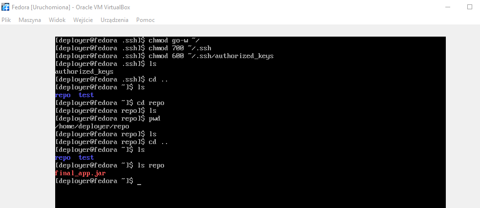

* **Na zainstalowanym systemie wykonaj zbiór poleceń umożliwiających pobranie artefaktu, zapisz polecenia**

   Na początku poprzez polecenie ``sudo dnf install httpd`` instaluję httpd, aby umożliwić pobranie artefaktu z fedory nr1. <br>
   Nastepnie przez polecenie ``sudo dnf group install "Web Server"`` doinstalowuje dodatkowe pakiety (bez tego w moim serwer http wogole nie odpowiadał na request) <br>
   Kolejno komendą ``sudo systemctl start httpd`` uruchamiam serwer, natomiast poprzez ``sudo systemctl enable httpd`` włączam usługę. <br>
   W ostatnim kroku pozostało tylko skonfigurować firewalla (aktualnie blokuje wszystkie requesty na praktycznie wszystkie porty) - dlatego otwieram wybrane porty: <br>
  ``sudo firewall-cmd --add-service=http --add-service=https --permanent``.

  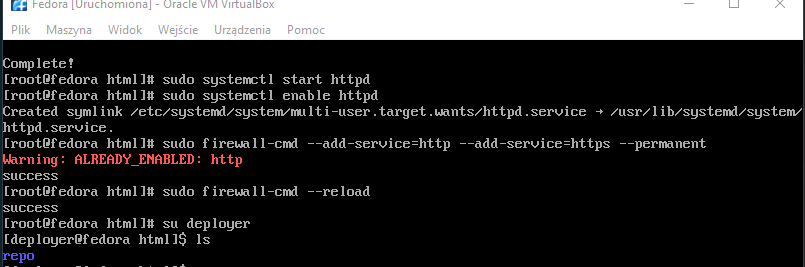

  Na koniec restartuje firewalla - ``sudo firewall-cmd --reload`` i we wskazanym katalogu widać iż zauploadowany wcześniej bezpośrednio z pipeliene artefakt - jest dostępny do pobrania.

   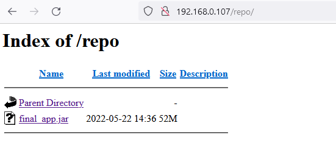

# Zakres rozszerzony
* **Skonfiguruj pipeline tak, by upload na serwer HTTP następował automatycznie**

   Całość opisu rozbudowy pipelien'a o powyższe kryterium została opisana powyżej, w sprawozdaniu.

* **Jeżeli artefaktem jest plik RPM, serwer HTTP powinien serwować repozytorium (createrepo)**

   Artefaktem nie jest plik RPM - krok pomijam.

### Instalacja nienadzorowana

* **Zlokalizuj plik odpowiedzi z instalacji**

   W celu realizacji zadania powracam do Fedory nr 1. Plik odpowiedzi anaconda-ks.cfg został zlokalizowany w katalogu głownym root. Z zainstalowanego systemu wyciągam go poprzez scp.

   

* **Dodaj do niego elementy odpowiedzialne za wszystkie potrzebne dependencje**

   Z elementów, które bedą potrzebne jako depdencję w celu pózniejszego dodania procesu pobierania artefaktu dodalem tylko ```wget``` - w celu pobrania finalnego artefaktu z wystawionego wcześniej repozytorium (Fedora2) <br> 
   oraz dodatkowo ``java-1.8.0-openjdk`` - dlatego że wynikowym artefaktem jest ``big-jar``, w związku z czym poza najmniejszym JRE (Java Runtime Enviroment), do dzialania nic więcej nie potrzebuje.
   Instalacja dependencji i pobranie z wystawionego repozytorium - docelowego artefaktu, dokonuje w sekcji ``%post`` - jako skrypty poinstalacyjne. Finalnie zmodyfikowane fragmenty prezentują się następująco:

   ```bash
   %packages

   @^minimal-environment
  
   java-1.8.0-openjdk
   wget

   %end
   ```

   ```bash
   %post

   mkdir final_artifact
   cd final_artifact
   wget http://192.168.0.107/repo/final_app.jar
   ls

   %end
   ```
* **Zdefiniuj repozytoria (co najmniej OS i aktualizacje, najlepiej też depednecje, optymalnie także repozytorium z własnym oprogramowaniem)**

   Definiuję repozytoria - zgodnie z przedstawionymi w instrukcji, a dodatkowo zmieniam typ instalacji na textowy.

   ```bash
   # Use graphical install
   text
   ```

   ```bash
    # Repo
    url --mirrorlist=http://mirrors.fedoraproject.org/mirrorlist?repo=fedora-$releasever&arch=x86_64
    repo --name=updates --mirrorlist=http://mirrors.fedoraproject.org/mirrorlist?repo=updates-released-f$releasever&arch=x86_64
   ```

* **Dodaj proces pobierania artefaktu**

   Poniżej załączam zrzut ekranu potwierdzający poprawne działanie.
  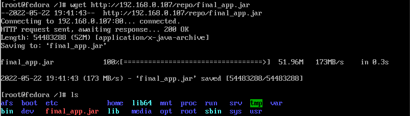

### Infrastructure as a code

* **Umieść plik odpowiedzi w repozytorium**

   Umieszczam plik.

   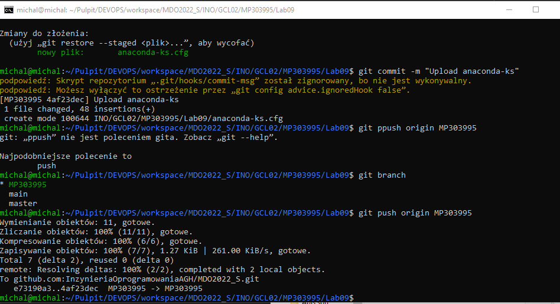

* **Połącz plik odpowiedzi z ISO instalacyjnym**

   Edytuję parametry uruchomieniowe (klawisz ``Tab``) A następnie rozpoczynam proces instalacji ustawiając jako zródło odpowiedzi link ``raw-github`` (wskazujący na wcześniej zauploadowany plik).

   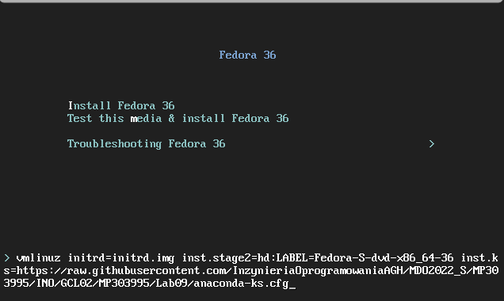

   Po kilku chwilach instalacja przebiegła prawidłowo

   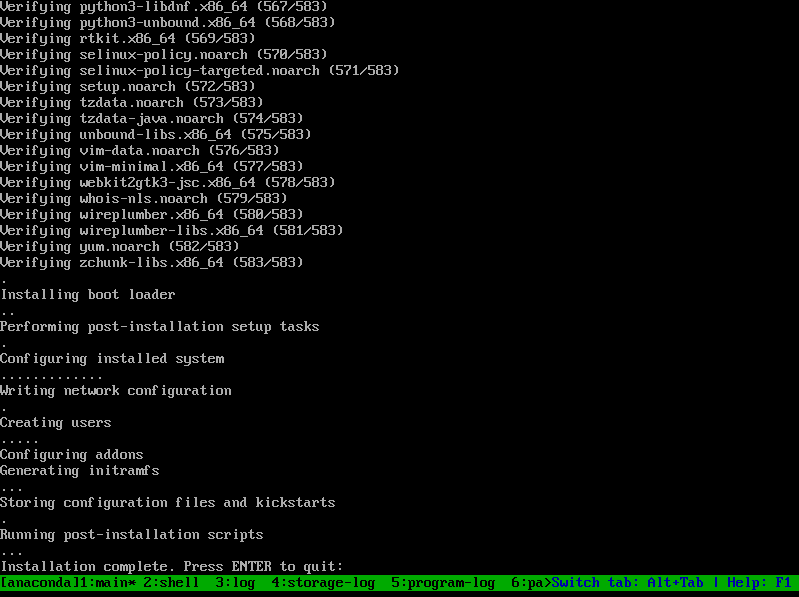

   Potwierdzenie, że zródłem pliku konfiguracyjnego instalatora, można zobaczyć poprzez obecnośc pobranego artefaktu - ``big jara`` o poprawnej nazwie. 

   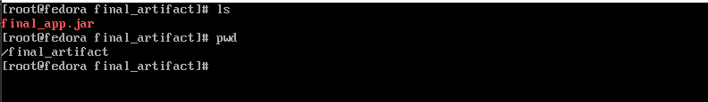
