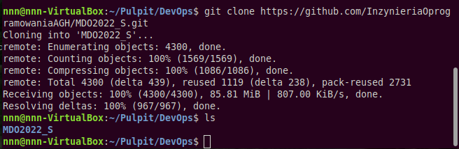

# SPRAWOZDANIE 1

### 1. Zainstalowanie dowolnego klienta git
W tym celu wykorzystano polecenie `sudo apt install git`

---
### 2. Wykonanie operacji *git clone* 
Uruchomiono terminal i użyto polecenia `git clone "url repozytrium"`  

---
### 3. Dokumentacja pracy
Utworzono plik *sprawozdanie.md* w którym opisano wykonane już kroki
