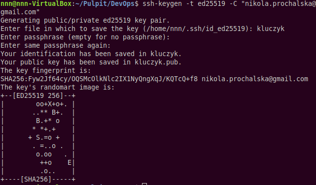
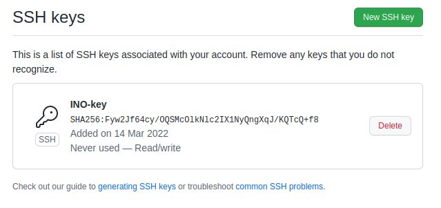
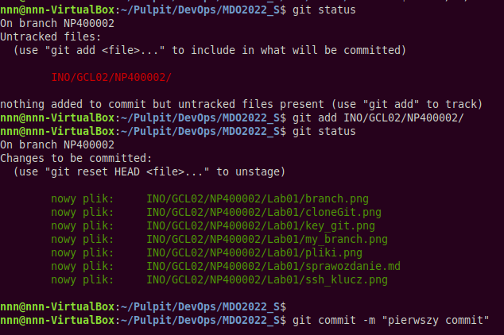
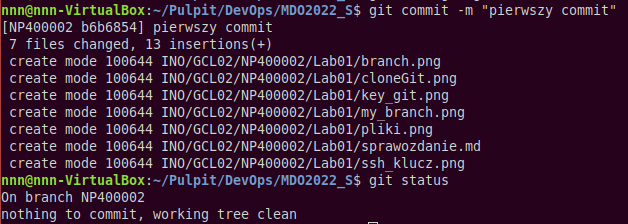
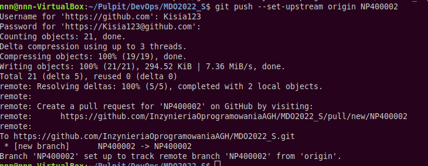
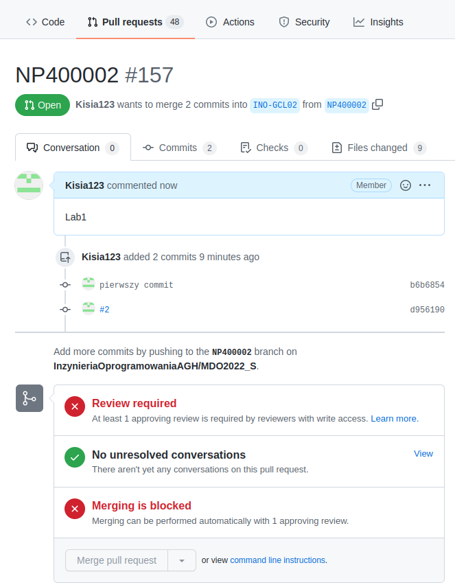

# SPRAWOZDANIE 1

### 1. Zainstalowanie dowolnego klienta git
W tym celu wykorzystano polecenie `sudo apt install git`

Utworzono także klucz SSH przy omocy polecenia `ssh-keygen`

Utworzony w ten sposób klucz przypisano do konta GitHub

---
### 2. Wykonanie operacji *git clone* 
Uruchomiono terminal i użyto polecenia `git clone "url repozytrium"`  

---
### 3. Dokumentacja pracy
Utworzono plik *sprawozdanie.md* w którym opisano wykonane już kroki instrukcji 

---
### 4. Nowy branch w repozytorium lokalnym
Przy pomocy polecenia `mkdir` utworzono nowy folder *NP400002* 

W folderze tym utworzono folder *Lab01* w którym umieszczono plik *sprawozdanie.md* 
oraz wykonane wcześniej zrzuty ekranu

Następnie wykonano commita przy pomocy polecenia `git commit`

Sprawdzono czy wykonany commit się udał przy pomocy polecenia `git status`

Powyższe zrzuty ekranu dodano także do repozytorium i wykonano commita

---
### 5. Wykonanie *pull request*
Wykonano *push* i utworzono branch w repozytorium odpowiadający utworzonemu wcześniej lokalnemu branchowi

W tym celu wykorzystano polecenie`git push --set-upstream origin "nazwa brancha"`

Logowanie przeprowadzono z wykorzystaniem nowo utworzonego tokenu na GitHubie

Do brancha grupy kierunkowej wykonano *pull request* swojego utworzonego brancha

Wykonany zrzut ekranu zapisano, dodano do repozytorium i zrobiono commita

---

