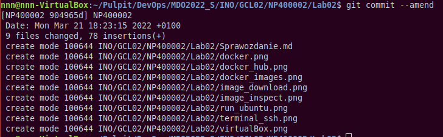
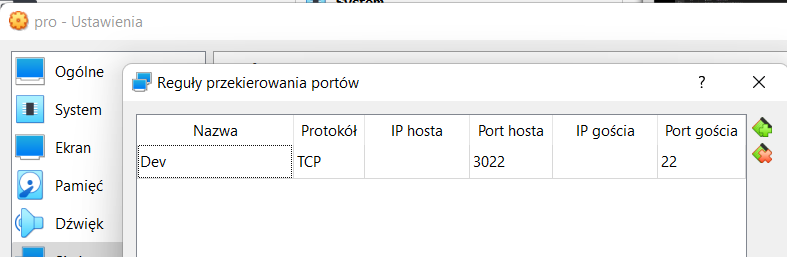
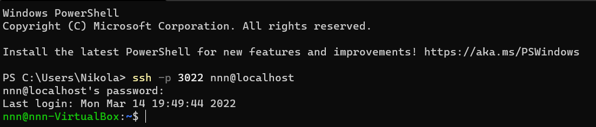
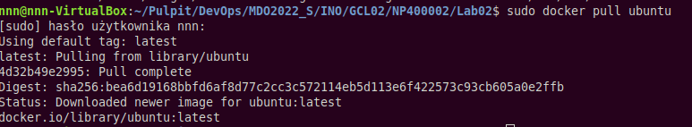
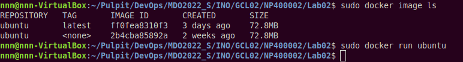
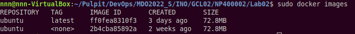
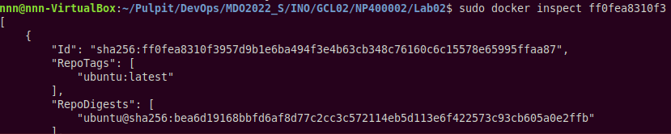
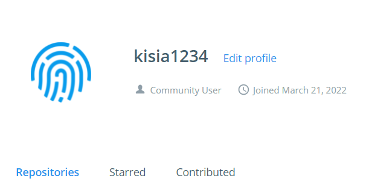

## Sprawozdanie 2

---
### 1. Przygotowanie *git hook*

- Początkowo zaleziono katalog `.git/hooks` zawierający skrypty uruchamiane podczas wykonaywania różnych operacji w repozytorium git

- W programie **Visual Studio Code** otworzono kopię pliku *commit-msg.sample* którą nazwano *commit-msg*

- W języku Python utworzono skrypt realizujący sprawdzanie poprawności tytułu oraz treści wykonanego commita:
```python
import sys

if __name__ == '__main__':
    x = sys.argv[1]
    plik = open(x) 
    tytul = plik.readline()
    pusta = plik.readline()
    tresc = plik.readline()
    
    if "NP400002" not in tytul:
        sys.exit(1)
    
    if "02" not in tresc:
        sys.exit(2)
```
- W przypadku gdy tytuł lub treść commita się nie zgadzała kod wyjścia był różny od zera

- W pliku *commit-msg* uruchomiono skrypt Python i w przypadku niepoprawnego kodu wyjścia pojawiał się kumunikat o aistniałym błędzie:
```bash
python INO/GCL02/NP400002/hook_script.py $1
wynik=$?
if [ $wynik = 1 ];
then
	echo >&2 Wrong commit title
	exit 1
fi
if [ $wynik = 2 ];
then
	echo >&2 Wrong commit message
	exit 1
fi
```

- Sprawdzono także poprawnośc działania utworzonego hooka


---
### 2. Przygotowanie środowiska Dockerowego

- Zapewniono dostęp do maszyny wirtualnej poprzez zdalny termianal przy pomocy ustawień sieci **VirtualBoxa**


- Sprawdzono możliwośc połączenia się z maszyną przy pomocy protokołu *ssh*


- Przy pomocy polecenia `sudo apt docker.io` zainstalowano środowisko dockerowe

---
### 3. Weryfikacja działania środowiska

- Przy pomocy polecenia `docker` sprawdzono czy środowisko jest uruchomione i działa


- Przy pomocy polecenia `sudo docker pull ubuntu` pobrano obraz dystrybucji linuksowej


- Poleceniem `sudo docker image ls` sprawdzono dostępne obrazy i poleceniem `sudo docker run ubunru` uruchomiono ubuntu


- W celu sprawdzenia wersji pobranego obrazu użyto polecenia `sudo docker images` które wyświetliło dostępne obrazy


- Z racji że tag wersji ubuntu wystąpił w postaci nazwy *latest* użyto polecenia `sudo docker inspect "id obrazu"` które wyświetla podstawowe informacje na temat podanego obrazu

Pomimo wykonanych kroków nie udało się znaleźć informacji o pobranej wersji ubuntu

---
### 4. Założenie konta na **Docker HUB**


---

