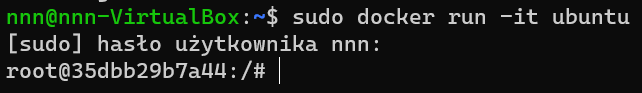
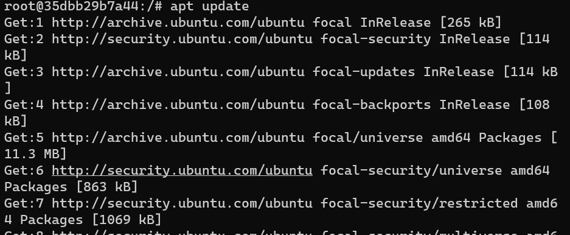
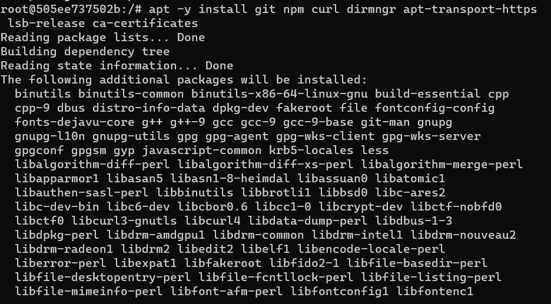
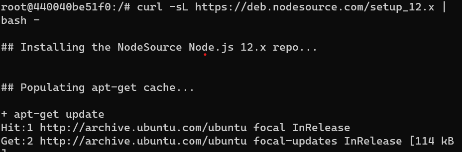
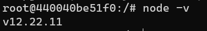
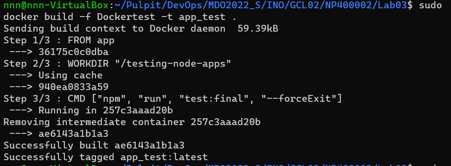
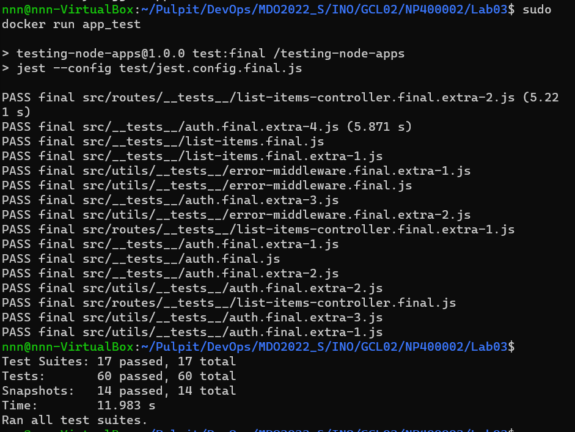

## Sprawozdanie 3

---
### 1. Znalezienie repozytorium
- Pierwszym krokiem było znalezienie repozytorium z kodem wybranego oprogramowania na GitHubie

- Repozytorium musiało spełniac pewne warunki do których należało: dysponowanie otwartą licencją, występowanie własnych narzędzi Makefile oraz posiadanie zdefiniowanych testów  

- Stosując się do podanych wymagań znaleziono odpowiednie repozytorium: 
`https://github.com/kentcdodds/testing-node-apps.git` 

---
### 2. Budowanie i testy wewnątrz kontenera bazowego
- Jako kontener bazowy wybrano Ubuntu

- Poleceniem `sudo docker run -it ubuntu` uruchomiono kontener Ubuntu w wersji z dostępem interaktywnym


- Następnie w kontenerze zaktualizowano system zarządzania pakietami do najnowszej wersji poleceniem `apt update`


- Poleceniem `apt -y install npm git curl dirmngr apt-transport-https lsb-release ca-certificates` zainstalowano Gita oraz npm potrzebne do do obsługi Node.js oraz inne pliki tworzące środowisko uruchomieniowe i umożliwiające pobieranie plików z internetu przy użyciu konsoli


- Z racji że projekt wymagał nowszej wersji Node.js do kontenera dodano Node.js w wersji *v12.22.11* z oficjalnego repoztorium APT poleceniem `curl -sL https://deb.nodesource.com/setup_12.x | bash -`


- Następnie zainstalowano Node.js 12 poleceniem `apt -y install nodejs`


- Wybrane repozytorium sklonowano poleceniem `git clone https://github.com/kentcdodds/testing-node-apps.git`

- Poleceniem `cd testing-node-apps` wykonano przejscie do sklonowanego katalogu z projektem

- W tym katalogu użyto polecenia `npm install` które spowodowało pobranie wymaganych  zależności projektu koniecznych do jego pracy

---
### 2. Tworzenie plików Dockerfile 

- Wykonanie powyższych kroków zakończyło się sukcesem i z tego powodu zautomatyzowano je przy pomocy pliku Dockerfile:
```dockerfile
FROM ubuntu:latest

ENV TZ=Europe/Warsaw
RUN ln -snf /usr/share/zoneinfo/$TZ /etc/localtime && echo $TZ > /etc/timezone

RUN apt -y update && apt -y install git npm 
RUN apt -y install curl dirmngr apt-transport-https lsb-release ca-certificates
RUN curl -sL https://deb.nodesource.com/setup_12.x | bash -
RUN apt -y install nodejs
RUN git clone https://github.com/kentcdodds/testing-node-apps.git

WORKDIR "/testing-node-apps"

RUN	npm install
```
- Konieczne było dodanie kroków wybierających strefę czasową 

- Poleceniem `sudo docker build -t app .` zbudowano pierwszy kontener:


- opcja `-t` odpowiadała za nazwanie tworzonego obrazu dockera

- Z racji że budowanie powiodło się  utworzono drugi plik Dockerfile o nazwie *Dockertest* w którym zautomatyzowano uruchamianie dostepnych dla projektu testów:
```dockerfile
FROM app

WORKDIR "/testing-node-apps"

#RUN npm run test:final --forceExit
CMD ["npm", "run", "test:final", "--forceExit"]
```

- w tym przypadku jako obraz dockera ustawiono *app* czyli nazwę obrazu powstałego podczas budowania pierwszego kontenera

- Poleceniem `sudo docker build -f Dockertest -t app_test .` zbudowano drugi kontener


- Następnie uruchomiono drugi kontener poleceniem `sudo docker run app_test`


- Przeprowadzone testy wykazały że kontener wdrożył się i pracował poprawnie

---