## Sprawozdanie 4

---

### 1. Zachowywanie stanu
- Na początku ustawiono Docker jako non-root user aby nie musieć używać polecenia `sudo` podczas pracy z Dockerem. W tym celu użyto polecenia `sudo usermod -aG docker $USER`

- Następnie przygotowano woluminy: wejściowy i wyjściowy o nazwach *volumeIn* oraz *volumeOut*. W tym celu użyto polecenia `docker volume create <nazwa>`

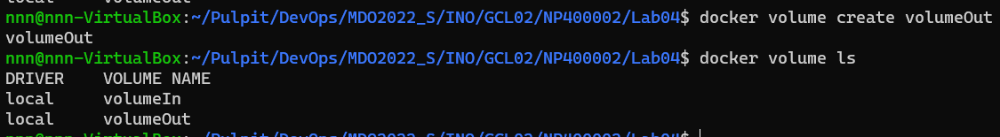

- do kontenera podłączono utworzone woluminy i uruchomiono go poleceniem: `docker run -it -v volumeIn:/volumeIn -v volumeOut:/volumeOut ubuntu:latest`

- w osobnym terminalu do katalogu Lab4 sklonowano repozytorium poleceniem: `git clone https://github.com/kentcdodds/testing-node-apps.git` 

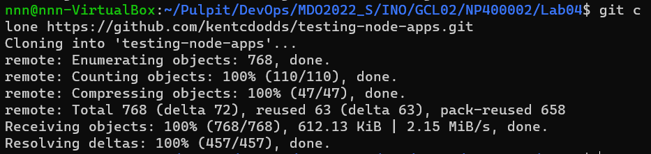

- Poleceniem `docker cp testing-node-apps <id_uruchomionego_kontenera>:/volumeIn` przekopiowano repozytorium na wolumin wejściowy.

-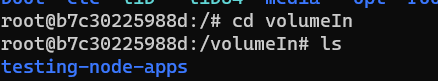

- w kontenerze przy pomocy poniższych poleceń zainstalowano niezbędne wymagania wstępne umozliwiajace uruchomienie projektu:

`apt update`

`apt -y install npm git curl dirmngr apt-transport-https lsb-release ca-certificates`

`curl -sL https://deb.nodesource.com/setup_12.x | bash -`

`apt -y install nodejs`

- na wolumin wyjściowy skopiowano repozyturium z woluminu wejściowego i zbudowano je poleceniem `npm install`

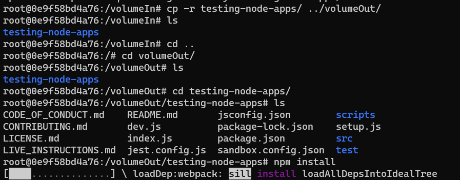  

- aby zweryfikować czy wszystko przebiegło pomyslnie uruchomiono testy dostępne dla projektu poleceniem `npm run test::final`

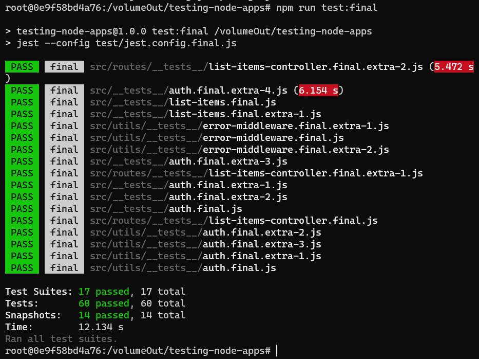

- jak można zauważyć wszystko przebiegło pomyślnie i wszystkie testy wykonały się poprawnie

- sprawdzono takze czy po ponownym uruchomieniu kontenera pliki zawarte są w woluminach:

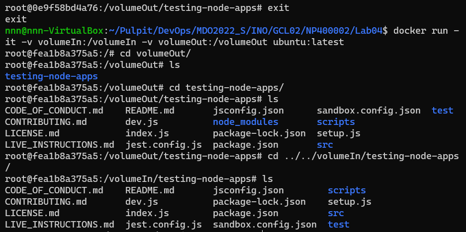

---

### 2. Eksportowanie portu
- Na początku poleceniem `docker run -it -p 5201:5201 ubuntu:latest` uruchomiono kontener, który zostanie serwerem

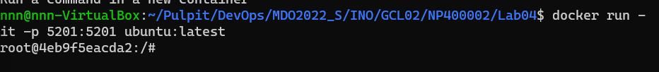

- w kontenerze zainstalowano iperf3 poleceniem `app update && app install iperf3`

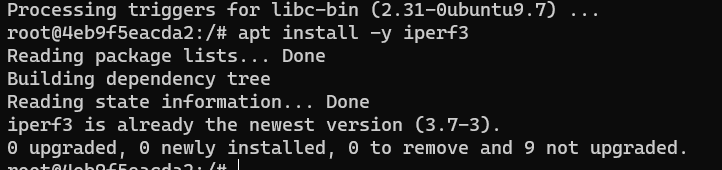

- przy pomocy polecenia `iperf3 -s` uruchomiono serwer

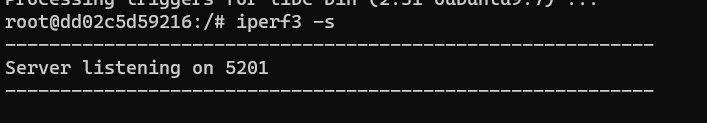

- poleceniem `docker inspect <id_kontenera>` sprawdzono jego adres ip

- utworzono nowy kontener poleceniem `docker run -it ubuntu:latest` w którym także zainstalowano iperf3

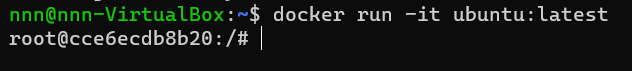

- poleceniem `iperf3 -c <adres_ip_kontenera>` polaczono się z serwerem z drugiego kontenera

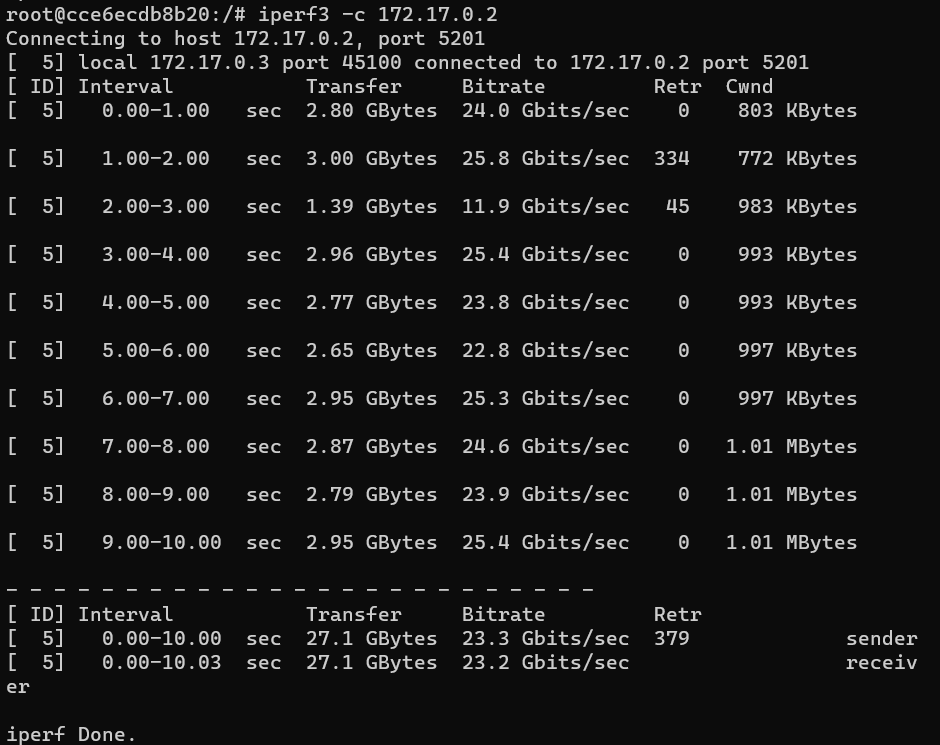

- na maszynie wirtualnej zainstalowano iperf3 i połączono się z serwerem poleceniem `iperf3 -c <id_kontenera>`

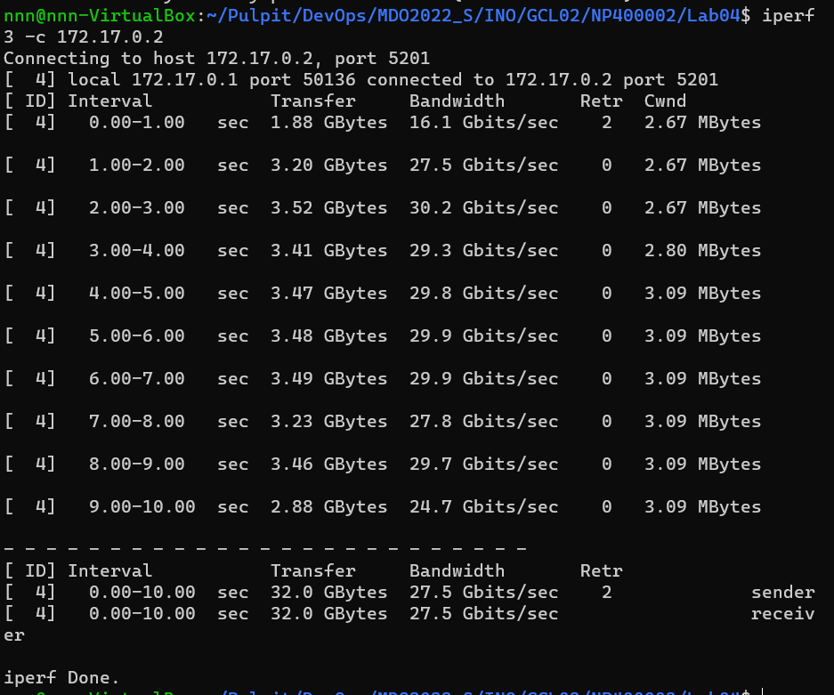

- aby możliwe było połączenie się z serwerem spoza hosta w ustawieniach wirtualnej maszyny dodano dwa przekierowania portów

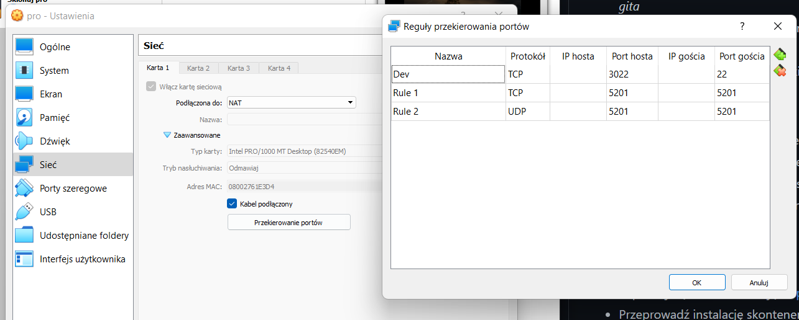

- w konsoli Windows'a poleceniem `ipconfig` znaleziono adres IP localhosta

- poleceniem `.\iperf3.exe -c  <id_hosta>` polaczono się z serwerem

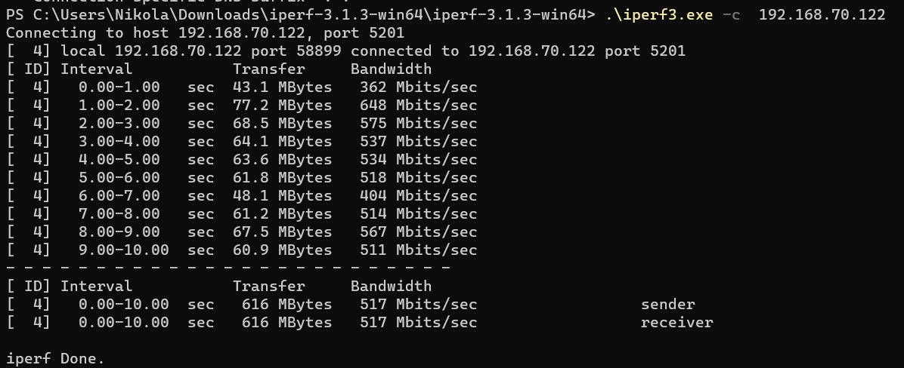

- na koniec wyciągnięto log z kontenera poleceniem `docker logs <id kontenera>`

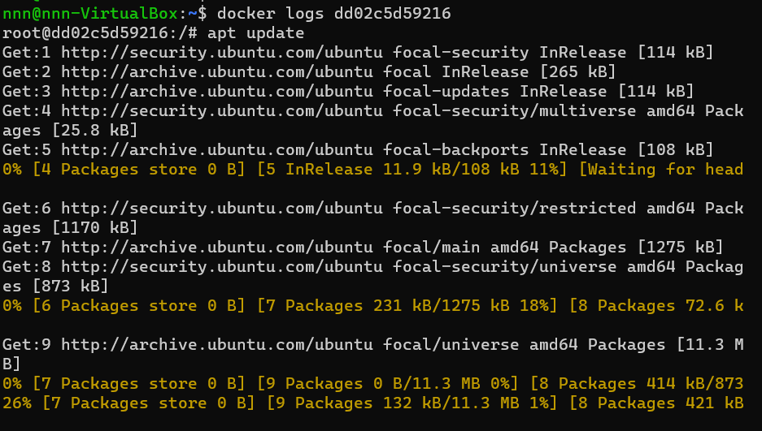

---

### 3. Instalacja Jenkins
- przy pomocy dokumentacji znajdującej się na stronie `https://www.jenkins.io/doc/book/installing/docker/#setup-wizard` wykonano kolejne kroki instalacji Jenkinsa na Dockerze

- na początku poleceniem `docker network create jenkins` utworzono sieć

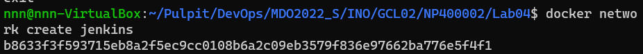

- następnie pobrano i uruchomiono *docker:dind*

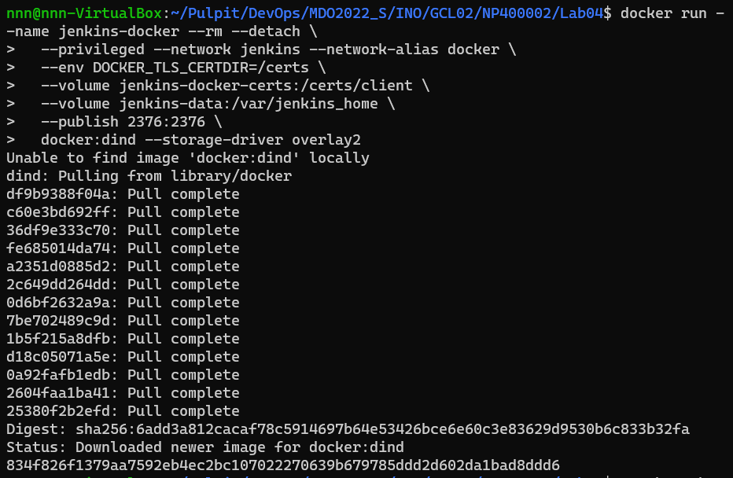

- na podstawie instrukcji przedstawionej na stronie stworzono Dockerfile

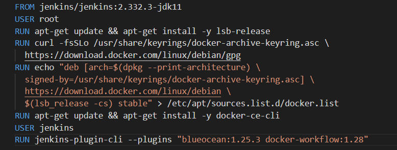

- utworzono nowy obraz Docker

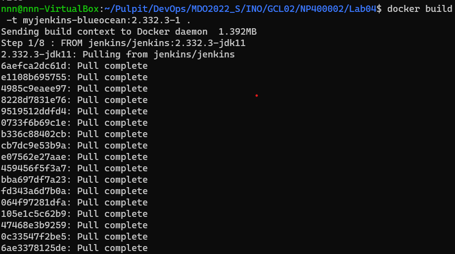

- na koniec uruchomiono utworzony obraz jako kontener w Dockerze

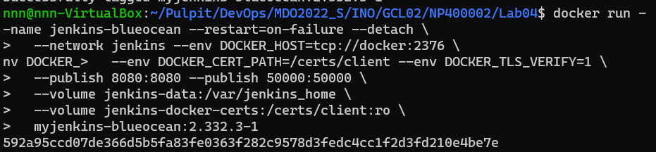

- poleceniem `docker ps` sprawdzono działające kontenery

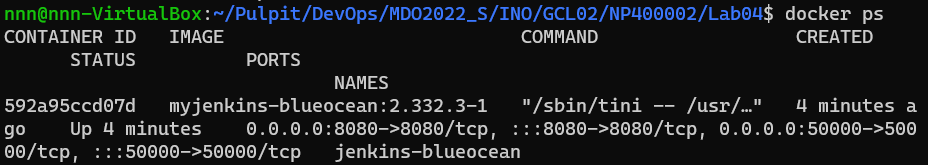

- po odczytaniu pliku z hasłem zalogowano się do Jenkinsa

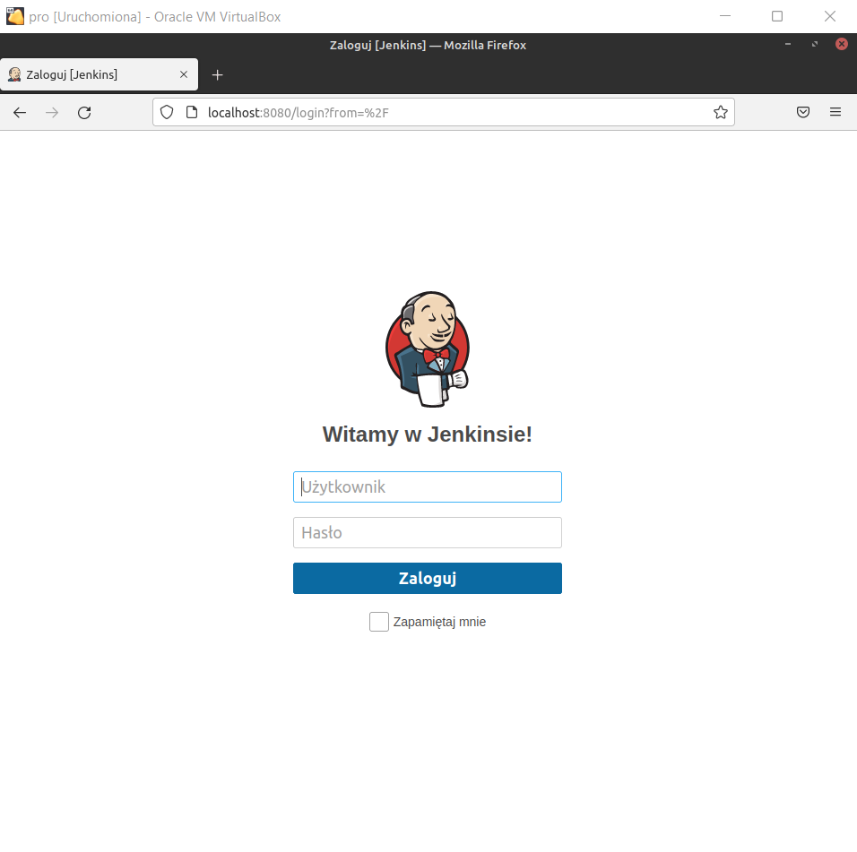
