# Sprawozdanie 5


## 1. Wstęp
Projekt wybrany przeze mnie dotyczy testowania backendu w Node.js i jest napisany w Java Script. Z tego też powodu wykorzystuje on narzedzia zawarte w NPM. Projekt zawiera plik `package.json` odpowiadający za spercyzowanie które paczki należy zainstalować aby projekt działał poprawnie. 

Projekt znajduje się na repozytorium:
[kentcdodds/testing-node-apps.git](https://github.com/kentcdodds/testing-node-apps.git)

---
## 2. Kontenery Jenkins i DIND
Na początku utworzono i uruchomiono kontener DIND:

```console
docker run 
	--name jenkins-dind 
	--rm 
	--detach
  	--privileged 
	--network jenkins 
	--network-alias docker
  	--env DOCKER_TLS_CERTDIR=/certs
  	--volume jenkins-docker-certs:/certs/client
  	--volume jenkins-data:/var/jenkins_home
 	--publish 2376:2376 docker:dind 
  	--storage-driver overlay2
  ```

Utworzono także kontener Jenkins:
```console
docker run 
	--name jenkins-container
 	--restart=on-failure
	--detach
  	--network jenkins 
	--env DOCKER_HOST=tcp://docker:2376
  	--env DOCKER_CERT_PATH=/certs/client 
	--env DOCKER_TLS_VERIFY=1 
  	--publish 8080:8080 
	--publish 50000:50000 
  	--volume jenkins-data:/var/jenkins_home 
  	--volume jenkins-docker-certs:/certs/client:ro myjenkins-blueocean:2.332.3-1
```

Do uruchomienia kontenerów wykorzystano polecenia znajdujące się i opisane na stronie [www.jenkins.io](https://www.jenkins.io/doc/book/installing/docker/).

Przy pomocy polecenia `docker ps` można sprawdzić czy kontenery zostały poprawnie uruchomione.

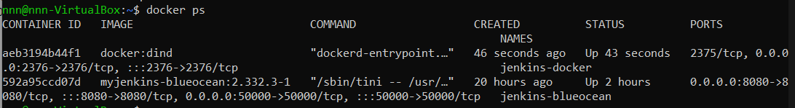

---
## 3. Sforkowanie repozytorium
Z racji że repozytorium w którym znajdował się wybrany projekt miało zawierać katalog z plikami Dockerfile i Jenkinsfile wykonanany został fork repozytorium do nowego własnego repozytorium. 

Moje repozytorium znajduje się pod linkiem:
[github.com/Kisia123](https://github.com/Kisia123/testing-node-apps.git)

Dzięki temu możliwa była dowola edycja plików zawartych w projekcie.
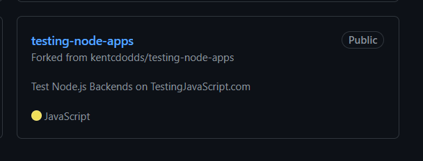

Następnie w repozytorium utworzono plik, który nazwano *Jenkinsfile*.
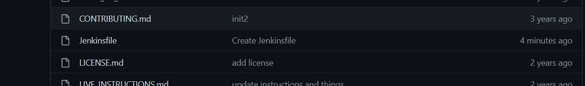

---
## 4. Utworzenie plików Dockerfile
Do utworzenia działającego pipeline można wykorzystać pliki Dockerfile. W związku z tym utworzono trzy pliki Dockerfile odpowiadające za trzy z czterech realizowanych kroków. 

### 4.1. Krok Build
Na początku utworzono Dockerfile realizujący krok *Build* gdzie Jenkins uruchamia proces budowania wybranej aplikacji w kontenerze. Kontener ten bazować ma na obrazie zawierającym dependecje i w przypadku tego projektu jest nim obraz *node*. Projekt wymagał Node.js w wersji większej niż 12 i 'node:latest' nie realizował tego wymogu. Z tego też powodu wybrano obraz Node.js w wersji 14 - dokładniej `node:14`. 

W kontenerze następuje klonowanie repozytorium z projektem (sforkowane repozytorium). Następnie ustawiany jest workdir i w moim przypadku został nim folder z projektem. Dodatkowo pobierany jest *npm* poleceniem `npm install` i budowany jest projekt przy pomocy polecenia `npm run build`. 

Informacje o tym jakiego polecenia należy użyć można znaleźć w pliku `package.json`.

```Dockerfile
FROM node:14

RUN git clone https://github.com/Kisia123/testing-node-apps.git
WORKDIR /testing-node-apps/
RUN npm install
RUN npm run build
```

### 4.2. Krok Test
Utworzono także plik Dockerfile dla kroku *Test* w którym miał powstać obraz testujący kod zbudowany przy pomocy kontenera budującego. W tym celu wykorzystano testy obecne w repozytorium programu.

```Dockerfile
FROM builder:latest

WORKDIR /testing-node-apps/

RUN npm run test:final
```

### 4.3. Krok Deploy
Utworzony został także plik Dockerfile dla kroku Deploy który miał uruchamiać zbudowany kod w kontenerze przeznaczonym do wdrożenia. Z racji że wybrany przeze mnie projekt był aplikacją Node.js instalacja i przygotowanie dependencji będzie dokładnie taka sama, z tego też powodu nie było konieczne tworzenie osobnego kontenera zawierającego dependencje. Obraz wdrożeniowy zostal więc oparty na kontenerze Builder. 

```Dockerfile
FROM builder:latest

WORKDIR /testing-node-apps/

CMD npm run start
```

Polecenie `npm run start` powodowało  uruchomienie serwera z nasłuchem na port 8080.

---
Utworzone pliki Dockerfile wrzucono następnie do katalogu `var/jenkins_home` poleceniem `docker cp <nazwa_pliku_dockerfile> <id_kontenera>: <ścieżka>`

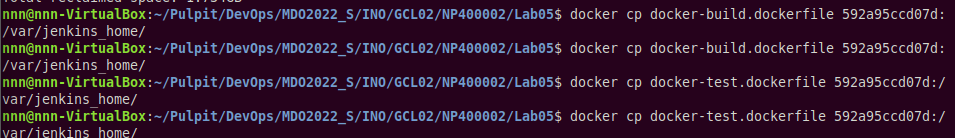

---
## 5. Tworzenie pipeline wewnątrz Jenkinsa
Na poczatku na stronie [http://localhost:8080](http://localhost:8080) zalogowano się do Jenkinsa (8080 - port który został użyty do konfiguracji Jenkinsa podczas instalacji). Po zalogowaniu stworzono nowy projekt i wybrano opcję *pipeline*.
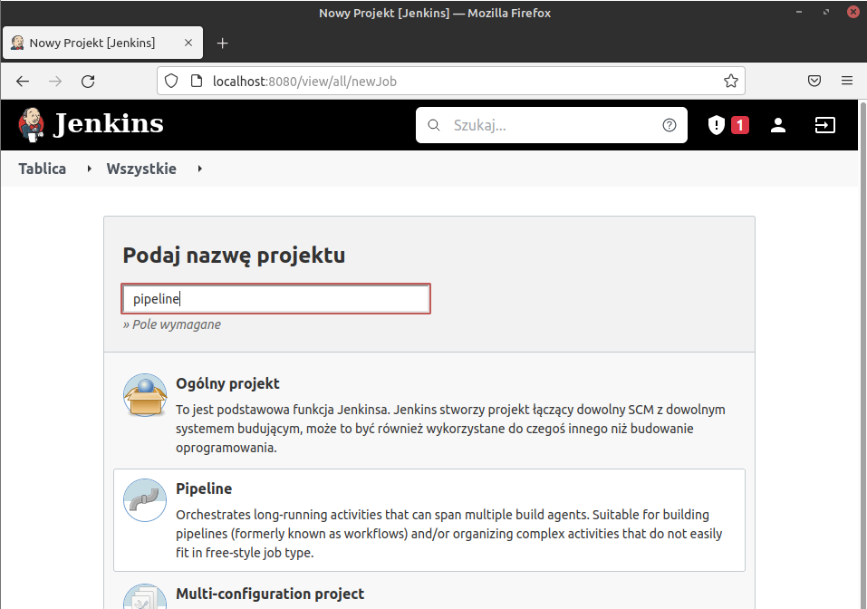

Dzięki temu że Jenkinsfile znajdował się w sforkowanym repozytorium projektu opis pipeline'a można było pobrać bezpośrednio z Githuba, dzięki czemu Pipeline nie był wpisany na sztywno i łatwiej można go było edytować z poziomu projektu. Podczas zaznaczania poszczególnych opcji należało pamiętać o podaniu dobrego URL repozytorium w którym znajdował się projekt oraz wybraniu odpowiedniego brancha. W moim przypadku wybrany został branch *main*. 
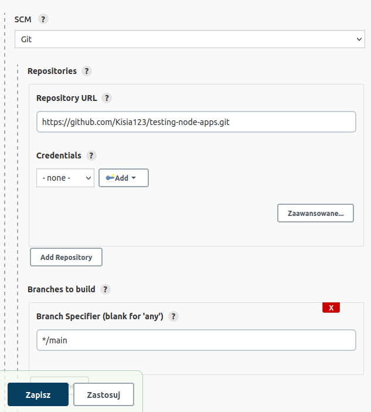

W pipeline utworzono 4 sceny (stages) realizujące 4 kroki, czyli: Build, Test, Deploy, Publish. 

### 5.1. Stage Build

```Jenkinsfile
stage('Build') {
	steps {
		echo "Build"
		sh 'docker build . -f /var/jenkins_home/docker-build.dockerfile -t builder'
		echo 'building is over'
	}
}
```
Stage ten odpowadał za uruchomienie utworzonego dockerfile dla kroku Build znajdującego się w katalogu `jenkins_home`. Budowanie nastąpiło w kontenerze nazwanym *builder*.

### 5.2. Stage Test

```Jenkinsfile
stage('Test'){
	steps{
		echo 'Test'
		sh 'docker build . -f /var/jenkins_home/docker-test.dockerfile -t tester'
		sh 'docker run tester'
		echo 'done testing'
	}
}
```
Stage ten odpowiadał za uruchomienie i przeprowadzenie testów zawartych w projekcie. Przy pomocy utworzonego pliku dockerfile zbudowano kontener *tester* w którym uruchomiono testy. 

### 5.3. Stage Deploy

```Jenkinsfile
stage('Deploy'){
	steps{
		echo 'Deploy'
		sh 'docker build . -f /var/jenkins_home/docker-deploy.dockerfile -t deployer'
		sh 'docker stop $(docker ps -aq)'
		sh 'docker run -d -p 8081:8080 deployer'
		echo 'deploy is done'
	}

}
```
W stage Deploy zbudowano kontener *deployer* przy pomocy utworzonego pliku dockerfile. Uruchamiany serwer należało zatrzymać oraz uruchomić w tle jako główny wątek kontenera korzystając z flagi `-d`. W przeciwnym wypadku stage Deploy działałby w nieskończoność i kolejny stage już by się nie wykonał. 

Konieczne było także zatrzymanie wszystkich działających kontenerów za pomocą polecenia `docker stop`. Polecenie to przyjmowało w postaci argumentów id kontenerów. Przy pomocy opcji `-a` otrzymano wszystkie uruchomione kontenery, a przy pomocy opcji `-q` otrzymano jedynie ich id. 

Z racji że projekt był serwerem działającym na porcie 8080 (informacja o tym znajdowała się w README.md projektu) wykonano przekierowanie na wolny port 8081 i tam go uruchomiono. Przekierowanie było kienieczne ponieważ na porcie 8080 działa Jenkins.

### 5.4. Stage Publish

```pipeline
stage('Publish'){
	when {
		expression {
			return params.PROMOTE == true
		}
	}
	agent{			
		docker {
			image 'builder:latest' 
			args '-u root' 
			}
	}

	steps{
		echo 'publish'
		sh 'npm install -g npm@latest'

		sh 'git config user.email "nikola.prochalska@gmail.com"'
		sh 'git config user.name "Kisia123"'

		sh "npm version ${params.VERSION}.${BUILD_NUMBER}"
		load '/var/jenkins_home/token'
		withEnv(["TOKEN=${NPM_TOKEN}"]) {

			sh 'echo "//registry.npmjs.org/:_authToken=${TOKEN}" >> ~/.npmrc'
			sh 'npm publish --access public' 

		}
		echo 'finally' 
	}
}
```

Krok publish zrealizowany został poprzez opublikowanie zbudowanego projektu na NPM. W tym celu znależało założyć konto na stronie [www.npmjs.com](https://www.npmjs.com) i utworzyć nowy Access Token.

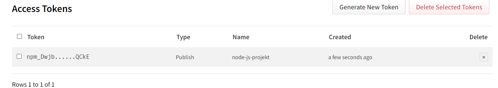

Wygenerowany kod skopioway został do pliku `token` przekazanego następnie kontenerowi Jenkinsa w ten sam sposób co pliki Dockerfile. Z racji że dostęp do tokena był konieczny do publikacji projektu zdecydowałam się nie robić pliku Dockerfile i wszelkie kroki wykonać jako komendy w Pipeline. 

Plik zawierający token załadowano i następnie przy pomocy kodu tokena miała wykonać się publikacja projektu przy pomocy polecenia `npm publish` Dodatkowo w tym stage dodano agenta żeby określić środowisko uruchomieniowe kroków podanych w bloku steps dzięki czemu zapewniony został dodstęp do plików związanych z projektem. 

Problemy pojawiły się w momencie próby publikacji projektu ponieważ pomimo tego że w kroku build i test wersja Node.js była odpowiednia to w publish okazało się że konieczna jest najnowsza wersja Node.js więc została ona zainstalowana. Problem wystąpił także z połączeniem z npm registry (pojawił się komunikat *must use TLS 1.2 or higher*). W związku z tym problemem używane registry ustawiono w pliku `package.json` jako [registry.npmjs.org](https://registry.npmjs.org/). 

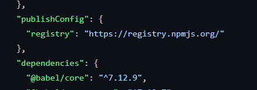

Dodatkowo zmieniono nazwę projektu aby uniknąć potencjalnego konfliktu nazw.

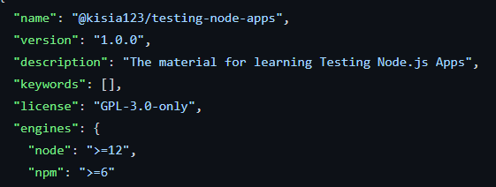

Publikacja nie udała się ponieważ należało potwierdzić tożsamość (wystąpił komunikat *Tell me who you are*) w związku z czym dodano informację o adresie e-mail oraz nazwy użytkownika Githuba. 

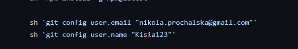

W kroku Publish znajdował się krok nadawania wersji promowanego projektu który został opisany poniżej.

---

Po wykonaniu tych kroków krok publish działał poprawnie. 

---
## 6. Promocja do nowej wersji

W celu zarządzania promocjami kompilacji do nowych wersji do Pipeline dodano blok z parametrami.

```Jenkinsfile
parameters{
	string(name: 'VERSION', defaultValue: '1.0', description: 'first two numbers')
	booleanParam(name: 'PROMOTE', defaultValue: false, description: 'should be published?')

}
```
Utworzenie takiego bloku sprawiło że przy każdej nowej kompilacji pojawiało się okienko w którym można było zaznaczyć czy promocja nastąpi czy też nie.

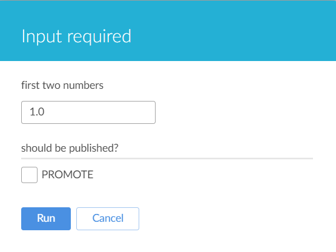

W momencie gdy wszystkie etapy Pipeline'u przeszły poprawnie i *PROMOTE* było zaznaczone krok Publish budował publikowany artefakt. Sprawdzenie czy *PROMOTE* zostało zaznaczone wykonywane było w Stage Publish.

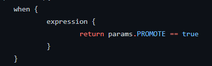

Parametr *VERSION* zawierał dwie pierwsze wartości w promowanej wersji. W kroku Publish poleceniem `npm version` nadawano wersję promowanego artefaktu.

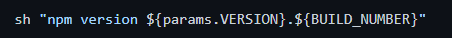

W momencie gdy promocja do npm nastąpiła możliwe jest zainstalowanie skompilowanego projektu. 

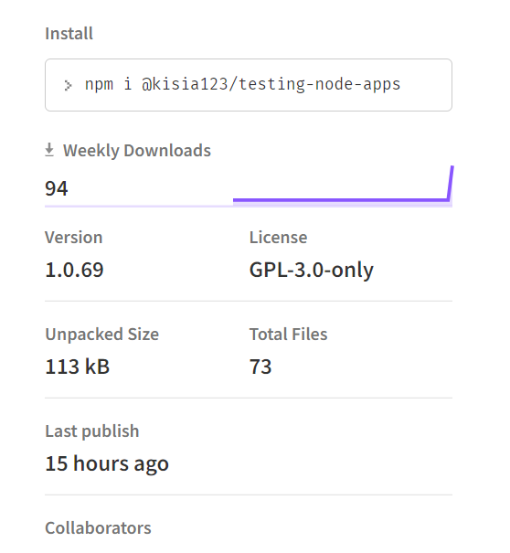
